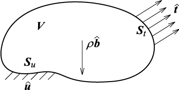

# FrontISTR ver. 5.0 理論マニュアル
<!-- this is a comment. -->

<!-- 文部科学省次世代ＩＴ基盤構築のための研究開発
「イノベーション基盤シミュレーションソフトウェアの研究開発」-->

本ソフトウェアは文部科学省次世代ＩＴ基盤構築のための研究開発「イノベーション基盤シミュレーションソフトウェアの研究開発」プロジェクトによる成果物です．
本ソフトウェアを無償または営利目的でご使用になる場合，「MITライセンス」をご了承頂くことが前提となります．

| FrontISTR | Version 5.0 |
|:---------:|:---------|
| ライセンス形態 | MIT License |
| 問い合わせ先 | FrontISTR研究会  〒277-8563 千葉県柏市柏の葉5-1-5  東京大学大学院新領域創成科学研究科 奥田研究室（気付）  E-mail：fstr_seminar@multi.k.u-tokyo.ac.jp |

## 目次

* [1. はじめに](#section1)
    - [1.1 本書の位置づけ](#section1.1)
    - [1.2 本書の目的](#section1.2)
    - [1.3 version 5.0における更新内容](#section1.3)
* [2. 有限要素法解析理論](#section2)
    - [2.1 微小変形線形弾性静解析]()
    - [　2.1.1 基礎方程式]()
    - [　2.1.2 仮想仕事の原理]()
    - [　2.1.3 定式化]()
    - [2.2 非線形静解析手法]()
    - [　2.2.1 幾何学的非線形解析手法]()
    - [　　2.2.1.1 仮想仕事式の増分分解]()
    - [　　2.2.1.2 仮想仕事の原理]()
    - [　　2.2.1.3 total Lagrange法の定式化]()
    - [　　2.2.1.4 updated Lagrange法の定式化]()
    - [　2.2.2 材料非線形解析手法]()
    - [　　2.2.2.1 超弾性材料]()
    - [　　2.2.2.2 弾塑性材料]()
    - [　　2.2.2.3 粘弾性材料]()
    - [　　2.2.2.4 クリープ材料]()
    - [　2.2.3 接触解析手法]()
    - [2.3 固有値解析]()
    - [　2.3.1 一般化固有値問題]()
    - [　2.3.2 問題設定]()
    - [　2.3.3 シフト付逆反復法]()
    - [　2.3.4 固有値解法のための算法]()
    - [　2.3.5 ランチョス法]()
    - [　2.3.6 ランチョス法が持つ幾何学的意味]()
    - [　2.3.7 三重対角化]()
    - [2.4 熱伝導解析]()
    - [　2.4.1 基礎方程式]()
    - [　2.4.2 離散化]()
    - [2.5 動的解析手法]()
    - [　2.5.1 陰解法の定式化について]()
    - [　　2.5.1.2 質量項の取り扱い]()
    - [　　2.5.1.3 減衰項の取り扱い]()
    - [　2.5.2 陽解法の定式化について]()
    - [2.6 周波数応答解析]()
    - [　2.6.1 定式化]()

## 1.  はじめに
### 1.1 本書の位置づけ

FrontISTRが対象範囲とする有限要素解析に関する理論について記述したものである．

### 1.2 本書の目的

本書では，ユーザーがFrontISTRを実行するにあたり，プログラム特有のデータ構造と解析機能の基本的な内容について記述する．
FrontISTRでの解析実行制御は，全体制御データ，計算制御データを指定する必要がある．
またメッシュに関するデータについては分散メッシュファイルを入力し解析を実行する．
以下の章より，これらの制御データの入力方法および入力データの関連についてその詳細を説明する．

### 1.3 基礎方程式

ここでは微小変形理論に基づく弾性静解析についての定式化を示す．
応力・ひずみ関係として線形弾性を仮定する．
図1に，固体力学における境界値問題を示した．
この境界値問題の平衡方程式，力学的境界条件，幾何学的境界条件は式(1)，(2)，(3)で与えられる．

図1 固体力学における境界値問題

$\nabla \cdot \boldsymbol{T} + \rho \widehat{\boldsymbol{b}} = \boldsymbol{0} \tag{1}$

$\boldsymbol{u} = \boldsymbol{\widehat{u}} \; {\rm on} \; \boldsymbol{S}_u \tag{2}$

$\boldsymbol{n} \cdot \boldsymbol{T} = \boldsymbol{\widehat{t}} \;\; {\rm on} \; \boldsymbol{S}_t \tag{3}$

       

