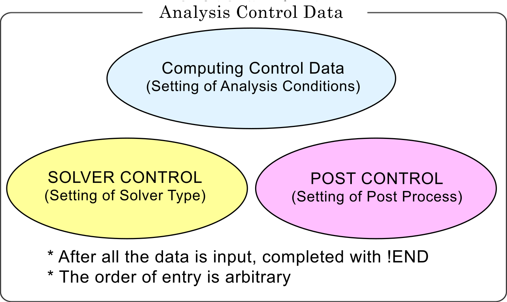

<script type="text/x-mathjax-config">
MathJax.Hub.Config({
  tex2jax: {
    inlineMath: [['$','$'], ['\\(','\\)']],
    processEscapes: true
  },
  CommonHTML: { matchFontHeight: true },
  displayAlign: "center"
});
</script>
<script async src="https://cdn.mathjax.org/mathjax/latest/MathJax.js?config=TeX-AMS_CHTML"></script>

# Analysis Control Data

## Outline of Analysis Control Data

In FrontISTR, an analysis control data file is input to acquire the computing control data, solver control data and post process (visualization) control data as shown in the following figure, in order to implement the analytical calculations.



The features of the analysis control data file are as follows.

  - This is an ASCII format file based on a free format.
  - This file consists of a header which starts with "`!`" and the data following this.
  - The order of description of the header is basically free.
  - A "`,`" is used as a punctuation mark of the data.
  - The inside of the file is briefly divided into three zones.
  - "`!END`" is input at the end of the file for completion.

**Example of Analysis Control Data**

```
#############################################################
##### (1) Computing control data portion ####################
#############################################################
### Control File for HEAT solver
!SOLUTION,TYPE=HEAT
!FIXTEMP
 XMIN, 0.0
 XMAX, 500.0

#############################################################
##### (2) Solver control data portion #######################
#############################################################
### Solver Control
!SOLVER,METHOD=1,PRECOND=2,ITERLOG=NO,TIMELOG=NO
100,
2
1.0e-8,1.0,0.0

#############################################################
##### (3) Post control (visualization) data portion #########
#############################################################
### Post Control
!WRITE,RESULT
!WRITE,VISUAL
!VISUAL, method=PSR
!surface_num = 1
!surface 1
!surface_style = 1
!display_method 1
!color_comp_name = TEMPERATURE
!color_subcomp = 1
!output_type = BMP
!x_resolution = 500
!y_resolution = 500
!num_of_lights = 1
!position_of_lights =
-20.0, 5.8, 80.0
!viewpoint = -20.0 10.0 8.0
!up_direction = 0.0 0.0 1.0
!ambient_coef= 0.3
!diffuse_coef= 0.7
!specular_coef= 0.5
!color_mapping_style= 1
!!interval_mapping= -0.01, 0.02
!color_mapping_bar_on = 1
!scale_marking_on = 1
!num_of_scale = 5
!font_size = 1.5
!font_color = 1.0 1.0 1.0
!END
```

## Input Rules

The analysis control data consists of a header line, data line and a comment line.

One header is always included in the header line.

### Header

The header specifies the meaning of the data and the data block in the analysis control data. When the head of the term starts with a "`!`", it is considered to be a header.

### Header Line

The header and the parameter accompanying this are described in this line.

The header line must start with a header. When a parameter is required, a "`,`" must be used to continue after that. When the parameter takes on a value, use an "`=`" after the parameter and describe the value after that.

The header line can not be described in more than two lines.

### Data Line

The data line starts after the header line, and the necessary data is described.

The data lines may be in multiple lines; however, this is determined according to the rules of the data description defined by each header.

There are cases where data lines are not required.

### Punctuation

A comma "`,`" is used as a punctuation of the data.

### Handling of Blanks

Blanks are disregarded.

### Name

Regarding the characters which can be used for the name, there is the underscore "`_`", hyphen "`-`", and alphanumeric characters "`a - z, A - Z, 0 - 9`"; however, the first letter of the name must start with "`_`", or an alphabetic character "`a - z, A - Z`". There is no distinction between uppercase and lowercase letters, and all letters are internally handled as uppercase letters.

The maximum length of the name is 63 characters.

### File Name

Regarding the characters which can be used for the file name, there are the underscore "`_`", hyphen "`-`", period "`.`", slash "`/`", and the alphanumeric characters "`a - z, A - Z, 0 - 9`".

As long as there is no specific description, a path can be included in the file name. Both the relative path and the absolute path can be specified.

The maximum length of the file name is 1,023 characters.

### Floating Point Data

Exponents are optional. An "`E`" or "`e`" character must be added before the exponent.

The selection of "`E`" or "`e`" is optional.

### `!!`, `#`, Comment Line

Lines starting with "`!!`" or "`#`" are considered to be comment lines, and are disregarded.

A comment line can be inserted in any position in the file, and there are no restrictions on the number of lines.

### `!END`

End of mesh data

When this header is displayed, the reading of the mesh data is completed.

## Analysis Control Data

### Header List of Computing Control Data

In FrontISTR, the following items can be mentioned as the boundary conditions which can be used for the computing control data.

  - Distributed load conditions (body force, pressure loading, gravity, centrifugal force)
  - Concentrated load conditions
  - Heat load
  - Single point restriction conditions (SPC conditions)
  - Spring boundary conditions
  - Contact
  - Concentrated heat flux
  - Distributed heat flux
  - Convective heat transfer boundary
  - Radiant heat transfer boundary
  - Specified temperature boundary

The same as the mesh data, the `!HEADER` format is used as the definition method of the above boundary conditions.

The header list of the common control data is shown in the following Table 7.3.1, and the header list for each analysis type is shown in Table 7.3.2.

---
**Table 7.3.1: Control Data Common to All Analysis**

|Header         |Meaning                                                          |Remarks  |Description No.|
|---------------|-----------------------------------------------------------------|---------|---------------|
|`!VERSION`     |Solver version number                                            |         |1-1 |
|`!SOLUTION`    |Specification of analysis type                                   |Mandatory|1-2 |
|`!WRITE,VISUAL`|Specification of visualization output                            |         |1-3 |
|`!WRITE,RESULT`|Specification of results output                                  |         |1-4 |
|`!WRITE,LOG`   |Specification of results output                                  |         |1-5 |
|`!OUTPUT_VIS`  |Control of visualization output items                            |         |1-6 |
|`!OUTPUT_RES`  |Control of results output items                                  |         |1-7 |
|`!RESTART`     |Control of restarting                                            |         |1-8 |
|`!ECHO`        |Echo output                                                      |         |1-9 |
|`!ORIENTATION` |Definition of local coordinate system                            |         |1-10|
|`!SECTION`     |Definition of local coordinate system the sction correspondent to|         |1-11|
|`!END`         |Ending specification of control data                             |         |1-12|

---
**Table 7.3.2: Control Data for Static Analysis**

|Header             |Meaning                                                 |Remarks|Description No.|
|-------------------|--------------------------------------------------------|-------|---------------|
|`!STATIC`          |Static analysis control                                 |       |2-1            |
|`!MATERIAL`        |Material name                                           |       |2-2            |
|`!ELASTIC`         |Elastic material physical properties                    |       |2-2-1          |
|`!PLASTIC`         |Plastic material physical properties                    |       |2-2-2          |
|`!HYPERELASTIC`    |Hyperelastic material physical properties               |       |2-2-3          |
|`!VISCOELASTIC`    |Viscoelastic material physical properties               |       |2-2-4          |
|`!CREEP`           |Creep material physical properties                      |       |2-2-5          |
|`!DENSITY`         |Mass density                                            |       |2-2-6          |
|`!EXPANSION_COEFF` |Coefficient of linear expansion                         |       |2-2-7          |
|`!USE_MATERIAL`    |User defined material                                   |       |2-2-8          |
|`!BOUNDARY`        |Displacement boundary conditions                        |       |2-3            |
|`!SPRING`          |Spring boundary conditions                              |       |2-3-1          |
|`!CLOAD`           |Concentrated load                                       |       |2-4            |
|`!DLOAD`           |Distributed load                                        |       |2-5            |
|`!ULOAD`           |User defined external load                              |       |2-6            |
|`!CONTACT_ALGO`    |Contact analytic algorithm                              |       |2-7            |
|`!CONTACT`         |Contact                                                 |       |2-8            |
|`!TEMPERATURE`     |Nodal temperature in thermal stress analysis            |       |2-9            |
|`!REFTEMP`         |Reference temperature in thermal stress analysis        |       |2-10           |
|`!STEP`            |Analysis step control                                   |       |2-11           |
|`!TRS`             |Tempearture dependent behaviour of viscoelastic material|       |2-12           |

---
**Table 7.3.3: Control Data for Eigenvalue Analysis**

|Header  |Meaning                    |Remarks                         |Description No.|
|--------|---------------------------|--------------------------------|---------------|
|`!EIGEN`|Eigenvalue analysis control|Mandatory in eigenvalue analysis|3-1            |

---
**Table 7.3.4: Control Data for Heat Conduction Analysis**

|Header      |Meaning                                                                  |Remarks   |Description No.|
|------------|-------------------------------------------------------------------------|----------|---------------|
|`!HEAT`     |Heat conduction analysis control                                         |Mandatory in heat conduction analysis| 4-1|
|`!FIXTEMP`  |Nodal temperature                                                        || 4-2|
|`!CFLUX`    |Concentrated heat flux given to node                                     || 4-3|
|`!DFLUX`    |Distributed heat flux / internal heat generation given to element surface|| 4-4|
|`!SFLUX`    |Distributed heat flux by surface group                                   || 4-5|
|`!FILM`     |Heat transfer coefficient given to boundary plain                        || 4-6|
|`!SFILM`    |Heat transfer coefficient by surface group                               || 4-7|
|`!RADIATE`  |Radiation factor given to boundary plane                                 || 4-8|
|`!SRADIATE` |Radiation factor by surface group                                        || 4-9|
|`!WELD_LINE`|Weld line                                                                || 4-10|

---
**Table 7.3.5: Control Data for Dynamic Analysis**

|Header         |Meaning                     |Remarks                      |Description No.|
|---------------|----------------------------|-----------------------------|---------------|
|`!DYNAMIC`     |Dynamic analysis control    |Mandatory in dynamic analysis|5-1|
|`!VELOCITY`    |Velocity boundary conditions|                             |5-2|
|`!ACCELERATION`|Acceleration boundary conditions|                         |5-3|
|`!COUPLE`      |Coupled surface definition Required in coupled analysis|  |5-4|
|`!EIGENREAD`   |Specification of eigenvalues and eigenvectors|Mandatory in frequency response analysis|5-5|
|`!FLOAD`       |Definition of concentrated load for frequency response analysis ||5-6|

In each header, there are data items which comply with the parameter and each header.

Each of the above headers is described in the following with examples of data creation for each analysis type. The description number in the above Table is the number indicated on the right end of the example of the data creation.

### (1) Control data common to all analyses

#### Example of Analysis Control Data

```
### Control File for FISTR
!VERSION                                        1-1
  3
!SOLUTION, TYPE=STATIC                          1-2
!WRITE, VISUAL                                  1-3
!WRITE, RESULT                                  1-4
!ECHO                                           1-9
!BOUNDARY                                       2-3
  FIX, 1, 3, 0.0
!CLOAD                                          2-4
  CL1, 3, -1.0
!END                                            1-12
```

#### Description of Header

##### 1-1 `!VERSION`

Refer to the solver version.

##### 1-2 `!SOLUTION, TYPE=STATIC`

TYPE=analysis type

##### 1-3 `!WRITE, VISUAL`

Output of data by visualizer via memory

Outputs the file just by entering

##### 1-4 `!WRITE, RESULT`

Output of analysis results file

Outputs the file just by entering

##### 1-6 `!ECHO`

Output of node data, element data and material data to log file

Outputs to the file just by entering

##### 1-8 `!END`

Indicates the end of control data

### (2) Static analysis control data

#### Example of Static Analysis Control data

```
### Control File for FISTR
!SOLUTION, TYPE=STATIC                          1-2
!WRITE, VISUAL                                  1-3
!WRITE, RESULT                                  1-4
!ECHO                                           1-9
!MATERIAL, NAME=M1                              2-2
!ELASTIC, TYPE=ISOTROPIC                        2-2-1
  210000.0, 0.3
!BOUNDARY                                       2-3
  FIX, 1, 3, 0.0
!SPRING 2-3-1
  200, 1, 0.03
!CLOAD 2-4
  CL1, 3, -1.0
!DLOAD 2-5
  1, P1, 1.0
!TEMPERATURE                                    2-9
  1, 10.0
!REFTEMP                                        2-10
!STEP, CONVERG=1.E-5, MAXITER=30                2-11
!END                                            1-12
```

#### Description of Header

  - <font color="Red">Red figures</font> are the values indicated in the example.
  - Alphabetic characters in the 2nd line of the table express the parameter name.

##### 2-1 `!STATIC`

Setting of static analysis method

##### 2-2 `!MATERIAL`

Definition of material physical properties

`NAME =` name of material physical properties

##### 2-2-1 `!ELASTIC, TYPE=ISOTROPIC`

Definition of elastic substance

`TYPE =` elastic type

| Young's Modulus                   | Poisson's Ratio              |
|-----------------------------------|------------------------------|
| YOUNG_MODULUS                     | POISSON_RATIO                |
| <font color="Red">210000.0</font> | <font color="Red">0.3</font> |

##### 2-3 `!BOUNDARY`

Definition of displacement boundary conditions

| Node ID or Node Group Name | Start No. of Restricted Degree of Freedom | End No. of Restricted Degree of Freedom | Restricted Value |
|----------------------------|-------------------------------------------|-----------------------------------------|------------------|
| NODE_ID                    | DOF_idS                                   | DOF_idE                                 | Value            |
|<font color="Red">FIX</font>, |<font color="Red">1</font>,|<font color="color">3</font>,|<font color="color">0.0</font>|

##### 2-3-1 `!SPRING`

Definition of spring boundary conditions

|Node ID or Node Group Name|Restricted Degree of Freedom|Spring Constant|
|--------------------------|----------------------------|---------------|
|NODE_ID                   |DOF_id                      |Value          |
|<font color="Red">200</font>,|<font color="Red">1</font>,|<font color="Red">0.03</font>|

##### 2-4 `!CLOAD`

Definition of concentrated load

|Node ID or Node Group Name|Degree of Freedom No.|Load Value|
|--------------------------|---------------------|----------|
|NODE_ID                   |DOF_id               |Value     |
|<font color="Red">CL1</font>,|<font color="Red">3</font>,|<font color="Red">-1.0</font>|

##### 2-5 `!DLOAD`

Definition of distributed load

|Element ID or Element Group Name|Load Type No.|Load Parameter|
|--------------------------------|-------------|--------------|
|ELEMENT_ID                      |LOAD_type    |param         |
|<font color="Red">1</font>, |<font color="Red">P1</font>,|<font color="Red">1.0</font>|

##### 2-9 `!TEMPERATURE`

Specification of nodal temperature used for thermal stress analysis

|Node ID or Node Group Name|Temperature|
|--------------------------|-----------|
|NODE_ID                   |Temp_Value |
|<font color="Red">1</font>, |<font color="Red">10</font>|

##### 2-10 `!REFTEMP`

Definition of reference temperature in thermal stress analysis

##### 2-11 `!STEP`

Control of nonlinear static analysis (Omissible in the case of linear analysis)

|Convergence Value Judgment Threshold|No. of Sub Steps (When AMP exists, AMP has priority)|Max No. of Iterative Calculations|Time Function Name (Specified in `!AMPLITUDE`)
|-------|--------|-------|---|
|CONVERG|SUBSTEPS|MAXITER|AMP|
|<font color="Red">1.0E-05</font>   |<font color="Red">10</font>              |<font color="Red">30</font>|   |

### (3) Eigenvalue analysis control data

#### Example of Eigenvalue Analysis Control Data

```
### Control File for FISTR
!SOLUTION, TYPE=EIGEN                           1-2
!WRITE, VISUAL                                  1-3
!WRITE, RESULT                                  1-4
!ECHO                                           1-9
!EIGEN                                          3-1
  3, 1.0E-8, 60
!BOUNDARY                                       2-3
 FIX, 1, 2, 0.0
!END
```

#### Description of Header

<font color="Red">Red figures</font> are the values indicated in the example.

##### 3-1 `!EIGEN`

Parameter settings of eigenvalue analysis

|No. of Eigenvalue|Allowance|Max No. of Iterations|
|-----------------|---------|---------------------|
|NSET             |LCZTOL   |LCZMAX               |
|<font color="Red">3</font>,|<font color="Red">1.0E-8</font>,|<font color="Red">60</font>|

##### 2-3 `!BOUNDARY` (Same items an in Static Analysis)

Definition of displacement boundary conditions

|Node ID or Node Group Name|Start No. of Restricted Degree of Freedom|End No. of Restricted Degree of Freedom|Restricted Value|
|--------------------------|-----------------------------------------|---------------------------------------|----------------|
|NODE_ID                   |DOF_idS                                  |DOF_idE                                |Value           |
|<font color="Red">FIX</font>,|<font color="Red">1</font>,|<font color="Red">3</font>,|<font color="Red">0.0</font>           |

### (4) Heat conduction analysis control data

#### Example of Heat Conduction Analysis Control Data

```
### Control File for FISTR
!SOLUTION, TYPE=HEAT                            1-2
!WRITE, VISUAL                                  1-3
!WRITE, RESULT                                  1-4
!ECHO                                           1-9
!HEAT                                           4-1
!FIXTEMP                                        4-2
  XMIN, 0.0
  XMAX, 500.0
!CFLUX                                          4-3
　ALL, 1.0E-3
!DFLUX                                          4-4
　ALL, S1, 1.0
!SFLUX                                          4-5
　SURF, 1.0
!FILM                                           4-6
  FSURF, F1, 1.0, 800
!SFILM                                          4-7
　SFSURF, 1.0, 800.0
!RADIATE                                        4-8
　RSURF, R1, 1.0E-9, 800.0
!SRADIATE                                       4-9
　RSURF, R1, 1.0E-9, 800.0
!END                                            1-12
```

#### Description of Header

<font color="Red">Red figures</font> are the values indicated in the example.

##### 4-1 `!HEAT`

Definition of control data for calculation

```
!HEAT
  (No data)                                     ----- Steady calculation
!HEAT
  0.0                                           ----- Steady calculation
!HEAT
  10.0, 3600.0                                  ----- Fixed time increment unsteady calculation
!HEAT
  10.0, 3600.0, 1.0                             ----- Automatic time increment unsteady calculation
!HEAT
  10.0, 3600.0, 1.0, 20.0                       ----- Automatic time increment unsteady calculation
```

##### 4-2 `!FIXTEMP`

Node group name, or node ID and fixed temperature

##### 4-3 `!CFLUX`

Definition of concentrated heat flux given to node

|Node Group Name or Node ID|Heat Flux Value|
|--------------------------|---------------|
|NODE_GRP_NAME             |Value          |
|<font color="Red">ALL</font>,|<font color="Red">1.0E-3</font>|

##### 4-4 `!DFLUX`

Definition of distributed heat flux and internal heat generation given to surface of element

|Element Group Name or Element ID|Load Type No.|Heat Flux Value|
|--------------------------------|-------------|---------------|
|<font color="Red">ALL</font>,|<font color="Red">S1</font>,|<font color="Red">1.0</font>|

**Load Parameter**

|Load Type No.|Applied Surface|Parameter      |
|-------------|---------------|---------------|
|BF           |Element Overall|Calorific value|
|S1           |Surface No. 1  |Heat flux value|
|S2           |Surface No. 2  |Heat flux value|
|S3           |Surface No. 3  |Heat flux value|
|S4           |Surface No. 4  |Heat flux value|
|S5           |Surface No. 5  |Heat flux value|
|S6           |Surface No. 6  |Heat flux value|
|S0           |Shell surface  |Heat flux value|

##### 4-5 `!SFLUX`

Definition of distributed heat flux by surface group

|Surface Group Name|Heat Flux Value|
|------------------|---------------|
|SURFACE_GRP_NAME  |Value          |
|<font color="Red">SURF</font>,|<font color="Red">1.0</font>|

##### 4-6 `!FILM`

Definition of heat transfer coefficient given to boundary plane

|Element Group Name or Element ID|Load Type No.|Heat Transfer Coefficient|Ambient Temperature|
|--------------------------------|-------------|-------------------------|-------------------|
|ELEMENT_GRP_NAME                |LOAD_type    |Value                    |Sink               |
|<font color="Red">FSURF</font>, |<font color="Red">F1</font>,|<font color="Red">1.0</font>,|<font color="Red">800.0</font>|

**Load Parameter**

|Load Type No.|Applied Surface| Parameter|
|-------------|---------------|----------|
|F1| Surface No. 1| Heat transfer coefficient and ambient temperature|
|F2| Surface No. 2| Heat transfer coefficient and ambient temperature|
|F3| Surface No. 3| Heat transfer coefficient and ambient temperature|
|F4| Surface No. 4| Heat transfer coefficient and ambient temperature|
|F5| Surface No. 5| Heat transfer coefficient and ambient temperature|
|F6| Surface No. 6| Heat transfer coefficient and ambient temperature|
|F0| Shell surface| Heat transfer coefficient and ambient temperature|
