## Analysis Control Data

### Outline of Analysis Control Data

In FrontISTR, an analysis control data file is input to acquire the computing control data, solver control data and post process (visualization) control data as shown in the following figure, in order to implement the analytical calculations.

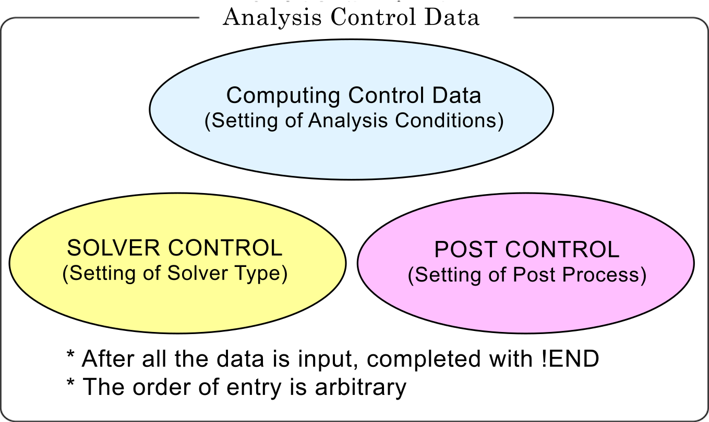{.center width="50%"}

The features of the analysis control data file are as follows.

  - This is an ASCII format file based on a free format.
  - This file consists of a header which starts with "`!`" and the data following this.
  - The order of description of the header is basically free.
  - A "`,`" is used as a punctuation mark of the data.
  - The inside of the file is briefly divided into three zones.
  - "`!END`" is input at the end of the file for completion.

**Example of Analysis Control Data**

```
#############################################################
##### (1) Computing control data portion ####################
#############################################################
### Control File for HEAT solver
!SOLUTION,TYPE=HEAT
!FIXTEMP
 XMIN, 0.0
 XMAX, 500.0

#############################################################
##### (2) Solver control data portion #######################
#############################################################
### Solver Control
!SOLVER,METHOD=1,PRECOND=1,ITERLOG=NO,TIMELOG=NO
100, 1
1.0e-8,1.0,0.0

#############################################################
##### (3) Post control (visualization) data portion #########
#############################################################
### Post Control
!WRITE,RESULT
!WRITE,VISUAL
!VISUAL, method=PSR
!surface_num = 1
!surface 1
!surface_style = 1
!display_method 1
!color_comp_name = TEMPERATURE
!color_subcomp = 1
!output_type = BMP
!x_resolution = 500
!y_resolution = 500
!num_of_lights = 1
!position_of_lights =
-20.0, 5.8, 80.0
!viewpoint = -20.0 10.0 8.0
!up_direction = 0.0 0.0 1.0
!ambient_coef= 0.3
!diffuse_coef= 0.7
!specular_coef= 0.5
!color_mapping_style= 1
!!interval_mapping= -0.01, 0.02
!color_mapping_bar_on = 1
!scale_marking_on = 1
!num_of_scale = 5
!font_size = 1.5
!font_color = 1.0 1.0 1.0
!END
```

### Input Rules

The analysis control data consists of a header line, data line and a comment line.

One header is always included in the header line.

Header
:  The header specifies the meaning of the data and the data block in the analysis control data. When the head of the term starts with a "`!`", it is considered to be a header.

Header Line
:   The header and the parameter accompanying this are described in this line.
:   The header line must start with a header. When a parameter is required, a "`,`" must be used to continue after that. When the parameter takes on a value, use an "`=`" after the parameter and describe the value after that.
:   The header line can not be described in more than two lines.

Data Line
:   The data line starts after the header line, and the necessary data is described.
:   The data lines may be in multiple lines; however, this is determined according to the rules of the data description defined by each header.
:   There are cases where data lines are not required.

Punctuation
:   A comma "`,`" is used as a punctuation of the data.

Handling of Blanks
:   Blanks are disregarded.

Name
:   Regarding the characters which can be used for the name, there is the underscore "`_`", hyphen "`-`", and alphanumeric characters "`a - z, A - Z, 0 - 9`"; however, the first letter of the name must start with "`_`", or an alphabetic character "`a - z, A - Z`". There is no distinction between uppercase and lowercase letters, and all letters are internally handled as uppercase letters.
:   The maximum length of the name is 63 characters.

File Name
:   Regarding the characters which can be used for the file name, there are the underscore "`_`", hyphen "`-`", period "`.`", slash "`/`", and the alphanumeric characters "`a - z, A - Z, 0 - 9`".
:   As long as there is no specific description, a path can be included in the file name. Both the relative path and the absolute path can be specified.
:   The maximum length of the file name is 1,023 characters.

Floating Point Data
:   Exponents are optional. An "`E`" or "`e`" character must be added before the exponent. The selection of "`E`" or "`e`" is optional.

!!, #, Comment Line
:   Lines starting with "`!!`" or "`#`" are considered to be comment lines, and are disregarded. A comment line can be inserted in any position in the file, and there are no restrictions on the number of lines.

!END
:   End of mesh data
:   When this header is displayed, the reading of the mesh data is completed.

### Analysis Control Data

#### Header List of Computing Control Data

In FrontISTR, the following items can be mentioned as the boundary conditions which can be used for the computing control data.

  - Distributed load conditions (body force, pressure loading, gravity, centrifugal force)
  - Concentrated load conditions
  - Heat load
  - Single point restriction conditions (SPC conditions)
  - Spring boundary conditions
  - Contact
  - Concentrated heat flux
  - Distributed heat flux
  - Convective heat transfer boundary
  - Radiant heat transfer boundary
  - Specified temperature boundary

The same as the mesh data, the `!HEADER` format is used as the definition method of the above boundary conditions.

The header list of the common control data is shown in the following Table 7.3.1, and the header list for each analysis type is shown in Table 7.3.2.

**Table 7.3.1: Control Data Common to All Analysis**

| Header                                             | Meaning                                                           | Remarks   | Description No. |
|----------------------------------------------------|-------------------------------------------------------------------|-----------|-----------------|
| [`!VERSION`](#1-version-1-1)                       | Solver version number                                             |           | 1-1             |
| [`!SOLUTION`](#2-solution-1-2)                     | Specification of analysis type                                    | Mandatory | 1-2             |
| [`!WRITE,VISUAL`](#3-write-visual-1-3)             | Specification of visualization output                             |           | 1-3             |
| [`!WRITE,RESULT`](#4-write-result-1-4)             | Specification of results output                                   |           | 1-4             |
| [`!WRITE,LOG`](#5-write-log-1-5)                   | Specification of results output                                   |           | 1-5             |
| [`!OUTPUT_VIS`](#6-output_vis-1-6)                 | Control of visualization output items                             |           | 1-6             |
| [`!OUTPUT_RES`](#7-output_res-1-7)                 | Control of results output items                                   |           | 1-7             |
| [`!RESTART`](#8-restart-1-8)                       | Control of restarting                                             |           | 1-8             |
| [`!ECHO`](#9-echo-1-9)                             | Echo output                                                       |           | 1-9             |
| [`!ORIENTATION`](#10-orientation-1-10)             | Definition of local coordinate system                             |           | 1-10            |
| [`!SECTION`](#11-section-1-11)                     | Definition of local coordinate system the sction correspondent to |           | 1-11            |
| [`!INITIAL_CONDITION`](#12-initial_condition-1-12) | Definition of initial condition                                   |           | 1-12            |
| [`!END`](#13-end-1-13)                             | Ending specification of control data                              |           | 1-13            |

**Table 7.3.2: Control Data for Static Analysis**

| Header                                          | Meaning                                                  | Remarks | Description No. |
|-------------------------------------------------|----------------------------------------------------------|---------|-----------------|
| [`!STATIC`](#1-static-2-1)                      | Static analysis control                                  |         | 2-1             |
| [`!MATERIAL`](#2-material-2-2)                  | Material name                                            |         | 2-2             |
| [`!ELASTIC`](#3-elastic-2-2-1)                  | Elastic material physical properties                     |         | 2-2-1           |
| [`!PLASTIC`](#4-plastic-2-2-2)                  | Plastic material physical properties                     |         | 2-2-2           |
| [`!HYPERELASTIC`](#5-hyperelastic-2-2-3)        | Hyperelastic material physical properties                |         | 2-2-3           |
| [`!VISCOELASTIC`](#6-viscoelastic-2-2-4)        | Viscoelastic material physical properties                |         | 2-2-4           |
| [`!CREEP`](#7-creep-2-2-5)                      | Creep material physical properties                       |         | 2-2-5           |
| [`!DENSITY`](#8-density-2-2-6)                  | Mass density                                             |         | 2-2-6           |
| [`!EXPANSION_COEFF`](#9-expansion_coeff-2-2-7)  | Coefficient of linear expansion                          |         | 2-2-7           |
| [`!TRS`](#10-trs-2-2-8)                         | Tempearture dependent behaviour of viscoelastic material |         | 2-2-8           |
| [`!FLUID`](#11-fluid-2-2-9)                     | Flow Condition                                           |         | 2-2-9           |
| [`!USER_MATERIAL`](#12-user_material-2-2-10)    | User defined material                                    |         | 2-2-10          |
| [`!BOUNDARY`](#13-boundary-2-3)                 | Displacement boundary conditions                         |         | 2-3             |
| [`!SPRING`](#14-spring-2-3-1)                   | Spring boundary conditions                               |         | 2-3-1           |
| [`!CLOAD`](#15-cload-2-4)                       | Concentrated load                                        |         | 2-4             |
| [`!DLOAD`](#16-dload-2-5)                       | Distributed load                                         |         | 2-5             |
| [`!ULOAD`](#17-uload-2-6)                       | User defined external load                               |         | 2-6             |
| [`!CONTACT_ALGO`](#18-contact_algo-2-7)         | Contact analytic algorithm                               |         | 2-7             |
| [`!CONTACT`](#19-contact-2-8)                   | Contact                                                  |         | 2-8             |
| [`!TEMPERATURE`](#20-temperature-2-9)           | Nodal temperature in thermal stress analysis             |         | 2-9             |
| [`!REFTEMP`](#21-reftemp-2-10)                  | Reference temperature in thermal stress analysis         |         | 2-10            |
| [`!STEP`](#22-step-2-11)                        | Analysis step control                                    |         | 2-11            |
| [`!AUTOINC_PARAM`](#23-autoinc_param-2-12)      | Auto increment control                                   |         | 2-12            |
| [`!TIME_POINTS`](#24-time_points-2-13)          | Output time point control                                |         | 2-13            |
| [`!CONTACT_PARAM`](#25-contact_param-2-14)      | Contact scan control                                     |         | 2-14            |

**Table 7.3.3: Control Data for Eigenvalue Analysis**

| Header                   | Meaning                     | Remarks                          | Description No. |
|--------------------------|-----------------------------|----------------------------------|-----------------|
| [`!EIGEN`](#1-eigen-3-1) | Eigenvalue analysis control | Mandatory in eigenvalue analysis | 3-1             |


**Table 7.3.4: Control Data for Heat Conduction Analysis**

| Header                             | Meaning                                                                   | Remarks                               | Description No. |
|------------------------------------|---------------------------------------------------------------------------|---------------------------------------|-----------------|
| [`!HEAT`](#1-heat-4-1)             | Heat conduction analysis control                                          | Mandatory in heat conduction analysis | 4-1             |
| [`!FIXTEMP`](#2-fixtemp-4-2)       | Nodal temperature                                                         |                                       | 4-2             |
| [`!CFLUX`](#3-cflux-4-3)           | Concentrated heat flux given to node                                      |                                       | 4-3             |
| [`!DFLUX`](#4-dflux-4-4)           | Distributed heat flux / internal heat generation given to element surface |                                       | 4-4             |
| [`!SFLUX`](#5-sflux-4-5)           | Distributed heat flux by surface group                                    |                                       | 4-5             |
| [`!FILM`](#6-film-4-6)             | Heat transfer coefficient given to boundary plain                         |                                       | 4-6             |
| [`!SFILM`](#7-sfilm-4-7)           | Heat transfer coefficient by surface group                                |                                       | 4-7             |
| [`!RADIATE`](#8-radiate-4-8)       | Radiation factor given to boundary plane                                  |                                       | 4-8             |
| [`!SRADIATE`](#9-sradiate-4-9)     | Radiation factor by surface group                                         |                                       | 4-9             |
| [`!WELD_LINE`](#10-weld_line-4-10) | Weld line                                                                 |                                       | 4-10            |

**Table 7.3.5: Control Data for Dynamic Analysis**

| Header                                 | Meaning                                                         | Remarks                                  | Description No. |
|----------------------------------------|-----------------------------------------------------------------|------------------------------------------|-----------------|
| [`!DYNAMIC`](#1-dynamic-5-1)           | Dynamic analysis control                                        | Mandatory in dynamic analysis            | 5-1             |
| [`!VELOCITY`](#2-velocity-5-2)         | Velocity boundary conditions                                    |                                          | 5-2             |
| [`!ACCELERATION`](#3-acceleration-5-3) | Acceleration boundary conditions                                |                                          | 5-3             |
| [`!COUPLE`](#4-couple-5-4)             | Coupled surface definition Required in coupled analysis         |                                          | 5-4             |
| [`!EIGENREAD`](#5-eigenread-5-5)       | Specification of eigenvalues and eigenvectors                   | Mandatory in frequency response analysis | 5-5             |
| [`!FLOAD`](#6-fload-5-6)               | Definition of concentrated load for frequency response analysis |                                          | 5-6             |

In each header, there are data items which comply with the parameter and each header.

Each of the above headers is described in the following with examples of data creation for each analysis type. The description number in the above Table is the number indicated on the right end of the example of the data creation.

#### (1) Control data common to all analyses

##### Example of Analysis Control Data

```
### Control File for FISTR
!VERSION                                        1-1
  5
!SOLUTION, TYPE=STATIC                          1-2
!WRITE, VISUAL                                  1-3
!WRITE, RESULT                                  1-4
!ECHO                                           1-9
!BOUNDARY                                       2-3
  FIX, 1, 3, 0.0
!CLOAD                                          2-4
  CL1, 3, -1.0
!END                                            1-12
```

##### Description of Header

###### 1-1 `!VERSION`

Refer to the solver version.

###### 1-2 `!SOLUTION, TYPE=STATIC`

TYPE=analysis type

###### 1-3 `!WRITE, VISUAL`

Output of data by visualizer via memory

Outputs the file just by entering

###### 1-4 `!WRITE, RESULT`

Output of analysis results file

Outputs the file just by entering

###### 1-6 `!ECHO`

Output of node data, element data and material data to log file

Outputs to the file just by entering

###### 1-8 `!END`

Indicates the end of control data

#### (2) Static analysis control data

##### Example of Static Analysis Control data

```
### Control File for FISTR
!SOLUTION, TYPE=STATIC                          1-2
!WRITE, VISUAL                                  1-3
!WRITE, RESULT                                  1-4
!ECHO                                           1-9
!MATERIAL, NAME=M1                              2-2
!ELASTIC, TYPE=ISOTROPIC                        2-2-1
  210000.0, 0.3
!BOUNDARY                                       2-3
  FIX, 1, 3, 0.0
!SPRING 2-3-1
  200, 1, 0.03
!CLOAD 2-4
  CL1, 3, -1.0
!DLOAD 2-5
  1, P1, 1.0
!TEMPERATURE                                    2-9
  1, 10.0
!REFTEMP                                        2-10
!STEP, CONVERG=1.E-5, MAXITER=30                2-11
!END                                            1-12
```

##### Description of Header

  - <font color="Red">Red figures</font> are the values indicated in the example.
  - Alphabetic characters in the 2nd line of the table express the parameter name.

###### 2-1 `!STATIC`

Setting of static analysis method

###### 2-2 `!MATERIAL`

Definition of material physical properties

`NAME =` name of material physical properties

###### 2-2-1 `!ELASTIC, TYPE=ISOTROPIC`

Definition of elastic substance

`TYPE =` elastic type

| Young's Modulus                   | Poisson's Ratio              |
|-----------------------------------|------------------------------|
| YOUNG_MODULUS                     | POISSON_RATIO                |
| <font color="Red">210000.0</font> | <font color="Red">0.3</font> |

###### 2-3 `!BOUNDARY`

Definition of displacement boundary conditions

| Node ID or Node Group Name | Start No. of Restricted Degree of Freedom | End No. of Restricted Degree of Freedom | Restricted Value |
|----------------------------|-------------------------------------------|-----------------------------------------|------------------|
| NODE_ID                    | DOF_idS                                   | DOF_idE                                 | Value            |
|<font color="Red">FIX</font>, |<font color="Red">1</font>,|<font color="color">3</font>,|<font color="color">0.0</font>|

###### 2-3-1 `!SPRING`

Definition of spring boundary conditions

|Node ID or Node Group Name|Restricted Degree of Freedom|Spring Constant|
|--------------------------|----------------------------|---------------|
|NODE_ID                   |DOF_id                      |Value          |
|<font color="Red">200</font>,|<font color="Red">1</font>,|<font color="Red">0.03</font>|

###### 2-4 `!CLOAD`

Definition of concentrated load

|Node ID or Node Group Name|Degree of Freedom No.|Load Value|
|--------------------------|---------------------|----------|
|NODE_ID                   |DOF_id               |Value     |
|<font color="Red">CL1</font>,|<font color="Red">3</font>,|<font color="Red">-1.0</font>|

###### 2-5 `!DLOAD`

Definition of distributed load

|Element ID or Element Group Name|Load Type No.|Load Parameter|
|--------------------------------|-------------|--------------|
|ELEMENT_ID                      |LOAD_type    |param         |
|<font color="Red">1</font>, |<font color="Red">P1</font>,|<font color="Red">1.0</font>|

###### 2-9 `!TEMPERATURE`

Specification of nodal temperature used for thermal stress analysis

|Node ID or Node Group Name|Temperature|
|--------------------------|-----------|
|NODE_ID                   |Temp_Value |
|<font color="Red">1</font>, |<font color="Red">10</font>|

###### 2-10 `!REFTEMP`

Definition of reference temperature in thermal stress analysis

###### 2-11 `!STEP`

Control of nonlinear static analysis (Omissible in the case of linear analysis)

|Convergence Value Judgment Threshold|No. of Sub Steps (When AMP exists, AMP has priority)|Max No. of Iterative Calculations|Time Function Name (Specified in `!AMPLITUDE`)
|-------|--------|-------|---|
|CONVERG|SUBSTEPS|MAXITER|AMP|
|<font color="Red">1.0E-05</font>   |<font color="Red">10</font>              |<font color="Red">30</font>|   |

#### (3) Eigenvalue analysis control data

##### Example of Eigenvalue Analysis Control Data

```
### Control File for FISTR
!SOLUTION, TYPE=EIGEN                           1-2
!WRITE, VISUAL                                  1-3
!WRITE, RESULT                                  1-4
!ECHO                                           1-9
!EIGEN                                          3-1
  3, 1.0E-8, 60
!BOUNDARY                                       2-3
 FIX, 1, 2, 0.0
!END
```

##### Description of Header

<font color="Red">Red figures</font> are the values indicated in the example.

###### 3-1 `!EIGEN`

Parameter settings of eigenvalue analysis

|No. of Eigenvalue|Allowance|Max No. of Iterations|
|-----------------|---------|---------------------|
|NSET             |LCZTOL   |LCZMAX               |
|<font color="Red">3</font>,|<font color="Red">1.0E-8</font>,|<font color="Red">60</font>|

###### 2-3 `!BOUNDARY` (Same items an in Static Analysis)

Definition of displacement boundary conditions

|Node ID or Node Group Name|Start No. of Restricted Degree of Freedom|End No. of Restricted Degree of Freedom|Restricted Value|
|--------------------------|-----------------------------------------|---------------------------------------|----------------|
|NODE_ID                   |DOF_idS                                  |DOF_idE                                |Value           |
|<font color="Red">FIX</font>,|<font color="Red">1</font>,|<font color="Red">3</font>,|<font color="Red">0.0</font>           |

#### (4) Heat conduction analysis control data

##### Example of Heat Conduction Analysis Control Data

```
### Control File for FISTR
!SOLUTION, TYPE=HEAT                            1-2
!WRITE, VISUAL                                  1-3
!WRITE, RESULT                                  1-4
!ECHO                                           1-9
!HEAT                                           4-1
!FIXTEMP                                        4-2
  XMIN, 0.0
  XMAX, 500.0
!CFLUX                                          4-3
  ALL, 1.0E-3
!DFLUX                                          4-4
  ALL, S1, 1.0
!SFLUX                                          4-5
  SURF, 1.0
!FILM                                           4-6
  FSURF, F1, 1.0, 800
!SFILM                                          4-7
  SFSURF, 1.0, 800.0
!RADIATE                                        4-8
  RSURF, R1, 1.0E-9, 800.0
!SRADIATE                                       4-9
  RSURF, R1, 1.0E-9, 800.0
!END                                            1-12
```

##### Description of Header

<font color="Red">Red figures</font> are the values indicated in the example.

###### 4-1 `!HEAT`

Definition of control data for calculation

```
!HEAT
  (No data)                         ----- Steady calculation
!HEAT
  0.0                               ----- Steady calculation
!HEAT
  10.0, 3600.0                      ----- Fixed time increment unsteady calculation
!HEAT
  10.0, 3600.0, 1.0                 ----- Automatic time increment unsteady calculation
!HEAT
  10.0, 3600.0, 1.0, 20.0           ----- Automatic time increment unsteady calculation
```

###### 4-2 `!FIXTEMP`

Node group name, or node ID and fixed temperature

###### 4-3 `!CFLUX`

Definition of concentrated heat flux given to node

| Node Group Name or Node ID    | Heat Flux Value                 |
|-------------------------------|---------------------------------|
| NODE_GRP_NAME                 | Value                           |
| <font color="Red">ALL</font>, | <font color="Red">1.0E-3</font> |

###### 4-4 `!DFLUX`

Definition of distributed heat flux and internal heat generation given to surface of element

| Element Group Name or Element ID | Load Type No.                | Heat Flux Value              |
|----------------------------------|------------------------------|------------------------------|
| <font color="Red">ALL</font>,    | <font color="Red">S1</font>, | <font color="Red">1.0</font> |

**Load Parameter**

| Load Type No. | Applied Surface | Parameter       |
|---------------|-----------------|-----------------|
| BF            | Element Overall | Calorific value |
| S1            | Surface No. 1   | Heat flux value |
| S2            | Surface No. 2   | Heat flux value |
| S3            | Surface No. 3   | Heat flux value |
| S4            | Surface No. 4   | Heat flux value |
| S5            | Surface No. 5   | Heat flux value |
| S6            | Surface No. 6   | Heat flux value |
| S0            | Shell surface   | Heat flux value |

###### 4-5 `!SFLUX`

Definition of distributed heat flux by surface group

| Surface Group Name             | Heat Flux Value              |
|--------------------------------|------------------------------|
| SURFACE_GRP_NAME               | Value                        |
| <font color="Red">SURF</font>, | <font color="Red">1.0</font> |

###### 4-6 `!FILM`

Definition of heat transfer coefficient given to boundary plane

| Element Group Name or Element ID | Load Type No.                | Heat Transfer Coefficient     | Ambient Temperature            |
|----------------------------------|------------------------------|-------------------------------|--------------------------------|
| ELEMENT_GRP_NAME                 | LOAD_type                    | Value                         | Sink                           |
| <font color="Red">FSURF</font>,  | <font color="Red">F1</font>, | <font color="Red">1.0</font>, | <font color="Red">800.0</font> |

**Load Parameter**

| Load Type No. | Applied Surface | Parameter                                         |
|---------------|-----------------|---------------------------------------------------|
| F1            | Surface No. 1   | Heat transfer coefficient and ambient temperature |
| F2            | Surface No. 2   | Heat transfer coefficient and ambient temperature |
| F3            | Surface No. 3   | Heat transfer coefficient and ambient temperature |
| F4            | Surface No. 4   | Heat transfer coefficient and ambient temperature |
| F5            | Surface No. 5   | Heat transfer coefficient and ambient temperature |
| F6            | Surface No. 6   | Heat transfer coefficient and ambient temperature |
| F0            | Shell surface   | Heat transfer coefficient and ambient temperature |

###### 4-7 `!SFILM`

Definition of heat transfer coefficient by surface group

| Surface Group Name               | Heat Transfer Rate            | Ambient Temperature            |
|----------------------------------|-------------------------------|--------------------------------|
| SURFACE_GRP_NAME                 | Value                         | Sink                           |
| <font color="Red">SFSURF</font>, | <font color="Red">1.0</font>, | <font color="Red">800.0</font> |

###### 4-8 `!RADIATE`

Definition of radiation factor given to boundary plane

| Element Group Name or Element ID | Load Type No.                | Radiation Factor                 | Ambient Temperature            |
|----------------------------------|------------------------------|----------------------------------|--------------------------------|
| ELEMENT_GRP_NAME                 | LOAD_type                    | Value                            | Sink                           |
| <font color="Red">RSURF</font>,  | <font color="Red">R1</font>, | <font color="Red">1.0E-9</font>, | <font color="Red">800.0</font> |

**Load Parameter**

| Load Type No. | Applied Surface | Parameter                                |
|---------------|-----------------|------------------------------------------|
| R1            | Surface No. 1   | Radiation factor and ambient temperature |
| R2            | Surface No. 2   | Radiation factor and ambient temperature |
| R3            | Surface No. 3   | Radiation factor and ambient temperature |
| R4            | Surface No. 4   | Radiation factor and ambient temperature |
| R5            | Surface No. 5   | Radiation factor and ambient temperature |
| R6            | Surface No. 6   | Radiation factor and ambient temperature |
| R0            | Shell surface   | Radiation factor and ambient temperature |

###### 4-9 `!SRADIATE`

Definition of radiation factor by surface group

| Surface Group Name               | Radiation Factor                 | Ambient Temperature            |
|----------------------------------|----------------------------------|--------------------------------|
| SURFACE_GRP_NAME                 | Value                            | Sink                           |
| <font color="Red">SRSURF</font>, | <font color="Red">1.0E-9</font>, | <font color="Red">800.0</font> |

#### (5) Dynamic analysis control data

##### Example of Dynamic Analysis Control Data

```
### Control File for FISTR
!SOLUTION, TYPE=DYNAMIC                         1-2
!DYNAMIC, TYPE=NONLINEAR                        5-1
  1 , 1
  0.0, 1.0, 500, 1.0000e-5
  0.5, 0.25
  1, 1, 0.0, 0.0
  100, 5, 1
  0, 0, 0, 0, 0, 0
!BOUNDARY, AMP=AMP1                             2-3
  FIX, 1, 3, 0.0
!CLOAD, AMP=AMP1                                2-4
  CL1, 3, -1.0
!COUPLE, TYPE=1                                 5-4
  SCOUPLE
!STEP, CONVERG=1.E-6, ITMAX=20                  2-11
!END                                            1-12
```

##### Description Header

  - <font color="Red">Red figures</font> are the values indicated in the example.
  - Alphabetic characters in the 2nd line of the table express the parameter name.

###### 5-1 `!DYNAMIC`

Controlling the linear dynamic analysis

| Solution of Equation of Motion | Analysis Types             |
|--------------------------------|----------------------------|
| idx_eqa                        | idx_resp                   |
| <font color="Red">11</font>    | <font color="Red">1</font> |

| Analysis Start Time          | Analysis End Time            | Overall No. of STEPS         | Time Increment                     |
|------------------------------|------------------------------|------------------------------|------------------------------------|
| t_start                      | t_end                        | n_step                       | t_delta                            |
| <font color="Red">0.0</font> | <font color="Red">1.0</font> | <font color="Red">500</font> | <font color="Red">1.0000e-5</font> |

| Parameter \(\gamma\) of Newmark-\(\beta\) Method | Parameter \(\beta\) of Newmark-\(\beta\) Method |
|----------------------------------------------|---------------------------------------------|
| gamma                                        | beta                                        |
| <font color="Red">0.5</font>                 | <font color="Red">0.25</font>               |

| Type of Mass Matrix        | Type of Damping            | Parameter \(R_m\) of Rayleigh Damping | Parameter of \(R_k\) of Rayleigh Damping |
|----------------------------|----------------------------|-------------------------------------|----------------------------------------|
| idx_mass                   | idx_dmp                    | ray_m                               | ray_k                                  |
| <font color="Red">1</font> | <font color="Red">1</font> | <font color="Red">0.0</font>        | <font color="Red">0.0</font>           |

| Resules Output Interval      | Monitoring Node ID or Node Group Name | Results Output Interval of Displacement Monitoring |
|------------------------------|---------------------------------------|----------------------------------------------------|
| nout                         | node_monit_1                          | nout_monit                                         |
| <font color="Red">100</font> | <font color="Red">55</font>           | <font color="Red">nout_monit</font>                |

|Output Control Displacement|Output Control Velocity|Output Control Acceleration|Output Control Reaction Force|Output Control Strain|Output Control Stress|
|---------------------------|-----------------------|---------------------------|-----------------------------|---------------------|---------------------|
|iout_list(1)               |iout_list(2)           |iout_list(3)               |iout_list(4)                 |iout_list(5)         |iout_list(6)         |
|<font color="Red">0</font> |<font color="Red">0</font> |<font color="Red">0</font> |<font color="Red">0</font> |<font color="Red">0</font> |<font color="Red">0</font> |

###### 2-3 `!BOUNDARY` (Same items as in Static Analysis)

Definition of displacement boundary conditions

| Node ID or Node Group Name    | Start No. of Restricted Degree of Freedom | End No. of Restricted Degree of Freedom | Restricted Value             |
|-------------------------------|-------------------------------------------|-----------------------------------------|------------------------------|
| NODE_ID                       | DOF_idS                                   | DOF_idE                                 | Value                        |
| <font color="Red">FIX</font>, | <font color="Red">1</font>,               | <font color="Red">3</font>,             | <font color="Red">0.0</font> |

###### 2-4 `!CLOAD` (Same items as in Static Analysis)

Definition of concentrated load

| Node ID or Node Group Name    | Degree of Freedom No.       | Load Value                    |
|-------------------------------|-----------------------------|-------------------------------|
| <font color="Red">CL1</font>, | <font color="Red">3</font>, | <font color="Red">-1.0</font> |

###### 5-4 `!COUPLE, TYPE=1`

Definition of coupled surface

| Coupling Surface Group Name      |
|----------------------------------|
| <font color="Red">SCOUPLE</font> |

###### 2-11 `!STEP, CONVERG=1.E-10, ITMAX=20`

Control of nonlinear static analysis

(Omissible in the case of linear analysis, and unnecessary for explicit method)

| Convergence Value Judgment Threshold (Default: 1.0E-06) | No. of Sub Steps (When AMP exists, AMP has priority) | Max No. of Iterative Calculations |
|---------------------------------------------------------|------------------------------------------------------|-----------------------------------|
| CONVERG                                                 | SUBSTEPS                                             | ITMAX                             |
| <font color="Red">1.0E-10</font>                        |                                                      | <font color="Red">20</font>       |

#### (6) Dynamic analysis (Frequency Response Analysis) Control Data

##### Example of Dynamic analysis (Frequency Response Analysis)

```
!SOLUTION, TYPE=DYNAMIC                         1-2
!DYNAMIC                                        5-1
  11 , 2
  14000, 16000, 20, 15000.0
  0.0, 6.6e-5
  1, 1, 0.0, 7.2E-7
  10, 2, 1
  1, 1, 1, 1, 1, 1
!EIGENREAD                                      5-5
  eigen0.log
  1, 5
!FLOAD, LOAD CASE=2                             5-6
  _PickedSet5, 2, 1.0
!FLOAD, LOAD CASE=2
  _PickedSet6, 2, 1.0
```

##### Description of Header

  - <font color="Red">Red figures</font> are the values indicated in the example.
  - Alphabetic characters in the 2nd line of the table express the parameter name.

###### 5-1 `!DYNAMIC`

Controlling the frequency response analysis

| Solution of Equation of Motion | Analysis Types             |
|--------------------------------|----------------------------|
| idx_eqa                        | idx_resp                   |
| <font color="Red">11</font>    | <font color="Red">2</font> |

| Minimum Frequency              | Maximum Frequency              | Number of divisions for the frequency range | Frequency to obtain displacement |
|--------------------------------|--------------------------------|---------------------------------------------|----------------------------------|
| f_start                        | f_end                          | n_freq                                      | f_disp                           |
| <font color="Red">14000</font> | <font color="Red">16000</font> | <font color="Red">20</font>                 | <font color="Red">15000.0</font> |

| Analysis Start Time          | Analysis End Time               |
|------------------------------|---------------------------------|
| <font color="Red">0.0</font> | <font color="Red">6.6e-5</font> |

| Type of Mass Matrix        | Type of Damping            | Parameter \(R_m\) of Rayleigh Damping | Parameter \(R_k\) of Rayleigh Damping |
|----------------------------|----------------------------|-------------------------------------|-------------------------------------|
| idx_mass                   | idx_dmp                    | ray_m                               | ray_k                               |
| <font color="Red">1</font> | <font color="Red">1</font> | <font color="Red">0.0</font>        | <font color="Red">7.2E-7</font>     |

| Results Output Interval in Time Domain | Visualization Type<br/>(1-Mode shapes,<br/>2-Time history result at f_disp) | Monitoring Node ID in Frequency Domain |
|----------------------------------------|-----------------------------------------------------------------------------|----------------------------------------|
| nout                                   | vistype                                                                     | nodeout                                |
| <font color="Red">10</font>            | <font color="Red">2</font>                                                  | <font color="Red">1</font>             |

|Output Control<br/>Displacement|Output Control<br/>Velocity|Output Control<br/>Acceleration|Output Control<br/>ignored|Output Control<br/>ignored|Output Control<br/>ignored|
|-------------------------------|---------------------------|-------------------------------|--------------------------|--------------------------|--------------------------|
|iout_list(1)                   |iout_list(2)               |iout_list(3)                   |<font color="Gray">iout_list(4)</font>|<font color="Gray">iout_list(5)</font>|<font color="Gray">iout_list(6)</font>|
|<font color="Red">1</font>     |<font color="Red">1</font> |<font color="Red">1</font>     |<font color="Red">1</font>|<font color="Red">1</font>|<font color="Red">1</font>|

###### 5-5 `!EIGENREAD`

Controlling the input file for frequency response analysis

| The name of eigenvalue analysis log |
|-------------------------------------|
| eigenlog_filename                   |
| <font color="Red">eigen0.log</font> |

|lowest mode to be used in frequency response analysis|highest mode to be used frequency response analysis|
|-----------------------------------------------------|---------------------------------------------------|
|start_mode                                           |end_mode                                           |
|<font color="Red">1</font>                           |<font color="Red">5</font>                         |

###### 5-6 `!FLOAD`

Defining external forces applied in frequency response analysis

| Node ID, Node Group Name<br/> or Surface Group Name | Degree of Freedom No.      | Load Value                   |
|-----------------------------------------------------|----------------------------|------------------------------|
| <font color="Red">_PickedSet5</font>                | <font color="Red">2</font> | <font color="Red">1.0</font> |

### Solver Control Data

#### Example of Solver Control Data

```
### SOLVER CONTROL
!SOLVER, METHOD=CG, PRECOND=1, ITERLOG=YES, TIMELOG=YES        6-1
  10000, 1                                                     6-2
  1.0e-8, 1.0, 0.0
```

#### Description of Header

  - <font color="Red">Red figures</font> are the values indicated in the example.

##### 6-1 `!SOLVER`

```
METHOD    = method
           (CG, BiCGSTAB, GMRES, GPBiCG, etc.)
TIMELOG   = whether solver computation time is output
MPCMETHOD = method for multipoint constraints
            (1: Penalty method,
             2: MPC-CG method,
             3: Explicit master-slave elimination)
DUMPTYPE  = type of matrix dumping
DUMPEXIT  = whether program exits right after dumping matrix
```

The following parameters will be disregarded when a direct solver is selected in the method.

```
PRECOND   = preconditioner
ITERLOG   = whether solver convergence history is output
SCALING   = whether matrix is scaled so that each diagonal element becomes 1
USEJAD    = whether matrix ordering optimized for vector processors is performed
ESTCOND   = frequency for estimating condition number
            (Estimation performed at every specified number of iterations and
             at the last iteration.  No estimation when 0 is specified.)
```

###### 6-2

| No. of Iterations              | Iteration Count of Preconditioning | No. of Krylov Subspaces | No. of Colors for Multi-Color ordering | No. of Recycling Set-Up Info for Preconditioning |
|--------------------------------|------------------------------------|-------------------------|----------------------------------------|--------------------------------------------------|
| NITER                          | iterPREMAX                         | NREST                   | NCOLOR_IN                              | RECYCLEPRE                                       |
| <font color="Red">10000</font> | <font color="Red">1</font>         |                         |                                        |                                                  |

###### 6-3

| Truncation Error                 | Scale Factor for Diagonal Elements<br/>when computing Preconditioning Matrix | Not Used                     |
|----------------------------------|------------------------------------------------------------------------------|------------------------------|
| <font color="Red">1.0e-8</font>, | <font color="Red">1.0</font>,                                                | <font color="Red">0.0</font> |

### Post Process (Visualization) Control Data

An example of the post process (visualization) control data and the contents are shown in the following.

#### Example of Visualization Control Data

Each description number (P1-0, P1-1, etc.) is linked to the number of the detailed descriptions in the following.

  - P1-&#9675; expresses the common data, and P2-&#9675; expresses the parameter for the purpose of the rendering.<br/>In addition, the rendering will become valid only when the `output_type=BMP`.
  - When the surface_style is `!surface_style = 2` (isosurface) `!surface_style = 3` (user specified curved surface), a separate setting is required. The data is indicated collectively after the common data.<br/>(P3-&#9675; is a description of the isosurface in `!surface_style = 2`. P4-&#9675; is a description of the user specified curved surface in `!surface_style = 3`.)
  - The items indicated with two `!` like "`!!`", will be recognized as a comment and will not affect the analysis.

```
### Post Control                                Description No.
!VISUAL, method=PSR                             P1-0
!surface_num = 1                                P1-1
!surface 1                                      P1-2
!surface_style = 1                              P1-3
!display_method = 1                             P1-4
!color_comp_name = STRESS                       P1-5
!colorsubcomp_name                              P1-6
!color_comp 7                                   P1-7
!!color_subcomp = 1                             P1-8
!iso_number                                     P1-9
!specified_color                                P1-10
!deform_display_on = 1                          P1-11
!deform_comp_name                               P1-12
!deform_comp                                    P1-13
!deform_scale = 9.9e-1                          P1-14
!initial_style = 1                              P1-15
!deform_style = 3                               P1-16
!initial_line_color                             P1-17
!deform_line_color                              P1-18
!output_type = BMP                              P1-19
!x_resolution = 500                             P2-1
!y_resolution = 500                             P2-2
!num_of_lights = 1                              P2-3
!position_of_lights = -20.0, 5.8, 80.0          P2-4
!viewpoint = -20.0 -10.0 5.0                    P2-5
!look_at_point                                  P2-6
!up_direction = 0.0 0.0 1.0                     P2-7
!ambient_coef= 0.3                              P2-8
!diffuse_coef= 0.7                              P2-9
!specular_coef= 0.5                             P2-10
!color_mapping_style= 1                         P2-11
!!interval_mapping_num                          P2-12
!interval_mapping= -0.01, 0.02                  P2-13
!rotate_style = 2                               P2-14
!rotate_num_of_frames                           P2-15
!color_mapping_bar_on = 1                       P2-16
!scale_marking_on = 1                           P2-17
!num_of_scale = 5                               P2-18
!font_size = 1.5                                P2-19
!font_color = 1.0 1.0 1.0                       P2-20
!background_color                               P2-21
!isoline_color                                  P2-22
!boundary_line_on                               P2-23
!color_system_type                              P2-24
!fixed_range_on = 1                             P2-25
!range_value = -1.E-2, 1.E-2                    P2-26
```

##### Common Data List&lt;P1-1 - P1-19&gt;

|No.  |Keywords             |Types         |Contents |
|-----|---------------------|--------------|---------|
|P1-0 |`!VISUAL`            |              |Specification of the visualization method|
|P1-1 |`surface_num`        |              |No. of surfaces in one surface rendering|
|P1-2 |`surface`            |              |Setting of the contents of surface|
|P1-3 |`surface_style`      |integer       |Specification of the surface type (Default: 1)<br/>1: Boundary surface<br/>2: Isosurface<br/>3: Curved surface defined by user based on the equation| 
|P1-4 |`display_method`     |integer       |Display method (Default: 1)<br/>1. Color code display<br/>2. Boundary line display<br/>3. Color code and boundary line display<br/>4. Display of 1 specified color<br/>5. Isopleth line display by classification of color|
|P1-5 |`color_comp_name`    |character(100)|Compatible with parameter name and colormap<br/>(Default: 1st parameter name)|
|P1-6 |`color_subcomp_name` |character(4)  |When the parameter is a vector, specifies the component to be displayed. (Default: x)<br/>norm: Norm of the vector<br/>x: x component<br/>y: y component<br/>z: z component|
|P1-7 |`color_comp`         |integer       |Provides an ID number to the parameter name<br/>(Default: 0)|
|P1-8 |`color_subcomp`      |integer       |When the degree of freedom of the parameter is 1 or more, specifies the degree of freedom number to be displayed.<br/>0: Norm<br/>(Default: 1)|
|P1-9 |`iso_number`         |integer       |Specifies the number of isopleth lines.<br/>(Default:5)|
|P1-10|`specified_color`    |real          |Specified the color when the `display_method = 4`<br/>0.0 &lt; specified_color &lt; 1.0|
|P1-11|`!deform_display_on` |integer       |Specifies the existence of deformation.<br/>1: On, 0: Off (Default: 0)|
|P1-12|`!deform_comp_name`  |character(100)|Specifies the attribution to be adopted when specifying deformation.<br/>(Default: Parameter called DISPLCEMENT)|
|P1-13|`!deform_ comp`      |integer       |ID number of the parameter when specifying deformation.<br/>(Default: 0)|
|P1-14|`!deform_scale`      |real          |Specifies the displacement scale when displaying deformation.<br/>Default:Auto<br/>`standard_scale` =<br/>&nbsp;&nbsp;&nbsp;&nbsp;0.1 * sqrt(`x_range`<sup>2</sup> + `y_range`<sup>2</sup> + `z_range`<sup>2</sup>) / `max_deform`<br/>`user_defined`: `real_scale` = `standard_scale` * `deform_scale`|
|P1-15|`!initial_style`     |integer       |Specifies the type of deformation display.(Default: 1)<br/>0: Not specified<br/>1: Solid line mesh(Displayed in blue if not specified)<br/>2: Gray filled pattern<br/>3: Shading (Let the physical attributions respond to the color)<br/>4: Dotted line mesh (Displayed in blue if not specified)|
|P1-16|`!deform_style`      |integer       |Specifies the shape display style after the initial deformation.(Default: 4)<br/>0: Not specified<br/>1: Solid line mesh (Displayed in blue if not specified)<br/>2: Gray filled pattern<br/>3: Shading (Let the physical attributions respond to the color)<br/>4: Dotted line mesh (Displayed in blue if not specified)|
|P1-17|`!initial_line_color`|real (3)      |Specifies the color when displaying the initial mesh. This includes both the solid lines and dotted lines.<br/>(Default: Blue(0.0, 0.0, 1.0)) |
|P1-18|`!deform_line_color` |real (3)      |Specifies the color when displaying the deformed mesh. This includes both the solid lines and dotted lines.<br/>(Yellow(1.0, 1.0, 0.0)) |
|P1-19|`output_type`        |character(3)  |Specifies the type of output file. (Default: AVS)<br/>`AVS`: UCD Data for AVS(only on object surface)<br/>`BMP`: Image data (BMP format)<br/>`COMPLETE_AVS`: UCD data for AVS<br/>`COMPLETE_REORDER_AVS`: Rearranges the node and element ID<br/>`SEPARATE_COMPLETE_AVS`: For each decomposed domain<br/>`COMPLETE_MICROAVS`: Outputs the physical value scalar<br/>`FSTR_FEMAP_NEUTRAL`: Neutral file for FEMAP| 

##### Rendering Data List &lt;P2-1 - P2-26&gt;

(Valid only when the `output_type=BMP`)

|        | Keywords               | Types    | Contents |
|--------|------------------------|----------|----------|
| P2-1   | `x_resolution`         | integer  | Specifies the width of final figure. (Default: 512) |
| P2-2   | `y_resolution`         | integer  | Specifies the height of final figure. (Default: 512)|
| P2-3   | `num_of_lights`        | integer  | Specifies the number of lights. (Default: 1)|
| P2-4   | `position_of_lights`   | real(:)  |  Specifies the position of the lights by coordinates.(Default: Directly above front)<br/>Specification method<br/> `!position_of_lights= x, y, z, x, y, z,...`<br/>Ex) `!position_of_lights=100.0, 200.0, 0.0`<br/>|
| P2-5   | `viewpoint`            | real(3)  | Specifies the viewpoint position by coordinates.<br/>(Default: x = (x<sub>min</sub> + x<sub>max</sub>)/2.0)<br/> y = y<sub>min</sub> + 1.5 \*( y<sub>max</sub> - y<sub>min</sub>)<br/>z = z<sub>min</sub> + 1.5 \*( z<sub>max</sub> - z<sub>min</sub>) )
| P2-6   | `look_at_point`        | real(3)  | Specifies the look at point position.<br/>(Default: Center of data)|
| P2-7   | `up_direction`         | real(3)  | Defines the view frame at Viewpoint, `look_at_point` and `up_direction`<br/>(Default: 0.0, 0.0, 1.0) |
| P2-8   | `ambient_coef`         | real     | Specifies the peripheral brightness.<br/> (Default: 0.3) |
| P2-9   | `diffuse_coef`         | real     | Specifies the intensity of the diffused reflection light by coefficient.<br/>(Default: 0.7)|
| P2-10  | `specular_coef`        | real     | Specifies the intensity of specular reflection by coefficient.<br/>(Default: 0.6)|
| P2-11  | `color_mapping_style`  | integer  | Specifies the color mapping style.<br/>(Default: 1)<br/>1: Complete linear mapping (Maps overall color in RGB linear)<br/>2: Clip linear mapping (Maps from `mincolor` to `maxcolor` in the RGB color space)<br/>3: Nonlinear color mapping (Patitions all domains into multiple sections, and performs linear mapping for each section)<br/>4: Optimum auto adjustment (Performs a statistical process of the data distribution to determine the color mapping)|
| P2-12  | `interval_mapping_num` | integer  | Specifies the number of sections when the `color_mapping_style = 3`|
| P2-13  | `interval_mapping`     | real(:)  | Specifies the section position and color number when the `color_mapping_style = 2` or `3`.<br/>if the `color_mapping_style=2`;<br/>`!interval_mapping=[minimum color], [maximum color]`<br/>If the `color_mapping_style=3`;<br/>`!interval_mapping=[section,compatible color value],... repeats number specified`<br/>Note: Must be describe in one line.|
| P2-14  | `rotate_style`         | integer  | Specifies the rotating axis of animation.<br/>1: Rotates at x-axis.<br/>2: Rotates at y-axis.<br/>3: Rotates at z axis.<br/>4: Particularly, specifies the viewpoint to perform animation. (8 frames)<br/>|
| P2-15  | `rotate_num_of_frames` | integer  | Specifies the cycle of animation.<br/>(`rotate_style` = 1, 2, 3)<br/>(Default: 8)|
| P2-16  | `color_mapping_bar_on` | integer  | Specifies the existence of color mapping bar.<br/>0: off; 1: on; Default: 0|
| P2-17  | `scale_marking_on`     | integer  | Specifies whether to display the value on the color mapping bar.<br/>0: off; 1: on; Default: 0|
| P2-18  | `num_of_scale`         | integer  | Specifies the number of memories of the color bar. <br/>(Default: 3)|
| P2-19  | `font_size`            | real     | Specifies the font size when displaying the value of the color mapping bar.<br/>Range: 1.0-4.0 (Default: 1.0)|
| P2-20  | `font_color`           | real(3)  | Specifies the display color when displaying the value of the color mapping bar.<br/>(Default: 1.0, 1.0, 1.0 (White)) |
| P2-21  | `background_color`     | real(3)  | Specifies the background color. (Default: 0.0, 0.0, 0.0 (Black))|
| P2-22  | `isoline_color`        | real(3)  | Specifies the color of the isopleth line. (Default: Same color as the value)|
| P2-23  | `boundary_line_on`     | integer  | Specifies whether to display the zone of the data.<br/>0: off; 1: on; Default: 0|
| P2-24  | `color_system_type`    | integer  | Specifies the color mapping style.<br/>(Default: 1)<br/>1: (Blue - Red)(in ascending order)<br/>2: Rainbow mapping (Ascending order from red to purple)<br/>3: (Black - White)(in ascending order)|
| P2-25  | `fixed_range_on`       | integer  | Specifies whether to maintain the color mapping style for other time steps.<br/>0: off; 1: on; (Default: 0)|
| P2-26  | `range_value`          | real(2)  | Specifies the section.|

##### Data List by Setting Values of `surface_style`

###### In the case of isosurface (`surface_style=2`)

|      | Keywords            | Types          | Contents
|------|---------------------|----------------|----------------------------------------------------------------------|
| P3-1 | `data_comp_name`    | character(100) | Provides the name to the attribution of the isosurface.|
| P3-2 | `data_subcomp_name` | character(4)   | When the parameter is a vector, specifies the component to be displayed. (Default: x)<br/>norm: Norm of the vector<br/>x: x component<br/>y: y component<br/>z: z component |
| P3-3 | `data_comp`         | integer        | Provides an ID number to the parameter name<br/>(Default: 0)|
| P3-4 | `data_subcomp`      | integer        | When the degree of freedom of the parameter is 1 or more, specifies the degree of freedom number to be displayed.<br/>0: Norm<br/>(Default: 1)|
| P3-5 | `iso_value`         | real           | Specifies the value of the isosurface. |

###### In the case of a curved surface (surface_sytle = 3) specified by the equation of the user

|      | Keywords   | Types   | Contents |
|------|------------|---------|-----------------------------------|
| P4-1 | method     | integer | Specifies the attribution of the curved surface. (Default: 5)<br/>1: Spherical surface<br/>2: Ellipse curved surface<br/>3: Hyperboloid<br/>4: Paraboloid<br/>5: General quadric surface|
| P4-2 | point      | real(3) | Specifies the coordinates of the center when method = 1, 2, 3, or 4<br/>(Default: 0.0, 0.0, 0.0)|
| P4-3 | radius     | real    | Specifies the radius when method = 1<br/>(Default: 1.0)|
| P4-4 | length     | real    | Specifies the length of the diameter when method = 2, 3, or 4.<br/>Note: The length of one diameter in the case the ellipse curved surface is 1.0.|
| P4-5 | coef       | real    | Specifies the coefficient of a quadric surface when method=5.<br/>coef[1]x<sup>2</sup> + coef[2]y<sup>2</sup> + coef[3]z<sup>2</sup> + coef[4]xy + coef[5]xz + coef[6]yz + coef[7]x + coef[8]y + coef[9]z + coef[10]=0<br/>Ex: coef=0.0, 0.0, 0.0, 0.0, 0.0, 0.0, 0.0, 1.0, 0.0, -10.0<br/>This means the plain surface of y=10.0|

### Details of Analysis Control Data Parameters

The details of each parameter explained in item 7.3 are described in the following.

The analysis control data is classified as follow.

  1. Common control data
  2. Control data for static analysis
  3. Control data for eigenvalue analysis
  4. Control data for heat conduction analysis
  5. Control data for dynamic analysis
  6. Solver control data
  7. Post process (visualization) control data

#### Common Control Data

##### (1) `!VERSION` (1-1)

Specifies the solver version number. The current version number is 5.

###### Example of Use

```
!VERSION
 5
```

##### (2) `!SOLUTION` (1-2)

Specifies the type of analysis.

###### Parameter

```
TYPE=
     STATIC      : Linear static analysis
     NLSTATIC    : Nonlinear static analysis (same as TYPE=STATIC, NONLINEAR)
     HEAT        : Heat conduction analysis
     EIGEN       : Eigenvalue analysis
     DYNAMIC     : Dynamic analysis
     STATICEIGEN : Nonlinear static analysis &rarr; Eigenvalue analysis
     ELEMCHECK   : Element shape check
NONLINEAR        : Consider Nonlinearity（only available when TYPE=STATIC/DYNAMIC ）
```

###### Example of Use

Linear static analysis

```
!SOLUTION, TYPE=STATIC
```

Nonlinear static analysis

```
!SOLUTION, TYPE=STATIC, NONLINEAR
```

##### (3) `!WRITE, VISUAL` (1-3)

Specifies the output data by the visualizer via memory.

###### Parameter

```
FREQUENCY = step interval of output (Default: 1)
```

###### Example of Use

```
!WRITE, VISUAL, FREQUENCY=2
```

##### (4) `!WRITE, RESULT` (1-4)

Specifies the output of the analysis results file.

###### Parameter

```
FREQUENCY = step interval of output (Default:1)
```

###### Example of Use

```
!WRITE, RESULT, FREQUENCY=2
```

##### (5) `!WRITE, LOG` (1-5)

Specifies the step interval for output to the log file.

###### Parameter

```
FREQUENCY = step interval of output (Default:1)
```

###### Example of Use

```
!WRITE, LOG, FREQUENCY=2
```

##### (6) `!OUTPUT_VIS` (1-6)

Output item control of the visualization

`!WRITE, VISUAL` must be specified


###### Parameter

N/A

###### 2nd Line or later

```
(2nd line or later) Parameter name, ON/OFF
```

The following parameter names can be specified.

|Parameter Names |Physical Values                   |
|----------------|----------------------------------|
|`DISP`      |Displacement (Default output)         |
|`ROT`       |Rotation (Only for 781,761 shell)     |
|`REACTION`  |Reaction force of nodes               |
|`NSTRAIN`   |Strain of nodes                       |
|`NSTRESS`   |Stress of nodes (Default output)      |
|`NMISES`    |Mises stress of nodes (Default output)|
|`TH_NSTRAIN`|Thermal strain of nodes (Not included)|
|`VEL`       |Velocity                              |
|`ACC`       |Acceleration                          |
|`TEMP`          | Temperature                      |
|`PRINC_NSTRESS` | Nodal principal stress(Scalar value)|
|`PRINCV_NSTRESS`| Nodal principal stress(Vector value)|
|`PRINC_NSTRAIN` | Nodal principal strain(Scalar value)|
|`PRINCV_NSTRAIN`| Nodal principal strain(Vector value)|
|`SHELL_LAYER`   | Output per layer of layerd shell element|
|`SHELL_SURFACE` | Output of surface information of shell element|
|`CONTACT_NFORCE` | Contact normal force(Vector value) |
|`CONTACT_FRICTION` | Contact friction force(Vector value) |
|`CONTACT_RELVEL` | Contact relative displacement (Vector value / slave point only)|
|`CONTACT_STATE`  | Contact state(Scalar value / -1, 0, 1 and 2 means free, undefined, stick and slip respectively)|
|`CONTACT_NTRACTION` | Contact normal traction(Vector value)|
|`CONTACT_FTRACTION` | Contact friction traction(Vector value)|

###### Example of Use

```
!OUTPUT_VIS
  NSTRAIN, ON
  NSTRESS, OFF
```

##### (7) `!OUTPUT_RES` (1-7)

Output item control of the result

`!WRITE, RESULT` must be specified

###### Parameter

N/A

###### 2nd Line or later

```
(2nd line or later) Parameter name, ON/OFF
```

The following parameter names can be specified.

|Parameter Names | Physical Values |
|------------|---------------------|
|`DISP`      |Displacement (Default output)|
|`ROT`       |Rotation (Only for 781,761 shell)|
|`REACTION`  |Reaction force of nodes|
|`NSTRAIN`   |Strain of nodes|
|`NSTRESS`   |Stress of nodes (Default output)|
|`NMISES`    |Mises stress of nodes (Default output)|
|`ESTRAIN`   |Strain of elements|
|`ESTRESS`   |Stress of elements (Default output)|
|`EMISES`    |Mises stress of elements (Default output)|
|`ISTRAIN`   |Strain of integration points|
|`ISTRESS`   |Stress of integration points|
|`PL_ISTRAIN`|Plastic strain of integration points|
|`TH_NSTRAIN`|Thermal strain of nodes (Not included)|
|`TH_ESTRAIN`|Thermal strain of elements (Not included)|
|`TH_ISTRAIN`|Thermal strain of integration points (Not included)|
|`VEL`       |Velocity|
|`ACC`       |Acceleration|
|`TEMP`          | Temperature|
|`PRINC_NSTRESS` | Nodal principal stress(Scalar value)|
|`PRINCV_NSTRESS`| Nodal principal stress(Vector value)|
|`PRINC_NSTRAIN` | Nodal principal strain(Scalar value)|
|`PRINCV_NSTRAIN`| Nodal principal strain(Vector value)|
|`PRINC_ESTRESS` | Elemental principal stress(Scalar value)|
|`PRINCV_ESTRESS`| Elemental principal stress(Vector value)|
|`PRINC_ESTRAIN` | Elemental principal strain(Scalar value)|
|`PRINCV_ESTRAIN`| Elemental principal strain(Vector value)|
|`SHELL_LAYER`   | Output per layer of layerd shell element|
|`SHELL_SURFACE` | Output of surface information of shell element|
|`CONTACT_NFORCE` | Contact normal force(Vector value) |
|`CONTACT_FRICTION` | Contact friction force(Vector value) |
|`CONTACT_RELVEL` | Contact relative displacement (Vector value / slave point only)|
|`CONTACT_STATE`  | Contact state(Scalar value / -1, 0, 1 and 2 means free, undefined, stick and slip respectively)|
|`CONTACT_NTRACTION` | Contact normal traction(Vector value)|
|`CONTACT_FTRACTION` | Contact friction traction(Vector value)|

###### Example of Use

```
! OUTPUT_RES
ESTRESS, OFF
ISTRESS, ON
```

##### (8) `!RESTART` (1-8)

Controls the writing of the restart file. When not specified, the restart file can not be written.

###### Parameter

```
FREQUENCY = n        :step interval of output (Default: 0)
            n > 0    :Output for each n step
            n < 0    :First, reads the restart file, then outputs for each n step
```

###### Example of Use

```
!RESTART, FREQUENCY=-2
```

##### (9) `!ECHO` (1-9)

Outputs the node data, element data and material data to the log file.

###### Parameter

N/A


##### (10) `!ORIENTATION` (1-10)

Definition of local coordinate system

###### Parameter

```
NAME = Name of local coordinate system
DEFINITION = COORDINATES (Default)/NODES
```

##### 2nd Line of later

- In case of `DEFINTION=COORDINATES`

```
(2nd line or later) a1, a2, a3, b1, b2, b3, c1, c2, c3
```

- In case of `DEFINTIION=NODES`

```
(2nd line or later) a, b, c
```

|Parameter Name|Attributions|Contents                      |
|--------------|------------|------------------------------|
|a1, a2, a3    |R           |coodinate of point a          |
|b1, b2, b3    |R           |coodinate of point b          |
|c1, c2, c3    |R           |coodinate of point c          |
|a,b,c         |I           |Node ID of a,b,c, respectively|

{.center width="50%"}


##### (11) `!SECTION` (1-11)

Definition of local coordinate system the sction correspondent to.

###### Parameter

```
SECNUM = Index of section defined in M1-10 in chapter 6.3.
ORIENTATION = Name of local coordinate system defined in (1-10) above.
```

###### 2nd Line or later

N/A

##### (12) `!INITIAL_CONDITION` (1-12)

Definition of initial condition

###### Parameter

```
TYPE = TEMPERATURE/VELOCITY/ACCELERATION
```

####### In case of `TYPE = TEMPERATURE`

(2nd line) ng1, t1

(3rd line or later) ng2, t2

...

|Parameter Name|Attributions|Contents                      |
|---------------|-----------|---------------|
| ng1,ng2, ...    | C/I         | name of node group/index of node |
| t1, t2, ...    | R         | temperature |

####### In case of `TYPE= VELOCITY/ACCELERATION`

(2nd line) ng1, dof1, v1

(3rd line or later) ng2, dof2, v2

...

|Parameter Name|Attributions|Contents                      |
|---------------|-----------|---------------|
| ng1,ng2, ...    | C/I         | name of node group/index of node |
| dof1, dof2, ... | I         | dof number(1-6) |
| v1, v2, ...    | R         | velocity/acceleration |

##### (13) `!END` (1-13)

Displays the end of the control data.

###### Parameter

N/A

#### Control Data for Static Analysis

##### (1) `!STATIC` (2-1)

Performs the static analysis. (Default: omissible)

###### Parameter

N/A

##### (2) `!MATERIAL` (2-2)

Definition of material physical properties

The definition of the material physical properties is used in a set with the `!MATERIAL` and the `!ELASTICITY`, `!PLASTICITY` and etc. entered next. The `!ELASTICITY`, `!PLASTICTY` and etc. entered before `!MATERIAL` will be disregarded.

Note: When the `!MATERIAL` is defined in the analysis control data, the `!MATERIAL` definition in the mesh data will be disregarded. When the `!MATERIAL` is not defined in the analysis control data, the `!MATERIAL` definition in the mesh data is used.

###### Parameter

```
NAME = Material name
```

##### (3) `!ELASTIC` (2-2-1)

Definition of elastic material

###### Parameter

```
TYPE = ISOTROPIC (Default)/ ORTHOTROPIC / USER
DEPENDENCIES = 0 (Default)/1
```

###### 2nd Line or later

- In the case of `TYPE = ISOTROPIC`

```
(2nd Line) YOUNGS, POISSION, Temperature
```

|Parameter Name|Attributions |Contents |
|--------------|-----|--------------------------------------------|
|YOUNGS        |R    |Young's Modulus                             |
|POISSON       |R    |Poisson's Ratio                             |
|Temperature   |R    |Temperature (required when DEPENDENCIES = 1)|

- In case of `TYPE=ORTHOTROPIC`

(2nd Line) E1, E2, E3, &nu;12, &nu;13, &nu;23, G12, G13, G23, Temperature

\begin{equation}
\begin{bmatrix}
  \varepsilon\_{11} \\\
  \varepsilon\_{22} \\\
  \varepsilon\_{33} \\\
  2\varepsilon\_{12} \\\
  2\varepsilon\_{23} \\\
  2\varepsilon\_{31} 
\end{bmatrix}
=
\begin{bmatrix}
  1/E_1 & -\nu\_{12}/E_1 & -\nu\_{13}/E_1 & 0         & 0         & 0 \\\
        & 1/E_2          & -\nu\_{23}/E_2 & 0         & 0         & 0 \\\
        &                & 1/E_3          & 0         & 0         & 0 \\\
        &                &                & 1/G\_{12} & 0         & 0 \\\
        & Symmetric      &                &           & 1/G\_{23} & 0 \\\
        &                &                &           &           & 1/G\_{31}
\end{bmatrix}
\begin{bmatrix}
  \sigma\_{11} \\\
  \sigma\_{22} \\\
  \sigma\_{33} \\\
  \sigma\_{12} \\\
  \sigma\_{23} \\\
  \sigma\_{31}
\end{bmatrix}
\end{equation}

- In the case of `TYPE=USER`

```
(2nd line - 10th line)v1, v2, v3, v4, v5, v6, v7, v8, v9, v10
```

##### (4) `!PLASTIC` (2-2-2)

Definition of plastic material

`!PLASTIC` must be defined together with `!ELASTIC`.

###### Parameter

```
YIELD        = MISES (Default), Mohr-Coulomb, DRUCKER-PRAGER, USER
HARDEN       = BILINEAR (Default), MULTILINEAR, SWIFT, RAMBERG-OSGOOD,
               KINEMATIC, COMBINED
DEPENDENCIES = 0 (Default)/1
```

** 2nd line or later **

####### In case of `YIELD = MISES` (Default)

** In case of `HARDEN = BILINEAR` (Default) **

```
(2nd line) YIELD0, H
```

** In case of `HARDEN = MULTILINEAR` **

```
(2nd line) YIELD, PSTRAIN, Temperature
(3rd line) YIELD, PSTRAIN, Temperature

...continues
```

** In case of `HARDEN = SWIFT` **

```
(2nd line) $\epsilon$0, K, n
```

** In case of `HARDEN = RAMBERG-OSGOOD` **

```
(2nd line) $\epsilon$0, D, n
```

** In case of `HARDEN = KINEMATIC` **

```
(2nd line) YIELD0, C
```

** In case of `HARDEN = COMBINED` **

```
(2nd line) YIELD0, H, C
```

####### In case of `YIELD =` Mohr-Coulomb or Drucker-Prager

** In case of `HARDEN = BILINEAR`(Default) **

```
(2nd line) c, FAI, H
```

** In case of `HARDEN = MULTILINEAR` **

```
(2nd line) FAI
(3nd line) PSTRAIN, c
(4th line) PSTRAIN, c
...continues
```

`HARDEN = `others will be disregarded, becomes the default (`BILINEAR`).

| Parameter Name    | Attributions | Contents                        |
|------------|------|------------------------------------------------|
| YIELD0     | R    | Initial yield stress                           |
| H          | R    | Hardening factor                               |
| PSTRAIN    | R    | Plastic strain                                 |
| YIELD      | R    | Yield stress                                   |
| \(\varepsilon0, K, n\)   | R    |\(\overline{\sigma} = k\left( \varepsilon_{0} + \overline{\varepsilon} \right)^{n}\)|
| \(\varepsilon0, D, n\)   | R    |\(\varepsilon = \frac{\sigma}{E} + \varepsilon_{0}\left( \frac{\sigma}{D} \right)^{n}\)|
| FAI        | R    | Internal frictional angle                      |
| c          | R    | Viscosity                                      |
| C          | R    | Linear motion hardening factor                 |
| Tempearture| R    | Temperature (required when `DEPENDENCIES = 1`) |
| v1, v2...v10 | R  | Material constant                              |

** In the case of `YIELD= USER` **

```
(2nd Line or later) v1, v2, v3, v4, v5, v6, v7, v8, v9, v10
```

###### Example of Use

```
!PLASTIC, YIELD=MISES, HARDEN=MULTILINEAR, DEPENDENCIES=1
  276.0, 0.0, 20.
  296.0, 0.0018, 20.
  299.0, 0.0053, 20.
  303.0, 0.008, 20.
  338.0, 0.0173, 20.
  372.0, 0.0271, 20.
  400.0, 0.037, 20.
  419.0, 0.0471, 20.
  437.0, 0.0571, 20.
  450.0, 0.0669, 20.
  460.0, 0.0767, 20.
  469.0, 0.0867, 20.
  477.0, 0.0967, 20.
  276.0, 0.0, 100.
  276.0, 0.0018, 100.
  282.0, 0.0053, 100.
  295.0, 0.008, 100.
  330.0, 0.0173, 100.
  370.0, 0.0271, 100.
  392.0, 0.037, 100.
  410.0, 0.0471, 100.
  425.0, 0.0571, 100.
  445.0, 0.0669, 100.
  450.0, 0.0767, 100.
  460.0, 0.0867, 100.
  471.0, 0.0967, 100.
  128.0, 0.0, 400.
  208.0, 0.0018, 400.
  243.0, 0.0053, 400.
  259.0, 0.008, 400.
  309.0, 0.0173, 400.
  340.0, 0.0271, 400.
  366.0, 0.037, 400.
  382.0, 0.0471, 400.
  396.0, 0.0571, 400.
  409.0, 0.0669, 400.
  417.0, 0.0767, 400.
  423.0, 0.0867, 400.
  429.0, 0.0967, 400.
```

The work hardening coefficient will be calculated by inserting the data from the above inputdata, regarding the specified temperature or plastic strain. It is necessary to input the same `PSTRAIN` array for each temperature.

##### (5) `!HYPERELASTIC` (2-2-3)

Definition of hyperelastic material

###### Parameter

```
TYPE = NEOHOOKE (Default)
       MOONEY-RIVLIN
       ARRUDA-BOYCE
       MOONEY-RIVLIN-ANISO
       USER
```

###### 2nd Line or later

####### In the case of `TYPE = NEOHOOKE`

(2nd line) C<sub>10</sub>, D

|Parameter Name|Attributions|Contents         |
|--------------|-----------|---------------|
|C<sub>10</sub>| R         |Material constant     |
|D             | R         |Material constant     |

####### In case of `TYPE = MOONEY-RIVLIN`

(2nd line) C<sub>10</sub>, C<sub>01</sub>, D

|Parameter Name|Attributions|Contents |
|-------------|------------|---------------|
|C<sub>10</sub>| R         |Material constant|
|C<sub>01</sub>| R         |Material constant|
|D             | R         |Material constant|

####### In case of `TYPE = ARRUDA-BOYCE`

```
(2nd line) mu, lambda_m, D
```

|Parameter Name|Attributions|Contents    |
|----------|------|----------|
| mu       | R    | Material constant |
| lambda_m | R    | Material constant |
| D        | R    | Material constant |

####### `TYPE = MOONEY-RIVLIN-ANISO`の場合

(2nd line) C<sub>10</sub>, C<sub>01</sub>, D, C<sub>42</sub>, C<sub>43</sub>

| 変数名      | 属性       | 内容          |
|-------------|------------|---------------|
|C<sub>10</sub>| R         | Material constant|
|C<sub>01</sub>| R         | Material constant|
|D             | R         | Material constant|
|C<sub>42</sub>| R         | Material constant|
|C<sub>43</sub>| R         | Material constant|

####### In case of `TYPE = USER`

```
(2nd line-10th line) v1, v2, v3, v4, v5, v6, v7, v8, v9, v10
```

##### (6) `!VISCOELASTIC` (2-2-4)

Definition of viscoelastic material

`!VISCOELASTIC` must be defined together with `!ELASTIC`.

###### Parameter

```
DEPENDENCIES = the number of parameters depended upon (Not included)
```

** 2nd Line or later **

```
(2nd line) g, t
```

|Parameter Name |Attributions |Contents            |
|--------|------|------------------|
| g      | R    | Shear relaxation modulus |
| t      | R    | Relaxation time        |

##### (7) `!CREEP` (2-2-5)

Definition of creep material

`!CREEP` must be defined together with `!ELASTIC`.

###### Parameter

```
TYPE = NORTON (Default)
DEPENDENCIES = 0 (Default) / 1
```

** 2nd Line or later **

```
(2nd line) A, n, m, Tempearature
```

|Parameter Name|Attributions |Contents     |
|-------------|------|----------|
| A           | R    |Material modulus| 
| n           | R    |Material modulus|
| m           | R    |Material modulus|
| Tempearture | R    |Temperature(required when `DEPENDENCIES=1`) |

##### (8) `!DENSITY` (2-2-6)

Definition of mass density

###### Parameter

```
DEPENDENCIES = the number of parameters depended upon (Not included)
```

** 2nd Line or later **

```
(2nd line) density
```

|Parameter Name |Attributions|Contents     |
|---------|------|----------|
| density | R    |Mass density |

##### (9) `!EXPANSION_COEFF` (2-2-7)

Definition of coefficient of linear expansion

The coefficient to be input here is not the coefficient of linear expansion \(\alpha\) at each temperature,
but its averaged value between the reference temperature \(T_{ref}\) and each temperature \(T\) as follows:

\begin{equation}
\overline{\alpha}(T)=\frac{1}{T-T_{ref}} \int_{T_{ref}}^T \alpha(T) dT
\end{equation}

###### Parameter

```
TYPE = ISOTROPIC(Default) / ORTHOTROPIC
DEPENDENCIES = 0(Default) / 1
```

** 2nd Line or later **

####### In case of `TYPE=ISOTROPIC`

```
(2nd line) expansion, Temperature
```

####### In case of `TYPE=ORTHOTROPIC`

```
(2nd line) $\alpha$11, $\alpha$22, $\alpha$33, Temperature
```

|Parameter Name|Attributions | Contents|
|---------------|------|--------------------------------|
| expansion     | R    | Coefficient of thermo expansion|
| $\alpha$11, $\alpha$22, $\alpha$33 | R    | Coefficient of thermo expansion|
| Tempearture   | R    | Temperature (required when DEPENDENCIES = 1)|

##### (10) `!TRS` (2-2-8)

Thermorheological Simplicity description on temperature behavior of viscoelastic materials

This definition must be placed after `!VISCOELASTIC`. If not, this definition will be ignored.

###### Parameter

```
DEFINITION = WLF(Default) /ARRHENUS
```

** 2nd line or later **

(2nd line) $\theta_0$, C<sub>1</sub>, C<sub>2</sub>

| Parameter Name               | Attributions | Contents    |
|------------------------------|--------------|-----------------------|
| $\theta_0$                   | R            | Reference temperature |
| C<sub>1</sub>, C<sub>2</sub> | R            | Material constants    |

##### (11) `!FLUID` (2-2-9)

Definition of flow condition

###### Parameter

```
TYPE = INCOMP_NEWTONIAN (Default)
```

** 2nd Line or later **

```
(2nd line) mu
```

|Parameter Name|Attributions|Contents |
|--------|------|------|
| mu     | R    |Viscosity |

##### (12) `!USER_MATERIAL` (2-2-10)

Input of user defined material

###### Parameter

```
NSTATUS = Specifies the number of state variables of material (Default: 1)
```

** 2nd line or later **

```
(2nd line-10th line) v1, v2, v3, v4, v5, v6, v7, v8, v9, v10
```

##### (13) `!BOUNDARY` (2-3)

Definition of displacement boundary conditions

###### Parameter

```
GRPID      = Group ID
AMP        = Time function name (Specified in !AMPLITUDE, valid in dynamic analysis)
ROT_CENTER = Node number of rotational constraint or node group name. 
             When specified it, this `!BOUNDARY` is recognized as rotational constraint. 
```

** 2nd line or later **

```
(2nd line) NODE_ID, DOF_idS, DOF_idE, Value
```

|Parameter Name |Attributions | Contents        |
|---------|------|------------------------------|
| NODE_ID | I/C  | Node ID or node group name|
| DOF_idS | I    | Start No. of restricted degree of freedom|
| DOF_idE | I    | End No. of restricted degree of freedom|
| Value   | R    | Restricted value (Default: 0)|

###### Example of Use

```
!BOUNDARY, GRPID=1
  1, 1, 3, 0.0
  ALL, 3, 3,
```
> Note: Resricted value is 0.0

##### (14) `!SPRING` (2-3-1)

Definition of spring boundary conditions

###### Parameter

```
GRPID = Group ID
```

** 2nd line or later **

```
(2nd line) NODE_ID, DOF_id, Value
```

|Parameter Name|Attributions|Contents|
|---------|------|------------------------------|
| NODE_ID | I/C  | Node ID or node group name |
| DOF_id  | I    | Restricted degree of freedom |
| Value   | R    | Spring constant|

###### Example of Use

```
!SPRING, GRPID=1
  1, 1, 0.5
```

##### (15) `!CLOAD` (2-4)

Definition of concentrated load

###### Parameter 

```
GRPID      = Group ID
AMP        = Time function name (Specified in !AMPLITUDE, valid in dynamic analysis)
ROT_CENTER = Node number of rotational constraint or node group name.
             When specified it, this `!CLOAD` is recognized as load of torque.
```

** 2nd line or later **

```
(2nd line) NODE_ID, DOF_id, Value
```

|Parameters|Attributions|Contents                |
|---------|------|------------------------------|
| NODE_ID | I/C  |Node ID or node group name|
| DOF_id  | I    |Degree of freedom No.|
| Value   | R    |Load value|

###### Example of Use

```
!CLOAD, GRPID=1
  1, 1, 1.0e3
  ALL, 3, 10.0
!CLOAD, ROT_CENTER=7, GRPID=1
  TORQUE_NODES, 1, 3
  TORQUE_NODES, 3, -4
```

##### (16) `!DLOAD` (2-5)

Definition of distributed load

###### Parameter

```
GRPID = Group ID
AMP = Time Function Name (Specified in !AMPLITUDE, valid in dynamic analysis)
FOLLOW = YES(Default) / NO
         (whether pressure load follow deformation, valid in finite displacement analysis)
```

** 2nd Line or later **

```
(2nd line) ID_NAME, LOAD_type, param1, param2,...
```

|Parameter Name|Attributions|Contents|
|-----------|------|--------------------------------------------|
| ID_NAME   | I/C  | Surface group name, element group name, or element ID|
| LOAD_type | C    | Load type No.|
| param\*   | R    | Load parameter (refer to following)|


####### Load Parameters

|Load Type No.|Types                        |No. of Parameters| Parameter Array & Meaning                              |
|----------------|------------------------------|--------------|----------------------------------------------------------|
| S              |Applies pressure to surface specified in the surface group| 1            |  Pressure value                                                 |
| P0             |Applies pressure to shell element| 1            |Pressure value |
| PX             |Pressure to shell element along X direction| 1            |Pressure value |
| PY             |Pressure to shell element along Y direction| 1            |Pressure value |
| PZ             |Pressure to shell element along Z direction| 1            |Pressure value |
| P1             |Applies pressure to 1st surface| 1            |Pressure value |
| P2             |Applies pressure to 2nd surface| 1            |Pressure value |
| P3             |Applies pressure to 3rd surface| 1            |Pressure value |
| P4             |Applies pressure to 4th surface| 1            |Pressure value |
| P5             |Applies pressure to 5th surface| 1            |Pressure value |
| P6             |Applies pressure to 6th surface| 1            |Pressure value |
| BX             |Body force in X direction| 1            |Body force value|
| BY             |Body force in Y direction| 1            |Body force value|
| BZ             |Body force in Z direction| 1            |Body force value|
| GRAV           |Gravity| 4            |Gravitaional acceleration, gravity direction cosine|
| CENT           |Centrifugal force| 7            |Angular velocity, position vector at a point on the rotation axis, vector in the rotating axis direction|

####### Example of Use

```
!DLOAD, GRPID=1
  1, P1, 1.0
  ALL, BX, 1.0
  ALL, GRAV, 9.8, 0.0, 0.0, -1.0
  ALL, CENT, 188.495, 0.0, 0.0, 0.0, 0.0, 0.0, 1.0
```

##### (17) `!ULOAD` (2-6)

Input of user definition load

###### Parameter

```
FILE = file name (Mandatory)
```

##### (18) `!CONTACT_ALGO` (2-7)

Specification of the contact analysis algorithm

###### Parameter

```
TYPE = SLAGRANGE (Lagrange multiplier method)
       ALAGRANGE (Extended Lagrange multiplier method)
```

##### (19) `!CONTACT` (2-8)

Definition of contact conditions

###### Parameter

```
GRPID       = Boundary conditions group ID
INTERACTION = SSLID(Default) / FSLID
NTOL        = Contact normal direction convergence threshold (Default: 1.e-5)
TTOL        = Contact tangential direction convergence threshold (Default: 1.e-3)
NPENALTY    = Contact normal direction Penalty (Default: stiffness matrix 1.e3)
TPENALTY    = Contact tangential direction Penalty (Default: 1.e3)
CONTACTPARAM = Contact scan parameter set name（specified by `!CONTACT_PARAM, NAME`）
```

**2nd line or later**

```
(2nd line) PAIR_NAME, fcoef, factor
```

|Parameter Name|Attributions|Contacts|
|--------------|------------|-----------------------------------------------|
| PAIR_NAME    | C          |Contact pair name (Defined in `!CONTACT_PAIR`) |
| fcoef        | R          |Friction coefficient (Default: 0.0)            |
| factor       | R          |Friction penalty stiffness                     |

###### Example of Use

```
!CONTACT_ALGO, TYPE=SLAGRANGE
!CONTACT, GRPID=1, INTERACTION=FSLID
  CP1, 0.1, 1.0e+5
```

####### Note

  - if `CONTACTPARAM` is specified, the destination `!CONTACT_PARAM` must be defined prior to the `!CONTACT` card. If this parameter is omitted, the default contact scan parameter set is used.

##### (20) `!TEMPERATURE` (2-9)

Specification of nodal temperature used for thermal stress analysis

###### Parameter

```
READRESULT = Number of result steps of heat conduction analysis.
             When specified, the temperature is sequentially input from
             the results file of the heat conduction analysis,
             and the 2nd line and later will be disregarded.
SSTEP      = First step number that performs the reading
             of the heat conduction analysis results (Default: 1)
INTERVAL   = Step interval that performs the reading
             of the heat conduction analysis results (Default: 1)
READTYPE   = STEP(Default) / TIME
             When TIME is specified, analysis time of the stress
             analysis is synchronized with the heat conduction
             analysis (value of INTERVAL is ignored, and the
             temperature is linearly interpolated from results of the
             heat conduction analysis right before and after the
             current analysis time)
```

When unsteady heat conduction analysis using auto time increment was
performed, and the results were output at specified time points using
!TIME_POINTS, READTYPE=TIME needs to be specified because the step
interval of the results is not constant.

** 2nd line or later **

```
(2nd line) NODE_ID, Temp_Value
```

|Parameter Name|Attributions|Contents                  |
|--------------|------------|--------------------------|
| NODE_ID      | I/C        |Node ID or node group name|
| Temp_Value   | R          |Temperature (Default: 0)  |

###### Example of Use

```
!TEMPERATURE
  1, 10.0
  2, 120.0
  3, 330.0
!TEMPERATURE
  ALL, 20.0
!TEMPERATURE, READRESULT=1, SSTEP=1
```

##### (21) `!REFTEMP` (2-10)

Definition of reference temperature in thermal stress analysis

###### Parameter

N/A

** 2nd line or later **

```
(2nd line) Value
```

|Parameter Name|Attributions|Contents|
|--------|------|-------------------------|
| Value  | R    | Reference temperature (Default: 0)|

##### (22) `!STEP` (2-11)

Analysis step settings

Required for nonlinear static and nonlinear dynamic analysis

If you omit this definition for any analysis other than the above, all boundary conditions are in effect and the calculation is done in one step

If the material properties are visco-elasticity and creep, specify `TYPE=VISCO` and set the calculation time condition to

###### Parameter

```
TYPE     = STATIC (default)/VISCO (quasi-static analysis)
SUBSTEPS = Number of substeps of the boundary conditions (Default: 1)
CONVERG  = Convergence threshold (Default: 1.0e-6)
MAXITER  = Maximum number of iterations in nonelinear analysis (Default: 50)
AMP      = Time function name (specified in !AMPLITUDE)
INC_TYPE = FIXED (fixed increment, default) / AUTO (automatic increment)
MAXRES   = Setting of maximum allowable residuals (default: 1.0e+10)
TIMEPOINTS = Name of the time list (specified by `!TIME_POINTS, NAME`)
AUTOINCPARAM = auto-incremental parameter set name (specified by `!AUTOINC_PARAM, NAME`)
MAXCONTITER = Maximum number of contact iterations in contact analysis (default: 10)
```

** 2nd line or later **

In case of `INC_TYPE=FIXED` (If `TYPE=STATIC`, it can be omitted.)

```
(2nd line) DTIME, ETIME
```

|Parameter Name|Attribution|Contents|
|--------|------|-----------------------------------------|
| DTIME  | R    |Time increment value (Default: 1/SUBSTEPS)|
| ETIME  | R    |End value of time increment in this step (Default: 1)|

In case of `INC_TYPE=AUTO` (regardless of `TYPE`)

```
(2nd line) DTIME_INIT, ETIME, MINDT, MAXDT
```

|Parameter Name|Attribution|Contents|
|--------------|-----------|----------------------------------|
| DTIME_INIT   | R         | Initial time increment           |
| ETIME        | R         | Step time width                  |
| MINDT        | R         | Lower limit of time increments   |
| MAXDT        | R         | Maximum limit of time increments |

** 3rd line or later **

```
  BOUNDARY, id          GRPID defined in id=!BOUNDARY
  LOAD, id              GRPID defined in id=!CLOAD, !DLOAD, !SPRING, !TEMPERATURE
  CONTACT, id           GRPID defined in id=!CONTACT
```

###### example

####### Examples of fixed time increment usage

```
!STEP, CONVERG=1.E-8
  0.1, 1.0
  BOUNDARY, 1
  LOAD, 1
  CONTACT, 1
```

Enable automatic incremental adjustment, set the initial time increment to 0.01, step time width to 2.5, lower time increment 1E-5, upper time increment 0.3, and maximum number of sub-steps to 200.

```
!STEP, INC_TYPE=AUTO, SUBSTEPS=200
   0.01, 2.5, 1E-5, 0.3
```

Enable automatic incremental adjustment and specify time list TP1 as the calculated and resulting output time

```
!STEP, INC_TYPE=AUTO, TIMEPOINTS=TP1
    0.1, 2.0, 1E-3, 0.2
```

####### Note

  - In the case of automatic incremental adjustment, `SUBSTEPS` is treated as the maximum number of substeps
  - Time-list name `TIMEPOINTS` and automatic contact parameter set `AUTOINCPARAM` are valid only when `INC_TYPE=AUTO`.
  - if `TIMEPOINTS` is specified, the destination `!TIME_POINT` must be defined before the `!STEP` card.
  - if `AUTOINCPARAM` is specified, the destination `!AUTOINC_PARAM` must be defined prior to the `!STEP` card. If this parameter is omitted, the default auto-incremental parameter set is used.

##### (23) `!AUTOINC_PARAM` (2-12)

Specify auto-incremental parameters.

###### Parameter

|Parameter Name|Attribution|Contents|
|--------------|-----------|--------|
|NAME          | C         | Automatic incremental parameter name (required) |

** 2nd line **

Specify the reduction conditions and the rate of time incremental reduction.

```
(2nd line) RS, NS_MAX, NS_SUM, NS_COUT, N_S
```

|Parameter Name|Attribution|Contents|
|--------------|-----------|--------|
|RS            | R         | Time incremantal rate of decline (default:0.25) |
|NS_MAX        | I         | Threshold for maximum number of Netwon method iterations (default: 10) |
|NS_SUM        | I         | Threshold for the total number of Netwon method iterations (default: 50) |
|NS_CONT       | I         | Number of contact iterations threshold (default: 10) |
|N_S           | I         | Number of sub-steps until the reduction condition is met (default: 1) |

** 3rd line **

Specifies the condition for the increase and the rate of increase of the time increment at that time.

```
(3rd line) RL, NL_MAX, NL_SUM, NL_COUT, N_L
```

|Parameter Name|Attribution|Contents|
|--------------|-----------|--------|
|RL            | R         | Incremental rate of increase by time (default:1.25) |
|NL_MAX        | I         | Threshold for maximum number of Netwon method iterations (default: 1) |
|NL_SUM        | I         | Threshold for the total number of Netwon method iterations (default: 1) |
|NL_CONT       | I         | Number of contact iterations threshold (default: 1) |
|N_L           | I         | Number of sub-steps until the increase condition is met (default: 2) |

** 4th line **

```
(4th line) RC, N_C
```

|Parameter Name|Attribution|Contents|
|--------------|-----------|--------|
| RC           | R         | Decrease of time increment at cutback (default: 0.25)|
| N_C          | I         | Maximum permissible number of continuous cutbacks (default: 5) |

###### example

With the same settings as the default settings

```
!AUTOINC_PARAM, NAME=AP1
  0.25, 10, 50, 10, 1
  1.25,  1,  1,  1, 2
  0.25,  5
```

##### (24) `!TIME_POINTS` (2-13)

###### Parameter

|Parameter Name|Attribution|Contents|
|--------------|-----------|--------|
| NAME         | C         | Time list name (required) |
| TIME         | C         | STEP (input based on the time from the step start time, default value) / TOTAL (input based on total time from the initial time) |
| GENERATE     | -         | Automatic generationi of time points by start time, end time and time interval |


** 2nd line or later **

When don't use `GENERATE`

```
(2nd line or later) TIME
```

|Parameter Name|Attribution|Contents|
|--------------|-----------|--------|
| TIME         | R         | time   |

When using `GENERATE`

```
(2nd line) STIME, ETIME, INTERVAL
```

|Parameter Name|Attribution|Contents|
|--------------|-----------|--------|
| STIME        | R         | start time |
| ETIME        | R         | end time   |
| INTERVAL     | R         | interval between time points |

###### example

Time 1.5, 2.7 and 3.9 are defined as total times without using `GENERATE`.

```
!TIME_POINTS, TIME=STEP, GENERATE, NAME=TP1
1.5, 3.9, 1.2
```

###### note

  - The time points must be entered in ascending order.


##### (25) `!CONTACT_PARAM` (2-14)

Specify contact scan parameter set.

###### Parameter

|Parameter Name|Attribution|Contents|
|--------------|-----------|--------|
| NAME         | C    | Contact scan parameter set name (required) |

** 2nd line **

Specify clearance values in in-surface directions.

```
(2nd line) CLEARANCE, CLR_SAME_ELEM, CLR_DIFFLPOS, CLR_CAL_NORM
```

|Parameter Name|Attribution|Contents|
|--------------|-----------|--------|
| CLEARANCE     | R    | ordinary clearance (Default: 1e-4)           |
| CLR_SAME_ELEM | R    | clearance for already-in-contct elems (loosen to avoid moving too easily) (Default: 5e-3) |
| CLR_DIFFLPOS  | R    | clearance to be recognized as different position (loosen to avoid oscillation) (Default: 1e-2)     |
| CLR_CAL_NORM  | R    | clearance used when calculating surface normal (Default: 1e-40                |

** 3rd line **

Specify clearance values in directions vertical to the surface.

```
(3rd line) DISTCLR_INIT, DISTCLR_FREE, DISTCLR_NOCHECK, TENSILE_FORCE, BOX_EXP_RATE
```

|Parameter Name|Attribution|Contents|
|--------------|-----------|--------|
| DISTCLR_INIT    | R    | dist clearance for initial scan (Default: 1e-6)       |
| DISTCLR_FREE    | R    | dist clearance for free nodes (wait until little penetration to be judged as contact) (Default: -1e-6) |
| DISTCLR_NOCHECK | R    | dist clearance for skipping distance check for nodes already in contact (big value to keep contact because contact-to-free is judged by tensile force) (Default: 1.0) |
| TENSILE_FORCE   | R    | tensile force to be judged as free node (Default: -1e-8)                 |
| BOX_EXP_RATE    | R    | expansion rate of the box used for contact scan (the smaller the faster, the bigger the safer) (Default: 1.05) |


###### Example of Use

With the same settings as the default settings

```
!CONTACT_PARAM, NAME=CPARAM1
 1.0e-4,  5.0e-3,  1.0e-2,  1.0e-4
 1.0e-6, -1.0e-6,  1.0,    -1.0e-8,  1.05
```

#### Control Data for Eigenvalue Analysis

##### (1) `!EIGEN` (3-1)

Parameter settings of eigenvalue analysis

###### Parameter

N/A

** 2nd line or later **

```
(2nd line) NGET, LCZTOL, LCZMAX
```

|Parameter Name|Attributions |Contents         |
|---------|------|-----------------------------|
| NSET    | I    |No. of eigenvalue|
| LCZTOL  | R    |Allowance (Default: 1.0e-8)|
| LCZMAX  | I    |Max No. of iterations (Default: 60)|

###### Example of Use

```
!EIGEN
  3, 1.0e-10, 40
```

#### Control Data for Heat Conduction Analysis

##### (1) `!HEAT` (4-1)

Definition of control data regarding calculation

###### Parameter

```
TIMEPOINTS = Time list name (specify with !TIME_POINTS, NAME)
```

** 2nd line or later **

```
(2nd line) DT, ETIME, DTMIN, DELTMX, ITMAX, ESP
```

|Parameter Name|Attributions|Contents|
|--------|------|-------------------------------------------------------------|
| DT     | R    | Initial time increment<br/>&#8806; 0: Steady calculation<br/>&gt; 0: Unsteady calculation|
| ETIME  | R    | Unsteady calculation time (mandatory for unsteady calculation)|
| DTMIN  | R    | Minimum time increment<br/>&#8806; 0: Fixed time increment<br/>&gt; 0: Auto time increment |
| DELTMX | R    | Allowable change in temperature|
| ITMAX  | I    | Maximum number of iterations of nonlinear calculation (Default: 20)|
| EPS    | R    | Convergence judgment value (Default: 1.0e-6)

###### Example of Use

```
!HEAT
  (No data)               ----- Steady calculation
!HEAT
  0.0                     ----- Steady calculation
!HEAT
  10.0, 3600.0            ----- Fixed time increment unsteady calculation
!HEAT
  10.0, 3600.0, 1.0       ----- Auto time increment unsteady calculation
!HEAT
  10.0, 3600.0, 1.0, 20.0 ----- Auto time increment unsteady calculation
```

###### Remarks

Only when performing auto time increment unsteady calculation,
TIMEPOINTS parameter can be used to specify time points at which
results and/or visualization files are output.


##### (2) `!FIXTEMP` (4-2)

Definition of fixed temperature

###### Parameter

```
AMP = Flux history table name (specified in !AMPLITUDE)
```

** 2nd line or later **

```
(2nd line) NODE_GRP_NAME, Value
```

|Parameter Name|Attributions|Contents|
|---------------|------|------------------------------|
| NODE_GRP_NAME | C/I  | Node group name or node ID |
| Value         | R    | Temperature (Default: 0) |

###### Example of Use

```
!FIXTEMP
  ALL, 20.0
!FIXTEMP, AMP=FTEMP
  ALL, 1.0
```

##### (3) `!CFLUX` (4-3)

Definition of centralized heat flux given to the node

###### Parameter

```
AMP = Flux history table name (specified in !AMPLITUDE)
```

** 2nd line or later **

```
(2nd line) NODE_GRP_NAME, Value
```

|Parameter Name| Attributions |Contents|
|---------------|------|------------------------------|
| NODE_GRP_NAME | C/I  |Node group name or node ID|
| Value         | R    |Heat flux value|

###### Parameter

```
!CFLUX
  ALL, 1.0E-3
!CFLUX, AMP=FUX1
  ALL, 1.0
```

##### (4) `!DFLUX` (4-4)

Definition of distributed heat flux and internal heat generation given to surface of element

###### Parameter

```
AMP = Flux history table name (specified in !AMPLITUDE)
```

** 2nd line or later **

```
(2nd line) ELEMENT_GRP_NAME, LOAD_type, Value
```

|Paramater Name|Attributions|Contents|
|------------------|------|------------------------------|
| ELEMENT_GRP_NAME | C/I  |Element group name or element ID|
| LOAD_type        | C    |Load type No.|
| Value            | R    |Heat flux value|

###### Parameter

```
!DFLUX
  ALL, S1, 1.0
!DFLUX, AMP=FLUX2
  ALL, S0, 1.0
```

####### Load Parameters

|Load Type No.|Applied Surface|Parameter|
|----------------|----------|------------|
| BF             | Element overall|Calorific value|
| S1             | Surface No. 1|Heat flux value|
| S3             | Surface No. 2|Heat flux value|
| S4             | Surface No. 3|Heat flux value|
| S5             | Surface No. 4|Heat flux value|
| S6             | Surface No. 5|Heat flux value|
| S2             | Surface No. 6|Heat flux value|
| S3             | Shell surface|Heat flux value|

##### (5) `!SFLUX` (4-5)

Definition of distributed heat flux by surface group

###### Parameter

```
AMP = Flux history table name (specified in !AMPLITUDE)
```

** 2nd line or later **

```
(2nd line) SURFACE_GRP_NAME, Value
```

|Parameter Name| Attributions |Contents|
|------------------|------|--------------|
| SURFACE_GRP_NAME | C    | Surface group name |
| Value            | R    | Heat flux value |

###### Example of Use

```
!SFLUX
  SURF, 1.0
!SFLUX, AMP=FLUX3
  SURF, 1.0
```

##### (6) `!FILM` (4-6)

Definition of heat transfer coefficient given to the boundary plane

###### Parameter

```
AMP1 = Heat transfer coefficient history table name (specified in !AMPLITUDE)
AMP2 = Ambient temperature history table name (specified in !AMPLITUDE)
```

** 2nd line or later **

```
(2nd line) ELEMENT_GRP_NAME, LOAD_type, Value, Sink
```

|Parameter Name| Attributions| Contents|
|------------------|------|------------------------------|
| ELEMENT_GRP_NAME | C/I  | Element group name or element ID |
| LOAD_type        | C    | Load type No. |
| Value            | R    | Heat transfer coefficient |
| Sink             | R    | Ambient temperature |

###### Example of Use

```
!FILM
  FSURF, F1, 1.0, 800.0
!FILM, AMP1=TFILM
  FSURF, F1, 1.0, 1.0
```

####### Load Parameters

|Load Type No.|Applied Surface | Parameter|
|----------------|----------|------------------------|
| F1             | Surface No. 1| Heat transfer coefficient and ambient temperature|
| F2             | Surface No. 2| Heat transfer coefficient and ambient temperature|
| F3             | Surface No. 3| Heat transfer coefficient and ambient temperature|
| F4             | Surface No. 4| Heat transfer coefficient and ambient temperature|
| F5             | Surface No. 5| Heat transfer coefficient and ambient temperature|
| F6             | Surface No. 6| Heat transfer coefficient and ambient temperature|
| F0             | Shell Surface| Heat transfer coefficient and ambient temperature|

##### (7) `!SFILM` (4-7)

Definition of heat transfer coefficient by surface group

###### Parameter

```
AMP1 = Heat transfer coefficient history table name (specified in !AMPLITUDE)
AMP2 = Ambient temperature history table name (specified in !AMPLITUDE)
```

** 2nd line or later **

```
(2nd line) SURFACE_GRP_NAME, Value, Sink
```

|Parameter Name| Attributions| Contents|
|------------------|------|--------------|
| SURFACE_GRP_NAME | C    | Surface group name|
| Valu             | R    | Heat Transfer Rate|
| Sink             | R    | Ambient Temperature|

###### Example of Use

```
!SFILM
  SFSURF, 1.0, 800.0
!SFILM, AMP1=TSFILM, AMP2=TFILM
  SFSURF, 1.0, 1.0
```

##### `!RADIATE` (4-8)

Definition of radiation factor given to boundary plane

###### Parameter

```
AMP1 = Radiation factor history table name (specified in !AMPLITUDE)
AMP2 = Ambient temperature history table name (specified in !AMPLITUDE)
```

** 2nd line or later **

```
(2nd line) ELEMENT_GRP_NAME, LOAD_type, Value, Sink
```

|Parameter Name |Attributions |Contents|
|------------------|------|------------------------------|
| ELEMENT_GRP_NAME | C/I  | Element group name or element ID|
| LOAD_type        | C    | Load type No.|
| Value            | R    | Radiation factor|
| Sink             | R    | Ambient temperature|

###### Example of Use

```
!RADIATE
  RSURF, R1, 1.0E-9, 800.0
!RADIATE, AMP2=TRAD
  RSURF, R1, 1.0E-9, 1.0
```

####### Load Parameters

|Load Type No. | Applied Surface |Parameter|
|----------------|----------|----------------------|
| R1             |Surface No. 1| Radiation factor and ambient temperature|
| R2             |Surface No. 2| Radiation factor and ambient temperature|
| R3             |Surface No. 3| Radiation factor and ambient temperature|
| R4             |Surface No. 4| Radiation factor and ambient temperature|
| R5             |Surface No. 5| Radiation factor and ambient temperature|
| R6             |Surface No. 6| Radiation factor and ambient temperature|
| R0             |Shell Surface| Radiation factor and ambient temperature|

##### (9) `!SRADIATE` (4-9)

Definition of radiation factor by surface group

###### Parameter

```
AMP1 = Radiation factor history table name (specified in !AMPLITUDE)
AMP2 = Ambient temperature history table name (specified in !AMPLITUDE)
```

** 2nd line or later **

```
(2nd line) SURFACE_GRP_NAME, Value, Sink
```

|Parameter Name| Attributions| Contents|
|------------------|------|--------------|
| SURFACE_GRP_NAME | C    | Surface group name |
| Value            | R    | Radiation factor |
| Sink             | R    | Ambient temperature |

###### Example of Use

```
!SRADIATE
  RSURF, 1.0E-9, 800.0
!SRADIATE, AMP2=TSRAD
  RSURF, 1.0E-9, 1.0
```

##### (10) `!WELD_LINE` (4-10)

Definition of weld line (Linear)

###### Parameter

N/A

** 2nd line **

```
(2nd line) I, U, Coef, V
```

|Parameter Name |Attributions |Contents|
|--------|------|----------------------|
| I      | R    |Current|
| U      | R    |Voltage|
| Coef   | R    |Heat input coefficient|
| V      | R    |Movement speed of the welding torch|

** 3rd line **

```
(3rd line) EGROUP, XYZ, C1, C2, H, tstart
```

|Parameter Name |Attributions |Contents|
|--------|------|----------------------------------------------|
| EGROUP | C    |Element group name for heat input|
| XYZ    | I    |Movement direction of welding torch (Degree of freedom No.)|
| C1     | R    |Starting point coordinates of welding torch|
| C2     | R    |Ending point coordinates of welding torch|
| H      | R    |Width of welding torch, inside which thermo energy inputted|
| tstart | R    |Welding start time|

#### Control Data for Dynamic Analysis

##### (1) `DYNAMIC`

Dynamic analysis control

Time t for each `!AMPLITUDE` specified in `!BOUNDARY`, `!CLOAD` and `!DLOAD` must be started from 0.0.

###### Parameter

```
TYPE = LINEAR    : Linear dynamic analysis
       NONLINEAR : Nonlinear dynamic analysis
```

** 2nd line or later **

```
(2nd line) idx_eqa, idx_resp
```

|Parameter Name| Attributions| Contents|
|----------|------|-----------------------------------------------------------------------------------------------------------|
| idx_eqa  | I    | Solution of equation of motion (Direct time integration)<br/>(Default: 1)<br/>1: Implicit method (Newmark-&beta; method)<br/>11: Explicit method (Center difference method)|
| idx_resp | I    | Analysis type (Default: 1)<br/>1: Time history response analysis<br/>2: Frequency response analysis (Not included)|

####### `idx_resp=1` (Time history response analysis)

```
(3rd line) t_start , t_end , n_step, t_delta
```
|Parameter Name |Attributions |Contents|
|---------|------|---------------------------------------|
| t_start | R    |Analysis start time (Default: 0.0), not used| 
| t_end   | R    |Analysis end time (Default: 1.0), not used|
| n_step  | I    |Overall No. of steps (Default: 1)|
| t_delta | R    |Time increment (Default: 1.0)|

```
(4th line) ganma , beta
```

|Parameter Name |Attributions |Contents
|--------|------|--------------------------------------------|
| ganma  | R    | Parameter &gamma; of Newmark-&beta; method (Default: 0.5)|
| beta   | R    | Parameter &beta; of Newmark-&gamma; method (Default: 0.25)|

```
(5th line) idx_mas ,idx_dmp , ray_m ,ray_k
```

|Parameter Name|Attributions|Contents|
|---------|------|-----------------------------------------------------------------------------------------------------|
| idx_mas | I    |Type of mass matrix (Default: 1)<br/>1: Lumped mass matrix<br/>2: Consistent mass matrix|
| idx_dmp | I    |1: Rayleigh damping (Default: 1)|
| ray_m   | R    |Parameter R<sub>m</sub> of Rayleigh damping (Default: 0.0)|
| ray_k   | R    |Parameter R<sub>k</sub> of Rayleigh damping (Default: 0.0)|

```
(6th line) nout, node_monit_1, nout_monit
```

|Parameter Name |Attributions |Contents|
|--------------|------|-------------------------------------|
| nout         | I    | not used|
| node_monit_1 | I    |Monitoring node ID (Global) or node group name|
| nout_monit   | I    |Results output interval of displacement monitoring<br/>(Default: 1)|

Note: Regarding the information of the monitoring node specified in this line, the displacement is output to the file &lt;dyna_disp_NID.txt&gt;, where NID is the global ID of the monitoring node, and each line includes the step number, time of the step, NID, u1, u2, and u3 in this order. The velocity and acceleration are also output to &lt;dyna_velo_NID.txt&gt; and &lt;dyna_acce_NID.txt&gt;, respectively, in the same format as the displacement. The nodal strain is output to &lt;dyna_strain_NID.txt&gt; and each line includes the step number, time of the step, NID, e11, e22, e33, e12, e23, and e13 in this order.  The nodal stress is output to &lt;dyna_stress_NID.txt&gt; and each line includes the step number, time of the step, NID, s11, s22, s33, s12, s23, s13, and s_mises in this order. When monitoring nodes are specified by a node group, each of the files stated above is separately output for each node. When this output is specified, the kinetic energy, deformation energy and the overall energy of the overall analytic model will also be output to &lt;dyna_energy.txt&gt;.

```
(7th line) iout_list(1),iout_list(2),iout_list(3),iout_list(4),iout_list(5),iout_list(6)
```

|Parameter Name|Attributions|Contents|
|--------------|------|----------------------------------------------------------------------|
| iout_list(1) | I    |Displacement output specification (Default: 0)<br/>0: Not output, 1: Output|
| iout_list(2) | I    |Velocity output specification (Default: 0)<br/>0: Not output, 1: Output|
| iout_list(3) | I    |Acceleration output specification (Default: 0)<br/>0: Not output, 1: Output|
| iout_list(4) | I    |Reaction force output specification (Default: 0)<br/>0: Not output, 1: Output|
| iout_list(5) | I    |Strain output specification (Default: 0)<br/>1: Output<br/>2: Output (Node base)<br/>3: Output (Element base)|
| iout_list(6) | I    |Stress output specification (Default: 0)<br/>0: Not output (Element base and node base)<br/>1: Output<br/>2: Output (Node base)<br/>3: Output (Element base)<br/>|

###### Example of Use

```
!DYNAMIC, TYPE=NONLINEAR
  1 , 1
  0.0, 1.0, 500, 1.0000e-5
  0.5, 0.25
  1, 1, 0.0, 0.0
  100, 55, 1
  0, 0, 0, 0, 0, 0
```

####### `idx_resp=2` (Frequency response analysis)

```
(3rd line) f_start, f_end, n_freq, f_disp
```

|Parameter Name |Attributions |Contents|
|---------|------|----------------------|
| f_start | R    |Minimum frequency|
| f_end   | R    |Maximum frequency|
| n_freq  | I    |Number of divisions for the frequency range|
| f_disp  | R    |Frequency to obtain displacement|

```
(4th line) t_start, t_end
```

|Parameter Name |Attributions |Contents|
|---------|------|------------------------|
| t_start | R    | Analysis start time|
| t_end   | R    | Analysis end time|

```
(5th line) idx_mas, idx_dmp, ray_m ,ray_k
```

|Parameter Name|Attributions|Contents|
|---------|------|-------------------------------------------------|
| idx_mas | I    | Type of mass matrix (Default: 1)<br/>1: Lumped mass matrix|
| idx_dmp | I    | 1: Rayleigh damping (Default: 1)|
| ray_m   | R    | Parameter R<sub>m</sub> of Rayleigh damping (Default: 0.0)
| ray_k   | R    | Parameter R<sub>k</sub> of Rayleigh damping (Default: 0.0)|

```
(6th line) nout, vistype, nodeout
```

|Parameter Name|Attributions|Contents|
|---------|------|-------------------------------------------------|
| nout    | I    |Results output interval in time domain|
| vistype | I    |Visuzalization type<br/>1:Mode shapes<br/>2:Time history results at f_disp|
| nodeout | I    |Monitoring NODE ID in frequency domain|

```
(7th line) iout_list(1),iout_list(2),iout_list(3),iout_list(4),iout_list(5),iout_list(6)
```

|Parameter Name|Attributions|Contents|
|--------------|------|----------------------------------------------|
| iout_list(1) | I    |Displacement output specification (Default: 0)<br/>0: Not output, 1: Output|
| iout_list(2) | I    |Velocity output specification (Default: 0)<br/>0: Not output, 1: Output|
| iout_list(3) | I    |Acceleration output specification (Default: 0)<br/>0: Not output, 1: Output|
| iout_list(4) | I    |not used|
| iout_list(5) | I    |not used|
| iout_list(6) | I    |not used|

###### Example of Use

```
!DYNAMIC
  11 , 2
  14000, 16000, 20, 15000.0
  0.0, 6.6e-5
  1, 1, 0.0, 7.2E-7
  10, 2, 1
  1, 1, 1, 1, 1, 1
```

##### (2) `!VELOCITY` (5-2)

Definition of velocity boundary conditions

###### Parameter

```
TYPE = INITIAL (Initial velocity boundary conditions)
     = TRANSIT (Time history velocity boundary conditions
                specified in !AMPLITUDE;Default)
AMP  = Time function name (specified in !AMPLITUDE)
       Provides the relationship betweentime t and factor f(t) in !AMPLITUDE.
       The time multiplied by factor f(t) to the following value
       becomes the restrained value of that time
       (when not specified: time and factor relationship becomes f(t) = 1.0).
```

** 2nd line or later **

```
(2nd line) NODE_ID, DOF_idS, DOF_idE, Value
```

|Parameter Name|Attributions|Contents|
|---------|------|------------------------------|
| NODE_ID | I/C  |Node ID or node group name|
| DOF_idS | I    |Start No. of restricted degree of freedom|
| DOF_idE | I    |End No. of restricted degree of freedom|
| Value   | R    |Restricted value (Default: 0)|

###### Example of Use

```
!VELOCITY, TYPE=TRANSIT, AMP=AMP1
  1, 1, 1, 0.0
  ALL, 3, 3
  * Restricted value is 0.0
!VELOCITY, TYPE=INITIAL
  1, 3, 3, 1.0
  2, 3, 3, 1.0
  3, 3, 3, 1.0
```

Note: The velocity boundary conditions are different than the displacement boundary conditions, and the multiple degrees of freedom can not be defined collectively. Therefore, the same number must be used for DOF_idS and DOF_idE.  When the `TYPE` is `INITIAL`, `AMP` becomes invalid.

##### (3) `!ACCELERATION` (5-3)

Definition of acceleration boundary conditions

###### Parameter

```
TYPE = INITIAL (Initial acceleration boundary conditions)
     = TRANSIT ((Time history acceleration boundary conditions
                 specified in AMPLITUDE; Default)
AMP  = Time function name (specified in !AMPLITUDE)
       Provides the relationship between time t and factor f(t) in !AMPLITUDE.
       The time multiplied by factor f(t) to the following Value
       becomes the restrained value of that time (when not specified:
       time and factor relationship becomes f(t) = 1.0).
```

** 2nd line or later **

```
(2nd line) NODE_ID, DOF_idS, DOF_idE, Value
```

|Parameter Name|Attributions|Contents|
|---------|------|------------------------------|
| NODE_ID | I/C  |Node ID or node group name|
| DOF_idS | I    |Start No. of restricted degree of freedom|
| DOF_idE | I    |End No. of restricted degree of freedom|
| Value   | R    |Restricted value (Default: 0)|

###### Example of Use

```
!ACCELERATION, TYPE=TRANSIT, AMP=AMP1
  1, 1, 3, 0.0
  ALL, 3, 3
  i* Restricted value is 0.0
!ACCELERATION, TYPE=INITIAL
  1, 3, 3, 1.0
  2, 3, 3, 1.0
  3, 3, 3, 1.0
```

Note: The acceleration boundary conditions are different than the displacement boundary conditions, and the multiple degrees of freedom can not be defined collectively. Therefore, the same number must be used for DOF_idS and DOF_idE.

  When the `TYPE` is `INITIAL`, `AMP` becomes invalid.

##### (4) `!COUPLE` (5-4)

Definition of coupled surface (Used only in coupled analysis)

###### Parameter

```
TYPE =  1: One-way coupled (FrontISTR starts from receiving data)
        2: One-way coupled (FrontISTR starts from sending data)
        3: Staggered two-way coupled (FrontISTR starts from receiving data)
        4: Staggered Two-way coupled (FrontISTR starts from sending data)
        5: Iterative partitioned two-way coupled (FrontISTR starts from receiving data)
        6: Iterative partitioned two-way coupled (FrontISTR starts from sending data)
ISTEP = Step No.
        From the beginning of analysis to the step specified here, a linearly increasing
        function from 0 to 1 is multiplied to the input fluid traction.
        After this step, the input fluid traction is directly applied.
WINDOW => 0: Multiply window function(*) to input fluid traction
```

(\*) \(\frac{1}{2}(1 - \cos\frac{2\pi i}{N})\), \(i\): current step, \(N\): no. of steps of current analysis

** 2nd line or later **

```
(2nd line) COUPLING_SURFACE_ID
```

|Parameter Name|Attributions|Contents|
|------------|------|--------------|
| SURFACE_ID | C    |Surface group name|

###### Example of Use

```
!COUPLE , TYPE=1
  SCOUPLE1
  SCOUPLE2
```

##### (5) `!EIGENREAD` (5-5)

Controlling the input file for frequency response analysis

###### Parameter

N/A

** 2nd line or later **

|Parameter Name|Attributions|Contents|
|-------------------|------|----------------------------|
| eigenlog_filename | C    |The name of eigenvalue analysis log|

```
(3rd line) start_mode, end_mode
```

|Parameter Name|Attributions|Contents|
|------------|------|------------------------------------|
| start_mode | I    |lowest mode to be used in frequency response analysis|
| end_mode   | I    |highest mode to be used in frequency response analysis|

###### Example of Use

```
!EIGENREAD
  eigen_0.log
  1, 5
```

##### (6) `!FLOAD` (5-6)

Defining external forces applied in frequency response analysis

###### Parameter

```
LOAD CASE = (1: Real part, 2: Imaginary part)
```
** 2nd line or later **

```
(2nd line) NODE_ID, DOF_id, Value
```

|Parameter Name|Attributions|Contents|
|---------|------|------------------------------------------------|
| NODE_ID | I/C  |Node ID, node group name or surface group name|
| DOF_id  | I    |Degree of freedom No.|
| Value   | R    |Load value|

###### Example of Use

```
!FLOAD, LOAD CASE=2
  _PickedSet5, 2, 1.0
```

#### Solver Control Data

##### (1) `!SOLVER` (6-1)

Control of solver

Mandatory control data

##### Parameter

```
METHOD =    Method (CG, BiCGSTAB, GMRES, GPBiCG, DIRECT, DIRECTmkl, MUMPS)
            DIRECT: Direct method other than contact analysis (serial processing only) (currently unavailable)
            DIRECTmkl: Direct method by Intel MKL
            MUMPS    : Direct method by MUMPS
            When any of direct methods is selected, the data lines will be disregarded.
            Thread-parallel computation by OpenMP is available in iterative methods
            for 3D problems.

PRECOND =   Preconditioner for iterative methods (1, 2, 3, 5, 10, 11, 12)
            1, 2       : (Block) SSOR (with multi-color ordering only for 3D problems)
            3          : (Block) Diagonal Scaling
            5          : AMG by multigrid preconditioner package ML
            10         : Block ILU(0)
            11         : Block ILU(1)
            12         : Block ILU(2)
            10, 11 and 12 are available only in 3D problems.
            In thread-parallel computation, SSOR, Diagonal Scaling or ML is recommended.

ITERLOG =   Whether solver convergence history is output (YES/NO) (Default: NO)

TIMELOG =   Whether solver computation time is output (YES/NO/VERBOSE) (Default: NO)

USEJAD =    Whether matrix ordering optimized for vector processors are performed
            (YES/NO) (Default: NO)
            Valid only in 3D problems with iterative solvers.

SCALING =   Whether matrix is scaled so that each diagonal element becomes 1 (YES/NO)
            (Default: NO)
            Valid only in 3D problems with iterative solvers.

DUMPTYPE =  Type of matrix dumping (NONE, MM, CSR, BSR) (Mainly for debugging)
            NONE : no dumping (Default)
            MM   : matrix is dumped in Matrix Market format
            CSR  : matrix is dumped in Compressed Sparse Row (CSR) format
            BSR  : matrix is dumped in Blocked CSR format

DUMPEXIT =  Whether the program terminates right after matrix dumping (YES/NO)
            (Default: NO)

MPCMETHOD = Method for multipoint constraints
            1: Penalty method (Default for direct methods)
            2: MPC-CG method
            3: Explicit master-slave elimination (Default for iterative methods)

ESTCOND =   Frequency of condition number estimation (experimental)
            Estimation is performed at every specified number of iterations and at the last
            iteration.  No estimation when 0 is specified.
            
METHOD2 =   Secondary method (BiCGSTAB, GMRES, GPBiCG) (experimental)
            Valid only when CG is specified as METHOD.
            When specified, the method is swithced and solution continues when CG diverged.
            All the other parameters and data lines are shared with the CG method.
```

** 2nd line or later **

```
(2nd line) NITER, iterPREmax, NREST, NCOLOR_IN, RECYCLEPRE
```

|Parameter Name|Attributions|Contents|
|------------|------|---------------------------|
| NITER      | I    |No. of iterations (Default: 100)
| iterPREmax | I    |No. of iteration of preconditioning based on Additive Schwarz<br/>(Default: 1)<br/>(recommended value : 1 (2 might be efficient in some parallel computation))|
| NREST      | I    |No. of Krylov subspaces (Default: 10)<br/>(Valid only when GMRES is selected as the solution)|
| NCOLOR_IN  | I    |No. of Colors for Multi-Color ordering (Default: 10)<br/>(Valid only when no. of OpenMP threads >= 2)|
| RECYCLEPRE | I    |No. of recycling set-up info for preconditioning (Default: 3)<br/>(Valid only in nonlinear analyses)|

```
(3rd line) RESID, SIGMA_DIAG, SIGMA
```

|Parameter Name|Attributions|Contents|
|------------|------|--------------------------------------|
| RESID      | R    |Truncation error (Default: 1.0e-8)|
| SIGMA_DIAG | R    |Scale factor for diagonal elements when computing preconditioning matrix (Default: 1.0)<br/>(When divide-by-zero or divergence occurs with ILU preconditioning, convergence might be obtained by setting number greater than 1.0)|
| SIGMA      | R    |Not used (Default: 0.0)|


####### In case of `PRECOND=5` (Optional)

When any other value is specified for PRECOND, the 4th line will be disregarded.

```
(4th line) ML_CoarseSolver, ML_Smoother, ML_MGCycle, ML_MaxLevels, ML_CoarseningScheme, ML_NumSweep
```

|Parameter Name|Attributions|Contents|
|---------------------|------|--------------------------------------|
| ML_CoarseSolver     | I    | Coarse solver of ML (1: smoother, 2: KLU (serial direct solver), 3: MUMPS (parallel direct solver)) (Default: 1) <br/>(recommended value : 3 or 2 for stiff problems, 1 for other problems)  |
| ML_Smoother         | I    | Smoother of ML (1: Chebyshev, 2: SymBlockGaussSeidel, 3: Jacobi) (Default: 1) <br/>(recommended value : 1)  |
| ML_MGCycle          | I    | Multigrid cycle of ML (1: V-cycle, 2: W-cycle, 3: Full-V-cycle) (Default: 1) <br/>(recommended value : 2 for stiff problems, 1 for other problems)  |
| ML_MaxLevels        | I    | Max No. of levels of ML (Default: 10) <br/>(recommended value : 2 (or 3 when memory is not sufficient) with direct coarse solver for very stiff problems, 10 for other problems)  |
| ML_CoarseningScheme | I    | Coarsening scheme of ML (1: UncoupledMIS, 2: METIS, 3: ParMETIS, 4: Zoltan, 5: DD) (Default: 1) <br/>(recommended value : 1 or 5)  |
| ML_NumSweep         | I    | No. of smoother sweeps of ML (polinomial degree for Chebyshev) (Default: 2) <br/>(recommended value : 2 for Chebyshev, 1 for SymBlockGaussSeidel)   |


###### Example of Use

Use CG with SSOR preconditioning, and set No. of iteration to 10000 and truncation error to 1.0e-8

```
!SOLVER, METHOD=CG, PRECOND=1, ITERLOG=YES, TIMELOG=YES
  10000, 1
  1.0e-8, 1.0, 0.0
```

Use GMRES with SSOR preconditioning, and set No. of Krylov subspace to 40 and No. of colors for Multi-Color ordering to 100

```
!SOLVER, METHOD=GMRES, PRECOND=1, ITERLOG=YES, TIMELOG=YES
  10000, 1, 40, 100
  1.0e-8, 1.0, 0.0
```

Use CG with ILU(0) preconditioning, and set scale factor for diagonal elements when computing preconditioning matrix to 1.1

```
!SOLVER, METHOD=CG, PRECOND=10, ITERLOG=YES, TIMELOG=YES
  10000, 1
  1.0e-8, 1.1, 0.0
```

Use CG with AMG preconditioning by ML

```
!SOLVER, METHOD=CG, PRECOND=5, ITERLOG=YES, TIMELOG=YES
  10000, 1
  1.0e-8, 1.0, 0.0
```

Use CG with AMG preconditioning by ML, and set coarse solver to MUMPS (for stiff problems)

```
!SOLVER, METHOD=CG, PRECOND=5, ITERLOG=YES, TIMELOG=YES
  10000, 1
  1.0e-8, 1.0, 0.0
  3
```

Use CG with AMG preconditioning by ML, and set multigrid cycle to W-cycle (for stiff problems)

```
!SOLVER, METHOD=CG, PRECOND=5, ITERLOG=YES, TIMELOG=YES
  10000, 1
  1.0e-8, 1.0, 0.0
  1, 1, 2
```

Use CG with AMG preconditioning by ML, and set coarse solver to MUMPS and max No. of levels to 2 (for very stiff problems)

```
!SOLVER, METHOD=CG, PRECOND=5, ITERLOG=YES, TIMELOG=YES
  10000, 1
  1.0e-8, 1.0, 0.0
  3, 1, 1, 2
```


#### Post Process (Visualization) Control Data

##### (1) `!VISUAL` (P1-0)

Specifies the visualization method.

```
METHOD = PSR             : Surface rendering
  visual_start_step      : Specification of time step number which starts the visualization process
                           (Default: 1)
  visual_end_step        : Specification of time step number which ends the visualization process
                           (Default: All)
  visual_interval_step   : Specification of time step interval which performs the visualization process
                           (Default: 1)
```

##### (2) `!surface_num`, `!surface`, `!surface_style` (P1-1 - 3)

###### `!surface_num` (P1-1)

No. of surfaces in one surface rendering

Ex.: There are four surfaces in Figure 7.4.1, which includes two isosurfaces pressure = 1000.0 and pressure = -1000.0, and two cut end plane surfaces z = -1.0 and z = 1.0.

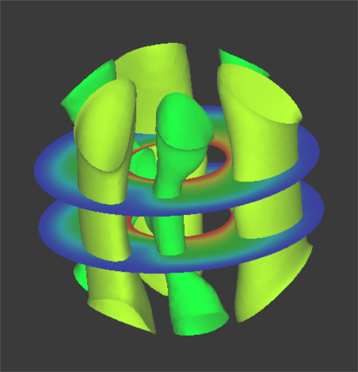{.center width="50%"}

**Figure 7.4.1: Example of surface_num Setting**

###### `!surface` (P1-2)

Sets the contents of the surface.

Ex: Then contents of the four surface in Figure 7.4.2 are as follows.

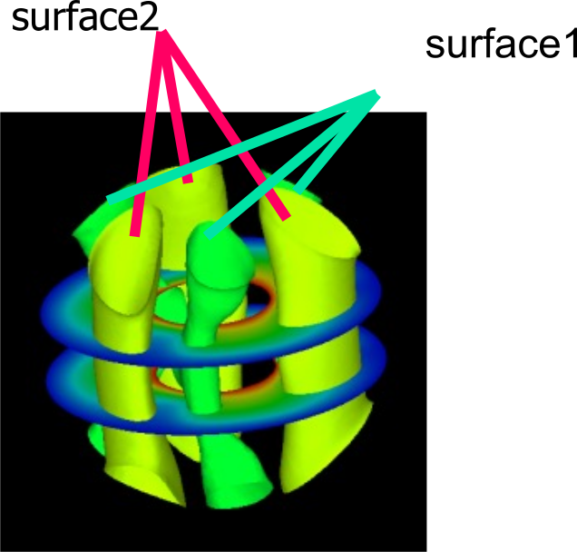{.center width="50%"}

Figure 7.4.2: Example of Surface Setting

```
!surface_num = 2
!SURFACE
!surface_style = 2
!data_comp_name = press
!iso_value = 1000.0
!display_method = 4
!specified_color = 0.45
!output_type = BMP
!SURFACE
!surface_style = 2
!data_comp_name = press
!iso_value = -1000.0
!display_method = 4
!specified_color = 0.67
```

###### `!surface_style` (P1-3)

Specifies the style of the surface.

  1. Boundary plane
  2. Isosurface
  3. Arbitary quadric surface<br/>coef[1]x2 + coef[2]y2 + coef[3]z2 + coef[4]xy + coef[5]xz<br/>+ coef[6]yz + coef[7]x + coef[8]y + coef[9]z + coef[10]=0

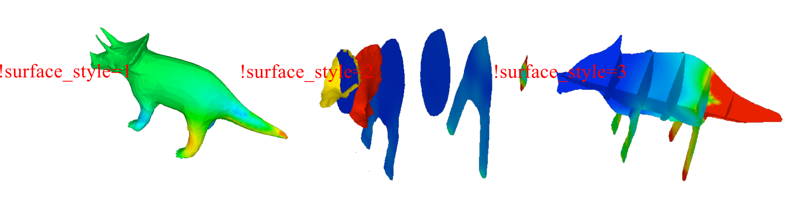{.center width="80%"}

**Figure 7.4.3: Example of surface_style Setting**

##### (3) `!display_method` (P1-4)

Display method (Default: 1)

  1. Color code display
  2. Boundary line display
  3. Color code and boundary line display
  4. Display of 1 specified color
  5. Isopleth line display by classification of color

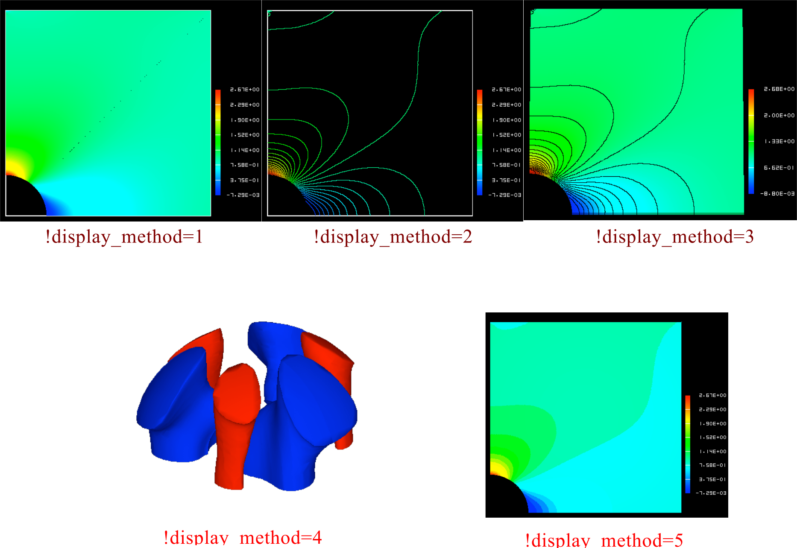{.center width="80%"}

**Figure 7.4.4:Example of display_method Setting**

#### (2) `!color_comp_name`, `!color_comp`, `!color_subcomp` (P1-5, P1-7, P1-8)

Specifies the selections for the color map from the physical values. Provides the names to the necessary physical values and the degree of freedom numbers. Accordingly, the names will be entered for the structure node_label(:) and nn_dof(:) of the results data.

Then you can define which one you hope to map into color by

###### `!color_comp_name` (Character string, default: 1st parameter)

Example

```
!color_comp_name = pressure
  In static analysis;        = DISPLASEMENT : Specification 
                                              of the results displacement data
                             = STRAIN       : Specification of strain data
                             = STRESS       : Specification of stress data
  In heat transfer analysis; = TEMPERATURE  : Specification
                                              of the results temperature data
```

###### `!color_comp` (Integer, default: 0)

Physical value ID number (Integers above 0)

Example

```
!color_comp = 2
```

This is the specification of the ID number and component name of the results data type; however, this is not included.

###### `!color_subcomp` (Integer, default: 0)

When the physical value is 1 degree of freedom or more like the vector quantity, it’s the number of the degree of freedom.

Example:
```
!color_subcomp = 0

    When !color_comp_name=DISPLACEMENT is specified
        1: X Component,  2: Y Component, 3: Z Component

    When !color_comp_name=STRAIN is specified
        1: $\epsilon$x,  2: $\epsilon$y,  3: $\epsilon$z
        4: $\epsilon$xy, 5: $\epsilon$yz, 6: $\epsilon$zx

    When !color_comp_name=STRESS is specified
        1: $\sigma$x,  2: $\sigma$y,  u: $\sigma$z
        4: $\tau$xy, 5: $\tau$yz, 6: $\tau$zx

    When !color/comp\_name=TEMPERATURE is specified
        1: Temperature
```

In the structural analysis, for example;

| Physical Value            | Displacement | Strain | Stress |
|---------------------------|--------------|--------|--------|
| No. of degrees of freedom | 3            | 6      | 7      |

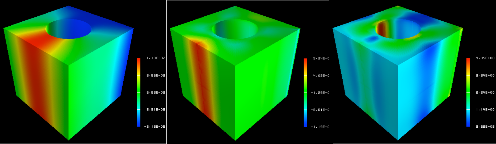{.center width="80%"}

**Figure 7.4.5: Example of color_comp, color_subcomp and color_comp_name Setting**

##### (5) `!isoline_number`, `!isoline_color` (P1-9, P2-22)

When `display_method=2`,`3` or `5`

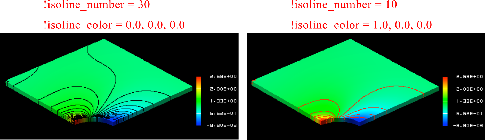{.center width="80%"}

**Figure 7.4.6: Example of isoline_number and isoline_color Setting**

##### (6) `!initial_style`, `!deform_style` (P1-15, P1-16)

Specifies the display style of the initial shape and the deformed shape.

  0. Not specified
  1. Solid line mesh (Displayed in blue if not specified)
  2. Gray filled pattern
  3. Shading (Let the physical attributions respond to the color)
  4. Dotted line mesh (Displayed in blue if not specified)

###### (7) `!deform_scale` (P1-14)

Specifies the displacement scale when displaying deformation.

Default: Auto

`standard_scale` = 0.1 * sqrt(`x_range`<sup>2</sup> + `y_range`<sup>2</sup> + `z_range`<sup>2</sup>) / `max_deform`

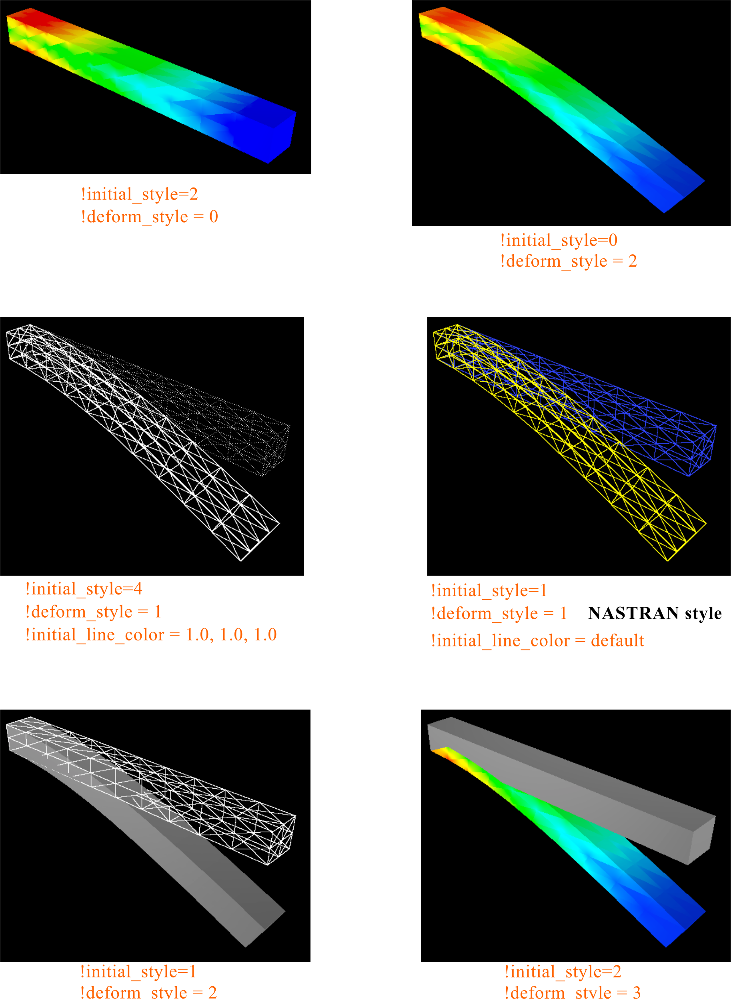{.center width="80%"}

**Figure 7.4.7: Example of display_styles Setting**

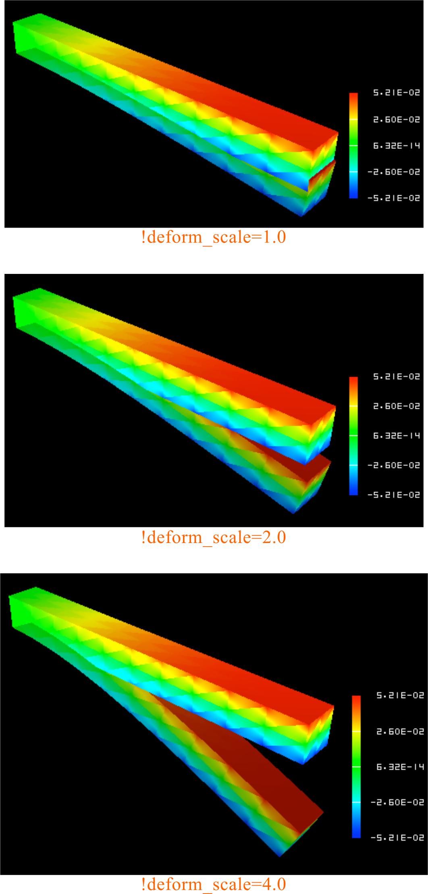{.center width="50%"}

**Figure 7.4.8: Example of deform_scale Setting**

###### (8) `!output_type` (P1-19)

Specifies the type of output file. (Default: AVS)

```
AVS                   : UCD data for AVS (only on object surface)
BMP                   : Image data (BMP format)
VTK                   : VTK data for ParaView
COMPLETE_AVS          : UCD data for AVS
COMPLETE_REORDER_AVS  : Rearranges the node and element ID in the UCD data for AVS
SEPARATE_COMPLETE_AVS : UCD data for AVS for each decomposed domain
COMPLETE_MICROAVS     : Outputs the physical values in the scalar in the UCD data for AVS
BIN_COMPLETE_AVS      : Outputs COMPLETE_AVS in binary format
FSTR_FEMAP_NEUTRAL    : Neutral file for FEMAP
```

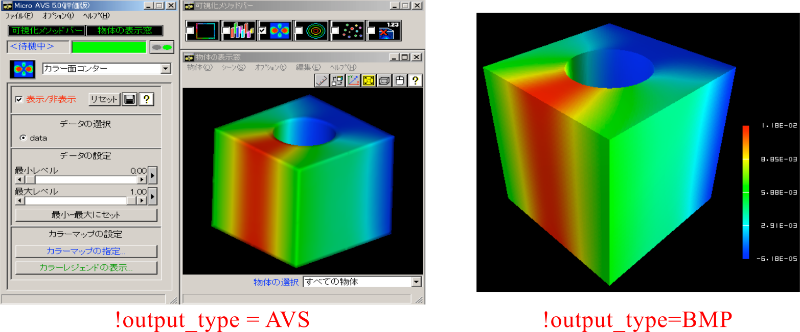{.center width="80%"}

Figure 7.4.9: Example of output_type

##### (9) `!x_resolution`, `!y_resolution` (P2-1, P2-2)

Specifies the resolution when `output_type=BMP`

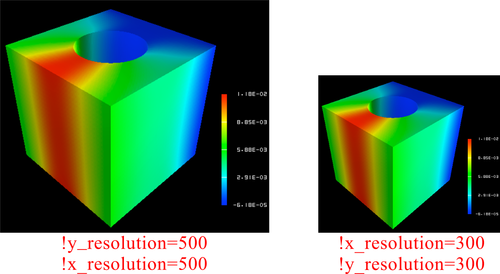{.center width="80%"}

**Figure 7.4.10: Example of x_resolution and y_resolution Setting**

##### (10) `!viewpoint`, `!look_at_point`, `!up_direction` (P2-5, P2-6, P2-7)

###### **viewpoint**

Specifies the viewpoint position by coordinates.

Default: x = (xmin + xmax)/2.0, y = ymin + 1.5 *(ymax – ymin), z = zmin + 1.5 *(zmax – zmin)

###### **look_at_point**

Specifies the look at point position.

Default: Center of data

###### **up_direction** 

Specifies the view frame in viewpoint, look_at_point and up_direction.

default: 0.0 0.0 1.0

###### View coodinate frame

  - Origin: `look_at_point`
  - Z-axis: `viewpoint` - `look_at_point`
  - X-axis: `up_direction` &times; z axis

{.center width="50%"}

**Figure 7.4.11: View Frame Determination Method**

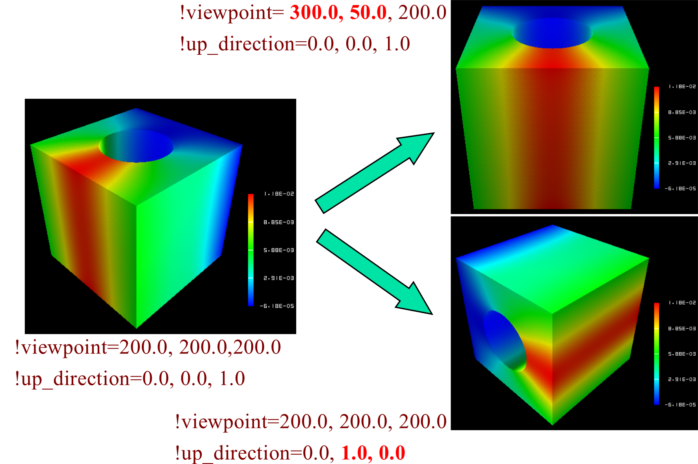{.center width="80%"}

**Figure 7.4.12: Example of !viewpoint, look_at_point and up_direction Setting**


##### (11) `!ambient_coef` `!diffuse_coef` `!specular_coef` (P2-8 P2-9 P2-10)

Coefficient setting of lighting model

When the ambient_coef is increased, information on the 3D depth direction is impaired.

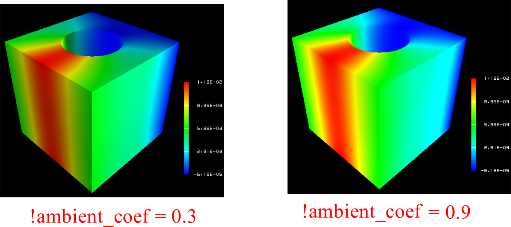{.center width="80%"}

##### (12) '!color_mapping_bar_on' '!scale_marking_on' '!num_of_scales' (P2-16 P2-17 P2-18)

|      |      |
|------|------|
|`!color_mapping_bar_on`|Specifies whether to display the color mapping bar.<br/>0: off 1: on (Default: 0)|
|`!scale_marking_on`    |set the memory status of `color_mapping_bar`<br/>0: off 1: on (default: 0)|
|`!num_of_scales`       |Specifies the number of memory. <br/> (default: 3)|

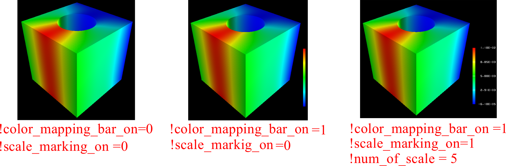{.center width="80%"}

##### (13) `!font_size` `!font_color` `!backgroud_color` (P2-19 P2-20 P2-21)

Specifies the background color and character font.

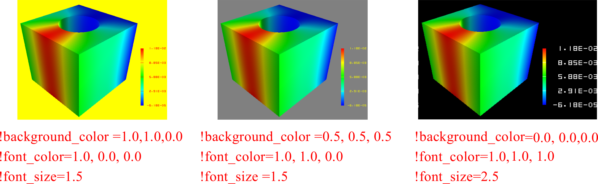{.center width="80%"}

**Figure 7.4.15: Example of Background and Font Setting**

##### (14) `!data_comp_name`, `!data_comp`, `!data_subcomp` (P3-1, P3-3, P3-4)

Specifies the physical values of the isosurface to be visualized when `surface_style=2`.

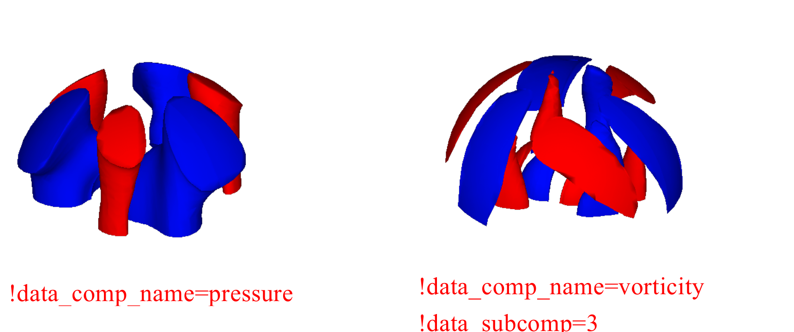{.center width="80%"}

**Figure 7.4.16: Example of data_comp, data_subcomp and data_comp_name Setting**

##### (15) `!method` (P4-1)

When specifying the surfaces and cut end, specifies the setting method of the surface.

```
!surface_num =2
!surface
!surface_style=3
!method=5
!coef=0.0, 0.0, 0.0, 0.0, 0.0, 0.0, 0.0, 0.0, 1.0, -0.35
!color_comp_name = temperature
```
**Figure 7.4.17: Example of Setting Method**

Accordingly, the cut end of the plane surface z = 0.35 and z = -0.35 will be visualized.
