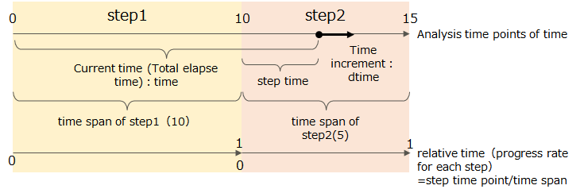
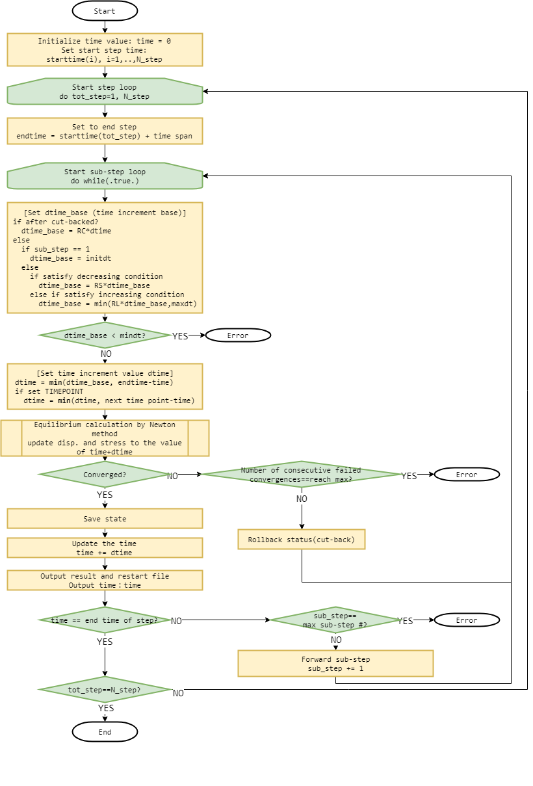

## Step control

### About time on analysis

In the analysis of FrontISTR, following definitions of "time" are used:

  - Current time : Total time from start of analysis.
  - Step time : Time from start in each of step.
  - Time span : Duration of time for each step.
  - Relative time : Ratio of "Step time" to "Time span".
  - Time increment : Increment from "Current time" to "time at which the equilibrium is attained".

{.center width="80%"}

Figure 4.7.1 Definition of terms for analysis time


### Control for static analysis

A static analysis in FrontISTR consists of one or more (continuous) analysis steps. A set of boundary conditions is given in each step and the analysis step is solved with incremental solving strategy which is mentioned previously.

Below, iteration of analysis is called "step loop", and incremental method is called "sub-step loop".

Incremental control of static analysis could be choose from the following solution.

- Analyze with fixed time increments. If convergence fails, the calculation will be stoped immediately.
- Automatic time increment and cutback. Depending on the convergence, change the increment width. If the calculation fails, recalculate after decreasing the increment width.

#### Automatic time increment and cut-back

Flow is automatic time increment and cut-back is as follows(Figure 4.7.2).

{.center width="80%"}

Figure 4.7.2 Flow of automatic time increment and cut-back

Overview of program flows is as follows,

1. Loop from step 1 to final step(N_step):
2. The time increment base `dtime_base` is determined from the current `dtime_base` and the convergence status in the previous sub-step. First time uses `initdt`. 
1. The actual `dtime` is determined by "step end or the remaining time until the nearest specified output time and smaller of `dtime_base`.
1. Try calculation of equilibrium of forces at time+dtime.
1. If converge, the time is forward by `dtime`, when it fails, restore time and  return to 2.
1. Step ends when time reachs step end time.

If any of the following cases occurs during the analysis, the nonlinear static analysis is considered to have failed and an error is terminated.

- The number of sub-steps reaches the upper limit before `time` reaches the step end time.
- When the time increment `dtime_base` falls below the time increment lower limit `mindt`.
- When does not converge continuously for the specified number (`N_C`) of times.

#### Adjust time increment baseline `dtime_base`

The first `dtime_base` of the step is set to the value of the specified initial time increment `initdt`.
Otherwise, it is set as follows according to the convergence status of the previous sub-step.

1. When failed to converge (a.k.a. cut-back) the value `dtime_base` multiplyed by `R_C` (reduction ratio of cut-back).
1. When be a successful to converge
    1. Corresponds to the decrease condition : the value of `dtime_base` multiplyed by `R_S` (decrease ratio). 
    2. In the case of an increase condition, not a decrease condition : the smaller value of 'dtime_base' multiplyed by 'R_L' (increase ratio) and the time increment upper limit `maxdt`.
    3. If neither : `dtime_base` dose not change.

#### Increase / decrease conditions

In the automatic time incremental adjustment function uses the following variables to determine the increment / decrement conditions:

- N_max : Maximum number of Newton iterations of previous substep.
- N_sum : Total number of Newton iterations in the previous substep(Same as `N_max`, when there is no repeated contact).
- N_cont : Number of contact iterations in previous substep.

Decrease condition is when both of the following are met:

- One of `N_max`, `N_sum` or `N_cont` exceeds the respective threshold `NS_max`, `NS_sum` or `NS_cont`.
- When the above conditions are satisfied by a substep that continues `N_S` times or more.

Increase condition is when both of the following are met:

- `N_max`, `N_sum` and `N_cont` are all within their respective threshold `NL_max`, `NL_sum` and `NL_cont`.
- The above condition is met by substep that continues more than `N_L` times.

#### Specify calculation time and output time

With automatic time increments, the increments change with the convergence state,
so it is not possible to determine in advance when to run the equilibrium calculation and result output.
If this is inconvenient, you can specify a list of output times to perform the equilibrium calculation
and result output at the desired time.

For steps that include a list of output times, `dtime` is adjusted so that the calculation is always performed at specified time.

#### Usage of function of automatic time increments and cut-back

Settings related to this function are made in the analysis control file.

The function of automatic time increment and cut-back are enabled specified by `TYPE_INC=AUTO` on the `!STEP` card.
For parameters that adjust the time increment, define `!AUTOINC_PARAM` and specify it in each step using the `!STEP, AUTOINCPARAM'.
If not specified, the default value of `!AUTOINC_PARAM' is used.

The output time is specified for each step with the `!STEP, TIMEPOINTS` parameter after defining the time list with `!TIME_POINTS`.

##### Example

Enable automatic incremental adjustment and set initial time increment 0.01, step duration 2.5, time increment lower limit 1E-5, time increment upper limit 0.3, maximum substep number to 200.
Specify `AP1` for the auto-incrment parameter set and 1.5, 2.7 and 3.9 for the output time.

```
    !AUTOINC_PARAM, NAME=AP1
    0.25, 10, 50, 10, 1
    1.25,  1,  1,  1, 2
    0.25,  5
    !TIME_POINTS, TIME=TOTAL, TIME=,NAME=TP1
    1.5
    2.7
    3.9
    !STEP, INC_TYPE=AUTO, SUBSTEPS=200, AUTOINCPARAM=AP1, TIMEPOINTS=TP1
    0.01, 2.5, 1E-5, 0.3
```

### Control for dynamic analysis

In this development code, dynamic analysis direct time integration method consists of one analysis step.

Incremental control for dynamic analysis is only fixed increments and automatic time increments are not available.


