## `hecmw_part1`

`hecmw_part1` is a utility software which divides a single domain mesh data into sub-domains and generates distributed mesh data for the parallel finite element method.

The software uses the HEC-MW library's data input function to divide single-domain mesh data into an arbitrary number of sub-domains The data is divided into two regions. In addition, HEC-MW library's data output function is used to generate "distributed mesh data", and the software developed with HEC-MW can analyze the data generated by `hecmw_part1`.

The `hecmw_part1` has two types of domain decomposition methods: "node-based decomposition" and "element-based decomposition".

We have also implemented an interface to the METIS library, which applies graph theory to domain decomposition, so that the domain decomposition method using kMETIS and pMETIS in the library can be implemented. The system also enables segmentation. In addition, it is possible to set the overlapping depth between partial regions in the node-based segmentation.

### Domain segmentation technique

The following division methods are available for `hecmw_part1`.

#### RCB

It stands for Recursive Coordinate Bisection and is a method of dividing a region based on the size of the coordinate values. It is a fast and stable method, but its subregion is limited to $2^n$ . It is an effective method for simple shapes.

#### METIS

This open-sourced free software is widely used in the world because it is a fast and stable method and provides good region separation even for complex shapes. This software has an interface to the METIS library and allows you to perform region segmentation directly using pMETIS and kMETIS. You can download METIS from the following URL.

[METIS - Serial Graph Partitioning and Fill-reducing Matrix Ordering](http://glaros.dtc.umn.edu/gkhome/metis/metis/download)

or its forked repository

[https://gitlab.com/FrontISTR-Commons/METIS](https://gitlab.com/FrontISTR-Commons/METIS)
[https://gitlab.com/FrontISTR-Commons/GKlib](https://gitlab.com/FrontISTR-Commons/GKlib)

### Domain division type

`hecmw_part1` supports the following two types of division of a single region mesh into subregions.

#### Nodal segmentation (Node-based segmentation)

As shown in Figure 1.3-1, this is a node-based region partitioning method, in which the only belonging subregion is determined for all nodes, and overlapping elements between adjacent subregions are created. Therefore, in node-based decomposition, each subregion possesses the following information about nodes and elements (Figure 1.3-2).

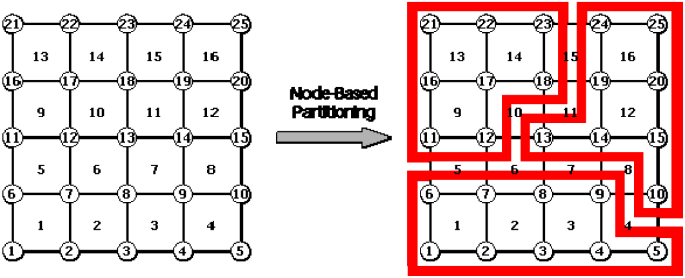{.center width="80%"}

Fig. 1.3-1 Region segmentation per node

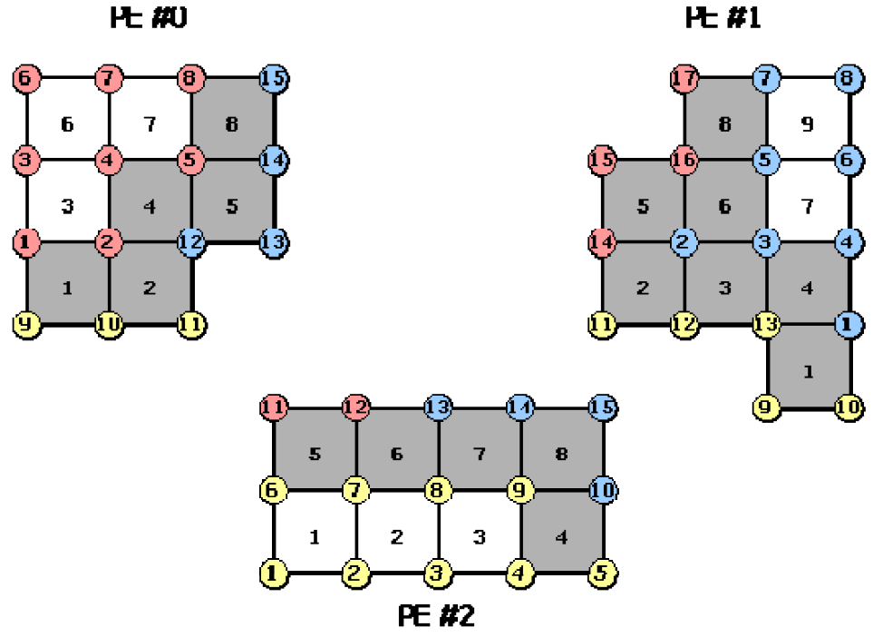{.center width="80%"}

Figure 1.3-2 Nodes and elements held by each subregion (node-based segmentation)

  - Nodes that belong to that subregion (internal nodes)
  - Elements containing internal nodes
  - Nodes that make up the elements, including internal nodes

It also possesses the following information on communication between adjacent sub-regions (communication table).

  - Import nodes: Nodes within a subregion that belong to another subregion
  - Export node: Internal node that is an import node of another sub-region
  - Shared elements: elements that are shared with other subdomains

The import nodes, export nodes, and shared elements in the second subregion of Figure 1.3-1 are shown in Figures 1.3-3, 1.3-4, and 1.3-5.

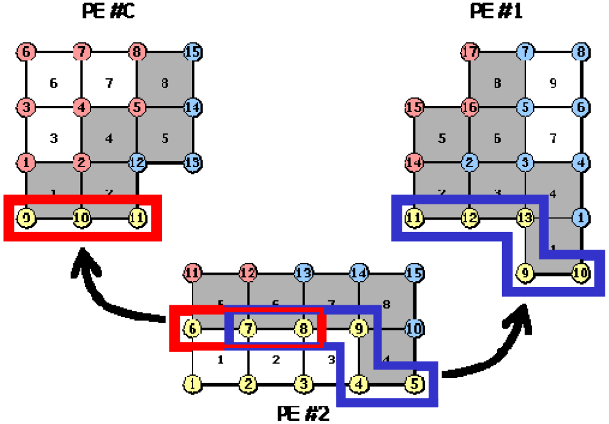{.center width="80%"}

Figure 1.3-3 Import nodes in the second sub-region.

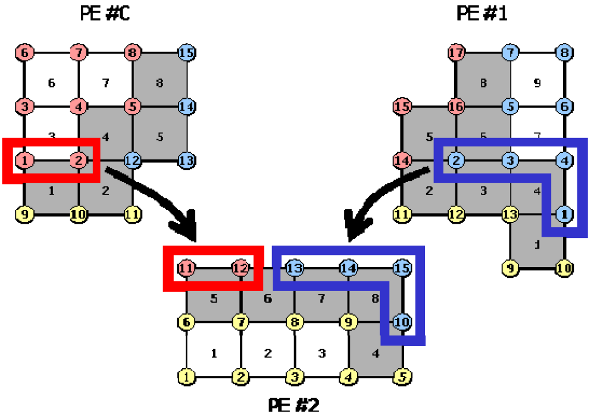{.center width="80%"}

Export nodes in the second sub-region.

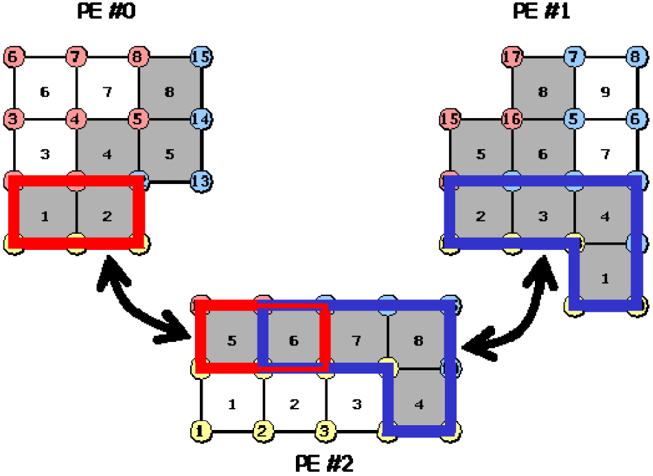{.center width="80%"}

Figure 1.3-5 Shared elements in the second subdomain.

#### Region division by elements (element-based division)

As shown in Fig. 1.3-6, region decomposition is performed on an element-by-element basis, and in this case, only one subregion is determined for every element, and overlapping nodes are generated between adjacent subregions. Hence, in element-based decomposition, each subregion has the following nodal points and element information (Figure 1.3-7).

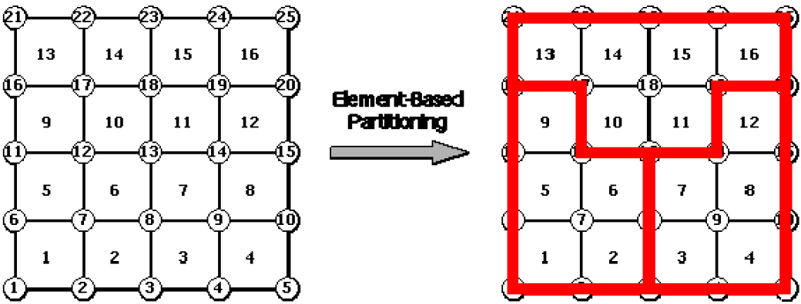{.center width="80%"}

Fig. 1.3-6 Region segmentation by element

{.center width="80%"}

Figure 1.3-7 Nodes and elements held by each subregion (element-based partitioning)

  - Elements that belong to this subdomain (internal elements)
  - Nodes that make up the internal elements
  - Elements containing the nodes that make up the internal elements

It also possesses the following information on communication between adjacent sub-regions (communication table).

  - Imported elements: elements in a subregion that belong to another subregion
  - Export elements: internal elements that are import elements of other sub-regions
  - Shared nodes: nodes that are shared with other subregions

The import element, export element, and shared nodes in the second subregion of Figure 1.3-7 are shown in Figure 1.3-8, Figure 1.3-9, and Figure 1.3-10.

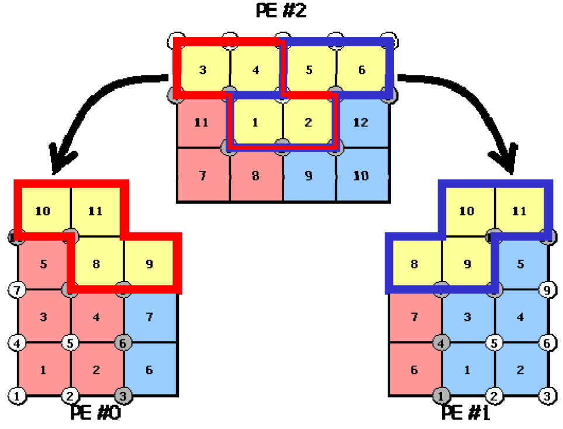{.center width="80%"}

Figure 1.3-8 Import elements in the second sub-region.

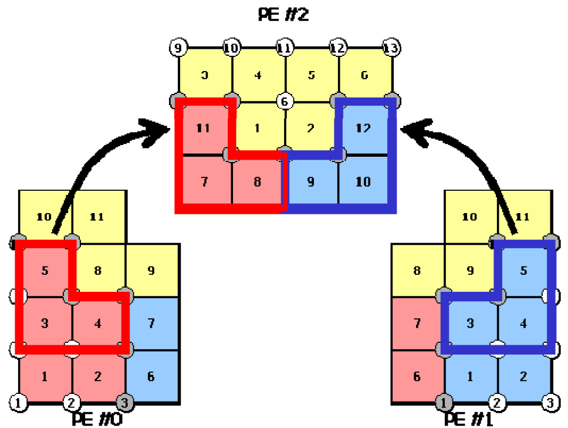{.center width="80%"}

Figure 1.3-9 Export elements in the second sub-region.

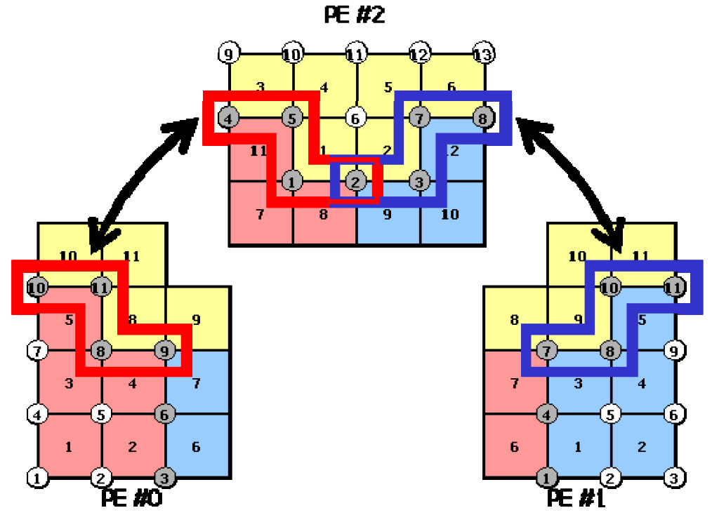{.center width="80%"}

Fig. 1.3-10 Shared nodes in the second sub-region.

In both types of domain division, the user does not need to consider the communication because the domain division utility automatically creates and writes its communication table to the distributed mesh data.

#### Variable overlap depth

The `hecmw_part1` allows you to set the overlapping depth between subregions as you like (except when the region decomposition type is nodal decomposition). Normally, the overlap depth is set to 1. However, when SAI (Sparse Approximate Inverse) is used for preprocessing to solve contact and MPC constraint problems, the overlap depth needs to be increased.

#### Creating a UCD file for generating a domain division image

`hecmw_part1` can generate a UCD file to display a region image in MicroAVS and so on.

#### Handling of contact points

`hecmw_part1` can specify

```
CONTACT=[DEFAULT|AGGREGATE|DISTRIBUTE|SIMPLE]
```

for the contact point when dealing with a contact problem.


### Files required for execution

In order to execute `hecmw_part1`, the following files are required.

  - Single-region mesh data for domain segmentation
  - global control file
  - Domain division utility control file

These files are described below.

#### Single-region mesh data file for domain segmentation

The data input function of the HEC-MW library is used for the data input function of this software, and the mesh data of a single region that can be input by this function can be divided into regions as input data.

#### global control file

This software uses the global control file of HEC-MW to specify the mesh data to be displayed. In order to run this software, you need to specify the following in the global control file.

  - File name of the mesh data of the single area to be divided
  - The file name header for the distributed mesh data to be created

The following is an example of the description of a global control file.

If the single region mesh data named `mesh.dat` is divided into the following three files, the global control file (`hecmw_ctrl.dat`) is written as follows: `mesh.dist.0`, `mesh.dist.1`... The description of the global control file (`hecmw_ctrl.dat`) is as follows.

```
# Definition of single region mesh data to be domain segmented
!MESH, NAME=part_in, TYPE=HECMW-ENTIRE
mesh.dat
# Define the Distributed Mesh Data to Create
!MESH, NAME=part_out, TYPE=HECMW-DIST
mesh.dist
```

Here, in the definition of the single region mesh data (the first `!MESH` in the first example), the string specified for the `NAME` option is fixed at `part_in`. In addition, in the definition of the distributed mesh data (the second `!MESH` in example 2), the string for the `NAME` option is fixed to `part_out` and the file format specifier for the `TYPE` option is fixed to `HECMW-DIST`. If these options do not contain the specified string, an error occurs.

#### Domain division utility control file

`hecmw_part1` sets up the conditions of region separation such as the region separation method, the number of region divisions, and so on, in the region separation utility control file (`hecmw_part_ctrl.dat`). The following is how to write the control manual.

The default file name of this control file is `hecmw_part_ctrl.dat`.

In the Application Examples chapter, the contents of the utility control file for each example are shown. Please refer to them when you are writing.

##### line 1

```
!PARTITION, TYPE=<type>, METHOD=<method>, DOMAIN=<domain> [, optional parameter]
```

| Parameter  |                                                    |
| ---------- | -------------------------------------------------- |
| TYPE       | Domain division type (required)                    |
| METHOD     | Domain decomposition method (required)             |
| DOMAIN     | Number of division (required)                      |
| DEPTH      | Overlap depth (optional)                           |
| UCD        | Output UCD file for the segmented image (optional) |
| CONTACT    |                                                    |

| Parameter  | Parameter value | Contents                                                          |
| ---------- | ------------- | ------------------------------------------------------------------- |
| TYPE       | NODE-BASED    | node-based division                                                 |
|            | ELEMENT-BASED | element-based division                                              |
| METHOD     | RCB           |  RCB method, the division reference axis must be specified on line 2|
|            | KMETIS        | kMETIS                                                              |
|            | PMETIS        | pMETIS                                                              |
| DOMAIN     | <domain>      | number of divisions
| DEPTH      | <depth>       | The overlap depth of the partial region (DEPTH=1 if omitted)</br>Cannot be specified when TYPE=ELEMENT-BASED|
| UCD        | <filename>    | UCD file name (can be abbreviated)                                  |
| CONTACT    | DEFAULT       |                                                                     |
|            | AGGREGATE     |                                                                     |
|            | DISTRIBUTE    |                                                                     |
|            | SIMPLE        |                                                                     |

##### Line 2 (required only if METHOD=RCB)

```
(Line 2) DIR1, DIR2, DIR3, ... (Specify the number of installments)
```

| variable name | attribute | contents                                                    |
| ------------- | --------- | ----------------------------------------------------------- |
| DIRX          | C         | Division reference axis (specified by lowercase x, y, or z) |

##### Example of a control file

Example 1

```
!PARTITION, TYPE=NODE-BASED, METHOD=RCB, DOMAIN=8, DEPTH=1, UCD=mesh.inp
x, y, z
```

Example 2

```
!PARTITION, TYPE=ELEMENT-BASED, METHOD=PMETIS, DOMAIN=32
```

### execution method

The start-up commands for this software are as follows.

```
$ hecmw_part1 [-f <part_ctrl_filename>]
```

With the -f option, you can specify the file name of the utility control file for region partitioning. If this option is omitted, the utility control information is read from a file with the default file name (`hecmw_part_ctrl.dat`) in the execution directory.

Moreover, when `hecmw_part1` is executed, the global control file is placed in the execution directory and the single region mesh data file is placed in the directory specified in the global control file.

### Application examples

#### Simple cube model (48 nodes x 48 nodes x 48 nodes)

- Element type: Hexahedron linear elements
- Number of nodes : 110,592
- Number of elements: 103,823

##### An example of a control file description for the domain division utility

```
!PARTITION, TYPE=NODE-BASED, METHOD=RCB, DOMAIN=64, UCD=cube.rcb.inp
x, y, z, x, y, z
```

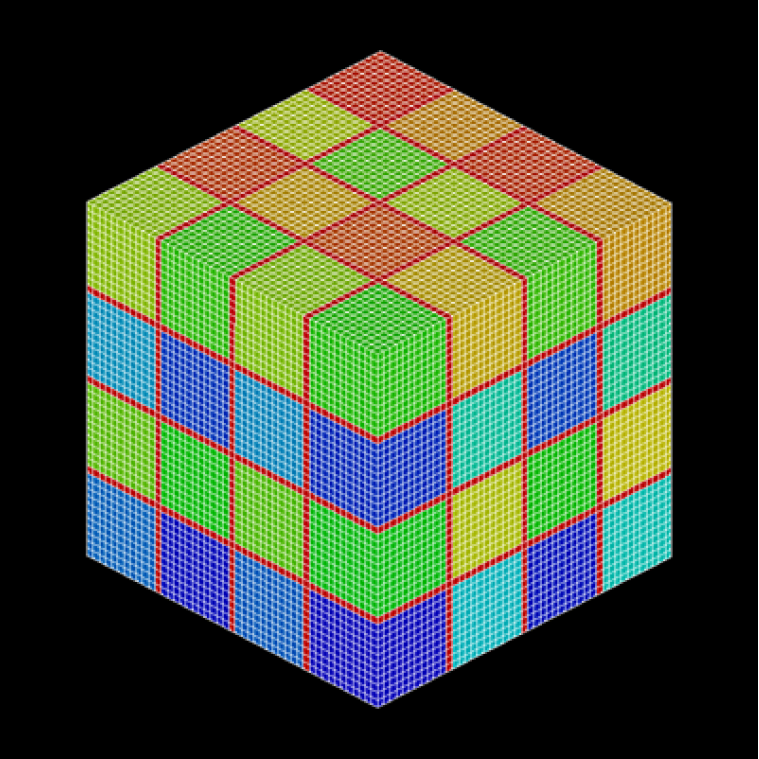{.center width="80%"}

Fig. 4.1-1 Domain decomposition utility application example 1: Simple cube model (Node-based decomposition, RCB method, number of edgecuts: 20,736/324,864)

##### An example of a control file description for the domain division utility

```
!PARTITION, TYPE=NODE-BASED, METHOD=KMETIS, DOMAIN=64, UCD=cube.kmetis.inp
```

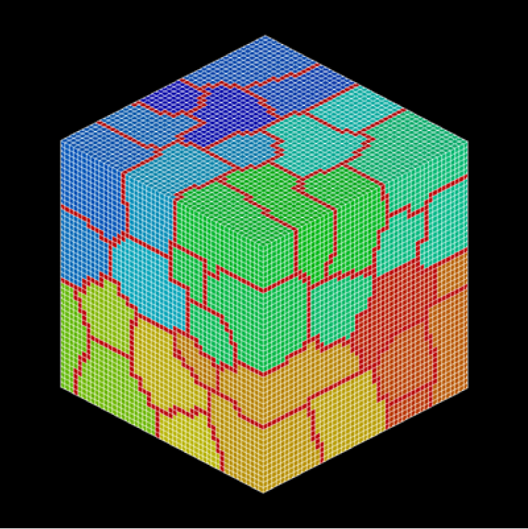{.center width="80%"}

Fig. 4.1-2 Domain decomposition utility application example 1: Simple cube model (node-based decomposition, kMETIS, edgecut number: 26,160/324,864)

#### Akamon (Hongo campus of the University of Tokyo) model

- Element type : Tetrahedral primary elements
- Number of nodes : 3,550
- Number of elements: 10,156

##### An example of a control file description for the domain division utility

```
!PARTITION, TYPE=NODE-BASED, METHOD=RCB, DOMAIN=32, UCD=akamon.rcb.inp
x, y, z, x, y
```

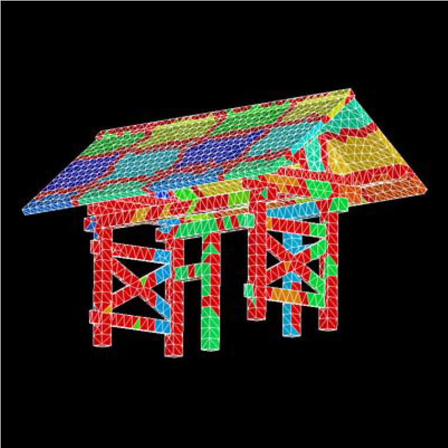{.center width="80%"}

Fig. 4.2-1 Domain decomposition utility application example 2: Red gate model (nodal-based decomposition, RCB method, edgecut:4,396/17,180)

##### An example of a control file description for the domain division utility

```
!PARTITION, TYPE=NODE-BASED, METHOD=PMETIS, DOMAIN=32, UCD=akamon.kmetis.inp
```

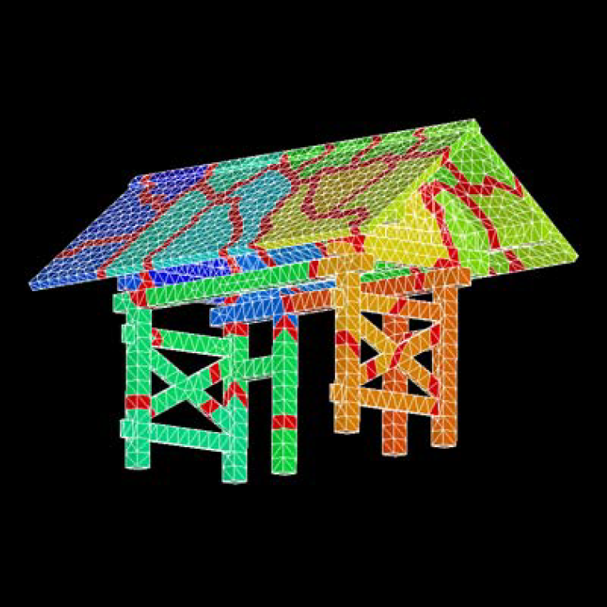{.center width="80%"}

Fig.4.2-2 Domain decomposition utility application example 2: Red gate model (nodal-based decomposition,pMETIS,edgetcut:2,119/17,180)

#### Honshu model

- Element type: triangular primary element
- Number of nodes : 21,285
- Number of elements: 40,548

##### Example of a control file description for the domain division utility

```
!PARTITION, TYPE=ELEMENT-BASED, METHOD=RCB, DOMAIN=64, UCD=honshu.rcb.inp
x, y, x, y, x, y
```

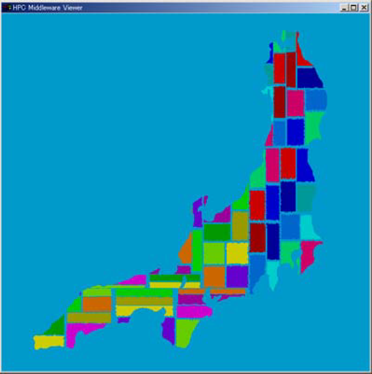{.center width="80%"}

Fig.4.3-1 Utility application example 3: Honshu model (element-based decomposition, RCB method, edgecut:17,241/237,627)

##### Example of a control file description for the domain division utility

```
!PARTITION, TYPE=ELEMENT-BASED, METHOD=KMETIS, DOMAIN=64, UCD=honshu.kmetis.inp
```

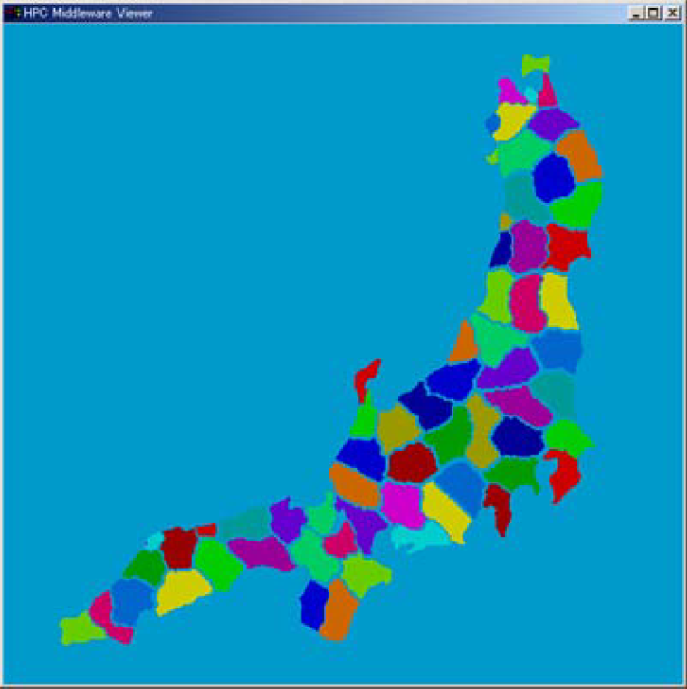{.center width="80%"}

Fig.4.3-2 Domain decomposition utility application example 3: Honshu model (element-based decomposition,kMETIS,edgecut:11,657/237,627)

#### Graphite Block Model

- Element type: primary hexahedron elements
- Number of nodes : 1,308
- Number of elements: 795

##### An example of a control file description for the domain division utility

```
!PARTITION, TYPE=NODE-BASED, METHOD=RCB, DOMAIN=4, DEPTH=1, UCD=carbon.1.inp
x, y
```

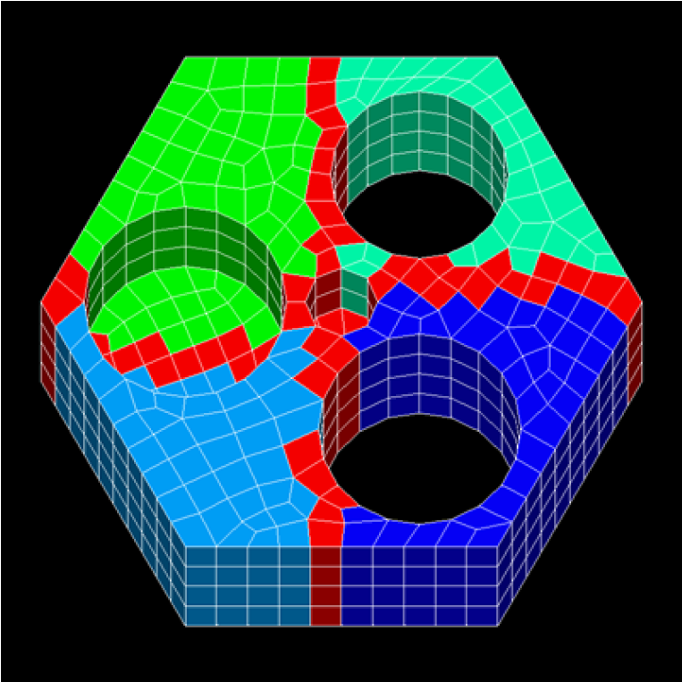{.center width="80%"}

Fig.4.4-1 Application example of domain decomposition utility 4: Graphite block model (overlap depth change example, DEPTH=1)

##### An example of a control file description for the domain division utility

```
!PARTITION, TYPE=NODE-BASED, METHOD=RCB, DOMAIN=4, DEPTH=2, UCD=carbon.2.inp
x, y
```

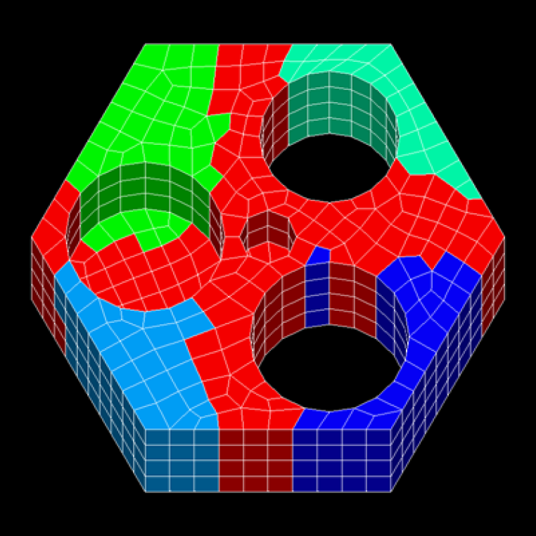{.center width="80%"}

Fig.4.4-2 Application example of domain decomposition utility 4: Graphite block model (overlap depth change example,DEPETH=2)

### error message

#### `HECMW-PART-E0001: No such file or directory`

The specified file does not exist.

#### `HECMW-PART-E0002: File close error`

An unexpected error occurred while closing the file.

#### `HECMW-PART-E0003: Too long file name`

The file name is too long.

#### `HECMW-PART-E0004: NULL pointer was found`

Illegal null pointer detected.

#### `HECMW-PART-E0005: Invalid EOF is found`

Unexpected EOF detected.

#### `HECMW-PART-E0006: Invalid argument is found`

Illegal arguments are detected.

#### `HECMW-PART-E0101: Invalid token found`

Invalid token detected.

#### `HECMW-PART-E0111: 'TYPE' must not be omitted`

Can't find 'TYPE', a mandatory option for '!PARTITION'

#### `HECMW-PART-E0121: 'METHOD' must not be omitted`

Can't find the required option 'METHOD' for '!PARTITION'

#### `HECMW-PART-E0131: 'DOMAIN' must not be omitted`

Missing 'DOMAIN', a mandatory option for '!PARTITION'

#### `HECMW-PART-E0134: 'METHOD' is 'RCB', but 'DOMAIN' is not n-th power of 2`

'RCB' is specified for 'METHOD', but the value of 'DOMAIN' is not a power of 2.

#### `HECMW-PART-E0161: Partitioning directions are not enough`

The direction of divisional axis is not specified enough.

#### `HECMW-PART-E0201: Invalid partitioning type is found`

We have detected an illegal domain split type.

#### `HECMW-PART-E0202: Invalid partitioning method is found`

We have detected an illegal domain division method.

#### `HECMW-PART-E0203: Invalid element type is found`

Illegal element type detected.

#### `HECMW-PART-E0204: Invalid partitioning direction is found`

Illegal split axis direction detected.

#### `HECMW-PART-E0205: Invalid number of sub-domains is found`

We have detected an illegal subspace count.

#### `HECMW-PART-E0206: Invalid overlapping depth is found`

Illegal inter-regional overlap depth detected

#### `HECMW-PART-E0211: Stack overflow`

The stack array overflowed.

#### `HECMW-PART-E0301: Domain number is outside of the range`

The number of partial regions exceeds the number of partial regions.

#### `HECMW-PART-E0311: Number of nodes is outside of the range`

Illegal node count detected.

#### `HECMW-PART-E0312: Number of internal nodes is outside of the range`

Illegal internal node count detected.

#### `HECMW-PART-E0321: Number of elements is outside of the range`

Illegal element count detected.

#### `HECMW-PART-E0322: Number of internal elements is outside of the range`

We have detected an illegal internal element count.

#### `HECMW-PART-E0331: Number of neighboring sub-domains must be grater than or equal 0`

The number of adjacent subregions is less than 0.

#### `HECMW-PART-E0501: Log file has not initialized yet`

Log files have not been initialized.

#### `HECMW-PART-E9999: Fatal error`

There was a serious error.

#### `HECMW-PART-W0162: Too many partitioning directions are specified`

More than the required number of axis directions are specified.

#### `HECMW-PART-W0401: EQUATION_BLOCK is not found`

Can't find the EQUATION_BLOCK.

#### `HECMW-PART-W0502: Log file for practitioner has already initialized`

The log file initialization process was called multiple times.

## `hecmw_vis1`

## `hec2rcap`

## `rconv`

## `rmerge`
