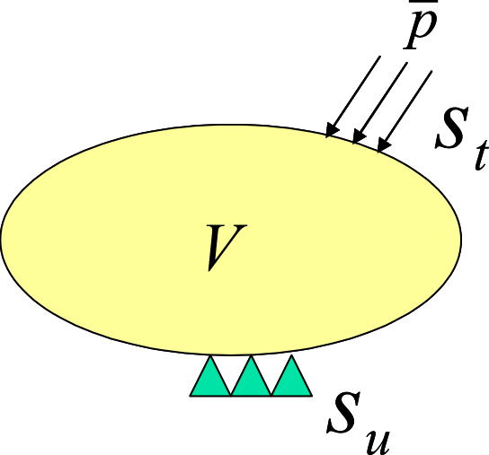

## Infinitesimal Deformation Linear Elastic Static Analysis

In this section, the elastic static analysis is formulated on the basis of the infinitesimal deformation theory, which assumes linear elasticity as a stress-strain relationship. 

### Basic equations

The equilibrium equation, mechanical boundary conditions, and geometric boundary conditions (basic boundary conditions) of solid mechanics are given by the following equations (see Fig. 2.1.1): 

$$
\begin{equation}
\nabla \cdot \sigma + \overline{b} = 0 \quad in \ V
\label{eq:2.1.1}
\end{equation}
$$

$$
\begin{equation}
\sigma \cdot n = \overline{t} \quad on \ S_t
\label{eq:2.1.2} 
\end{equation}
$$

$$
\begin{equation}
u = \overline{u} \quad on \ S_u
\label{eq:2.1.3}
\end{equation}
$$

where $\sigma$, $\overline{t}$ and $S_t$ denote stress, surface force, and body force, respectively. $S_t$ and $S_u$ represent the geometric and mechanical boundaries, respectively.

 Fig. 2.1.1 Boundary value problem in solid mechanics (infinitesimal deformation problem)

The strain-displacement relation in infinitesimal deformation problems is given by the following equation:

$$
\begin{equation}
\varepsilon = \nabla_S u
\label{eq:2.1.4}
\end{equation}
$$

Furthermore, the stress-strain relationship (constitutive equation) in linear elastic bodies is given by the following equation:

$$
\begin{equation}
\sigma = C : \varepsilon
\label{eq:2.1.5}
\end{equation}
$$

where, $C$ is a fourth-order elasticity tensor.

### Principle of Virtual Work

The principle of the virtual work related to the infinitesimal deformation linear elasticity problem, which is equivalent to the basic equation Eq.$\eqref{eq:2.1.1}$, Eq.$\eqref{eq:2.1.2}$ and Eq.$\eqref{eq:2.1.3}$, is expressed as:

$$
\begin{equation}
\int_V \sigma : \delta \varepsilon\, dV = \int_{S_t} \overline{t} \cdot \delta u\, dS + \int_V \overline{b} \cdot \delta u\,dV
\label{eq:2.1.6}
\end{equation}
$$

$$
\begin{equation}
\delta u = 0 \quad on \ S_u
\label{eq:2.1.7}
\end{equation}
$$

Moreover, considering the constitutive equation Eq.$\eqref{eq:2.1.5}$, Eq.$\eqref{eq:2.1.6}$, is expressed as follows:

$$
\begin{equation}
\int_V (C : \varepsilon) : \delta \varepsilon\, dV = \int_{S_t} \overline{t} \cdot \delta u\, dS + \int_V \overline{b} \cdot \delta u\, dV
\label{eq:2.1.8}
\end{equation}
$$

In Eq.$\eqref{eq:2.1.8}$, $\varepsilon$ is the strain tensor and $C$ is the forth-order enasticity tensor. In this case, if the strain tensor $\sigma$ and $\varepsilon$ are represented by vector formats $\hat{\sigma}$ and $\hat{\varepsilon}$, respectively, the consitutive equation Eq.$\eqref{eq:2.1.5}$ is expressed as follows

$$
\begin{equation}
\hat{\sigma} = D \hat{\varepsilon}
\label{eq:2.1.9}
\end{equation}
$$

where $D$ is an elastic matrix.

Considering that the $\hat{\sigma}$, $\hat{\varepsilon}$ and Eq.$\eqref{eq:2.1.9}$ are expressed in vector format, Eq.$\eqref{eq:2.1.8}$ is expressed as follows:

$$
\begin{equation}
\int_V \hat{\varepsilon}^T D \delta \hat{\varepsilon}\, dV = \int_{S_t}
\delta u^T \overline{t}\, dS + \int_V \delta u^T \overline{b}\, dV
\label{eq:2.1.10}
\end{equation}
$$

Eq.$\eqref{eq:2.1.10}$ and Eq.$\eqref{eq:2.1.7}$ are the principles of the virtual work discretized in this development code.

### Formulation

If the principle of virtual work, Eq.$\eqref{eq:2.1.10}$, is discretized for each finite element, the following equation is obtained:  

$$
\begin{equation}
\sum_{e} = \int_{V^e} \hat{\varepsilon}^T D \delta \hat{\varepsilon}\, dV = \sum_{e} \int_{S^e_t}
\delta u^T \overline{t}\, dS + \sum_{e} \int_{V^e} \delta u^T \overline{b}\,dV
\label{eq:2.1.11}
\end{equation}
$$

Using the displacement of the nodes that compose each element, the displacement field is interpolated as follows:

$$
\begin{equation}
u = \sum^m_{i=1} N_i u_i = N U
\label{eq:2.1.12}
\end{equation}
$$

The strain at this moment, using Eq.$\eqref{eq:2.1.4}$,  is given as follows:

$$
\begin{equation}
\hat{\varepsilon} = B U
\label{eq:2.1.13}
\end{equation}
$$

When Eq.$\eqref{eq:2.1.12}$ and Eq.$\eqref{eq:2.1.13}$ are substituted into Eq.$\eqref{eq:2.1.11}$, the following equation is obtained:

$$
\begin{equation}
\sum_e \delta U^T \left( \int_{V^e} B^T DB\, dV \right)
U = \sum_e \delta U^T \cdot \int_{S_t^e}
N^T \overline{t}\, dS + \sum_{e} \delta U^T \int_{V^e} N^T
\overline{b}\, dV
\label{eq:2.1.14}
\end{equation}
$$

Eq.$\eqref{eq:2.1.14}$ can be summarized as

$$
\begin{equation}
\delta U^T K U = \delta U^T F
\label{eq:2.1.15}
\end{equation}
$$

In this case, the components of the matrix and vector defined by Eq.$\eqref{eq:2.1.16}$ and Eq.$\eqref{eq:2.1.17}$ can be calculated for each finite and overlapped element:

$$
\begin{equation}
K = \sum_e \int_{V^e} B^T DB dV
\label{eq:2.1.16}
\end{equation}
$$

$$
\begin{equation}
F = \sum_e (\int_{S_t^e} N^T \overline{t}\, dS + \int_{V^e} N^T \overline{b}\, dV )
\label{eq:2.1.17}
\end{equation}
$$

if Eq.$\eqref{eq:2.1.15}$ is true for an arbitary virtual displacement $\delta U$, tha following equation is obtained:

$$
\begin{equation}
K U = F
\label{eq:2.1.18}
\end{equation}
$$

Meanwhile, the displacement boundary conditioni Eq.$\eqref{eq:2.1.3}$ is expressed as follows:

$$
\begin{equation}
U = \overline{U}
\label{eq:2.1.19}
\end{equation}
$$

By solving Eq.$\eqref{eq:2.1.18}$ based on the constraint condition Eq.$\eqref{eq:2.1.19}$, it is possible to define the node displacement $U$.
