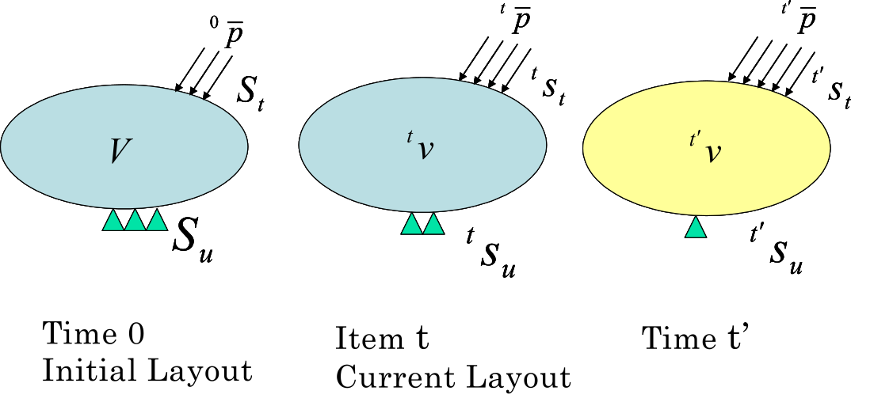

## Non-linear Static Analysis Method

As mentioned previously, in the analysis of infinitesimal deformation problems, it is possible to use the principle of virtual work, which is equivalent to the basic equations (the equilibrium equation), to perform finite element analysis by discretizing this equation with finite elements. Therefore, analyses of finite deformation problems that deal with large deformations of structures are typically conducted with the principle of virtual work. 

However, in finite deformation problems, the equation of the principle of virtual work is non-linear in relation to displacement even if it the material is assumed to be linear.

Generally, non-linear equations are solved by iteration methods. 

These type of iterative calculations are performed through incremental analysis, which is performed on small load increments that are accumulated until the final deformation state is reached. If an infinitesimal deformation problem is assumed, there will be no distinction in the arrangement to define the strain and stress before and after the deformation. Thus, the basic equation can be described before or after the deformation with no problem. 

However, in the case of increment analysis in finite deformation problems, it is possible to choose between the initial state or the starting point of the increment. The former is called the total Lagrange method and the latter is called the updated Lagrange method. For more details, refer to the references at the end of this chapter.

In this development code, both the total and updated Lagrange methods were adopted. 

### Geometric non-linear analysis method

#### Incremental decomposition of virtual work equation

In this section, an increment analysis is performed wherein the status is known until time \(t\) and unknown until \(t'=t+\Delta t\) (See to Fig. 2.2.1). The equilibrium equation, of the static boundary value problem, mechanical boundary conditions, and geometric boundary conditions (basic boundary condidions) are as follows:

\begin{equation}
\nabla_{t'_x} \cdot ^{t'} \sigma +^{t'} \overline{b} =0 \qquad in \ V
\label{eq:2.2.1}
\end{equation}

\begin{equation}
^{t'} \sigma \cdot^{t'} n = ^{t'} \overline{t} \qquad on \ ^{t'}S_t
\label{eq:2.2.2}
\end{equation}

\begin{equation}
^{t'} u = ^{t'} \overline{u} \qquad on \ ^{t'} S_u
\label{eq:2.2.3}
\end{equation}

\(^{t'} \sigma\)，\(^{t'} \overline{b}\)，\(^{t'} n\)，\(^{t'} \overline{t}\)，and \(^{t'} \overline{u}\) are the Cauchy stress (true stress), body force, outward until normal vector on body surface, predetermined surfacxe force, and predetermined displacement at time \(t'\), respectively. These equations are described for the arrangements of \(^{t'}v\), \(^{t'}s_t\), \(^{t'}s_u\) at time \('t\).

 Fig. 2.2.1: Concept of incremental analysis

### Principle of Virtual Work

The principle of virtual work equivalent to the equilibrium equation of Eq.\(\eqref{eq:2.2.1}\) and mechanical boundary conditions of Eq.\(\eqref{eq:2.2.2}\) is given by the following equation:

\begin{equation}
\int_{^{t'}v}{^{t'} \sigma} : \delta^{t'} A_{(L)} \, d^{t'}v =
\int_{^{t'} s_{t}}^{t'}
\overline{t}
\cdot \delta u \, d^{t'}s +
\int_{V}^{t'}
\overline{b} \cdot \delta u \, d^{t'}v
\label{eq:2.2.4}
\end{equation}

where \(^{t'} A_{(L)}\) is the linear part of the Almansi strain tensor, which is expressed by the following equation:

\begin{equation}
^{t'} A_{(L)} = \frac{1}{2}
\left\lbrace \frac{\partial ^{t'} u}{\partial ^{t'} x} + \left( \frac{ \partial ^{t'} u}{\partial ^{t'} x} \right) ^\mathrm{T} \right\rbrace
\label{eq:2.2.5}
\end{equation}

Eq.\(\eqref{eq:2.2.4}\) should be solved along with the geometric boundary conditions, strain displacement relation, and stress-strain relationship equation; however Eq.\(\eqref{eq:2.2.4}\) is described with the arrangement at time \(t'\), which  is still unknown at this stage. Therefor, a formulation with reference to arrangement \(V\) at time \(0\) or arrangement \(^{t'} v\) at time \(t\) has to be performed.

#### Formulation of total Lagrange method

In this section, a formulation based on the total Lagrange method used in the development code is described. 

The principle of virtual work equation at time \({t'}\) with reference to the initial arrangement at time \(0\) is given by the following equation: 

\begin{equation}
\int_{V}\,^{t'}_{0} S:\delta_0^{t'}
E\, dV=^{t'}\delta R
\label{eq:2.2.6}
\end{equation}

\begin{equation}
^{t'} \delta R=
\int_{S_t}\,
^{t'}_{0} \overline{t} \cdot \delta u\, dS
+
\int_{V}\,
^{t'}_{0} \overline{b} \cdot \delta u\, dV
\label{eq:2.2.7}
\end{equation}

where \(^{t'}_0 S\) and \(^{t'}_0 E\) represent the second Piola–Kirchhoff strain tensor and Green–Lagrange strain tensor, respectively, at time \(t'\) with reference to the initial arrengement at time \(0\). Furthermore, \(^{t'}_0 \overline{t}\) and \(^{t'}_0 \overline{b}\) are the surface force vector and body force coverted per unit volume of the initial arrangement, respectively, and are expressed as follows when associated with Eq.\(\eqref{eq:2.2.1}\), Eq.\(\eqref{eq:2.2.2}\) and Eq.\(\eqref{eq:2.2.3}\):

\begin{equation}
^{t'}_0 \overline{t}=\frac{d^{t'}s_{t'}}{dS}\overline{t}
\label{eq:2.2.8}
\end{equation}

\begin{equation}
^{t'}_0\overline{b}=\frac{d^{t'}v_{t'}}{dV}\overline{b}
\label{eq:2.2.9}
\end{equation}

The Green-Langrange strain tensor at time \(t\) is defined by the following equation:

\begin{equation}
^{t'}_{0} E=\frac{1}{2}
\left\lbrace
  \frac{\partial ^{t}u}{\partial X}
 +\left(\frac{\partial ^{t} u}{\partial X} \right)^T
 +\left(\frac{\partial ^{t} u}{\partial X}\right)^T
 \cdot \frac{\partial ^{t} u}{\partial X}
\right\rbrace
\label{eq:2.2.10}
\end{equation}

The displacement at time \(t'\) and the second Piola-Kirchhoff stress \(^{t'} u\), \(_{0}^{t'} S\) can be represented with incremental decomposition as follows:

\begin{equation}
^{t'} u =^{t} u + \Delta u
\label{eq:2.2.11}
\end{equation}

\begin{equation}
_{0}^{t'} S = _{0}^{t} S + \Delta S
\label{eq:2.2.12}
\end{equation}

The increment of Green-Lagrrange strain, in connection with the displacement increment, is defined by the following equation:

\begin{equation}
_{0}^{t'} E = _{0}^{t} E + \Delta E
\label{eq:2.2.13}
\end{equation}

\begin{equation}
\Delta E = \Delta E_{L} + \Delta E_{NL}
\label{eq:2.2.14}
\end{equation}

\begin{equation}
\Delta E_{L}=\frac{1}{2}
\left\lbrace
\frac{\partial \Delta u}{\partial X}
+\left(\frac{\partial \Delta u}{\partial X}\right)^\mathrm{T}
+\left(\frac{\partial \Delta u}{\partial X} \right)^\mathrm{T}\cdot
\frac{\partial ^{t} u}{\partial X}
+\left(\frac{\partial ^{t} u}{\partial X} \right)^\mathrm{T}
\cdot\frac{\partial \Delta u}{\partial X} \right\rbrace
\label{eq:2.2.15}
\end{equation}

\begin{equation}
\Delta E_{NL} = \frac{1}{2}\left(\frac{\partial \Delta u}{\partial X}\right)^\mathrm{T}\cdot\frac{\partial \Delta u}{\partial X}
\label{eq:2.2.16}
\end{equation}

If Eq.\(\eqref{eq:2.2.11}\), Eq.\(\eqref{eq:2.2.12}\), Eq.\(\eqref{eq:2.2.13}\), Eq.\(\eqref{eq:2.2.14}\), Eq.\(\eqref{eq:2.2.15}\) and Eq.\(\eqref{eq:2.2.16}\) are substituted into Eq.\(\eqref{eq:2.2.6}\) and Eq.\(\eqref{eq:2.2.7}\), the following equation is obtained:

\begin{equation}
\int_{V} \Delta S: (\delta \Delta E_{L} + \delta \Delta E_{NL})dV + \int_{V}\,_{0}^{t} S : \delta \Delta E_{NL}\, dV = ^{t'} \delta R - \int_V{_{0}^t S} : \delta \Delta E_{L}\,dV
\label{eq:2.2.17}
\end{equation}

In this case, it is assumed that \(\Delta S\) is associated with \(\Delta E_L\) and the forth-order tensor \(^{t}_{0} C\), and is expressed as follows:

\begin{equation}
\Delta S=^t_0 C:\Delta_t E_{L}
\label{eq:2.2.18}
\end{equation}

By substituting Eq.\(\eqref{eq:2.2.18}\) into Eq.\(\eqref{eq:2.2.17}\), and omitting \(\Delta S :\delta \Delta E_{NL}\) with \(\Delta u\) of second or higher order, the following equation is obtained:

\begin{equation}
\int_V ( ^t_{0}
C \Delta E_{L} ) : \delta \Delta E_{L}\, dV + \int_V\,^t_{0} S : \delta \Delta E_{NL}\, dV = _{0}^{t'}\delta R - \int_V{_{0}^t S} : \delta \Delta E_{L}\, dV
\label{eq:2.2.19}
\end{equation}

Further, if Eq.\(\eqref{eq:2.2.19}\) is discretized by the finite element, following equation is obtained:

\begin{equation}
\delta U^T ( ^t_{0} K_{L} + ^t_{0} K_{NL} ) \Delta U = \delta U^{T}\,_{0}^{t'} F - \partial U^T\,^t_{0} Q
\label{eq:2.2.20}
\end{equation}

where \(^t_0 K\), \(^t_0 K_{NL}\), \(^{t'}_0 F\), \(^t_0 Q\) denote the initial displacement matrix, initial stress matrix, external force vector, and internal stress vector, respectively.

Therefore, the recurrence formula to determine the status from time \(t\) to time \(t'\) is given by the following equation:

\(i = 0\)

Step1 :
\( \,^{t'}_0 K^{(0)}=^{t}_0 K_L+^{t}_0 K_{NL};\,^{t'}_0 Q^{(0)}=^{t}_0 Q;\ U^{(0)}=^{t} U \)
 
Step2 :
\( ^{t'}_0 K^{(i)}\Delta U^{(i)}=^{t'}_0 F-^{t'}_0 Q^{(i-1)} \)

Step3 :
\( \,^{t'} U^{(i)}=^{t'} U^{(i-1)} + \Delta U^{(i)} \)

\(i = i + 1\)

#### Formulation of the Updated Lagrange Method

The principle of the virtual work equation at time \(t'\) with reference to the arrangement at time \(t\) given by the following equation:

\begin{equation}
\int_{V}\,^{t'}_{t} S:\delta_t^{t'}
E dV=\,^{t'}\delta R
\label{eq:2.2.21}
\end{equation}

\begin{equation}
^{t'}\delta R = \int_{S_t}\,^{t'}_{t}\overline{t} \cdot \delta u\, dS + \int_{V}\,^{t'}_{t}\overline{b} \cdot \delta u\, dV
\label{eq:2.2.22}
\end{equation}

However,

\begin{equation}
^{t'}_{t} \overline{t} = \frac{d^{t'}s_{t'}}{d^ts}\overline{t}
\label{eq:2.2.23}
\end{equation}

\begin{equation}
^{t'}_{t} \overline{b} = \frac{d^{t'}v_{t'}}{d^tv}\overline{b}
\label{eq:2.2.24}
\end{equation}

While tensor \(^{t'}_t S\) and \(^{t'}_t E\) and vector \(^{t'}_t \overline{t}\) and \(^{t'}_t \overline{b}\) are are based on arrangement at time \(t\), the Green-Lagrange strain does not include the initial displacement (displacement until time \(t\) \(^t u\):

\begin{equation}
^{t'}_{t} E = \Delta_{t} E_{L} + \Delta_{t} E_{NL}
\label{eq:2.2.25}
\end{equation}

Further, this becomes

\begin{equation}
\Delta_{t} E_{L}=\frac{1}{2}
\left\lbrace \frac{\partial \Delta u}{\partial^t\, x} + \left(\frac{ \partial \Delta u}{\partial ^t\,x}\right)^\mathrm{T} \right\rbrace
\label{eq:2.2.26}
\end{equation}

\begin{equation}
\Delta_t E_{NL} = \frac{1}{2} \left( \frac{ \partial \Delta u}{\partial ^t\,x}\right)^\mathrm{T} \cdot \frac{ \partial \Delta u}{\partial^t\,x}
\label{eq:2.2.27}
\end{equation}

However,

\begin{equation}
_{t'}^{t} S = _{t}^{t} S + \Delta _{t} S
\label{eq:2.2.28}
\end{equation}

Thus, if this is substituted into Eq.\(\eqref{eq:2.2.21}\), Eq.\(\eqref{eq:2.2.22}\), and Eq.\(\eqref{eq:2.2.25}\), the eqation to be solved is as follows:

\begin{equation}
\int_{t_{v}} \Delta_{t} S : (\delta \Delta_{t}{E_{L}} + \delta \Delta_t{E_{NL}})d^t{v} + \int_{t_{v}}{_{t}^{t'}S} : \delta \Delta_{t} {E_{NL}}\,d^t{v}=^{t'} \delta R - \int_{t_{v}}{_{t}^t S} : \delta \Delta_{t} E_{L}\,d^t{v}
\label{eq:2.2.29}
\end{equation}

In this case, it is assumed that \(\Delta_t S\) with \(\Delta_t E_t\) and forth-order tensor \(^t_t C\), and is expressed as follows:

\begin{equation}
\Delta_t S = ^t_t C : \Delta_t E_{L}
\label{eq:2.2.30}
\end{equation}

If this is substituted Eq.\(\eqref{eq:2.2.29}\), the following equation is obtained:

\begin{equation}
\int_V ( ^t_t C \Delta_{t} E_{L} ) : \delta \Delta_{t} E_{L}\, dV+\int_V{^t_{t} S} : \delta \Delta_{t} E_{NL}\, dV = ^{t'} \delta R - \int_V{_{t}^t S} : \delta \Delta_t E_{L}\, dV
\label{eq:2.2.31}
\end{equation}

By discretizing Eq.\(\eqref{eq:2.2.31}\) with finite elements, as following equation is acquired:

\begin{equation}
\delta U^T ( ^t_t K_{L} + ^t_t K_{NL} ) \Delta U = \delta U^{T}\, {_{t}^{t'}} F - \partial U^T\, {^t_{t} Q}
\label{eq:2.2.32}
\end{equation}

where \(^t_t K_L\), \(^t_t K_{NL}\), \(^{t'}_t F\) and \(^t_t Q\) denote the initial displacement matrix, initial stress matrix, external force vector, and internal stress vector, respectively.

Therefore, the recurrence formula to determine the status from time \(t\) to \(t’\) is given by the following equation:

\(i = 0\)

Step1 :
\(\,\,\,^{t'}_t K^{(i)}=\,^{t}_t K_L+^{t}_t K_{NL};\,^{t'}_t Q^{(i)}=\, ^{t}_t Q;\, U^{(i)}=\,^{t} U\)

Step2 :
\(\,\,\,^{t'}_t K^{(i)} \Delta U^{(i)}=\, ^{t'}_t F - ^{t'}_t Q^{(i-1)}\)

Step3 :
\(\,\,\,^{t'} U^{(i)}=\, ^{t'} U^{(i-1)} + \Delta U^{(i)}\)

\(i = i + 1\)

### Material Non-linear Analysis Method

With this development code, it is possible to analyze two types of non-linear materials; materials with isotropic hyperelasticity and elastoplasticity. 

If the material to be analyzed is elastoplastic, the updated Lagrange method is applied. If it is hyperelastic, the total Lagrange method. Furthermore, the Newton–Raphson method is applied to the iterative analysis method. 

These material constitutive equations are discussed ahead. 

#### Hyperelastic Material

The elastic potential energy in isotropic hyperelastic materials is obtained from an isotropic response from an unstressed initial state. It can be represented as a function of the principal invariants of the Cauchy–Green deformation tensor \(C(I_1, I_2, I_3)\) or  the principal invariants of deformation tensor \((\overline{I_1}, \overline{I_2}, \overline{I_3})\) excluding volume change; that is, as \(W = W(I_1, I_2, I_3)\) or \(W=W(\overline{I_1}, \overline{I_2}, \overline{I_3})\).

The constitutive equation of a hyperelastic material is defined by the relationship between the second Piola–Kirchhoff stress and Green–Lagrange strain, and the total Lagrange method is applicable for its deformation analysis.

The elastic potential energy \(W\) of the hyperelastic models included in this development code is listed below. If the elastic potential energy \(W\) is known, the second Piola–Kirchhoff stress and the stress-strain relationship can be calculated as follows: 

\begin{equation}
S = 2\frac{\partial W}{\partial C}
\label{eq:2.2.33}
\end{equation}

\begin{equation}
C = 4 \frac{ \partial^2 W}{\partial C \partial C}
\label{eq:2.2.34}
\end{equation}

##### (1) Neo-Hookean hyperelasticity model

The Neo-Hookean hyperelasticity model is an expansion of the isotropic linear law (Hooke’s law); thus, it is compatible with large deformation problems. Its elastic potential is as follows:

\begin{equation}
W = C_{10} ( {\overline I_{1}} - 3 ) + \frac{1}{D_1} ( J - 1 )^2
\label{eq:2.2.35}
\end{equation}

where \(C_{10}\) and \(D_1\) are the material constants.

##### (2) Mooney-Rivlin hyperelasticity model

\begin{equation}
W = C_{10}(\overline{I_1}-3) + C_{01}(\overline{I_2}-3) + \frac{1}{D_1} (J-1)^2
\label{eq:2.2.36}
\end{equation}

where, \(C_{10}, C_{01}\) and \(D_1\) are the material constants.

##### (3) Arruda Boyce hyperelasticity model

\begin{align}
W &= \mu \left[ \frac{1}{2} ( {\overline{I}}_1 - 3 )
   + \frac{1}{20 {\lambda_m}^2} ( \ {{\overline{I}}_1}^2 - 9 )
   + \frac{11}{1050 {\lambda_m}^2} ( {{\overline{I}}_1}^3 - 27 ) \nonumber \\\
  \qquad + \frac{19}{7000 {\lambda_m}^2} ( {{\overline{I}}_1}^4 - 81 )
   + \frac{519}{673750 {\lambda_m}^2} ( {{\overline{I}}_1}^5 - 243 ) \right] \\\
  &+ \frac{1}{D} \left( \frac{J^2 - 1}{2} - \ln J \right)
\label{eq:2.2.37}
\end{align}

\begin{equation}
\mu = \frac{\mu_0}{1 + \cfrac{3}{5 \lambda_m^2} + \cfrac{99}{175 \lambda_m^4} + \cfrac{513}{875 \lambda_m^6} + \cfrac{42039}{67375 \lambda_m^8}}
\label{eq:2.2.38}
\end{equation}

where \(\mu\), \(\lambda_m\) and \(D\) are the material constants.

#### Elastoplastic materials

In this development code, an elastoplastic constitutive equation that follows the associated flow rule is applied. Furthermore, its constitutive equation represents the relationship between the Jaumman speed of Kirchhoff stress and deformation speed tensor, and the updated Lagrange method is applicable for its deformation analysis. 

##### (1) Elastoplastic constitutive Equation

The yield criteria of an elasto-plastic solid is assumed to be given as follows:

Initla yield conditions:

\begin{equation}
F( \sigma, \sigma_{y_0})
\label{eq:2.2.39}
\end{equation}

Subsequent yield conditions:

\begin{equation}
F(\sigma, \sigma_y (\overline{e}^p))
\label{eq:2.2.40}
\end{equation}

where

  - \(F\) : Yield function
  - \(\sigma_{y_0}\) : Initial yield stress
  - \(\sigma_y\) : Consecutive yield stress
  - \(\sigma\) : Stress tensor
  - \(e\) : Infinitesimal strain tensor
  - \(e^p\) : Plastic strain tensor
  - \(\overline{e}^p\) : Equivalent plastic strain

It is assumed that the relationship between yield stress and equivalent plastic strain corresponds to that between stress in uniaxial state and plastic strain. 

**The relationship between stress in uniaxial state and plastic strain**

\begin{equation}
\sigma = H(e^p)
\label{eq:2.2.41}
\end{equation}

\begin{equation}
\frac{d \sigma}{d e^p} = H'
\label{eq:2.2.42}
\end{equation}

where \(H'\) is the modulus of strain hardening

**The relationship between equivalent stress and equivalent plastic strain**

\begin{equation}
\overline{\sigma} = H(\overline{e}^p)
\label{eq:2.2.43}
\end{equation}

\begin{equation}
\dot{\overline{\sigma}} = H' \dot{\overline{e}}^p
\label{eq:2.2.44}
\end{equation}

The subsequent yield function is normally a function of temperature and plastic strain work; however, to simplify, it is a function of only equivalent plastic strain \(e^{-p}\) in this case. Moreover, \(F=0\) continues to be satisfied during the plastic deformation; thus, the following equation must hold:

\begin{equation}
\dot{F} = \frac{\partial F}{\partial \sigma} : \dot{\sigma} + \frac{\partial F}{\partial e^p} : \dot{e}^p = 0
\label{eq:2.2.45}
\end{equation}

where \(\dot{F}\) represents the time derivative of \(F\), and the time derivative of a certain amount \(A\) is represented by \(\dot{A}\).

In this case, assuming the existence of plastic potential \(\Theta\), the plastic strain speed is speed represented by the following equation:

\begin{equation}
\dot{e}^p=\dot{\lambda}\frac{\partial \Theta}{\partial \sigma}
\label{eq:2.2.46}
\end{equation}

where \(\dot{\lambda}\) is a coefficient.

Moreover, considering that the plastic potential \(\Theta\) is equivalent to the yield function \(F\), the associated flow rule of the following equation is assumed: 

\begin{equation}
\dot{e}^p = \dot{\lambda} \frac{\partial F}{\partial \sigma}
\label{eq:2.2.47}
\end{equation}

If this is substituted into Eq.\(\eqref{eq:2.2.45}\), the following equation is obtained: 

\begin{equation}
\dot{\lambda} = \frac{a^T : d_D }{A + a^T : D : a}\dot{e}
\label{eq:2.2.48}
\end{equation}

Where \(D\) is an elasticity matrix,

\begin{align}
  a^T &= \frac{\partial F}{\partial \sigma}
& d_D &= D a^T
&   A &= -\frac{ a }{\dot{\lambda}} \frac{\partial F}{\partial e^p} : \dot{e}^p
\label{eq:2.2.49}
\end{align}

The stress-strain relationship equation of elastoplasticity can be expressed as follows

\begin{equation}
\dot{\sigma} =
\left\{
D -
\frac{d_D \otimes {d_D}^\mathrm{T}}
     {A + {d_D}^\mathrm{T} a}
\right\}
\colon \dot{e}
\label{eq:2.2.50}
\end{equation}

When the yield function Eq.\(\eqref{eq:2.2.50}\) of an elastoplastic material is known, the constitutive equation can be acquired from this equation.

##### (1) Yield Function

The elastoplastic yield functions included in this development code are as follows:

- Von Mises yield function:

\begin{equation}
F = \sqrt{3 J_2} - \sigma_y = 0
\label{2.2.51}
\end{equation}

- Mohr-Coulomb yield function:

\begin{equation}
F = \sigma_1 - \sigma_3 + \ ( \ \sigma_1 + \sigma_3\  )\sin \phi - 2 \ c \cos \phi = 0
\label{eq:2.2.52}
\end{equation}

- Drucker-Prager yield function:

\begin{equation}
F = \sqrt{J_2} - \ \alpha\ \sigma \ : I - \sigma_y = 0
\label{eq:2.2.53}
\end{equation}

where the material constants \(\alpha\) and \(\sigma_y\) are calculated from viscosity and friction angle of the material.

\begin{align}
  \alpha &= \frac{2 \sin \phi}{3 + \sin \phi}\
& \sigma_y &= \frac{6\ c \cos \phi}{3 + \sin \phi}
\label{eq:2.2.54}
\end{align}

#### Viscoelastic material

In this development code, the generalized Maxwell model is applied for viscoelastic materials. The constitutive equation is a function of deviatoric strain \(e\) and deviatoric viscous strain \(q\).

\begin{equation}
\sigma \ (t) = Ktr \varepsilon I + 2 G ( \mu_0 e + \mu q )
\label{eq:2.2.55}
\end{equation}

where

\begin{align}
\mu q &= \sum_{m = 1}^{M} \mu_{m} q^{(m)}
      & \sum_{m = 0}^{M} \mu_{m} = 1
\label{eq:2.2.56}
\end{align}

Furthermore, \(q\) can be determined from

\begin{equation}
{\dot{q}}^{(m)} + \frac{1}{\lambda_{m}} q^{(m)} = \dot{e}
\label{eq:2.2.57}
\end{equation}

where \(\lambda_m\) is relaxation, and the relaxation coefficient \(G\) is represented by the following Prony series:

\begin{equation}
G (t) = G \left[ \mu_0 + \sum_{i = 1}^M {\mu_m \exp\left( \frac{-t}{\lambda_m \ } \right)} \right]
\label{eq:2.2.58}
\end{equation}

#### Creep material

A displacement under constant stress with time dependence is a phenomenon called "creep".

The previously mentioned viscoelastic behavior can also be considered as a type of linear creep phenomenon. In this section, a few types of non-linear creep are explained. For this phenomenon, a method that creates a constitutive equation by adding it to an instantaneous strain is typically used, and the strain when a constant load is applied is defined as creep strain \(\varepsilon^c\). The most commonly used constitutive equation that considers creep is creep strain speed \(\dot{\varepsilon^c}\), which is defined as a function of stress and total creep strain: 

\begin{equation}
{\dot{\varepsilon}}^c \equiv \frac{\partial \varepsilon^c}{\partial t} = \beta ( \,\sigma,\ \varepsilon^c\  )
\label{eq:2.2.59}
\end{equation}

In this case, if the instantaneous strain is assumed as the elasticity strain \(\varepsilon^e\), the total strain is expressed as an addition of creep strain to it. 

\begin{equation}
\varepsilon = \varepsilon^e + \varepsilon^c
\label{eq:2.2.60}
\end{equation}

where

\begin{equation}
\varepsilon^e = {c^e}^{-1}\ : \sigma
\label{eq:2.2.61}
\end{equation}

As previously mentioned in plastic materials, it is necessary to show the method of time integration on numerical analysis for the constitutive equation that indicates creep. The constitutive equation when creep is considered is 

\begin{equation}
\sigma_{n + 1} = c\ :\ ( \varepsilon_{n + 1} - \varepsilon_{n + 1}^c )
\label{eq:2.2.62}
\end{equation}

\begin{equation}
\varepsilon_{n + 1}^c = \varepsilon_n^c + \ \Delta t\ \beta_{n + \theta}
\label{eq:2.2.63}
\end{equation}

where \(\beta_{n+\theta}\) is

\begin{equation}
\beta_{n + \theta} = ( 1 - \theta  ) \beta_n + \theta \beta_{n + 1}
\label{eq:2.2.64}
\end{equation}

Furthermore, the creep strain increment \(\Delta \varepsilon^c\) is a simplified non-linear equation,

\begin{equation}
R_{n + 1} = \varepsilon_{n + 1} - \ c^{- 1}\ : \sigma_{n + 1} - \ \varepsilon_n^c - \ \Delta t\ \beta_{n + \theta} = \mathbf{0}
\label{eq:2.2.65}
\end{equation}

In the iterative calculation of the Newton-Raphson method, using the initial value as a strain increment determined from \(\sigma_{n+1} = \sigma_n\) and the finite element method, the iterative and incremental solution are as follows: 

\begin{equation}
R_{n + 1}^{(k + 1)} = \mathbf{0} = \ R_{n + 1}^{(k)} - ( \ c^{- 1} + \Delta t\ c_{n + 1}^c\  ) d \sigma_{n + 1}^{(k)}
\label{eq:2.2.66}
\end{equation}

where

\begin{equation}
c^c_{n+1} = 
\left. \frac{\partial\beta}{\partial\sigma} \right|_{n+\theta}
=
\left. \theta\frac{\partial\beta}{\partial\sigma} \right|_{n+1}
\label{eq:2.2.67}
\end{equation}

When the iterative solution is performed using the solutions of Eq.\(\eqref{eq:2.2.65}\) and Eq.\(\eqref{eq:2.2.66}\) until the residual \(R\) becomes \(0\), stress \(\sigma_{n+1}\) and the tangent coefficient are used as follows:

\begin{equation}
c_{n + 1}^* = [ c^{-1} + \Delta t c_{n + 1}^c ]^{- 1}
\label{eq:2.2.68}
\end{equation}

As a specific equation of Eq.\(\eqref{eq:2.2.58}\),  this development code applies the Norton model below. Its constitutive equation is represented as follows, where the equivalent creep strain \(\dot{\varepsilon}^{cr}\) is a function of Mises stress \(q\) and time \(t\):

\begin{equation}
{\dot{\varepsilon}}^{cr} = A q^n t^m
\label{eq:2.2.69}
\end{equation}

where \(A\), \(m\) and \(n\) are the material constants.

### Contact Analysis Method

When two objects contact each other, the contact force \(t_c\) is conducted through the contact surface. The principle of virtual work Eq.\(\eqref{eq:2.2.4}\) can be expressed as follows: 

\begin{equation}
\int^{t'}_{^{t'}v}\,^{t'} \sigma : \delta^{t'} A_{(L)} d^{t'}v = \int^{t'}_{^{t'}S_{t}}\,^{t'} \overline{t} \cdot \delta u d^{t'}s+ \int^{t'}_{V} \overline{b} \cdot \delta u d^{t'}v + \int^{t'}_{^{t'} S _{c}}t_{c}[\delta u^{(1)} - u^{(2)}]
\label{eq:2.2.70}
\end{equation}

where \(S_c\) is contact area, and \(u^{(1)}\) and \(u^{(2)}\) represent the displacement of contact objects 1 and 2, respectively. 

In the contact analysis, the surfaces with possible contact are designated as pairs; one of the surfaces is the master surface, and the other is the slave surface. In this master-slave analysis method, the following contact constraint conditions are assumed: 

  1. The slave nodes do not perforate the master surface. 
  2. When the contact occurs, the slave node is defined as the contact position through which the master and slave surface transfer the contact and frictional forces to each other. 

If the last term of Eq.\(\eqref{eq:2.2.55}\) is discretized by finite elements, the following equation is obtained:

\begin{equation}
\int^{t'}_{^{t'}S_{c}} t_c [\delta u^{(1)} - \delta u^{(2)}] \approx \delta UK_c \Delta U + \delta UF_c
\label{eq:2.2.71}
\end{equation}

where \(K_c\) and \(F_c\) represent the contact stiffness matrix and contact force, respectively. By substituting this equation into Eq.\(\eqref{eq:2.2.20}\) or Eq.\(\eqref{eq:2.2.32}\), the finite element equation of the total Lagrange method (which considers the contact constraint) and the updated Lagrange method become: 

\begin{equation}
\delta U^T ( ^t_0 K_L + ^t_0 K_{NL} + K_c ) \Delta U = \delta U^T {_0^{t'} F} - \partial U^T {^t_0 Q} + \delta UF_c
\label{eq:2.2.72}
\end{equation}

\begin{equation}
\delta U^T (^t_t K_L + ^t_t K_{NL} + K_c ) \Delta U = \delta U^T {_{t} ^{t'} F} - \partial U^T {^t_t Q}+ \delta UF_c
\label{eq:2.2.73}
\end{equation}

With this development software, it is possible to analyze the contact deformation between two deformable bodies, and the user can choose from the following analysis functions: 

  - Infinitesimal sliding contact problem: This analysis assumes that the position of the contact point does not change.
  - Finite sliding contact problem: This analysis supports cases where the contact position changes because of deformation. 
  - Contact problem without friction
  - Contact problem with friction: This analysis supports the Coulomb friction law. 

However, when the infinitesimal deformation linear elastic analysis is chosen, it becomes a problem without infinitesimal sliding friction.

Furthermore, at this point, it only supports contact analysis of primary solid elements (element numbers 341, 351, and 361). 

