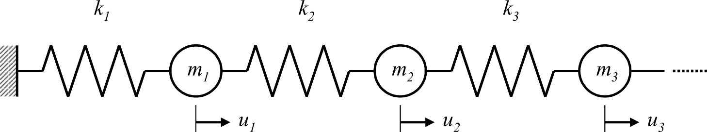
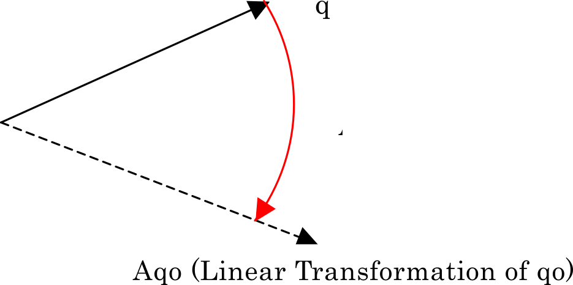
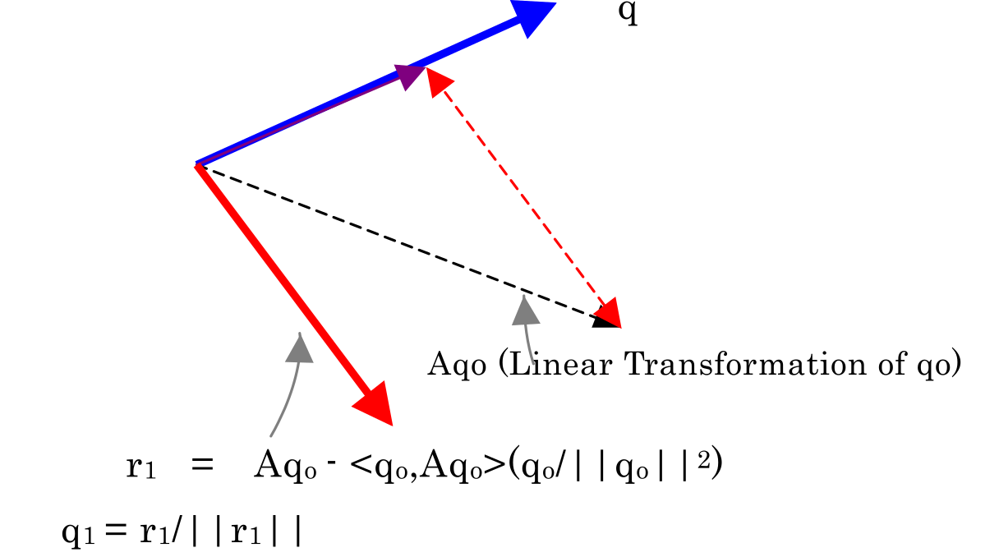
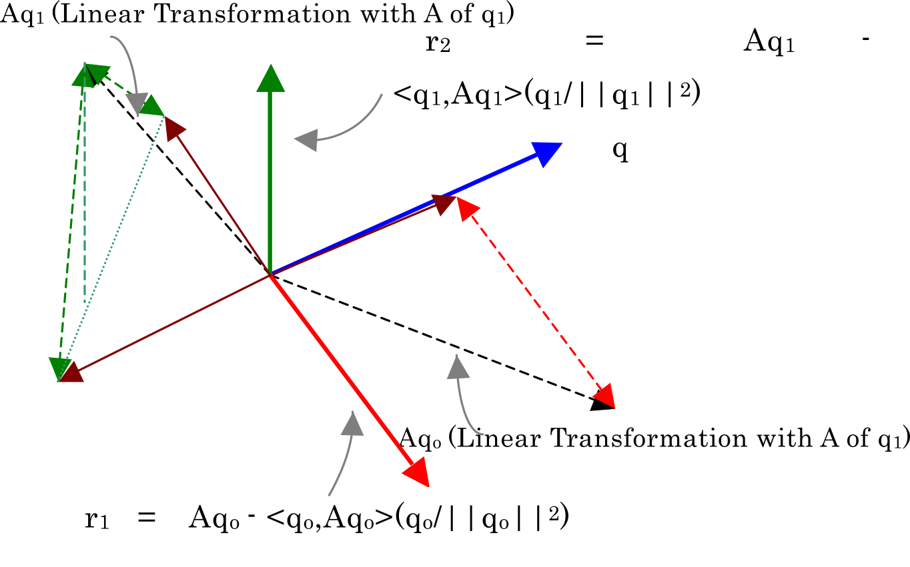

## Eigenvalue Analysis

### Generalized Eigenvalue Problems

In free oscillation analysis of continuous bodies, a spatial discretization is performed, and it is modeled with a multi-DOF system with concentrated mass points as shown in Fig. 2.3.1. In the case of free oscillation problems without damping, the governing equation (motion equation) is as follows:

\begin{equation}
M\ddot{u} + K u = 0
\label{eq:2.3.1}
\end{equation}

where \(u\) is the generalized displacement vector, \(M\) is the mass matrix and \(K\) is the stiffness matrix. Further, the function is defined with \(\omega\) as as the inherent angular frequency; \(a\), \(b\) and \(c\) as arbitary constants; and \(x\) as the vector: 

\begin{equation}
u(t) = (a \sin \omega t + b \cos \omega t ) x
\label{eq:2.3.2}
\end{equation}

In this case, this equation and its second derivative, that is, 

\begin{equation}
\ddot{u}(t) = -\omega^2 (a \sin \omega t + b \cos \omega t) x
\label{eq:2.3.3}
\end{equation}

is substituted into Eq.\(\eqref{eq:2.3.1}\), which becomes

\begin{equation}
M\ddot{u} + K u = (a \sin \omega t + b \cos \omega t) (- \omega^2 M + K x ) =  ( -\lambda M + K x) = 0
\label{eq:2.3.4}
\end{equation}

That is, the following equation is obtained:

\begin{equation}
K x = \lambda M x
\label{eq:2.3.5}
\end{equation}

Therefore, if coefficient \(\lambda(=\omega^2)\) and vector \(x\) that satisfy Eq.\(\eqref{eq:2.3.5}\) can be determined, function \(u(t)\) becomes the solution of formula.

The coefficient \(\lambda\) and vector \(x\) are called eigenvalue and eigenvector, respectively, and the problem that determines these from Eq.\(\eqref{eq:2.3.1}\) is known as a generalized eigenvalue problem. 

{.center width="80%"}

Fig. 2.3.1: Example of a multi-DOF system of free oscillation without damping

### Problem Settings

Eq.\(\eqref{eq:2.3.5}\), which can be expanded to any order, appears in many situations. When dealing with physical problems, the matrix is often Hermitian (symmetric.) In a complex matrix, the transpose is a conjugate complex number, and the real matrix is a symmetric matrix. Therefore, when the \(ij\) components of matrix \(K\) are defined as \(k_{ij}\), if the conjugate complex number \(k\) is set as \(\bar{k}\), the relationship becomes

\begin{equation}
k_{ij} = \bar{k}_{ji}
\label{eq:2.3.6}
\end{equation}

In this study, it is assumed that the matrices are symmetric and positive definite. A positive definite matrix is a symmetric matrix with all positive eigenvalues; that is, it always satisfies Eq.\(\eqref{eq:2.3.7}\):

\begin{equation}
x^{t} A x > 0
\label{eq:2.3.7}
\end{equation}

### Shifted Inverse Iteration Method

Structural analyses with the finite element method do not require all eigenvalues. In many cases, just a few low-order eigenvalues are sufficient. As for HEC-MW, it was designed to deal with large-scale problems thus, the matrices are large and very sparse (with many zeros). Therefore, it is important to consider this and determine eigenvalues of low-order mode efficiently. 

When the lower limit of eigenvalues is set to \(\sigma\), Eq.\(\eqref{eq:2.3.5}\) is modified according to the following equation (which is mathematically equivalent): 

\begin{equation}
(K - \sigma M)^{-1} M x = \frac{1}{(\lambda-\sigma)} x
\label{eq:2.3.8}
\end{equation}

This equation has the following convenient properties for calculation:

  1. The mode is inverted.
  2. The eigenvalue around \(\rho\) are maximized.

In actual calculations, the maximum eigenvalue is often determined at the beginning. Therefore, the main convergence calculation is applied to Eq.\(\eqref{eq:2.3.8}\), rather than Eq.\(\eqref{eq:2.3.5}\) to determine from the eigenvalues around \(\rho\). This method is called shifted inverse iteration. 

### Algorithm for Eigenvalue Solution

The Jacobi method is another such orthodox and popular method. 

It is an effective method for small and dense matrices; however, the matrices dealt with by HEC-MW are large and sparse; thus, the Lanczos iterative is preferred. 

### Lanczos Method

The Lancos method was proposed by C. Lanczos in the 1950s and is a calculation algorithm for triply diagonalizing a matrix. The following are some of its characteristics: 

  1. It is an iterative convergence method that allows calculation of a matrix even if it is sparse.  
  2. The algorithm is focused on matrices and vector product, and suitable for parallelization. 
  3. It is suitable for the geometric segmentation associated with finite element mesh. 
  4. It is possible to limit the number of eigenvalues to be determined and mode range to make the calculation more efficient.

The Lanczos method creates sequential orthogonal vectors, starting from the initial vector, to calculate the basis of subspaces. It is faster than the other subspace methods and is widely used in finite element method programs. However, this method is easily influenced by computer errors, which may impair the orthogonality of the vectors and interrupt it in the middle of the process. Therefore, it is essential to apply measures against errors. 

### Geometric Significance of the Lanczos Method

By converting Eq.\(\eqref{eq:2.3.8}\) into a variable

\begin{align}
  a^T &= \frac{\partial F}{\partial \sigma}\ ,
& \left[ \frac{1}{(\lambda-\sigma)}\right] &= \zeta
\label{eq:2.3.9}
\end{align}

and rewriting the problem, the following equation is obtained:

\begin{equation}
A x = \zeta x
\label{eq:2.3.10}
\end{equation}

An appropriate vector \(q_0\)  linearly transformed with matrix \(A\) (see Fig. 2.3.2).

{.center width="70%"}

Fig. 2.3.2: Linear Transformation of \(q_0\) with Matrix \(A\)

The transformed vector is orthogonalized within the space created by the original vector. That is, it is subjected to a so-called Gram–Schmidt orthogonalization shown in Fig. 2.3.2. Thus, if the vector obtained is defined as \(r_1\) and normalized (to length 1), it generates \(q_1\) (Fig. 2.3.3). With a similar calculation, \(q_2\) is obtained from \(q_1\) (Fig. 2.3.4), which is orthogonal to both \(q_1\) and \(q_0\). If the same calculation is repeated, mutually orthogonal vectors are determined up to the order of the maximum matrix. 

{.center width="70%"}

Fig. 2.3.3: Vector \(q_1\) orthogonal to \(q_0\)

{.center width="70%"}

Fig. 2.3.4: Vector \(q_2\) Orthogonal to \(q_1\) and \(q_0\)

The algorithm of the Lanczos method is a Gram–Schmidt orthogonalization on vector sequence \(\\{A_{q_0}, A^2_{q_0}, A^3_{q_0}, \ldots, A^n_{q_0} \\}\) or, in other words, \(\\{A_{q_0}, A_{q_1}, A_{q_2}, \ldots \\}\). This vector sequence is called Krylov sequence, and the space it creates is called Krylov subspace. If Gram–Schmidt orthogonalization is performed in this space, two adjacent vectors determine another vector. This is called the principle of Lanczos. 

### Triple Diagonalization

The \(i + 1\)th calculation in the iteration above can be expressed as 

\begin{equation}
\beta_{i+1} q_{i+1} + \alpha_{i+1} q_{i} + \gamma_{i+1} q_{i-1} = Aq_{i}
\label{eq:2.3.11}
\end{equation}

In this case,

\begin{align}
  \beta_{i+1} &= \frac{1}{|r_{i+1}|}\ ,
& \alpha_{i+1} &= \frac{(q_i, Aq_i)}{q_i, q_i}\ ,
& \gamma_{i+1} &= \frac{(q_{i-1}, Aq_i)}{(q_{i-1}, q_{i-1})}
\label{eq:2.3.12}
\end{align}

In matrix notation, this becomes

\begin{equation}
AQ_m = Q_m T_m
\label{eq:2.3.13}
\end{equation}

In this case,

\begin{align}
Q_m &= [q_1, q_2, q_3, \ldots , q_m]\ ,
&T &=
  \begin{pmatrix}
  \alpha_{1} & \gamma_{1} & & &\\\
  \beta_{2}  & \alpha_{2} & \gamma_{2} & &  \\\
             & \cdots & & &\\\
  & & & \beta_{m} & \alpha_{m}
  \end{pmatrix}
\label{eq:2.3.14}
\end{align}

That is, the eigenvalues are obtained through eigenvalue calculation on the triply diagonalized matrix obtained with Eq.\(\eqref{eq:2.3.13}\).

