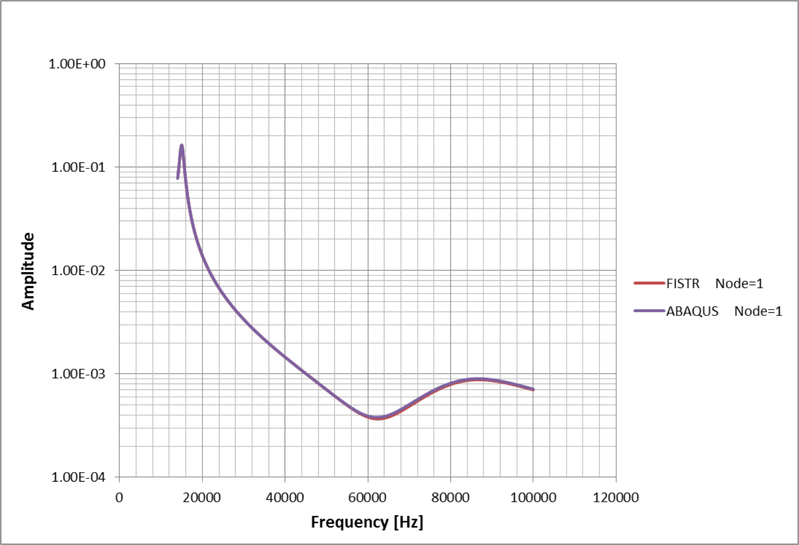

## Verification by Simple-Shaped Model

### Elastic static analysis

This verification was performed with a mesh-divided cantilever, as shown in Fig. 9.1.1. The analysis was performed with seven load conditions, exA–exG, as illustrated in Fig. 9.1.2. Please note that exG has the same load conditions as those of exA using the direct method solver.

The verification result of each load condition is presented in Tables 9.1.1–9.1.7.

{.center width="350px"}

Fig. 9.1.1: Example of Mesh Partitioned Cantilever Beam (Hexahedral Element)

|                                                |                                   |
|------------------------------------------------|-----------------------------------|
| {width="350px"} | (a) exA, G: Concentrated load     |
| {width="350px"} | (b) exD: Gravitation              |
| {width="350px"} | (c) exB: Surface-distributed load |
| {width="350px"} | (d) exE: Centrifugal force        |
| {width="350px"} | (e) exC: Volume load              |
| {width="350px"} | (f) exF : Heat load               |

| Item                                    | Value                                           |
|:----------------------------------------|:------------------------------------------------|
| Young's Modulus                         | \(E = 4000.0\ kgf/mm^2\)                        |
| Length                                  | \(L = 10.0\ mm\)                                |
| Poisson's Ratio                         | \(\nu = 0.3\)                                   |
| Sectional area                          | \(A = 1.0\ mm^2\)                               |
| Mass density                            | \(\rho = 8.0102 \times 10^{-10}\ kg\,s^2/mm^4\) |
| Second moment of area                   | \(I = 1.0/12.0\ mm^4\)                          |
| Gravitational acceleration              | \(g = 9800.0\ mm/s^2\)                          |
| Linear coefficient of thermal expansion | \(\alpha = 1.0 \times 10^{-5}\)                 |

Fig. 9.1.2: Verification conditions of the cantilever model

Table 9.1.1: exA: Verification results of the concentrated load problem

| Case Name | Number of elements | | Predicated Value : \(\delta_{max}= -1.000\) | | Remarks |
|:-:|:-:|:-:|:-:|:-:|:-:|
|   |   | NASTRAN | ABAQUS | FrontISTR | |
| A231 | 40  | -0.338 | -0.371 | -0.371 | 33 nodes / plane stress status problem |
| A232 | 40  | -0.942 | -1.002 | -1.002 | 105 nodes / plane stress status problem |
| A241 | 20  | -0.720 | -0.711 | -0.711 | 33 nodes / plane stress status problem |
| A242 | 20  | -0.910 | -1.002 | -1.002 | 85 nodes / plane stress status problem |
| A341 | 240 | -0.384 | -0.384 | -0.386 | 99 nodes |
| A342 | 240 | -0.990 | -0.990 | -0.999 | 525 nodes |
| A351 | 80  | -0.353 | -0.355 | -0.351 | 99 nodes |
| A352 | 80  | -0.993 | -0.993 | -0.992 | 381 nodes |
| A361 | 40  | -0.954 | -0.985 | -0.984 | 99 nodes |
| A362 | 40  | -0.994 | -0.993 | -0.993 | 220 nodes |
| A731 | 40  | -      | -      | -0.991 | 33 nodes / direct method |
| A741 | 20  | -      | -      | -0.996 | 33 nodes / direct method |

Table 9.1.2: exB: Verification results of the surface-distributed load problem

| Case name | Number of elements | | Predicated value : \(\delta_{max}= -3.750\) | | Remarks |
|:-:|:-:|:-:|:-:|:-:|:-:|
|   |   | NASTRAN | ABAQUS | FrontISTR | |
| B231 | 40  | -1.281 | -1.403 | -1.403 | 33 nodes / plane stress status problem |
| B232 | 40  | -3.579 | -3.763 | -3.763 | 105 nodes / plane stress status problem |
| B241 | 20  | -3.198 | -2.680 | -2.680 | 33 nodes / plane stress status problem |
| B242 | 20  | -3.426 | -3.765 | -3.765 | 85 nodes / plane stress status problem |
| B341 | 240 | -1.088 | -1.449 | -1.454 | 99 nodes |
| B342 | 240 | -3.704 | -3.704 | -3.748 | 525 nodes |
| B351 | 80  | -3.547 | -1.338 | -1.325 | 99 nodes |
| B352 | 80  | -0.3717| -3.716 | -3.713 | 381 nodes |
| B361 | 40  | -3.557 | -3.691 | -3.688 | 99 nodes |
| B362 | 40  | -3.726 | -3.717 | -3.717 | 220 nodes |
| B731 | 40  | -      | -      | -3.722 | 33 nodes / direct method |
| B741 | 20  | -      | -      | -3.743 | 33 nodes / direct method |

Table 9.1.3: exC: Verification results of the volume load problem

| Case Name | Number of elements | | Predicated Value : \(\delta_{max}= -2.944^{-5}\) | | Remarks |
|:-:|:-:|:-:|:-:|:-:|:-:|
|   |   | NASTRAN | ABAQUS | FrontISTR | |
| C231 | 40  | - | -1.101e-5 | -1.101e-5 | 33 nodes / plane stress problem |
| C232 | 40  | - | -2.951e-5 | -2.951e-5 | 105 nodes / plane stress problem |
| C241 | 20  | - | -2.102e-5 | -2.102e-5 | 33 nodes / plane stress problem |
| C242 | 20  | - | -2.953e-5 | -2.953e-5 | 85 nodes / plane stress problem |
| C341 | 240 | - | -1.136e-5 | -1.140e-5 | 99 nodes |
| C342 | 240 | - | -2.905e-5 | -2.937e-5 | 525 nodes |
| C351 | 80  | - | -1.050e-5 | -1.039e-5 | 99 nodes |
| C352 | 80  | - | -2.914e-5 | -2.911e-5 | 381 nodes |
| C361 | 40  | - | -2.895e-5 | -2.893e-5 | 99 nodes |
| C362 | 40  | - | -2.915e-5 | -2.915e-5 | 220 nodes |
| C731 | 40  | - | -         | -2.922e-5 | 33 nodes / direct method |
| C741 | 20  | - | -         | -2.938e-5 | 33 nodes / direct method |

Table 9.1.4: exD: Verification results of the gravitation problem

| Case name | Number of elements | | Predicated Value : \(\delta_{max}= -2.944^{-5}\) | | Remarks |
|:-:|:-:|:-:|:-:|:-:|:-:|
|   |   | NASTRAN | ABAQUS | FrontISTR | |
| D231 | 40  | -1.101e-5 | -1.101e-5 | -1.101e-5 | 33 nodes / plane stress status problem |
| D232 | 40  | -2.805e-5 | -2.951e-5 | -2.951e-5 | 105 nodes / plane stress status problem |
| D241 | 20  | -2.508e-5 | -2.102e-5 | -2.102e-5 | 33 nodes / plane stress status problem |
| D242 | 20  | -2.684e-5 | -2.953e-5 | -2.953e-5 | 85 nodes / plane stress status problem |
| D341 | 240 | -1.172e-5 | -1.136e-5 | -1.140e-5 | 99 nodes |
| D342 | 240 | -2.906e-5 | -2.905e-5 | -2.937e-5 | 525 nodes |
| D351 | 80  | -1.046e-5 | -1.050e-5 | -1.039e-5 | 99 nodes |
| D352 | 80  | -2.917e-5 | -2.914e-5 | -2.911e-5 | 381 nodes |
| D361 | 40  | -2.800e-5 | -2.895e-5 | -2.893e-5 | 99 nodes |
| D362 | 40  | -2.919e-5 | -2.915e-5 | -2.915e-5 | 220 nodes |
| D731 | 40  | -         | -         | -2.922e-5 | 33 nodes / direct method |
| D741 | 20  | -         | -         | -2.938e-5 | 33 nodes / direct method |

Table 9.1.5: exE: Verification results of the centrifugal force problem

| Case name | Number of elements | | Predicated value : \(\delta_{max}= 2.635^{-3}\) | | Remarks |
|:-:|:-:|:-:|:-:|:-:|:-:|
|   |   | NASTRAN | ABAQUS | FrontISTR | |
| E231 | 40  | 2.410e-3 | 2.616e-3 | 2.650e-3 | 33 nodes / plane stress status problem |
| E232 | 40  | 2.447e-3 | 2.627e-3 | 2.628e-3 | 105 nodes / plane stress status problem |
| E241 | 20  | 2.386e-3 | 2.622e-3 | 2.624e-3 | 33 nodes / plane stress status problem |
| E242 | 20  | 2.387e-3 | 2.627e-3 | 2.629e-3 | 85 nodes / plane stress status problem |
| E341 | 240 | 2.708e-3 | 2.579e-3 | 2.625e-3 | 99 nodes |
| E342 | 240 | 2.639e-3 | 2.614e-3 | 2.638e-3 | 525 nodes |
| E351 | 80  | 2.642e-3 | 2.598e-3 | 2.625e-3 | 99 nodes |
| E352 | 80  | 2.664e-3 | 2.617e-3 | 2.616e-3 | 381 nodes |
| E361 | 40  | 2.611e-3 | 2.603e-3 | 2.603e-3 | 99 nodes |
| E362 | 40  | 2.623e-3 | 2.616e-3 | 2.616e-3 | 220 nodes |
| E731 | 40  | -        | -        | 2.619e-3 | 33 nodes / direct method |
| E741 | 20  | -        | -        | 2.622e-3 | 33 nodes / direct method |

Table 9.1.6: exF: Verification results of the thermal stress load problem

| Case name | Number of elements | | Predicated Value : \(\delta_{max}= 1.000^{-2}\) | | Remarks |
|:-:|:-:|:-:|:-:|:-:|:-:|
|   |   | NASTRAN | ABAQUS | FrontISTR | |
| F231 | 40  | - | 1.016e-2 | 1.007e-2 | 33 nodes / plane stress status problem |
| F232 | 40  | - | 1.007e-2 | 1.007e-2 | 105 nodes / plane stress status problem |
| F241 | 20  | - | 1.010e-2 | 1.010e-2 | 33 nodes / plane stress status problem |
| F242 | 20  | - | 1.006e-2 | 1.006e-2 | 85 nodes / plane stress status problem |
| F341 | 240 | - | 1.047e-2 | 1.083e-2 | 99 nodes |
| F342 | 240 | - | 1.018e-2 | 1.022e-2 | 525 nodes |
| F351 | 80  | - | 1.031e-2 | 1.062e-2 | 99 nodes |
| F352 | 80  | - | 1.015e-2 | 1.017e-2 | 381 nodes |
| F361 | 40  | - | 1.026e-2 | 1.026e-2 | 99 nodes |
| F362 | 40  | - | 1.016e-2 | 1.016e-2 | 220 nodes |

Table 9.1.7: exG: Verification results of the direct method (concentrated load problem)

| Case name | Number of elements | | Predicated value : \(\delta_{max}= -1.000\) | | Remarks |
|:-:|:-:|:-:|:-:|:-:|:-:|
|   |   | NASTRAN | ABAQUS | FrontISTR | |
| G231 | 40  | -0.338 | -0.371 | -0.371 | 33 nodes / plane stress status problem |
| G232 | 40  | -0.942 | -1.002 | -1.002 | 105 nodes / plane stress status problem |
| G241 | 20  | -0.720 | -0.711 | -0.711 | 33 nodes / plane stress status problem |
| G242 | 20  | -0.910 | -1.002 | -1.002 | 85 nodes / plane stress status problem |
| G341 | 240 | -0.384 | -0.384 | -0.386 | 99 nodes |
| G342 | 240 | -0.990 | -0.990 | -0.999 | 52 nodes |
| G351 | 80  | -0.353 | -0.355 | -0.351 | 99 nodes |
| G352 | 80  | -0.993 | -0.993 | -0.992 | 381 nodes |
| G361 | 40  | -0.954 | -0.985 | -0.984 | 99 nodes |
| G362 | 40  | -0.994 | -0.993 | -0.993 | 220 nodes |
| G731 | 40  | -      | -      | -0.991 | 33 nodes / direct method |
| G741 | 20  | -      | -      | -0.996 | 33 nodes / dierct method |

### Non-linear static analysis

#### (2-1) exnl1: Geometrical non-linear analysis

The verification model of exI is the same as those of exA–G. A schematic diagram of the verification model is shown in Fig. 9.1.3. A geometric non-linear analysis was performed on this model. The verification results are presented in Table 9.1.8.
 
The non-linear calculation is a ten-step process with an increment value of 0.1 P and a final load of 1.0 P.

{.center width="350px"}

Fig. 9.1.3: Verification model

Table 9.1.8: exI: Verification results (maximum deflection amount log)

| Case Name | 0.1   | 0.2   | 0.3   | 0.4   | 0.5   | 0.6   | 0.7   | 0.8   | 0.9   | 1.0   | Linear Solution |
|:-:|:-:|:-:|:-:|:-:|:-:|:-:|:-:|:-:|:-:|:-:|:-:|
| I231     | -     | -     | -     | -     | -     | -     | -     | -     | -     | -     | -      |
| I232     | -     | -     | -     | -     | -     | -     | -     | -     | -     | -     | -      |
| I241     | -     | -     | -     | -     | -     | -     | -     | -     | -     | -     | -      |
| I242     | -     | -     | -     | -     | -     | -     | -     | -     | -     | -     | -      |
| I341     | 0.039 | 0.077 | 0.116 | 0.154 | 0.193 | 0.232 | 0.270 | 0.309 | 0.348 | 0.386 | 0.386  |
| I342     | 0.099 | 0.200 | 0.300 | 0.400 | 0.499 | 0.599 | 0.698 | 0.797 | 0.896 | 0.995 | 0.999  |
| I351     | 0.035 | 0.070 | 0.105 | 0.141 | 0.176 | 0.211 | 0.246 | 0.281 | 0.316 | 0.351 | 0.351  |
| I352     | 0.099 | 0.198 | 0.298 | 0.397 | 0.496 | 0.595 | 0.693 | 0.792 | 0.890 | 0.987 | 0.992  |
| I361     | 0.070 | 0.139 | 0.209 | 0.278 | 0.348 | 0.417 | 0.487 | 0.556 | 0.625 | 0.694 | 0.984  |
| I362     | 0.099 | 0.197 | 0.298 | 0.397 | 0.496 | 0.595 | 0.694 | 0.793 | 0.891 | 0.988 | 0.993  |

#### (2-2) 　exnl2: Elastoplasticity deformation analysis

Based on the test conducted at National Agency for Finite Element Methods and Standards (NAFEMS; U.K.): Test NL1, this verification problem was verified by elastoplastic deformation analysis that incorporated geometric non-linearity and multiple hardening rules. The elastoplastic deformation analysis model is shown in Fig. 9.1.4.

{.center width="350px"}

Fig. 9.1.4: Elastoplasticity deformation analysis Model

(1) Verification conditions:

|Item |Value  |
|:--|:--|
|Material   | Mises elastoplastic material |
|Young's Modulus   | \(E = 250 GPa\) |
|Poisson's Ratio | \(\nu = 0.25\) |
|Initial yield stress  | \(5 MPa\) |
|Initial yield strain | \(0.25\times 10^{-4}\) |
|Isotropic hardening factor | \(H_i = 0\) or \(62.5 GPa\) |

(2) Boundary conditions

|Item |Boundary conditions |Value   |
|:--|:--|:--|
|step 1 | Forced displacement in nodes 2 and 3 | \(u_x =  0.2500031251 *10^{-4} \) |
|step 2 | Forced displacement in nodes 2 and 3 | \(u_x =  0.25000937518*10^{-4} \) |
|step 3 | Forced displacement in nodes 3 and 4 | \(u_y =  0.2500031251 *10^{-4} \) |
|step 4 | Forced displacement in nodes 3 and 4 | \(u_y =  0.25000937518*10^{-4} \) |
|step 5 | Forced displacement in nodes 2 and 3 | \(u_x = -0.25000937518*10^{-4} \) |
|step 6 | Forced displacement in nodes 2 and 3 | \(u_x = -0.2500031251 *10^{-4} \) |
|step 7 | Forced displacement in nodes 3 and 4 | \(u_y = -0.25000937518*10^{-4} \) |
|step 8 | Forced displacement in nodes 3 and 4 | \(u_y = -0.2500031251 *10^{-4} \) |

All the nodes that are not mentioned here are fully constrained. The theoretical solution for this problem is presented as follows:

| Strain (\(\times10^{-4}\)) [\(\varepsilon_x\), \(\varepsilon_y\), \(\varepsilon_z\)] | Equivalent Stress (\(MPa\)) [\(H_i=0\ H_k=0\); \(H_i=62.5\ H_k=0\)] |
|:--|:--|
| 0.25, 0, 0    | 5.0; 5.0 | 
| 0.50, 0, 0    | 5.0; 5.862 |
| 0.50, 0.25, 0 | 5.0; 5.482 |
| 0.50, 0.50, 0 | 5.0; 6.362 |
| 0.25, 0.50, 0 | 5.0; 6.640 |
| 0, 0.50, 0    | 5.0; 7.322 |
| 0, 0.25, 0    | 3.917; 4.230 |
| 0, 0, 0       | 5.0; 5.673 |

The results of the calculations are as follows:

| Strain (\(\times10^{-4}\)) [\(\varepsilon_x\), \(\varepsilon_y\), \(\varepsilon_z\)] | Equivalent Stress (\(MPa\)) [\(H_i=0\ H_k=0\); \(H_i=62.5\ H_k=0\)] |
|:--|:--|
| 0.25, 0, 0    | 5.0 (0.0%); 5.0 (0.0%) | 
| 0.50, 0, 0    | 5.0 (0.0%); 5.862 (0.0%) |
| 0.50, 0.25, 0 | 5.0 (0.0%); 5.482 (0.0%) |
| 0.50, 0.50, 0 | 5.0 (0.0%); 6.362 (-0.05%)|
| 0.25, 0.50, 0 | 5.0 (0.0%); 6.640 (-0.21%)|
| 0, 0.50, 0    | 5.0 (0.0%); 7.322 (-0.34%)|
| 0, 0.25, 0    | 3.824 (-2.4%); 4.230 (-2.70%)|
| 0, 0, 0       | 5.0 (0.0%); 5.673 (5.673 (-2.50%)|

### Contact analysis (1)

Based on the contact patch test problem (CGS-4) from NAFEMS (U.K.), this verification problem tests the finite sliding contact problem function with friction. The contact analysis model is shown in Fig. 9.1.5

{.center width="350px"}

Fig. 9.1.5: Contact analysis model

The equilibrium condition of this problem is as follows:

\[
  Fcos\,\alpha - Gsin\,\alpha = \pm f_{c}
\]

In the adhesive friction stage, the frictional force is as follows:

\[
  f_{c} = E_t\Delta u
\]

In the sliding friction stage, the frictional force is as follows:

\[
  f_c = \mu(G \cos\,\alpha + F \sin\,\alpha)
\]

The comparison between the calculation results and the analysis solution is as follows.

| \(\mu\) | \(F/G\) Analysis Solution | \(F/G\) Calculation Results |
|:--------|:--------------------------|:----------------------------|
| 0.0     | 0.1                       | 0.1                         |
| 0.1     | 0.202                     | 0.202                       |
| 0.2     | 0.306                     | 0.306                       |
| 0.3     | 0.412                     | 0.412                       |

### Contact analysis (2): Hertz contact problem

In this verification, the Hertz contact problem between a cylinder of infinite length and an infinite plane was analyzed. The cylinder’s radius was R=8 mm, and the deformable body’s Young’s modulus E and Poisson’s ratio µ were 1100 MPa and 0.0, respectively. Moreover, assuming that the contact area was much smaller than the cylinder’s radius, and also considering the symmetry of the problem, the analysis was performed with a quarter model of the cylinder. 

{.center width="350px"}

Fig. 9.1.6: Hertz contact problem analysis model

#### (1) Verification results of contact radius

The theoretical formula to calculate the contact radius is as follows:

\[
  a = \sqrt{\frac{4FR}{\pi E^{*}}}
\]

where

\[
  E^{*} = \frac{E}{2(1 - \mu^{2})}
\]

With the actual calculation, when the pressure is \(F=100\), the contact radius is \(a=1.36\).

Fig. 9.1.7 shows the equivalent nodal force of the contact point. The contact radius is obtained by extrapolating this nodal force distribution. 
{.center width="512px"}

Fig. 9.1.7: Equivalent nodal force distribution of the contact point 

#### (2) Verification results of maximum shear stress

With the theoretical solution, when the contact position is \(z=0.78a\), the maximum shear stress is as follows:

\[
  \tau_{max} = 0.30\sqrt{\frac{FE^*}{\pi R}}
\]

With the actual calculation conditions, it becomes

\[
\tau_{max} = 14.2
\]

The actual result obtained was

\[
\tau_{max} = 15.6
\]

{.center width="350px"}

Fig. 9.1.8: Shear stress distribution (maximum value = 15.6)

### (3) Eigenvalue analysis

The verification models of exJ and exK are the same as those of exA–G. A schematic diagram of the verification model is shown in Fig. 9.1.9. An eigenvalue analysis was performed for this model to determine the primary, secondary, and tertiary eigenvalues. The iteration and direct method solvers were used for exJ and exK, respectively. Furthermore, the verification results are presented in Tables 9.1.9–9.1.12. 

{.center width="350px"}

Fig. 9.1.9: Verification Model

The vibration eigenvalue of the cantilever is determined by the following equations: 

Primary :
\[
n_1 = \frac{1.875^2}{2 \pi l^2} \sqrt{ \frac{gEI}{\omega} }
\]

Secondary :
\[
n_2 = \frac{4.694^2}{2 \pi l^2} \sqrt{ \frac{gEI}{\omega} }
\]

Tertiary :
\[
n_3 = \frac{7.855^2}{2 \pi l^2} \sqrt{ \frac{gEI}{\omega} }
\]

The property values of the verification model are:

| Item       | Value                       |
|:-----------|:----------------------------|
| \(I\)      | \(10.0 mm\)                 |
| \(E\)      | \(4000.0 kgf /mm^2\)        |
| \(l\)      | \(1.0/12.0 mm^4\)           |
| \(\omega\) | \(7.85 * 10^{-6} kgf/mm^3\) |
| \(g\)      | \(9800.0 mm/sec^2\)         |

Therefore, the primary to tertiary eigenvalue are as follows:

| Mode number   | Value   |
|:--------------|:--------|
| \(n_1\)       | 3.609e3 |
| \(n_2\)       | 2.262e4 |
| \(n_3\)       | 6.335e4 |

Table 9.1.9: exJ: Iteration method verification results with the primary eigenvalue

| Case Name |  Number of elements | Predicated value : n1=3.609e3 | | Remarks |
|:-:|:-:|:-:|:-:|:-:|
|   |   | NASTRAN | FrontISTR | |
| J231 | 40  | 5.861e3 | 5.861e3 | 33 nodes / plane stress status problem |
| J232 | 40  | 3.596e3 | 3.593e3 | 105 nodes / plane stress status problem |
| J241 | 20  | 3.586e3 | 4.245e3 | 33 nodes / plane stress status problem |
| J242 | 20  | 3.590e3 | 3.587e3 | 85 nodes / plane stress status problem |
| J341 | 240 | 5.442e3 | 5.429e3 | 99 nodes |
| J342 | 240 | 3.621e3 | 3.595e3 | 525 nodes |
| J351 | 80  | 3.695e3 | 4.298e3 | 99 nodes |
| J352 | 80  | 3.610e3 | 3.609e3 | 381 nodes |
| J361 | 40  | 3.679e3 | 3.619e3 | 99 nodes |
| J362 | 40  | 3.611e3 | 3.606e3 | 220 nodes |

Table 9.1.10: Iteration method verification results of exJ with the secondary eigenvalue

| Case name | Number of elements | Predicated value : n2=2.262e4 | | Remarks |
|:-:|:-:|:-:|:-:|:-:|
|   |   | NASTRAN | FrontISTR | |
| J231 | 40  | 3.350e4 | 3.351e4 | 33 nodes / plane stress status problem |
| J232 | 40  | 2.163e4 | 2.156e4 | 105 nodes / plane stress status problem |
| J241 | 20  | 2.149e4 | 2.516e4 | 33 nodes / plane stress status problem |
| J242 | 20  | 2.149e4 | 2.143e4 | 85 nodes / plane stress status problem |
| J341 | 240 | 3.145e4 | 3.138e4 | 99 nodes |
| J342 | 240 | 2.171e4 | 2.155e4 | 525 nodes |
| J351 | 80  | 2.208e4 | 2.546e4 | 99 nodes |
| J352 | 80  | 2.156e4 | 2.149e4 | 381 nodes |
| J361 | 40  | 2.202e4 | 2.168e4 | 99 nodes |
| J362 | 40  | 2.154e4 | 2.144e4 | 220 nodes |

> Note: In the three-dimensional (3D) models, the primary and secondary values have equal roots. Therefore, the secondary value in the table represents the tertiary calculation value.

Table 9.1.11: Direct method verification results of exK with the primary eigenvalue

| Case name | Number of elements | Predicated Value : n1=3.609e3 | | Remarks |
|:-:|:-:|:-:|:-:|:-:|
|   |   | NASTRAN | FrontISTR | |
| J231 | 40  | 5.861e3 | 5.861e3 | 33 nodes / plane stress status problem |
| J232 | 40  | 3.596e3 | 3.593e3 | 105 nodes / plane stress status problem |
| J241 | 20  | 3.586e3 | 4.245e3 | 33 nodes / plane stress status problem |
| J242 | 20  | 3.590e3 | 3.587e3 | 85 nodes / plane stress status problem |
| J341 | 240 | 5.442e3 | 5.429e3 | 99 nodes |
| J342 | 240 | 3.621e3 | 3.595e3 | 525 nodes |
| J351 | 80  | 3.695e3 | 4.298e3 | 99 nodes |
| J352 | 80  | 3.610e3 | 3.609e3 | 381 nodes |
| J361 | 40  | 3.679e3 | 3.619e3 | 99 nodes |
| J362 | 40  | 3.611e3 | 3.606e3 | 220 nodes |
| J731 | 40  | -       | 3.606e3 | 220 nodes |
| J741 | 20  | -       | 3.594e3 | 220 nodes |

Table 9.1.12: Direct method verification results of exK with the secondary eigenvalue

| Case name | Number of elements | Predicated value : n2=2.262e4 | | Remarks |
|:-:|:-:|:-:|:-:|:-:|
|   |   | NASTRAN | FrontISTR | |
| J231 | 40  | 3.350e4 | 3.351e4 | 33 nodes / plane stress status problem |
| J232 | 40  | 2.163e4 | 2.156e4 | 105 nodes / plane stress status problem |
| J241 | 20  | 2.149e4 | 2.516e4 | 33 nodes / plane stress status problem |
| J242 | 20  | 2.149e4 | 2.143e4 | 85 nodes / plane stress status problem |
| J341 | 240 | 3.145e4 | 3.138e4 | 99 nodes |
| J342 | 240 | 2.171e4 | 2.155e4 | 525 nodes |
| J351 | 80  | 2.208e4 | 2.546e4 | 99 nodes |
| J352 | 80  | 2.156e4 | 2.149e4 | 381 nodes |
| J361 | 40  | 2.202e4 | 2.168e4 | 99 nodes |
| J362 | 40  | 2.154e4 | 2.144e4 | 220 nodes |
| J731 | 40  | -       | 2.156e4 | 220 nodes |
| J741 | 20  | -       | 2.153e4 | 220 nodes |

> Note: In the 3D models, the primary and secondary values have equal roots. Therefore, the secondary value in the table represents the tertiary calculation value.

### (4) Heat conduction analysis

The common conditions for the steady-state heat conduction analysis are shown in Fig. 9.1.10. The individual conditions for the verification cases exM–exT are shown in Fig. 9.1.11. The mesh division used here is equivalent to that of exA.

The verification results (temperature distribution table) of each case are presented in Tables 9.1.13–9.1.20.

{.center width="350px"}

|                    |                |
|--------------------|----------------|
|Length between AB   |\(L = 10.0m\)   |
|Cross-sectional area|\(A = 1.0 mm^2\)|

Temperature dependency of thermal conductivity

|Thermal conductivity \(\lambda(W/mK)\)|Temperature \((^\circ C)\)|
|--------------------------------------|--------------------------|
|50.0                                  |0.0                       |
|35.0                                  |500.0                     |
|20.0                                  |1000.0                    |

Fig. 9.1.10: Verification conditions of steady-heat conduction analysis

|   |   |
|---|---|
|exM: Linear material|  |
|exN: Specified tempreature problem    |{width="350px"}|
|exO: Concentrated heat flux problem   |{width="350px"}|
|exP: Distributed heat flux problem    |{width="350px"}|
|exQ: Convective heat transfer problem |{width="350px"}|
|exR: Radiant heat transfer problem    |{width="350px"}|
|exS: Volume heat generation problem   |{width="350px"}|
|exT: Internal gap problem             |{width="350px"}|

Fig. 9.1.11: Analysis conditions for each verification case

Table 9.1.13: Verification results of exM (steady-state calculation of linear material)

| Case name | Element type | Number of elements/nodes | Distance from edge A (m) |  |  |  |  |  |  |
|:--|:--|:--|:--|:--|:--|:--|:--|:--|:--|
|   |   |   | Edge A | 2.0 | 4.0 | 6.0 | 8,0 | Edge B |
| M361A | 361 | 40／33  | 0.0 | 100.0 | 200.0 | 300.0 | 400.0 | 500.0 |
| M361B | 361 | 40／105 | 0.0 | 100.0 | 200.0 | 300.0 | 400.0 | 500.0 |
| M361C | 361 | 20／33  | 0.0 | 100.0 | 200.0 | 300.0 | 400.0 | 500.0 |
| M361D | 361 | 20／85  | 0.0 | 100.0 | 200.0 | 300.0 | 400.0 | 500.0 |
| M361E | 361 | 240／99 | 0.0 | 100.0 | 200.0 | 300.0 | 400.0 | 500.0 |
| M361F | 361 | 24／525 | 0.0 | 100.0 | 200.0 | 300.0 | 400.0 | 500.0 |
| M361G | 361 | 80／99  | 0.0 | 100.0 | 200.0 | 300.0 | 400.0 | 500.0 |

Table 9.1.14: Verification results of exN (specified temperature problem)

| Case name | Element type | Number of elements/nodes | Distance from edge A (m) |  |  |  |  |  |  |
|:--|:--|:--|:--|:--|:--|:--|:--|:--|:--|
|   |   |   | Edge A | 2.0 | 4.0 | 6.0 | 8,0 | Edge B |
| ABAQUS | 361 | 40／99  | 0.0 | 87.3 | 179.7 | 278.2 | 384.3 | 500.0 |
| N231   | 231 | 40／33  | 0.0 | 87.2 | 179.5 | 278.0 | 384.1 | 500.0 |
| N232   | 232 | 40／105 | 0.0 | 86.0 | 178.3 | 276.8 | 382.9 | 500.0 |
| N241   | 241 | 20／33  | 0.0 | 87.3 | 179.7 | 278.2 | 384.3 | 500.0 |
| N242   | 242 | 20／85  | 0.0 | 87.3 | 179.7 | 278.2 | 384.3 | 500.0 |
| N341   | 341 | 240／99 | 0.0 | 87.3 | 179.7 | 278.2 | 384.3 | 500.0 |
| N342   | 342 | 24／525 | 0.0 | 87.9 | 179.9 | 278.0 | 383.6 | 500.0 |
| N351   | 351 | 80／99  | 0.0 | 87.3 | 179.7 | 278.2 | 384.3 | 500.0 |
| N352   | 352 | 80／381 | 0.0 | 87.3 | 179.7 | 278.2 | 384.3 | 500.0 |
| N361   | 361 | 40／99  | 0.0 | 87.3 | 179.7 | 278.2 | 384.3 | 500.0 |
| N362   | 362 | 40／330 | 0.0 | 87.3 | 179.7 | 278.2 | 384.3 | 500.0 |
| N731   | 731 | 40／33  | 0.0 | 87.3 | 179.7 | 278.2 | 384.3 | 500.0 |
| N741   | 741 | 20／33  | 0.0 | 87.3 | 179.7 | 278.2 | 384.3 | 500.0 |

Table 9.1.15: Verification results of exO (concentrated heat flux problem)

| Case name | Element type | Numbewr of elements/nodes | Distance from edge A (m) |  |  |  |  |  |  |
|:--|:--|:--|:--|:--|:--|:--|:--|:--|:--|
|   |   |   | Edge A | 2.0 | 4.0 | 6.0 | 8,0 | Edge B |
| ABAQUS | 361 | 40／99  | 0.0 | 103.2 | 213.7 | 333.3 | 464.8 | 612.6 |
| O231   | 231 | 40／33  | 0.0 | 103.2 | 213.7 | 333.3 | 464.8 | 612.6 |
| O232   | 232 | 40／105 | 0.0 | 103.2 | 213.7 | 333.3 | 464.8 | 612.6 |
| O241   | 241 | 20／33  | 0.0 | 103.2 | 213.7 | 333.3 | 464.8 | 612.6 |
| O242   | 242 | 20／85  | 0.0 | 103.2 | 213.7 | 333.4 | 465.2 | 618.0 |
| O341   | 341 | 240／99 | -   | -     | -     | -     | -     | -     |
| O342   | 342 | 24／525 | 0.0 | 104.4 | 214.9 | 334.7 | 466.3 | 614.6 |
| O351   | 351 | 80／99  | -   | -     | -     | -     | -     | -     |
| O352   | 352 | 80／381 | 0.0 | 103.2 | 213.7 | 333.3 | 465.0 | 624.2 |
| O361   | 361 | 40／99  | 0.0 | 103.2 | 213.7 | 333.3 | 464.8 | 612.6 |
| O362   | 362 | 40／330 | 0.0 | 103.2 | 213.7 | 333.4 | 465.5 | 623.5 |
| O731   | 731 | 40／33  | 0.0 | 103.2 | 213.7 | 333.3 | 464.8 | 612.5 |
| O741   | 741 | 20／33  | 0.0 | 103.2 | 213.7 | 333.3 | 464.8 | 612.6 |

Table 9.1.16: Verification results of exP (distribution heat flux problem)

| Case name | Element type | Number of elements/nodes | Distance from edge A (m) |  |  |  |  |  |  |
|:--|:--|:--|:--|:--|:--|:--|:--|:--|:--|
|   |   |   | Edge A | 2.0 | 4.0 | 6.0 | 8,0 | Edge B |
| ABAQUS | 361 | 40／99  | 0.0 | 103.2 | 213.7 | 333.3 | 464.8 | 612.6 |
| P231   | 231 | 40／33  | 0.0 | 103.2 | 213.7 | 333.3 | 464.8 | 612.6 |
| P232   | 232 | 40／105 | 0.0 | 103.2 | 213.7 | 333.3 | 464.8 | 612.6 |
| P241   | 241 | 20／33  | 0.0 | 103.2 | 213.7 | 333.3 | 464.8 | 612.6 |
| P242   | 242 | 20／85  | 0.0 | 103.2 | 213.7 | 333.3 | 464.8 | 612.6 |
| P341   | 341 | 240／99 | -   | -     | -     | -     | -     | -     |
| P342   | 342 | 24／525 | 0.0 | 103.2 | 213.7 | 333.3 | 464.8 | 612.6 |
| P351   | 351 | 80／99  | -   | -     | -     | -     | -     | -     |
| P352   | 352 | 80／381 | 0.0 | 103.2 | 213.7 | 333.3 | 464.8 | 612.6 |
| P361   | 361 | 40／99  | 0.0 | 103.2 | 213.7 | 333.3 | 464.8 | 612.6 |
| P362   | 362 | 40／330 | 0.0 | 103.2 | 213.7 | 333.4 | 465.5 | 612.6 |
| P731   | 731 | 40／33  | 0.0 | 103.2 | 213.7 | 333.3 | 464.8 | 612.5 |
| P741   | 741 | 20／33  | 0.0 | 103.2 | 213.7 | 333.3 | 464.8 | 612.6 |

Table 9.1.17: Verification results of exQ (convective heat transfer problem) 

| Case name | Element type | Number of elements/nodes | Distance from edge A (m) |  |  |  |  |  |  |
|:--|:--|:--|:--|:--|:--|:--|:--|:--|:--|
|   |   |   | Edge A | 2.0 | 4.0 | 6.0 | 8,0 | Edge B |
| ABAQUS | 361 | 40／99  | 0.0 | 89.2 | 183.8 | 284.8 | 393.9 | 513.2 |
| Q231   | 231 | 40／33  | 0.0 | 89.2 | 183.8 | 284.8 | 393.9 | 513.2 |
| Q232   | 232 | 40／105 | 0.0 | 89.2 | 183.8 | 284.8 | 393.9 | 513.2 |
| Q241   | 241 | 20／33  | 0.0 | 89.2 | 183.8 | 284.8 | 393.9 | 513.2 |
| Q242   | 242 | 20／85  | 0.0 | 89.2 | 183.8 | 284.8 | 393.9 | 513.2 |
| Q341   | 341 | 240／99 | -   | -    | -     | -     | -     | -     |
| Q342   | 342 | 24／525 | 0.0 | 89.2 | 183.8 | 284.8 | 393.9 | 513.2 |
| Q351   | 351 | 80／99  | -   | -    | -     | -     | -     | -     |
| Q352   | 352 | 80／381 | 0.0 | 89.2 | 183.8 | 284.8 | 393.9 | 513.2 |
| Q361   | 361 | 40／99  | 0.0 | 89.2 | 183.8 | 284.8 | 393.9 | 513.2 |
| Q362   | 362 | 40／330 | 0.0 | 89.2 | 183.8 | 284.8 | 393.9 | 513.2 |
| Q731   | 731 | 40／33  | 0.0 | 89.2 | 183.8 | 284.8 | 393.9 | 513.2 |
| Q741   | 741 | 20／33  | 0.0 | 89.2 | 183.8 | 284.8 | 393.9 | 513.2 |

Table 9.1.18: Verification results of exR (radiation heat transfer problem)

| Case name | Element type | Number of elements/nodes | Distance from edge A (m) |  |  |  |  |  |  |
|:--|:--|:--|:--|:--|:--|:--|:--|:--|:--|
|   |   |   | Edge A | 2.0 | 4.0 | 6.0 | 8,0 | Edge B |
| ABAQUS | 361 | 40／99  | 0.0 | 89.5 | 184.4 | 285.8 | 395.3 | 515.2 |
| R231   | 231 | 40／33  | 0.0 | 89.5 | 184.4 | 285.8 | 395.3 | 515.2 |
| R232   | 232 | 40／105 | 0.0 | 89.5 | 184.4 | 285.8 | 395.3 | 515.2 |
| R241   | 241 | 20／33  | 0.0 | 89.5 | 184.4 | 285.8 | 395.3 | 515.2 |
| R242   | 242 | 20／85  | 0.0 | 89.5 | 184.4 | 285.8 | 395.3 | 515.2 |
| R341   | 341 | 240／99 | -   | -    | -     | -     | -     | -     |
| R342   | 342 | 24／525 | 0.0 | 89.5 | 184.4 | 285.8 | 395.3 | 515.2 |
| R351   | 351 | 80／99  | -   | -    | -     | -     | -     | -     |
| R352   | 352 | 80／381 | 0.0 | 89.5 | 184.4 | 285.8 | 395.3 | 515.2 |
| R361   | 361 | 40／99  | 0.0 | 89.5 | 184.4 | 285.8 | 395.3 | 515.2 |
| R362   | 362 | 40／330 | 0.0 | 89.5 | 184.4 | 285.8 | 395.3 | 515.2 |
| R731   | 731 | 40／33  | 0.0 | 89.5 | 184.4 | 285.8 | 395.3 | 515.2 |
| R741   | 741 | 20／33  | 0.0 | 89.5 | 184.4 | 285.8 | 395.3 | 515.2 |

Table 9.1.19: Verification results of exS (volume heat generation problem)

| Case name | Element type | Number of elements/nodes | Distance from edge A (m) |  |  |  |  |  |  |
|:--|:--|:--|:--|:--|:--|:--|:--|:--|:--|
|   |   |   | Edge A | 2.0 | 4.0 | 6.0 | 8,0 | Edge B |
| ABAQUS | 361 | 40／99  | 0.0 | 103.2 | 213.7 | 333.3 | 464.8 | 612.6 |
| S231   | 231 | 40／33  | 0.0 | 103.2 | 213.7 | 333.3 | 464.8 | 612.6 |
| S232   | 232 | 40／105 | 0.0 | 103.2 | 213.7 | 333.3 | 464.8 | 612.6 |
| S241   | 241 | 20／33  | 0.0 | 103.2 | 213.7 | 333.3 | 464.8 | 612.6 |
| S242   | 242 | 20／85  | 0.0 | 103.2 | 213.7 | 333.3 | 464.8 | 612.6 |
| S341   | 341 | 240／99 | -   | -     | -     | -     | -     | -     |
| S342   | 342 | 24／525 | 0.0 | 103.2 | 213.7 | 333.3 | 464.8 | 612.6 |
| S351   | 351 | 80／99  | -   | -     | -     | -     | -     | -     |
| S352   | 352 | 80／381 | 0.0 | 103.2 | 213.7 | 333.3 | 464.8 | 612.6 |
| S361   | 361 | 40／99  | 0.0 | 103.2 | 213.7 | 333.3 | 464.8 | 612.6 |
| S362   | 362 | 40／330 | 0.0 | 103.2 | 213.7 | 333.3 | 464.8 | 612.6 |
| S731   | 731 | 40／33  | 0.0 | 103.2 | 213.7 | 333.3 | 464.8 | 612.6 |
| S741   | 741 | 20／33  | 0.0 | 103.2 | 213.7 | 333.3 | 464.8 | 612.6 |

Table 9.1.20: Verification results of exT (internal gap problem)

| Case name | Element type | Number of elements/nodes | Distance from edge A (m) |  |  |  |  |  |  |
|:--|:--|:--|:--|:--|:--|:--|:--|:--|:--|
|   |   |   | Edge A | 2.0 | 4.0 | 6.0 | 8,0 | Edge B |
| ABAQUS | 361 | 40／99  | 0.0 | 88.6 | 182.4 | 282.6 | 387.7 | 500.0 |
| S231   | 231 | 40／33  | 0.0 | 88.6 | 182.4 | 282.6 | 387.7 | 500.0 |
| S232   | 232 | 40／105 | 0.0 | 88.6 | 182.4 | 282.6 | 387.7 | 500.0 |
| S241   | 241 | 20／33  | 0.0 | 88.6 | 182.4 | 282.6 | 387.7 | 500.0 |
| S242   | 242 | 20／85  | 0.0 | 88.6 | 182.4 | 282.6 | 387.7 | 500.0 |
| S341   | 341 | 240／99 | -   | -    | -     | -     | -     | -     |
| S342   | 342 | 24／525 | 0.0 | 88.6 | 182.4 | 282.6 | 387.7 | 500.0 |
| S351   | 351 | 80／99  | -   | -    | -     | -     | -     | -     |
| S352   | 352 | 80／381 | 0.0 | 88.6 | 182.4 | 282.6 | 387.7 | 500.0 |
| S361   | 361 | 40／99  | 0.0 | 88.6 | 182.4 | 282.6 | 387.7 | 500.0 |
| S362   | 362 | 40／330 | 0.0 | 88.6 | 182.4 | 282.6 | 387.7 | 500.0 |
| S731   | 731 | 40／33  | 0.0 | 88.6 | 182.4 | 282.6 | 387.7 | 500.0 |
| S741   | 741 | 20／33  | 0.0 | 88.6 | 182.4 | 282.6 | 387.7 | 500.0 |

### (5) Linear dynamic analysis

In exW, a linear dynamic analysis was performed on the same mesh-divided cantilever that was discussed earlier in the Elastic static analysis subsection, with the verification conditions shown in Fig. 9.1.12. The objective was to verify the impact of time increment on the results with the same mesh division. Both the implicit and explicit methods of dynamic analysis and the element types 361 and 342 were used. The verification results are presented in Table 9.1.22 and shown in Figs. 9.1.13–9.1.15.

Analysis Model

{.center width="350px"}

Analysis Model

{width="512px"}

Time history of external force \(F\)

The theoretical solution for vibration point displacement is as follows:

\[
F(t)=F_0 I(t)
\]

where

\[
F_0:{\rm Constant\ vector}
\]

\[
I(t)=
\begin{cases}
0, t < 0 \\\
1, 0 \leq t
\end{cases}
\]

\[
u(t) = \frac{F_0 l^3}{EI} \sum^{\infty}\_{i=1} \frac{1-\cos{\omega_i t}}{{\lambda_i}^4}
\left\lbrace
\cosh{\lambda_i}-\cos{\lambda_i}-\frac{\cosh{\lambda_i} + \cos{\lambda_i}}{\sin{\lambda_i}+\sin{\lambda_i}}
(\sinh{\lambda_i} - \sin{\lambda_i})
\right\rbrace^2
\]

Fig. 9.1.12: Verification conditions of linear dynamic analysis

Verification conditions:

|                            |          |                            |
|:---------------------------|:--------:|:---------------------------|
| Length                     | \(L\)    | \(10.0\ mm\)               |
| Cross-sectional width      | \(a\)    | \(1.0\ mm\)                |
| Cross-sectional height     | \(b\)    | \(1.0\ mm\)                |
| Young's modulus            | \(E\)    | \(4000.0\ kgf/mm^2\)       |
| Poisson's ratio            | \(\nu\)  | \(0.3\)                    |
| Density                    | \(\rho\) | \(1.0E-09\ kgf\,s^2/mm^3\) |
| Gravitational acceleration | \(g\)    | \(9800.0\ mm/s^2\)         |
| External force             | \(F_0\)  | \(1.0\ kgf\)               |

|                                                  |                           |
|--------------------------------------------------|---------------------------|
| Element                                          | Hexahedral linear element |
| Tetrahedral secondary element                    |                           |
| Solution                                         | Implicit method           |
| Parameter \(\gamma\) of Newmark-\(\beta\) method | 1/2                       |
| Parameter \(\beta\) of Newmark-\(\beta\) method  | 1/4                       |
| Explicit method                                  |                           |
| Damping                                          | N/A                       |

Table 9.1.21: Verification conditions of the linear dynamic analysis (continuation)

| Case Name | Element Type | No. of Nodes | No. of Elements | Solution | Time Increment \(\Delta t\) [sec] |
|:--|:--|:--|:--|:--|:--|
| W361_c0_im_m2_t1 | 361 |  99 |  40 | Implicit method | 1.0E-06 |
| W361_c0_im_m2_t2 | 361 |  99 |  40 | Implicit method | 1.0E-05 |
| W361_c0_im_m2_t3 | 361 |  99 |  40 | Implicit method | 1.0E-04 |
| W361_c0_ex_m2_t1 | 361 |  99 |  40 | Explicit method | 1.0E-08 |
| W361_c0_ex_m2_t2 | 361 |  99 |  40 | Explicit method | 1.0E-07 |
| W361_c0_ex_m2_t3 | 361 |  99 |  40 | Explicit method | 1.0E-06 |
| W342_c0_im_m2_t1 | 342 | 525 | 240 | Implicit method | 1.0E-06 |
| W342_c0_im_m2_t2 | 342 | 525 | 240 | Implicit method | 1.0E-05 |
| W342_c0_im_m2_t3 | 342 | 525 | 240 | Implicit method | 1.0E-04 |
| W342_c0_ex_m2_t1 | 342 | 525 | 240 | Explicit method | 1.0E-08 |
| W342_c0_ex_m2_t2 | 342 | 525 | 240 | Explicit method | 5.0E-08 |
| W342_c0_ex_m2_t3 | 342 | 525 | 240 | Explicit method | 1.0E-07 |

Table 9.1.22: Verification results of linear dynamic analysis of exW (cantilever)

| Case name | Element type | Number of nodes | Number of elements | Solution | z-direction displacement: \(u_z(mm)\) when time \(t = 0.002(s)\) |  |
|:--|:--|:--|:--|:--|:--|:--|
|                  |     |     |     |        |Theorical solution repeated to sextic equation|FrontISTR|
| W361_c0_im_m2_t1 | 361 |  99 |  40 | Implicit method | 1.9753 | 1.9302 |
| W361_c0_im_m2_t2 | 361 |  99 |  40 | Implicit method | 1.9753 | 1.8686 |
| W361_c0_im_m2_t3 | 361 |  99 |  40 | Implicit method | 1.9753 | 0.3794 |
| W361_c0_ex_m2_t1 | 361 |  99 |  40 | Explicit method | 1.9753 | 1.9302 |
| W361_c0_ex_m2_t2 | 361 |  99 |  40 | Explicit method | 1.9753 | 1.9247 |
| W361_c0_ex_m2_t3 | 361 |  99 |  40 | Explicit method | 1.9753 | Divergence |
| W342_c0_im_m2_t1 | 342 | 525 | 240 | Implicit method | 1.9753 | 1.9431 |
| W342_c0_im_m2_t2 | 342 | 525 | 240 | Implicit method | 1.9753 | 1.8719 |
| W342_c0_im_m2_t3 | 342 | 525 | 240 | Implicit method | 1.9753 | 0.3873 |
| W342_c0_ex_m2_t1 | 342 | 525 | 240 | Explicit method | 1.9753 | 1.9359 |
| W342_c0_ex_m2_t2 | 342 | 525 | 240 | Explicit method | 1.9753 | 1.9358 |
| W342_c0_ex_m2_t3 | 342 | 525 | 240 | Explicit method | 1.9753 | Divergence |

{.center width="512px"}

Fig. 9.1.13: Deformation diagram and equivalent stress distribution of the cantilever (W361_c0_im_m2_t2)

{.center width="512px"}

(a) Element Type 361 : Implicit method

{.center width="512px"}

(b) Element Type 361 : Explicit method

Fig. 9.1.14: Time history of vibration point displacement \(u_z\)

{.center width="512px"}

(a) Element Type 342 : Implicit method

{.center width="512px"}

(b) Element Type 342 : Explicit method

### (6) Frequency response analysis

In this verification, a frequency response analysis was performed on a cantilever, and the results were compared with those obtained using the ABAQUS software. The analysis model and verification conditions are presented below:

{.center width="350px"}
{.center width="350px"}

Analysis conditions:

|                               |          |                      |
|-------------------------------|----------|----------------------|
| Young's modulus               | \(E\)    | \(210000\ N/mm^2\)   |
| Poisson's ratio               | \(\nu\)  | \(0.3\)              |
| Density                       | \(\rho\) | \(7.89E-09\ t/mm^3\) |
| Gravitational acceleration    | \(g\)    | \(9800.0\ mm/s^2\)   |
| Load                          | \(F_0\)  | \(1.0\ N\)           |
| Parameter of Rayleigh damping | \(R_m\)  | \(0.0\)              |
| Parameter of Rayleigh damping | \(R_k\)  | \(7.2E-07\)          |

Fig. 9.1.15 : Analysis model (tetrahedral primary element (126 elements and 55 nodes))

The eigenvalues up to the fifth order and the frequency response of the vibration points obtained from eigenvalue analysis are as follows:

| mode | FrontISTR | ABAQUS |
|:-----|:----------|:-------|
| 1    | 14952     | 14952  |
| 2    | 15002     | 15003  |
| 3    | 84604     | 84539  |
| 4    | 84771     | 84697  |
| 5    | 127054    | 126852 |

{.center width="512px"}

Fig. 9.1.16 : Frequency dependence of displacement strength of vibration points

