## Actual Model Examples for Elastic Static Analysis

### Analysis Model

A list of actual model verification examples for elastic static analysis are presented in Table 9.2.1. The different shapes of the models are shown in Figs. 9.2.1–9.2.5 (some models are excluded). The examples of the element types 731 and 741 require a separate direct method solver.

Table 9.2.1: Actual model verification examples for elastic static analysis

| Case name | Element type | Verification model             | Number of nodes | Freedom freequency |
|:----------|:-------------|:-------------------------------|:----------------|:-------------------|
| EX01A     | 342          | Connecting rod (100,000 nodes) | 94,074          | 282,222            |
| EX01B     | 342          | Connecting rod (330,000 nodes) | 331,142         | 993,426            |
| EX02      | 361          | Block with hole                | 37,386          | 112,158            |
| EX03      | 342          | Turbine blade                  | 10,095          | 30,285             |
| EX04      | 741          | Cylindrical shell              | 10,100          | 60,600             |
| EX05A     | 731          | Wine glass (coarse)            | 7,240           | 43,440             |
| EX05B     | 731          | Wine glass (midium)            | 48,803          | 292,818            |
| EX05C     | 731          | Wine glass (fine)              | 100,602         | 603,612            |

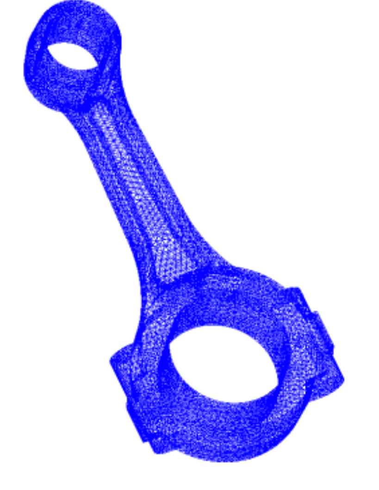{.center width="250px"}

Fig. 9.2.1: Connecting Rod (EX01A)

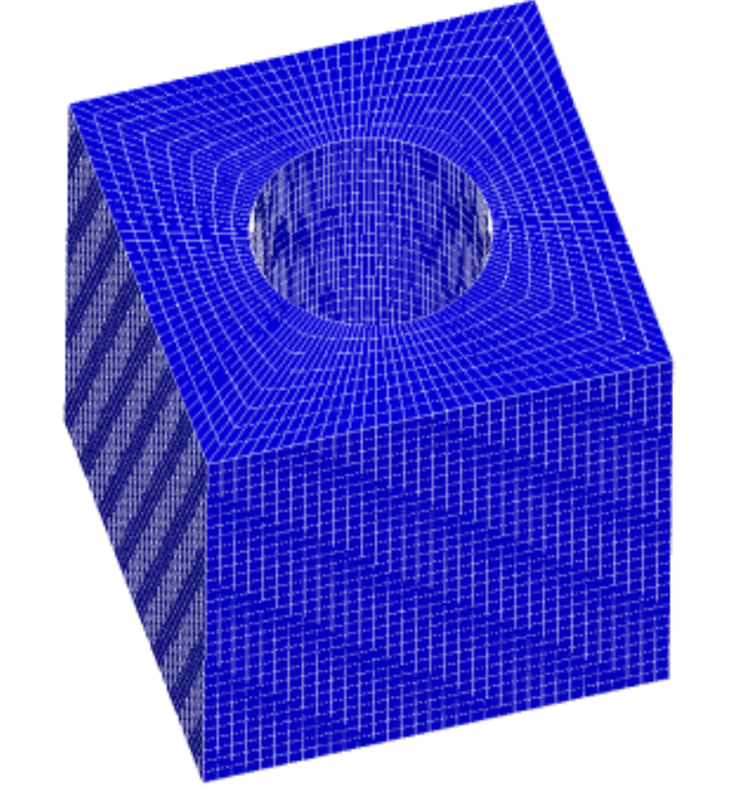{.center width="350px"}

Fig. 9.2.2: Perforated block (EX02)

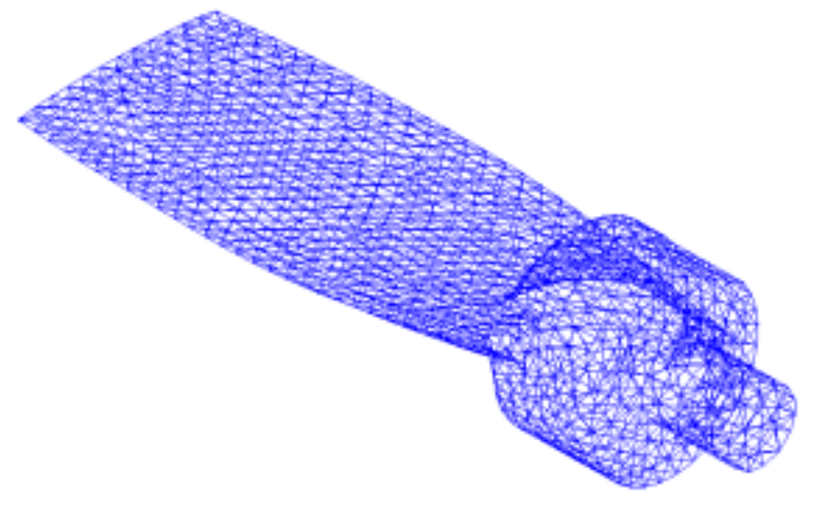{.center width="350px"}

Fig. 9.2.3: Turbine blade (EX03, EX06)

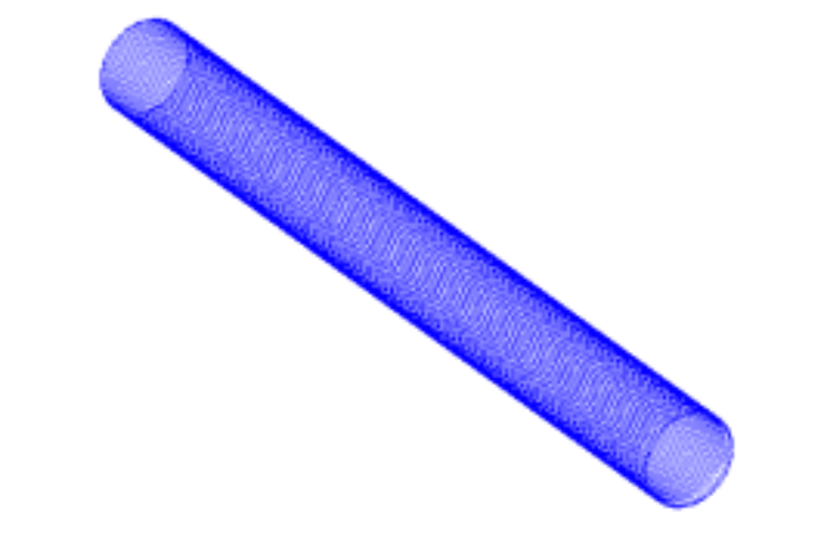{.center width="350px"}

Fig. 9.2.4: Cylindrical shell (EX04, EX09)

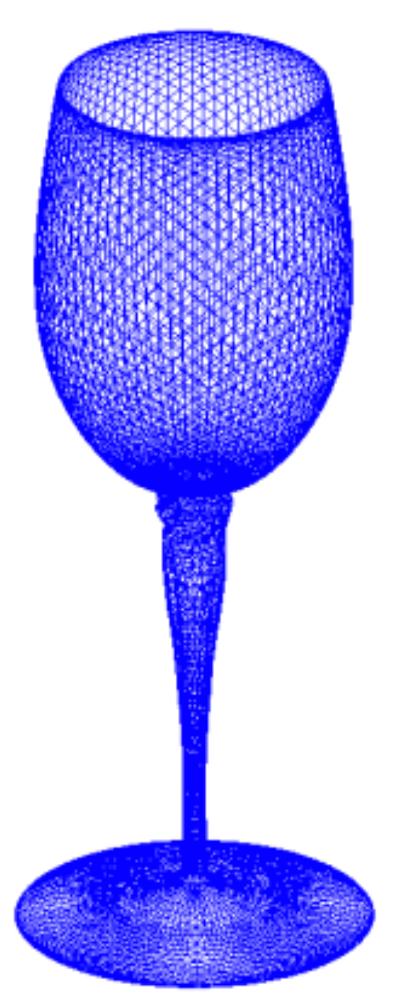{.center width="200px"}

Fig. 9.2.5: Wine Glass (EX05, EX10A)

### Analysis results

#### Example of analysis results

Examples of the analysis results are shown in Figs. 9.2.6–9.2.9. 

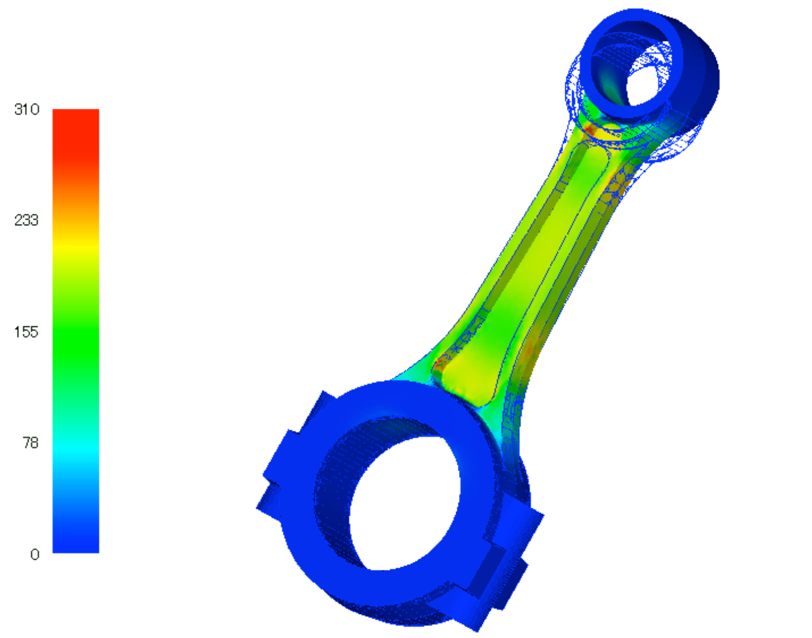{.center width="350px"}

Fig. 9.2.6: EX01 analysis results (Mises stress and deformation diagram (10 times))

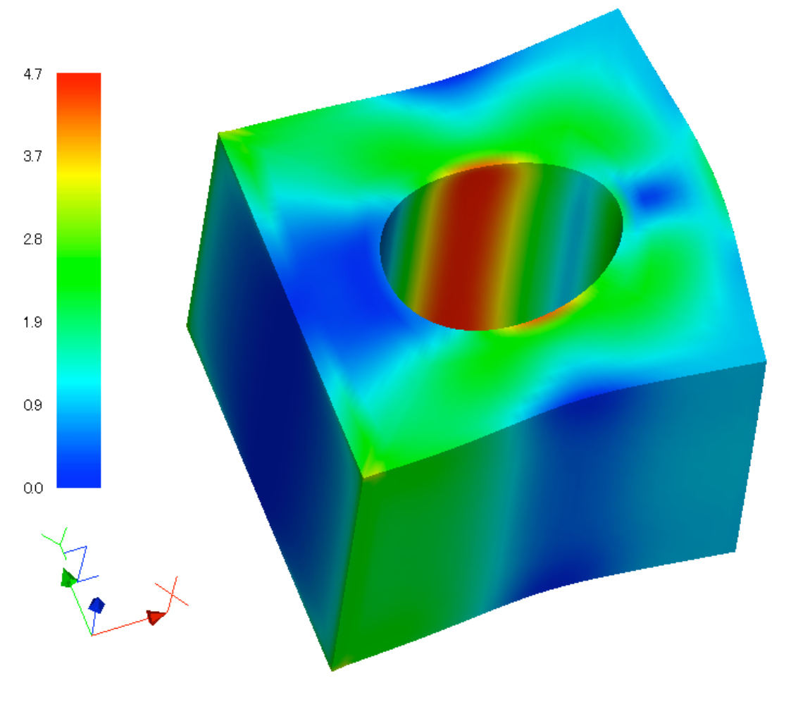{.center width="350px"}

Fig. 9.2.7: EX02 analysis results (Mises stress and deformation diagram (100 times))

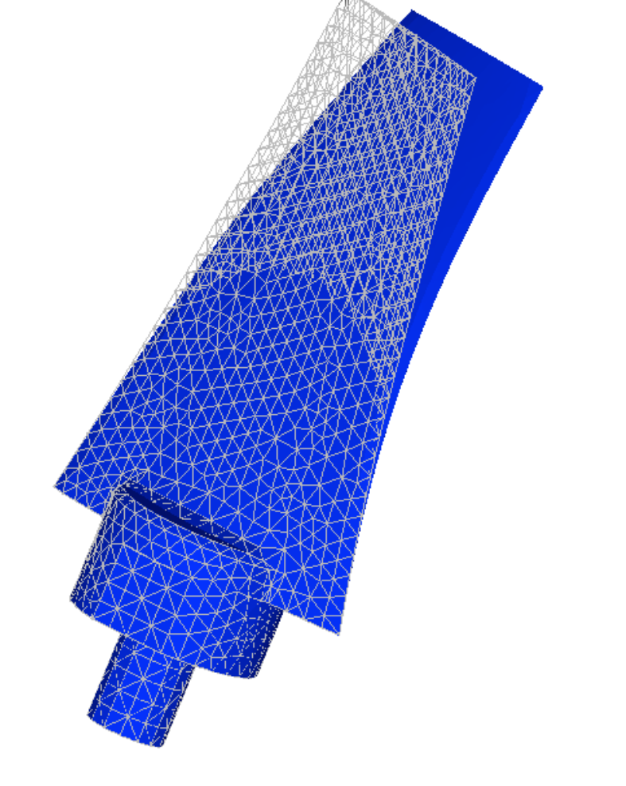{.center width="250px"}

Fig. 9.2.8: EX03 analysis results (deformation diagram (10 times))

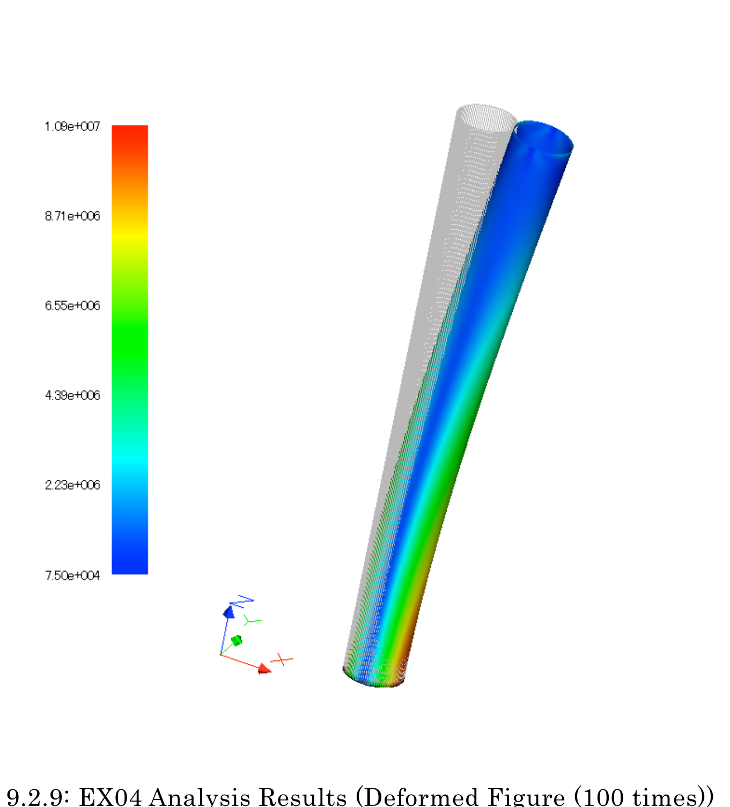{.center width="350px"}

Fig. 9.2.9: EX04 analysis results (deformation diagram (100 times))

#### Verification Results of Analysis Performance with Example EX02

An analysis was performed with the commercial software ABAQUS using a model equivalent to the verification example model EX02 (perforated block). A comparison of the maximum and minimum values of the stress components with the results of FrontISTR is shown in Fig. 9.2.10. It can be seen that the stress components are very close to each other. 

The effect of area division on stress distribution was also analyzed. The division was performed according to the RCB method, i.e., the model was halved in each of the X, Y, and Z axial directions, creating eight areas in total. Fig. 9.2.11 shows the division, while Fig. 9.2.12 shows the stress distribution of the analysis results with a single area and with the area divided into eight areas.

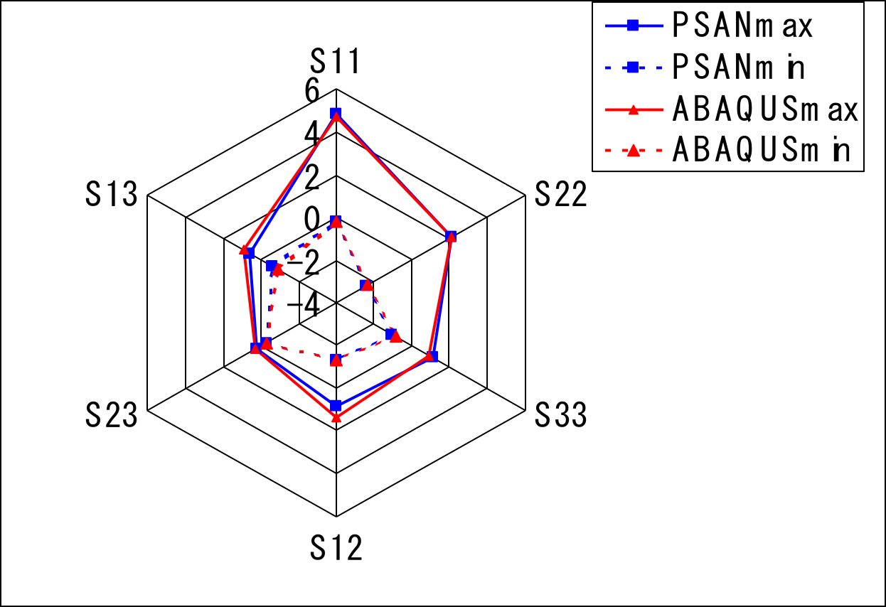{.center width="350px"}

Fig. 9.2.10: Comparison of the stress components of EX02 with the commercial software

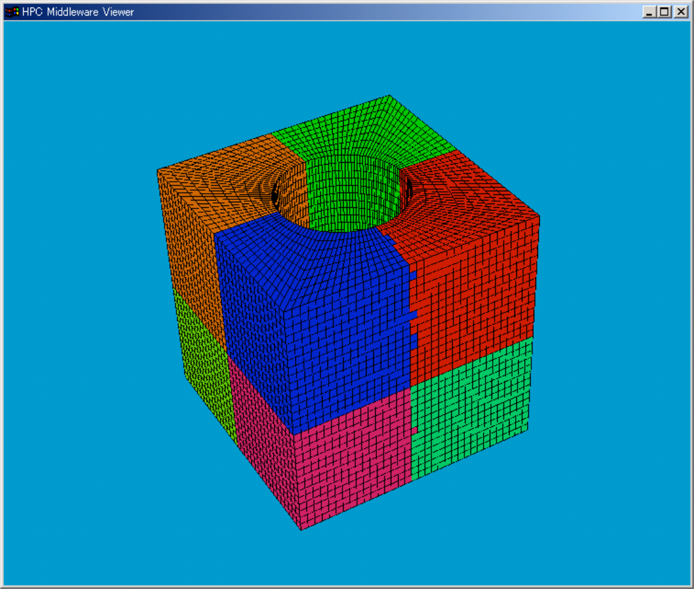{.center width="350px"}

Fig. 9.2.11: Result of the division of EX02 in eight areas by the RCB method

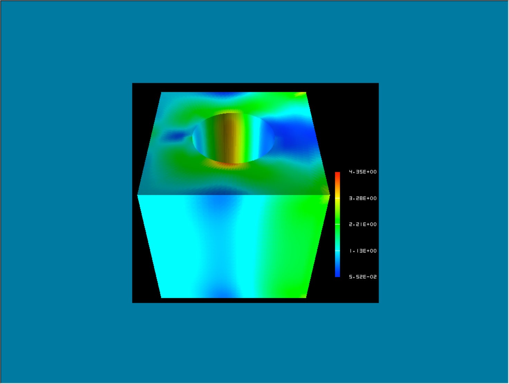{.center width="350px"}

Fig. 9.2.12: No difference between the stress distribution of the analysis results with a single area and with the area divided into eight areas

Furthermore, a comparison of the execution time with the settings of the HEC-MW solver used is presented in Table 9.2.2. Fig. 9.2.13 shows the convergence history until the solution was found.

Table 9.2.2: Comparison of execution time with HEC-MW solvers

| Solver | Execution Time(s) |
|:--|:--|
| CGI      | 38.79 |
| CGscale  | 52.75 |
| BCGS     | 60.79 |
| CG8      | 6.65 |

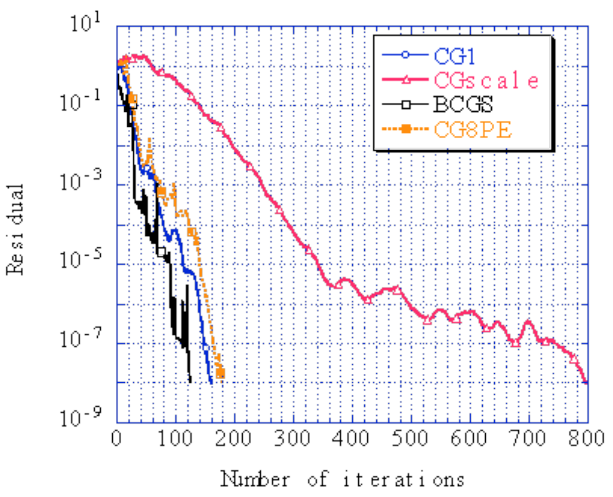{.center width="350px"}

Fig. 9.2.13: Comparison of convergence history with the HEC-MW solver (convergence threshold: \(1.0 \times 10^{-8}\) )

#### Comparison of calculation time with verification example EX01A

The increase rate of the calculation speed because of area division was verified with the example EX01A (connecting rod.) The test was conducted with a Xeon 2.8 GHz 24 node cluster computer, and the results are shown in Fig. 9.2.14. This figure shows that the calculation speed increases proportionally to the number of areas. 

The difference in the calculation time because of the computer environment was also analyzed. The results are presented in Table 9.2.3. 

{.center width="350px"}

Fig. 9.2.14: Speed-increasing effect because of area division

Table 9.2.3: Comparison of calculation time with different computers (one CPU) 

| CPU         | Frequancy [GHz] | OS      | CPU Time [sec] | solver time [sec] |
|:------------|:----------------|:--------|:---------------|:------------------|
| Xeon        | 2.8             | Linux   | 850            | 817               |
| Pentium III | 0.866           | Win2000 | 2008           | 1980              |
| Pentium M   | 0.760           | WinXP   | 1096           | 1070              |
| Pentium 4   | 2.0             | WinXP   | 802            | 785               |
| Pentium 4   | 2.8             | WinXP   | 738            | 718               |
| Celeron     | 0.700           | Win2000 | 2252           | 2215              |
| Pentium 4   | 2.4             | WinXP   | 830            | 804               |

