## Actual Model Examples for Eigenvalue Analysis

### Analysis model

A list of examples of the actual verification models for eigenvalue analysis is presented in Table 9.3.1. The model shapes of EX07 (turbine rotor) and EX08 (spring) are also shown in Figs. 9.3.1 and 9.3.2. The other model shapes are the same as those of the examples previously discussed in the elastic static analysis, which has the same verification content. The examples of the element types 731 and 741 require a separate direct method solver. 

Table 9.3.1: Examples of actual model verification for eigenvalue analysis

| Case Name | Element Type | Verification Model  | No. of Nodes | No. of Degrees of Freedom |
|:----------|:-------------|:--------------------|:-------------|:--------------------------|
| EX06      | 342          | Turbine blade       | 10,095       | 30,285                    |
| EX07      | 361          | Turbine rotor       | 127,440      | 382,320                   |
| EX08      | 342          | Spring              | 78,771       | 236,313                   |
| EX09      | 741          | Cylindrical shell   | 10,100       | 60,600                    |
| EX10A     | 731          | Wine glass (coarse) | 7,240        | 43,440                    |
| EX10B     | 731          | Wine glass (midium) | 48,803       | 292,818                   |

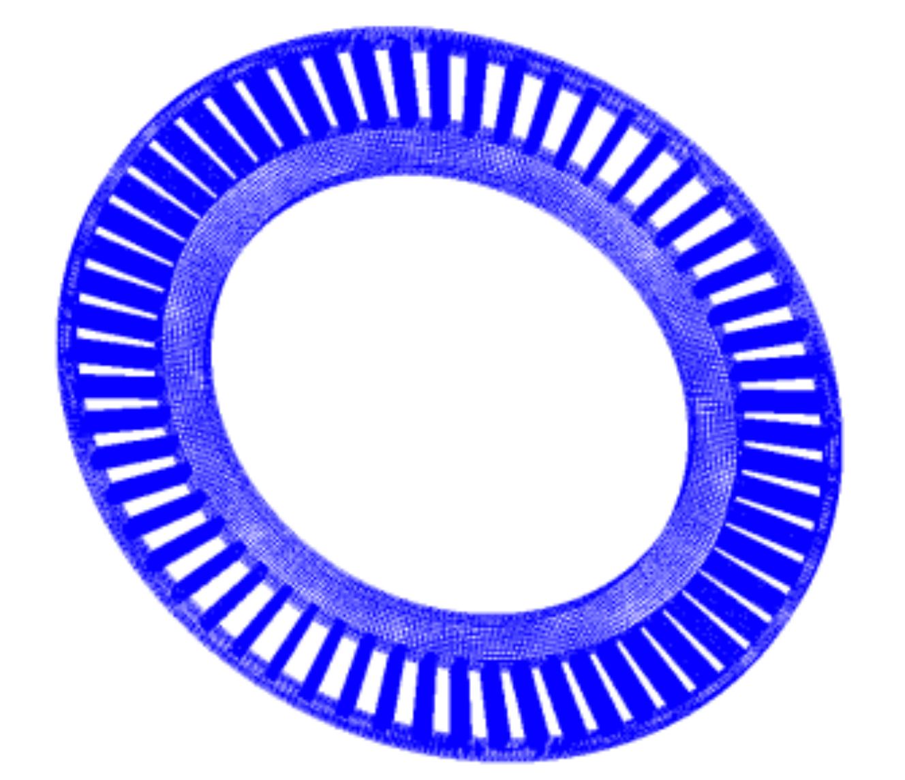{.center width="350px"}

Fig. 9.3.1: Turbine rotor (EX07)

{.center width="350px"}

Fig. 9.3.2: Spring (EX08)

### Analysis Results

The vibration mode and natural frequency are shown in the following.

#### (1) EX06 Turbine blade

|                                                    |                                                    |
|----------------------------------------------------|----------------------------------------------------|
| {width=200px"} | 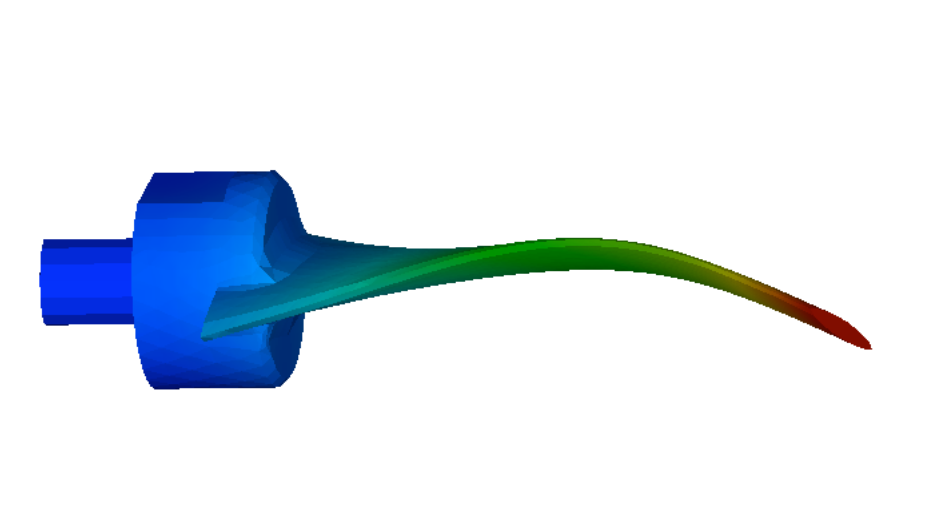{width="200px"} |
| (a) Mode 1 (1170 kHz)                              | (b) Mode 2(3250kHz)                                |
|                                                    |                                                    |
| {width="200px"} | 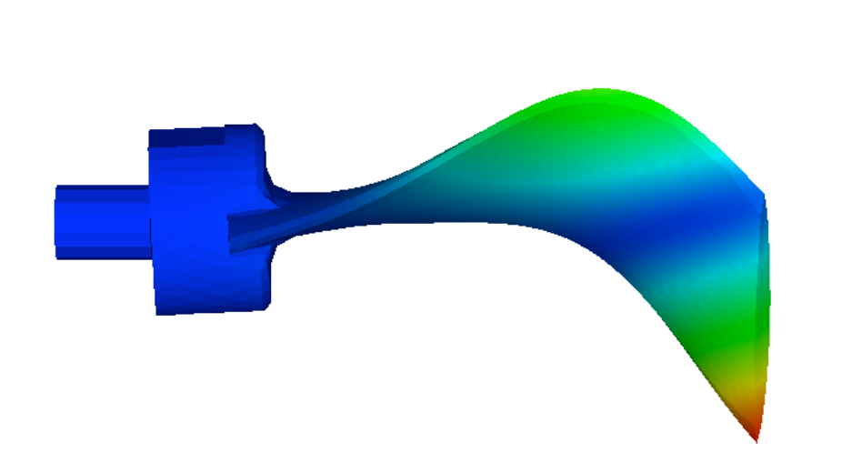{width="200px"} |
| (c) Mode 3(4130kHz)                                | (d) Mode 4(4140kHz)                                |
|                                                    |                                                    |
| {width="200px"} |                                                    |
| (e) Mode 5(8210kHz)                                |                                                    |

Fig. 9.3.3: EX06, turbine blade vibration mode

#### (2) EX07 Turbine rotor

|                                                    |                                                    |
|----------------------------------------------------|----------------------------------------------------|
| 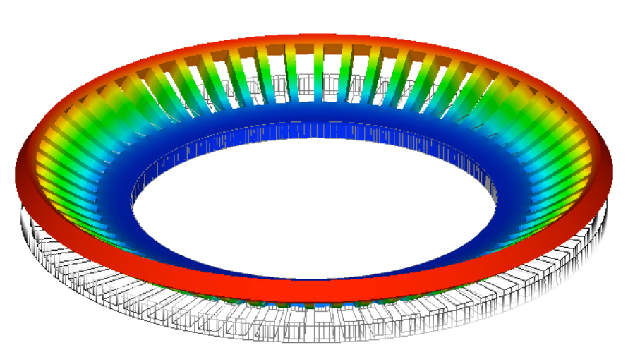{width="300px"} | {width="300px"} |
| (a) Mode 1(1067Hz)                                 | (b) Mode 2(1072Hz)                                 |
|                                                    |                                                    |
| 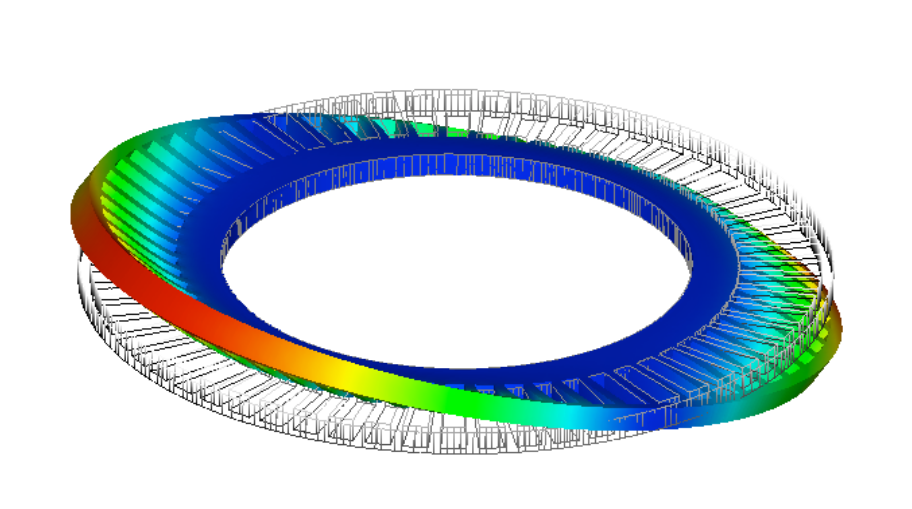{width="300px"} | {width="300px"} |
| (c) Mode 3(1072Hz)                                 | (d) Mode 4(1093Hz)                                 |
|                                                    |                                                    |
| 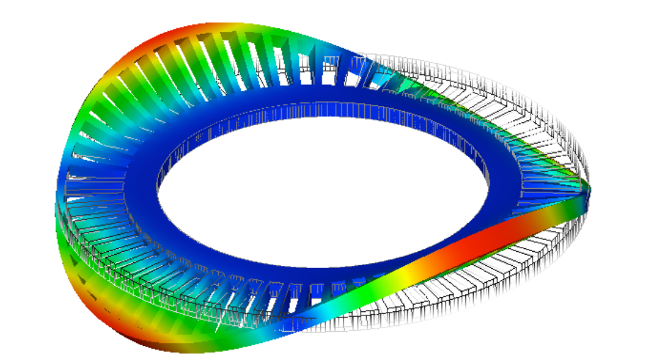{width="300px"} |                                                    |
| (e) Mode 5(1093Hz)                                 |                                                    |
|                                                    |                                                    |

Fig. 9.3.4: EX07, Turbine rotor vibration mode

#### EX08 Spring

|  |  |  |
|--|--|--|
|Mode 1 (445Hz)                                   |Mode 2 (446Hz)                                   |Mode 3 (908Hz)                                   |
|{width="160px"}|{width="160px"}|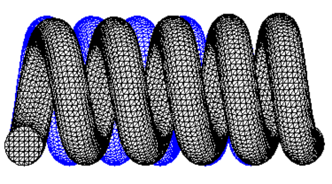{width="160px"}|
|  |  |
|Mode 4 (985Hz)                                   |Mode 5 (1819Hz)                                  |   |
|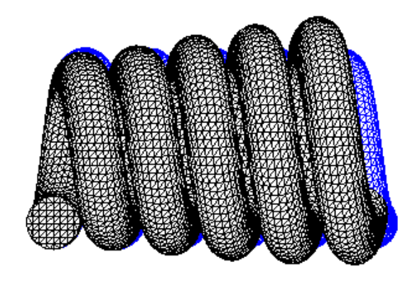{width="160px"}|{width="160px"}|   |

|   | FrontISTR | NASTRAN |
|---|----------:|--------:|
| 1 | 445 Hz    | 445 Hz  |
| 2 | 446 Hz    | 446 Hz  |
| 3 | 908 Hz    | 908 Hz  |
| 4 | 985 Hz    | 986 Hz  |
| 5 | 1810 Hz   | 1810 Hz |

Fig. 9.3.5: EX08, spring vibration mode

#### (4) EX09 Cylindrical shell

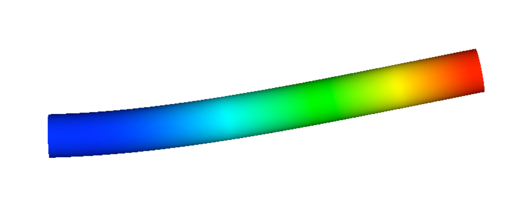{.center width="350px"}

(a) Mode 1, 2 (109 Hz)

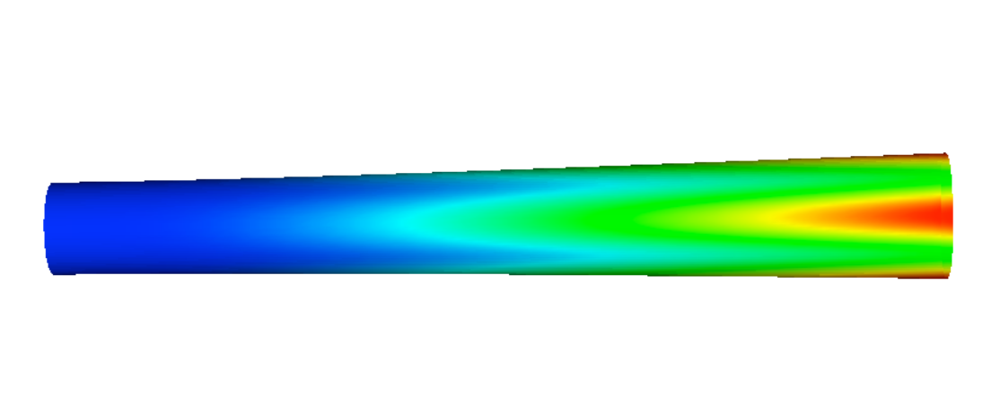{.center width="350px"}

(b) Mode 3,4(570Hz)

{.center width="350px"}

(c) Mode 5(615Hz)

Fig. 9.3.6: EX09, cylindrical shell vibration mode

#### EX10A Wine glass

|   |   |   |
|---|---|---|
| 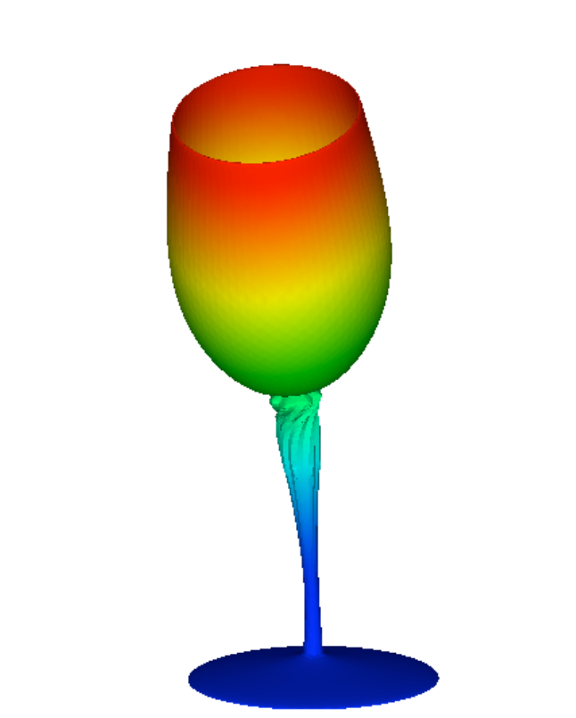{width="120px"} | 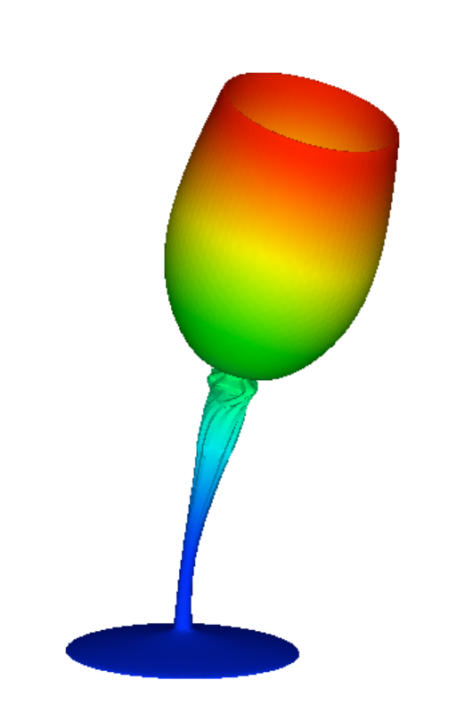{width="120px"} | {width="120px"} |
| (a) Mode 1(101Hz)                                               | (b) Mode 2(102Hz)                                               | (c) Mode 3(354Hz)                                               |
| 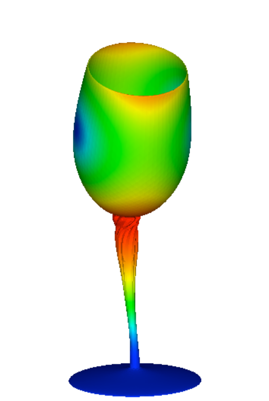{width="120px"}| 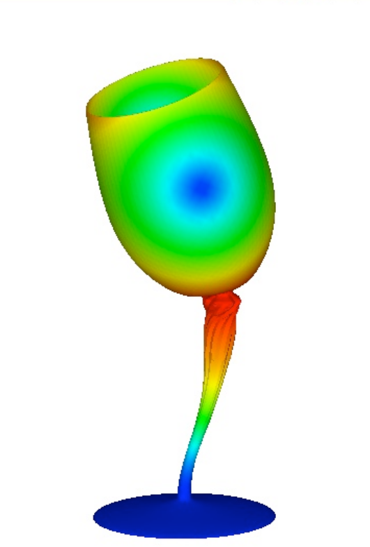{width="120px"} |                                                                |
| (d) Mode 4(1335Hz)                                              | (e) Mode 5(1336Hz)                                               |                                                                |

Fig. 9.3.7: EX10A Wine Glass Vibration Mode

