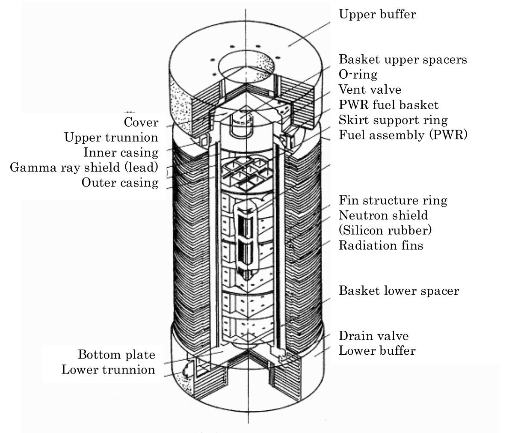
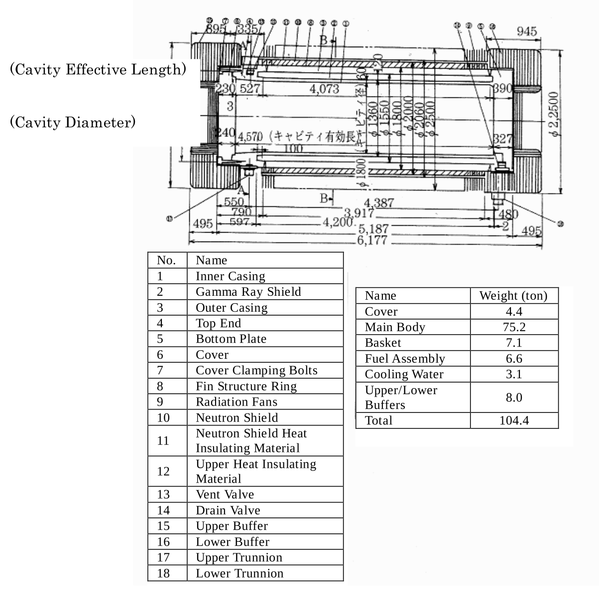
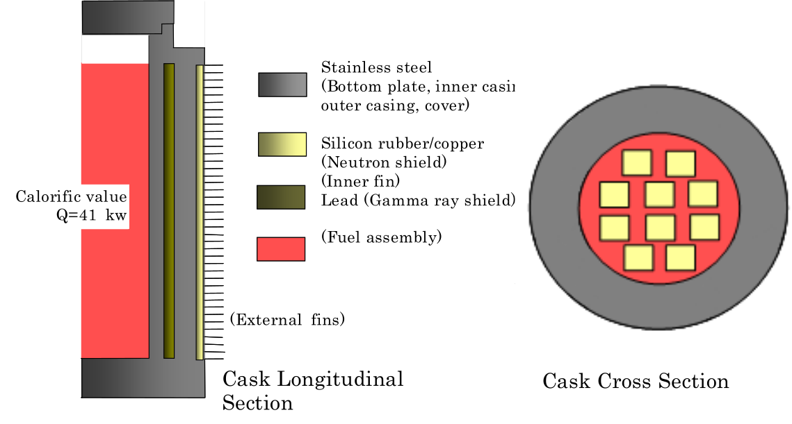
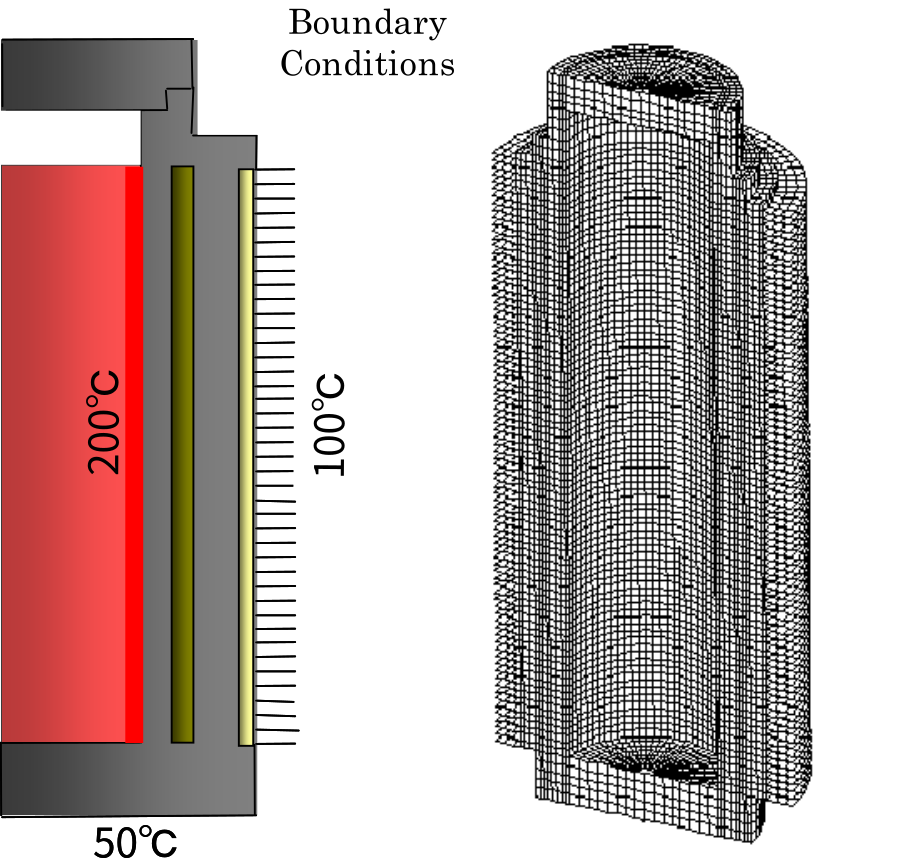
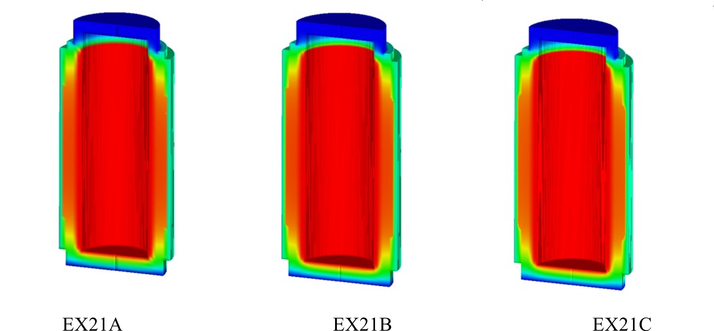
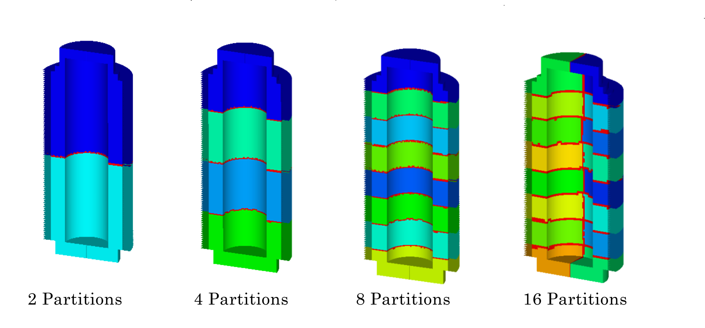
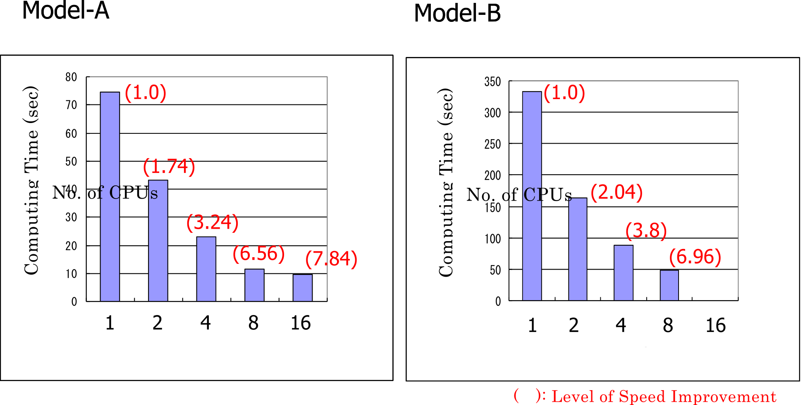

## Actual Model Examples for Heat Conduction Analysis

### Analysis model

The heat conduction analysis was performed with a used nuclear fuel transport container as an actual model. For this analysis, three verification examples were set, each with a model of different mesh roughness, as presented in Table 9.4.1. The shapes of the models are shown in Figs. 9.4.1–9.4.4. 

Table 9.4.1: Examples of actual verification models for heat conduction analysis

| Case ame | Element type | Verification model                    | Number of nodes | Freedom frequency |
|:---------|:-------------|:--------------------------------------|:----------------|:------------------|
| EX21A    | 361          | Used unclear fuel transport container | 88,938          | 79,920            |
| EX21B    | 361          |                                       | 309,941         | 289,800           |
| EX21C    | 361          |                                       | 1,205,765       | 1,159,200         |

{: .center width="350px"}

Fig. 9.4.1: Used nuclear fuel transport container

{: .center width="350px"}

Fig. 9.4.2: Dimensions of the used nuclear fuel transport container

{: .center width="350px"}

Fig. 9.4.3: Model’s schematic diagram

{: .center width="350px"}

Fig. 9.4.4: Model’s boundary conditions and mesh division diagram (EX21A)

### Analysis Results

Examples of analysis results are shown in Figs. 9.4.5–9.4.7.

{: .center width="512px"}

Fig. 9.4.5: Temperature distribution diagram

{: .center width="512px"}

Fig. 9.4.6: Distributed model diagram

{: .center width="512px"}

Fig. 9.4.7: Speed improvement degree because of dispersion treatment

