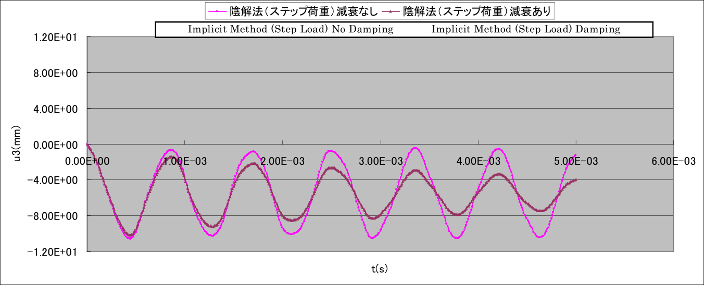

## Actual Model Examples for Linear Dynamic Analysis

### Analysis model

The linear dynamic analysis was performed with the machine parts shown in Fig. 9.5.1 as the actual models. For the analysis model, four cases were considered as verification examples with different load conditions and damping coefficients, as presented in Table 9.5.1.

Table 9.5.1: Verification Example of Actual Model for Linear Dynamic Analysis

| Case Name | Element Type | Verification Model | Loading Conditions | Damping Conditions | No. of Nodes | No. of Degrees of Freedom |
|:----------|:-------------|:-------------------|:-------------------|:-------------------|:-------------|:--------------------------|
| EX31A    | 342        | Mesh model     | Step load (F0)         | No     | 15,214 | 45,642 |
| EX31B    | 342        |                | Step load (F0)         | Yes    | 15,214 | 45,642 |
| EX31C    | 342        |                | Square wave pulse (F1) | No     | 15,214 | 45,642 |
| EX31D    | 342        |                | Square wave pulse (F1) | Yes    | 15,214 | 45,642 |

{.center width="512px"}

Fig. 9.5.1 : Mesh Model

### Analysis results

Examples of the analysis results are shown in Fig. 9.5.2 ~ Fig. 9.5.3.

{.center width="512px"}

(a) In the case of Step Load

{.center width="512px"}

(b) In the case of Square Wave Pulse Load

Fig. 9.5.2: Time history of vibration point displacement \(u_z\)

---

{.center width="350px"}

(a) t=5.0E-04(s)

{.center width="350px"}

(b) t=4.0E-03(s)

Fig. 9.5.3: Deformation diagram and equivalent stress distribution (deformation ratio of 5.0), EX31C

