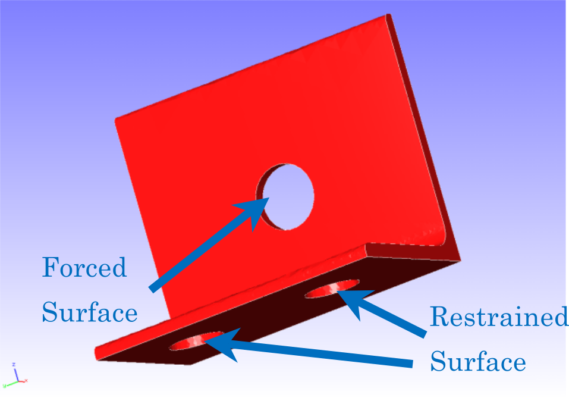
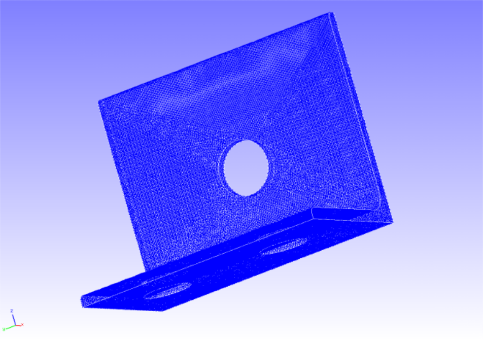
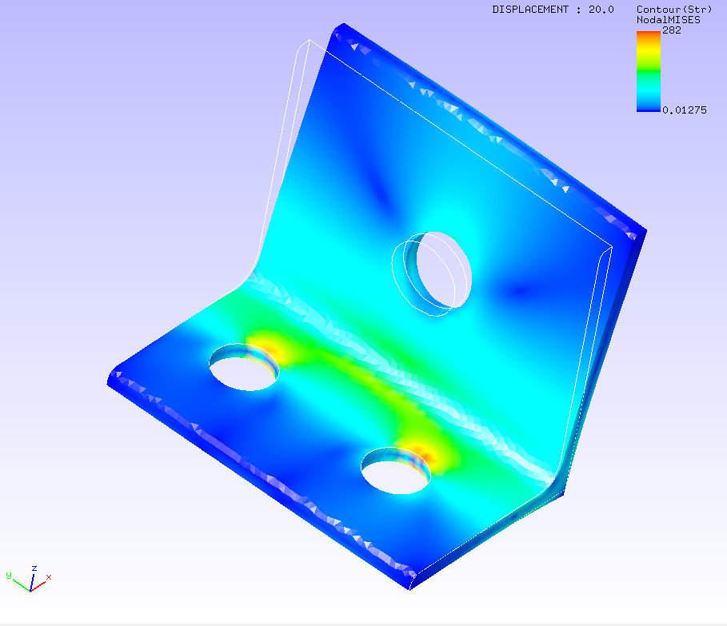

## Static Analysis (Elasticity)

This analysis uses the data of `tutorial/01_elastic_hinge`.

### Analysis target

The target of this analysis is a hinge part whose shape and mesh data are shown in Figs. 4.1.1 and 4.1.2, respectively. The mesh is a tetrahedral secondary element with 49871 elements and 84056 nodes.

<div style="text-align: center;">
<br>
Fig. 4.1.1 : Shape of the hinge part
</div>

<div style="text-align: center;">
<br>
Fig. 4.1.2 : Mesh data of the hinge part
</div>

### Analysis contents

In this stress analysis, the displacement of the constrained surface shown in Fig. 4.1.1 is restrained, and a concentrated load is applied to the forced surface. The analysis control data are presented below.

```
# Control File for FISTR
## Analysis Control
!VERSION
                  3
!SOLUTION, TYPE=STATIC
!WRITE,RESULT
!WRITE,VISUAL
## Solver Control
### Boundary Conditon
!BOUNDARY
  BND0, 1, 3, 0.000000
!BOUNDARY
  BND1, 1, 3, 0.000000
!CLOAD
  CL0, 1, 1.00000
### Material
!MATERIAL, NAME=STEEL
!ELASTIC
  210000.0, 0.3
!DENSITY
  7.85e-6
### Solver Setting
!SOLVER,METHOD=CG,PRECOND=1,ITERLOG=YES,TIMELOG=YES
  10000, 2
  1.0e-8, 1.0, 0.0
```

### Analysis results

The contour diagram of a Mises stress created with REVOCAP_PrePost is shown in Fig. 4.1.3. Furthermore, a part of the log files of the analysis results is shown below as numerical data of the analysis.

<div style="text-align: center;">
<br>
Fig. 4.1.3 : Analysis results of Mises stress
</div>

```
#### Result step=     1
 ##### Local Summary @Node    :Max/IdMax/Min/IdMin####
 //U1    3.9115E+00     82452 -7.1083E-02     65233
 //U2    7.4504E-03       354 -5.8813E-02       696
 //U3    5.9493E-02        84 -5.8751E-01     61080
 //E11   1.3777E-01       130 -1.3653E-01     77625
 //E22   4.9199E-02        61 -5.4370E-02       102
 //E33   6.8634E-02     51036 -6.1176E-02     30070
 //E12   7.1556E-02     27808 -6.8093E-02     27863
 //E23   5.3666E-02        56 -5.4347E-02        82
 //E31   7.2396E-02     36168 -9.6621E-02       130
 //S11   3.8626E+04       130 -3.6387E+04     28580
 //S22   1.6628E+04       130 -1.5743E+04     28580
 //S33   1.6502E+04     30033 -1.5643E+04     28580
 //S12   5.7795E+03     27808 -5.4998E+03     27863
 //S23   4.3345E+03        56 -4.3896E+03        82
 //S31   5.8474E+03     36168 -7.8040E+03       130
 //SMS   2.8195E+04     77625  1.2755E+00     75112
```

