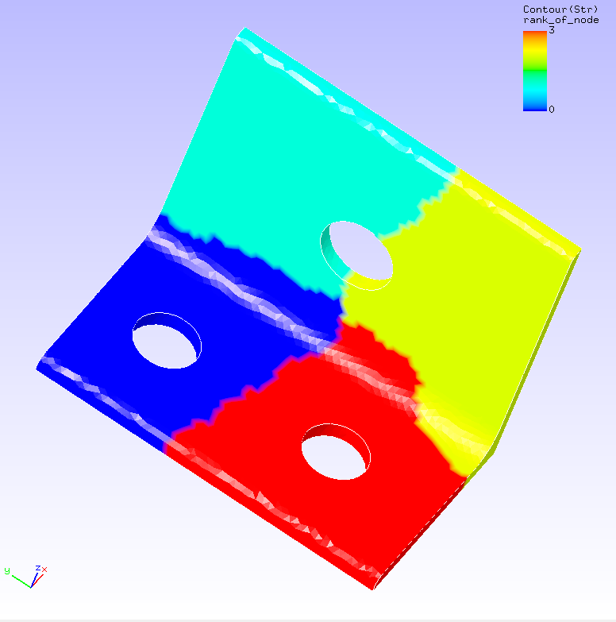
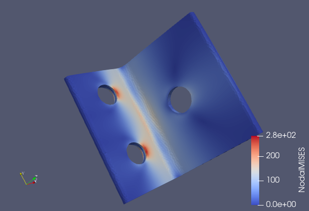

## Linear Static Analysis (Elasticity, Parallel)

To run 4 parallel static analysis(elasticity), and you can use the data in `tutorial/02_elastic_hinge_parallel`.

### Analysis target

 | Item                | Description                           | Notes                     | Reference   |
 |---------------------|---------------------------------------|---------------------------|-------------|
 | Type of analysis    | Linear static analysis                |!SOLUTION,TYPE=STATIC      |             |
 | Number of nodes     | 84,056                                |                           |             |
 | Number of elements  | 49,871                                |                           |             |
 | Element type        | 10-node tetrahedron quadratic element |!ELEMNT,TYPE=342           |[Element Library](../analysis/analysis_02.html#element-library) |
 | Material name       | STEEL                                 |!MATERIAL,NAME=STEEL       |[Material Data](../analysis/analysis_02.html#material-data)|
 | Material property   | ELASTIC                               |!ELASTIC                   |             |
 | Boundary conditions | Restraint, Concentrated force         |                           |             |
 | Matrix solution     | CG/SSOR                               |!SOLVER,METHOD=CG,PRECOND=1|             |

{.center width="350px"}

<div style="text-align: center;"> 
Fig. 4.2.1 : Analysis area of each node
</div>

### Analysis

Extract the code FrontISTR code and go to the directory in this example to check if you have the files necessary for analysis.

 | File name             | Type                  | Role |
 |-----------------------|-----------------------|------|
 | `hecmw_ctrl.dat`      | Global control data   |      |
 | `hinge.cnt`           | Analysis control data |      |
 | `hinge.msh`           | Mesh data             |      |
 | `hecmw_part_ctrl.dat` | Domain segmentation control data | Control data to divide the mesh data into regions by `hecmw_part1` |

``` 
$ tar xvf FrontISTR.tar.gz
$ cd FrontISTR/tutorial/02_elastic_hinge_parallel
$ ls
hecmw_ctrl.dat  hecmw_part_ctrl.dat  hinge.cnt  hinge.msh
``` 

A stress analysis is performed to constrain the displacement of the constrained surface and add concentrated loads to the forced surface.

The overall control data, analysis control data and domain division control data are shown below.

#### Global control data `hecmw_ctrl.dat`

```
#
# for partitioner
#
!MESH, NAME=part_in,TYPE=HECMW-ENTIRE # The original mesh data to be split in hecmw_part1
 hinge.msh
!MESH, NAME=part_out,TYPE=HECMW-DIST  # File name after splitting by hecmw_part1
 hinge_4
#
# for solver
#
!MESH, NAME=fstrMSH, TYPE=HECMW-DIST  # Specify the mesh data to be split
 hinge_4
!CONTROL, NAME=fstrCNT                # Specify analysis control data
 hinge.cnt
!RESULT, NAME=fstrRES, IO=OUT         # Specify the result data
 hinge.res
!RESULT, NAME=vis_out, IO=OUT         # Specify the visualization data
 hinge_vis
```

#### Analysis control data `hinge.cnt`

```
#  Control File for FISTR
## Analysis Control
!VERSION                   # Specify the version of the file format
 3
!SOLUTION, TYPE=STATIC     # Specify the type of analysis
!WRITE,RESULT              # Specification of the result data output
!WRITE,VISUAL              # Specify the output of visualization data
## Solver Control
### Boundary Conditon
!BOUNDARY
 BND0, 1, 3, 0.000000      # Restrained surface 1
!BOUNDARY
 BND1, 1, 3, 0.000000      # Restrained surface 2
!CLOAD
 CL0, 1, 0.01000           # Specify a forced surface
### Material
!MATERIAL, NAME=STEEL      # Specify material properties
!ELASTIC                   # Definition of elastic substances
 210000.0, 0.3
!DENSITY                   # Definition of mass density
 7.85e-6
### Solver Setting
!SOLVER,METHOD=CG,PRECOND=1,ITERLOG=YES,TIMELOG=YES  # Solver control
 10000, 2
 1.0e-08, 1.0, 0.0
## Post Control
!VISUAL,metod=PSR          # Specify the visualization methods
!surface_num=1             # Number of surfaces in a surface rendering
!surface 1                 # Specify the contents of the surface
!output_type=VTK           # Specify the type of the visualization file
!END                       # Indicates the end of the analysis control data
```

#### Domain division control data `hecmw_part_ctrl.dat`

```
!PARTITION,TYPE=NODE-BASED,METHOD=PMETIS,DOMAIN=4,UCD=part.inp
```

#### Analysis procedure

In order to run FrontISTR at MPI, the mesh data `hinge.msh` is first divied into four regions.

```
$ hecmw_part1
Oct 07 11:04:52 Info: Reading mesh file...
Oct 07 11:04:52 Info: Starting domain decomposition...
Oct 07 11:04:52 TH(0/8) Info: Creating local mesh for domain #0 ...
Oct 07 11:04:52 TH(2/8) Info: Creating local mesh for domain #1 ...
Oct 07 11:04:52 TH(6/8) Info: Creating local mesh for domain #2 ...
Oct 07 11:04:52 TH(7/8) Info: Creating local mesh for domain #3 ...
Oct 07 11:04:52 Info: Domain decomposition done
```

New files called hinge_4.x and part.inp will be generated.

```
$ ls
hecmw_ctrl.dat  hecmw_part_ctrl.dat  hinge.msh  hinge_4.1  hinge_4.3
hecmw_part.log  hinge.cnt            hinge_4.0  hinge_4.2  part.inp
```

Next, you will execute the FrontISTR command `fistr1` with MPI.

```
$ mpirun -np 4 fistr1 -t 1
(MPI 4 parallel, 1 OpenMP thread)
```

```
##################################################################
#                         FrontISTR                              #
##################################################################
---
version:    5.1.0
git_hash:   acab000c8c633b7b9d596424769e14363f720841
build:
  date:     2020-10-05T07:39:55Z
  MPI:      enabled
  OpenMP:   enabled
  option:   "-p --with-tools --with-refiner --with-metis --with-mumps --with-lapack --with-ml --with-mkl "
  HECMW_METIS_VER: 5
execute:
  date:       2020-10-07T11:07:21+0900
  processes:  4
  threads:    1
  cores:      4
  host:
    0: flow-p06
    1: flow-p06
    2: flow-p06
    3: flow-p06
---
...
 Step control not defined! Using default step=1
 fstr_setup: OK
 Start visualize PSF 1 at timestep 0

 loading step=    1
 sub_step= 1,   current_time=  0.0000E+00, time_inc=  0.1000E+01
 loading_factor=    0.0000000   1.0000000
### 3x3 BLOCK CG, SSOR, 2
      1    2.183567E+00
      2    2.423900E+00
      3    2.939117E+00
...
   2084    1.158654E-08
   2085    1.032414E-08
   2086    9.436273E-09
### Relative residual = 9.43589E-09

### summary of linear solver
      2086 iterations      9.435886E-09
    set-up time      :     4.695220E-02
    solver time      :     7.103976E+01
    solver/comm time :     1.929294E+01
    solver/matvec    :     1.544405E+01
    solver/precond   :     3.243278E+01
    solver/1 iter    :     3.405549E-02
    work ratio (%)   :     7.284205E+01

 Start visualize PSF 1 at timestep 1
### FSTR_SOLVE_NLGEOM FINISHED!

 ====================================
    TOTAL TIME (sec) :     72.42
           pre (sec) :      0.29
         solve (sec) :     72.13
 ====================================
 FrontISTR Completed !!
```

The analysis is completed when `FrontISTR Completed!!` is displayed, the analysis is done.

### Analysis Results

Once the analysis is complete, several new files will be created.

```
$ ls
0.log       FSTR.dbg.3           hinge.cnt      hinge.res.2.1  hinge_vis_psf.0000
1.log       FSTR.msg             hinge.msh      hinge.res.3.0  hinge_vis_psf.0000.pvtu
2.log       FSTR.sta             hinge.res.0.0  hinge.res.3.1  hinge_vis_psf.0001
3.log       hecmw_ctrl.dat       hinge.res.0.1  hinge_4.0      hinge_vis_psf.0001.pvtu
FSTR.dbg.0  hecmw_part.log       hinge.res.1.0  hinge_4.1      part.inp
FSTR.dbg.1  hecmw_part_ctrl.dat  hinge.res.1.1  hinge_4.2
FSTR.dbg.2  hecmw_vis.ini        hinge.res.2.0  hinge_4.3
```

The `*.res.*` is the result data, which contains results of analysis of each MPI node of FrontISTR.

The `*_vis_*` is called visualization data, and can be displayed by general-purpose visualization software. In this example, the data is output in VTK format and can be displayed using ParaView or other visualization software.


{.center width="350px"}
<div style="text-align: center;">
Fig. 4.2.2 Analytical results for Mises stress(displayed in VTK)
</div>

#### Log file `0.log`

<div style="height: 400px; overflow-y: scroll;">
```
 fstr_setup: OK
#### Result step=     0
 ##### Local Summary @Node    :Max/IdMax/Min/IdMin####
 //U1    0.0000E+00         1  0.0000E+00         1
 //U2    0.0000E+00         1  0.0000E+00         1
 //U3    0.0000E+00         1  0.0000E+00         1
 //E11   0.0000E+00         1  0.0000E+00         1
 //E22   0.0000E+00         1  0.0000E+00         1
 //E33   0.0000E+00         1  0.0000E+00         1
 //E12   0.0000E+00         1  0.0000E+00         1
 //E23   0.0000E+00         1  0.0000E+00         1
 //E31   0.0000E+00         1  0.0000E+00         1
 //S11   0.0000E+00         1  0.0000E+00         1
 //S22   0.0000E+00         1  0.0000E+00         1
 //S33   0.0000E+00         1  0.0000E+00         1
 //S12   0.0000E+00         1  0.0000E+00         1
 //S23   0.0000E+00         1  0.0000E+00         1
 //S31   0.0000E+00         1  0.0000E+00         1
 //SMS   0.0000E+00         1  0.0000E+00         1
 ##### Local Summary @Element :Max/IdMax/Min/IdMin####
 //E11   0.0000E+00         1  0.0000E+00         1
 //E22   0.0000E+00         1  0.0000E+00         1
 //E33   0.0000E+00         1  0.0000E+00         1
 //E12   0.0000E+00         1  0.0000E+00         1
 //E23   0.0000E+00         1  0.0000E+00         1
 //E31   0.0000E+00         1  0.0000E+00         1
 //S11   0.0000E+00         1  0.0000E+00         1
 //S22   0.0000E+00         1  0.0000E+00         1
 //S33   0.0000E+00         1  0.0000E+00         1
 //S12   0.0000E+00         1  0.0000E+00         1
 //S23   0.0000E+00         1  0.0000E+00         1
 //S31   0.0000E+00         1  0.0000E+00         1
 //SMS   0.0000E+00         1  0.0000E+00         1
 ##### Global Summary @Node    :Max/IdMax/Min/IdMin####
 //U1    0.0000E+00        14  0.0000E+00        14
 //U2    0.0000E+00        14  0.0000E+00        14
 //U3    0.0000E+00        14  0.0000E+00        14
 //E11   0.0000E+00        14  0.0000E+00        14
 //E22   0.0000E+00        14  0.0000E+00        14
 //E33   0.0000E+00        14  0.0000E+00        14
 //E12   0.0000E+00        14  0.0000E+00        14
 //E23   0.0000E+00        14  0.0000E+00        14
 //E31   0.0000E+00        14  0.0000E+00        14
 //S11   0.0000E+00        14  0.0000E+00        14
 //S22   0.0000E+00        14  0.0000E+00        14
 //S33   0.0000E+00        14  0.0000E+00        14
 //S12   0.0000E+00        14  0.0000E+00        14
 //S23   0.0000E+00        14  0.0000E+00        14
 //S31   0.0000E+00        14  0.0000E+00        14
 //SMS   0.0000E+00        14  0.0000E+00        14
 ##### Global Summary @Element :Max/IdMax/Min/IdMin####
 //E11   0.0000E+00        14  0.0000E+00        14
 //E22   0.0000E+00        14  0.0000E+00        14
 //E33   0.0000E+00        14  0.0000E+00        14
 //E12   0.0000E+00        14  0.0000E+00        14
 //E23   0.0000E+00        14  0.0000E+00        14
 //E31   0.0000E+00        14  0.0000E+00        14
 //S11   0.0000E+00        14  0.0000E+00        14
 //S22   0.0000E+00        14  0.0000E+00        14
 //S33   0.0000E+00        14  0.0000E+00        14
 //S12   0.0000E+00        14  0.0000E+00        14
 //S23   0.0000E+00        14  0.0000E+00        14
 //S31   0.0000E+00        14  0.0000E+00        14
 //SMS   0.0000E+00        14  0.0000E+00        14
#### Result step=     1
 ##### Local Summary @Node    :Max/IdMax/Min/IdMin####
 //U1    7.4906E-03     50978 -6.9368E-04     51989
 //U2    6.1150E-05      2426 -1.2781E-04     40202
 //U3    1.8720E-04      2712 -5.5024E-03     67858
 //E11   1.3024E-03     28591 -1.2844E-03     28580
 //E22   2.1102E-04     24593 -2.0594E-04       205
 //E33   6.8634E-04     51036 -5.9603E-04     67794
 //E12   5.2186E-04       209 -5.4559E-04     28641
 //E23   2.5417E-04     28521 -3.2956E-04       187
 //E31   7.2396E-04     36168 -9.5847E-04     28591
 //S11   3.6844E+02     28591 -3.6387E+02     28580
 //S22   1.5841E+02     28591 -1.5743E+02     28580
 //S33   1.5959E+02     51036 -1.5643E+02     28580
 //S12   4.2150E+01       209 -4.4067E+01     28641
 //S23   2.0529E+01     28521 -2.6618E+01       187
 //S31   5.8474E+01     36168 -7.7415E+01     28591
 //SMS   2.5134E+02     28591  3.5157E-02     12726
 ##### Local Summary @Element :Max/IdMax/Min/IdMin####
 //E11   1.0115E-03      9959 -9.7870E-04      9942
 //E22   1.5457E-04     13694 -1.4639E-04      7189
 //E33   5.9415E-04     44563 -5.0497E-04     47965
 //E12   3.5513E-04      9579 -3.9083E-04      9600
 //E23   2.0608E-04      9563 -2.3480E-04      9589
 //E31   5.7633E-04     43142 -4.8019E-04      9571
 //S11   2.6038E+02      9573 -2.5605E+02      9571
 //S22   1.0144E+02      9573 -1.0100E+02      9571
 //S33   1.3921E+02     44569 -1.1431E+02     47974
 //S12   2.8683E+01      9579 -3.1567E+01      9600
 //S23   1.6645E+01      9563 -1.8964E+01      9589
 //S31   4.6550E+01     43142 -3.8785E+01      9571
 //SMS   2.0350E+02      9959  3.4602E-02        28
 ##### Global Summary @Node    :Max/IdMax/Min/IdMin####
 //U1    3.9115E-02     82452 -7.1083E-04     65233
 //U2    7.4504E-05       354 -5.8813E-04       696
 //U3    5.9493E-04        84 -5.8751E-03     61080
 //E11   1.3777E-03       130 -1.3653E-03     77625
 //E22   4.9199E-04        61 -5.4370E-04       102
 //E33   6.8634E-04     51036 -6.1176E-04     30070
 //E12   7.1556E-04     27808 -6.8093E-04     27863
 //E23   5.3666E-04        56 -5.4347E-04        82
 //E31   7.2396E-04     36168 -9.6621E-04       130
 //S11   3.8626E+02       130 -3.6387E+02     28580
 //S22   1.6628E+02       130 -1.5743E+02     28580
 //S33   1.6502E+02     30033 -1.5643E+02     28580
 //S12   5.7795E+01     27808 -5.4998E+01     27863
 //S23   4.3345E+01        56 -4.3896E+01        82
 //S31   5.8474E+01     36168 -7.8040E+01       130
 //SMS   2.8195E+02     77625  1.2755E-02     75112
 ##### Global Summary @Element :Max/IdMax/Min/IdMin####
 //E11   1.0731E-03     10485 -1.2123E-03     41779
 //E22   3.9143E-04     33536 -4.1389E-04     22892
 //E33   5.9415E-04     44563 -5.0497E-04     47965
 //E12   5.3264E-04      9163 -5.0405E-04      9161
 //E23   3.9226E-04     33024 -4.1464E-04     23465
 //E31   5.7633E-04     43142 -4.8019E-04      9571
 //S11   2.7231E+02      9180 -2.9763E+02     41779
 //S22   1.0792E+02      9180 -1.0656E+02     41779
 //S33   1.3921E+02     44569 -1.1431E+02     47974
 //S12   4.3021E+01      9163 -4.0712E+01      9161
 //S23   3.1683E+01     33024 -3.3490E+01     23465
 //S31   4.6550E+01     43142 -3.8785E+01      9571
 //SMS   2.4057E+02     41779  3.1383E-02     38687
```
 </div>