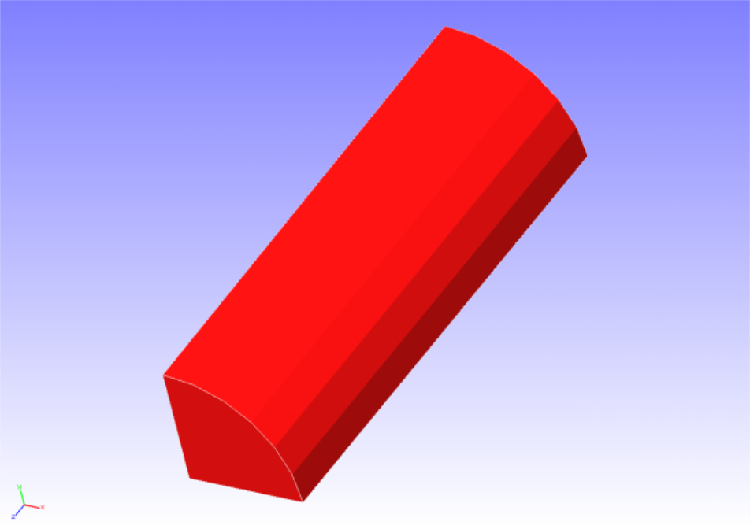
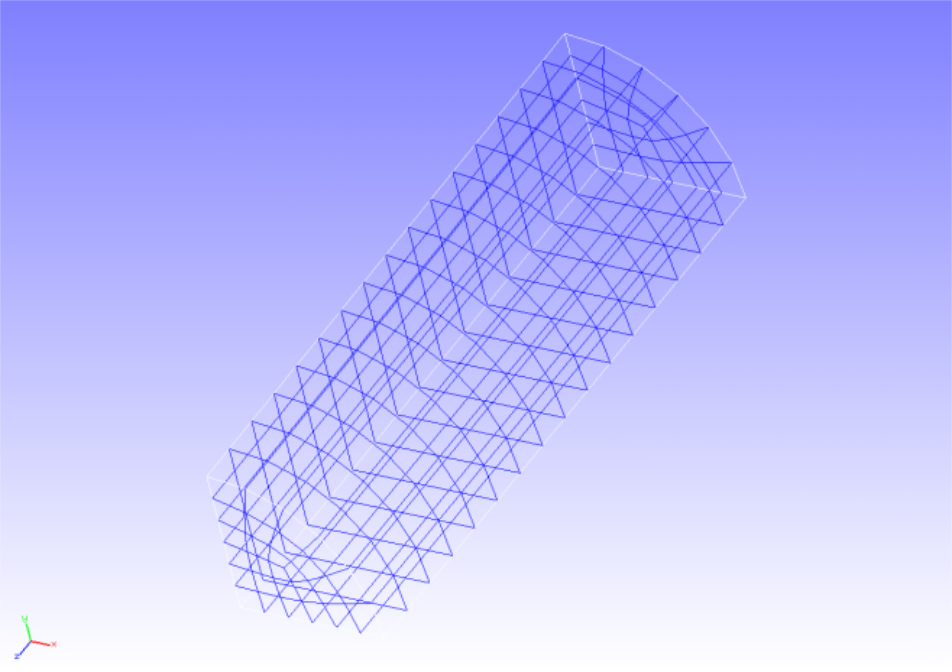
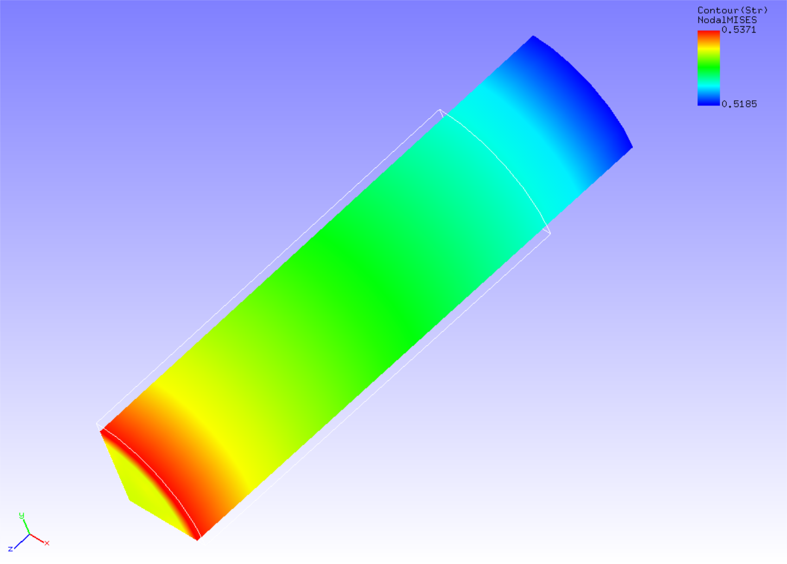

## Non-Linear Static Analysis (Hyperelasticity, Part 1)

This analysis uses the data of `tutorial/03_hyperelastic_cylinder`.

### Analysis target

The analysis target is a 1/8th model of a round bar. The geometry is shown in Figure 4.3.1 and the mesh data is shown in Figure 4.3.2.

 | Item             | Description                                | Remarks                   | Reference |
 |------------------|--------------------------------------------|---------------------------|-----------|
 |Type of analysis  |Non-linear static analysis (hyperelasticity)|!SOLUTION,TYPE=NLSTATIC    |           |
 |Number of nodes   |629                                         |                           |           |
 |Number of elements|432                                         |                           |           |
 |Element type      |Eight node hexahedral element               |!ELEMENT,TYPE=361          |           |
 |Material name     |MAT1                                        |!MATERIAL,NAME=MAT1        |           |
 |Material property |ELASTIC                                     |!ELASTIC                   |           |
 |Boundary condition|Restraint, Forced displacement              |                           |           |
 |Matrix solver     |CG/SSOR                                     |!SOLVER,METHOD=CG,PRECOND=1|           |

{.center width="350px"}
<div style="text-align: center;">
Fig. 4.3.1 : Shape of the round bar (1/8 model)
</div>

{.center width="350px"}
<div style="text-align: center;">
Fig. 4.3.2: Shape of the round bar (1/8 model)
</div>

### Analysis content

In this stress analysis, an axial tensile displacement is given to a round bar. The Mooney–Rivlin model was used in the material constitutive equation of hyperelasticity. The analysis control data are presented below.

#### Analysis control data `cylinder.cnt`

```
#  Control File for FISTR
## Analysis Control
!VERSION
 3
!SOLUTION, TYPE=NLSTATIC
!WRITE,RESULT
!WRITE,VISUAL
## Solver Control
### Boundary Conditon
!BOUNDARY, GRPID=1
 LOADS, 3, 3, -7.0
 FIX,   3, 3, 0.0
 XSYMM, 1, 1, 0.0
 YSYMM, 2, 2, 0.0
### STEP
!STEP, SUBSTEPS=5, CONVERG=1.0e-5
 BOUNDARY, 1
### Material
!MATERIAL, NAME=MAT1
!HYPERELASTIC, TYPE=MOONEY-RIVLIN
 0.1486, 0.4849, 0.0789
### Solver Setting
!SOLVER,METHOD=CG,PRECOND=1,ITERLOG=YES,TIMELOG=YES
 10000, 1
 1.0e-8, 1.0, 0.0
## Post Control
!VISUAL,metod=PSR
!surface_num=1
!surface 1
!output_type=VTK
!END
```

### Analysis results

The results of the fifth substep are shown in Figure 4.3.3. A deformation diagram with Mises stress contours is created by REVOCAP_PrePost. A part of the analysis results log file is shown below as numerical data for the analysis results.

{.center width="350px"}
<div style="text-align: center;">
Fig. 4.3.3: Analysis results of deformation and Mises stress
</div>

```
 fstr_setup: OK
#### Result step=     0
 ##### Local Summary @Node    :Max/IdMax/Min/IdMin####
 //U1    0.0000E+00         1  0.0000E+00         1
 //U2    0.0000E+00         1  0.0000E+00         1
 //U3    0.0000E+00         1  0.0000E+00         1
 //E11   0.0000E+00         1  0.0000E+00         1
 //E22   0.0000E+00         1  0.0000E+00         1
 //E33   0.0000E+00         1  0.0000E+00         1
 //E12   0.0000E+00         1  0.0000E+00         1
 //E23   0.0000E+00         1  0.0000E+00         1
 //E31   0.0000E+00         1  0.0000E+00         1
 //S11   0.0000E+00         1  0.0000E+00         1
 //S22   0.0000E+00         1  0.0000E+00         1
 //S33   0.0000E+00         1  0.0000E+00         1
 //S12   0.0000E+00         1  0.0000E+00         1
 //S23   0.0000E+00         1  0.0000E+00         1
 //S31   0.0000E+00         1  0.0000E+00         1
 //SMS   0.0000E+00         1  0.0000E+00         1
 ##### Local Summary @Element :Max/IdMax/Min/IdMin####
 //E11   0.0000E+00         1  0.0000E+00         1
 //E22   0.0000E+00         1  0.0000E+00         1
```


