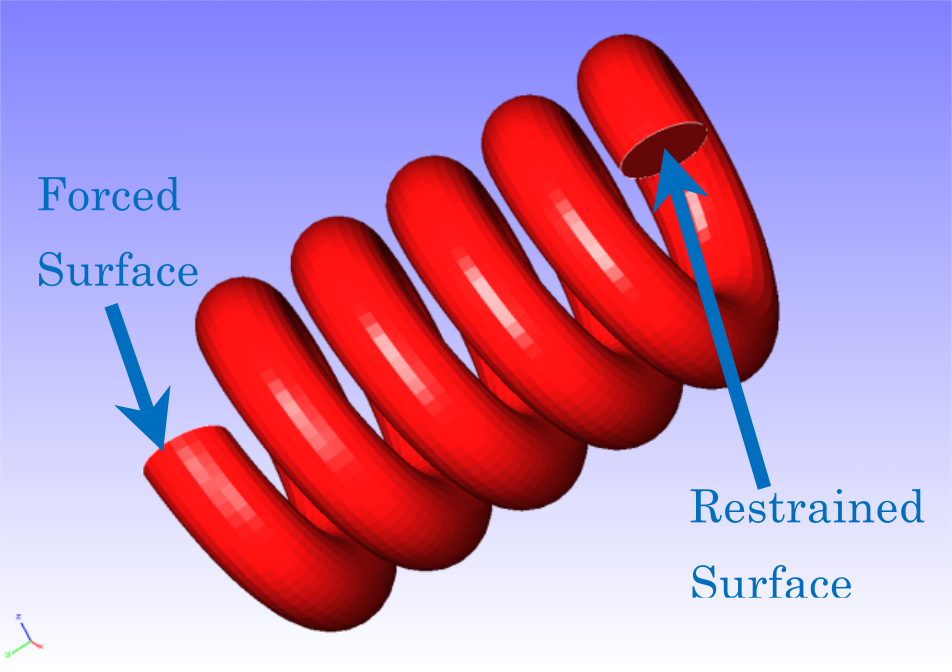
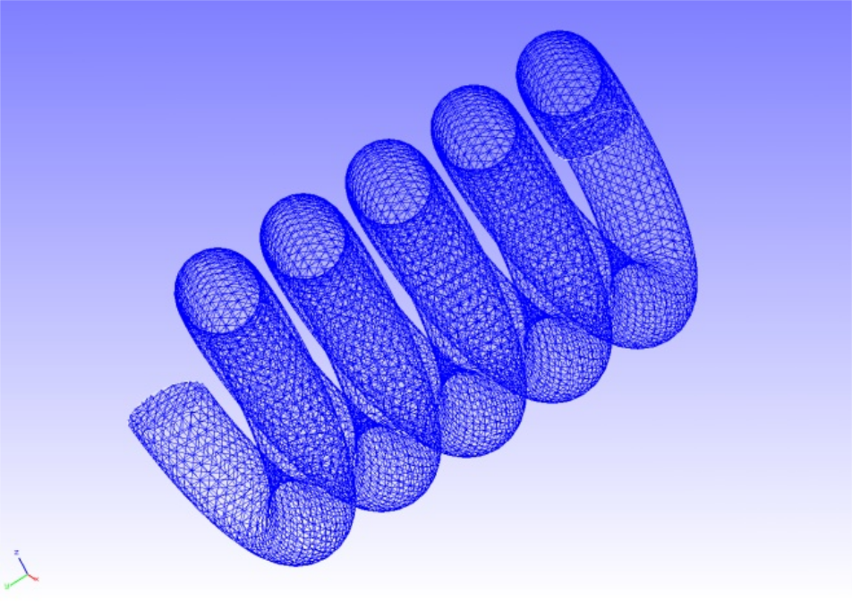
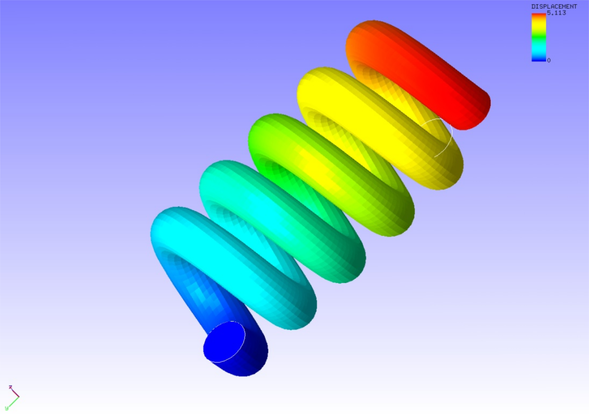

## Static Analysis (Hyperelasticity Part 2)

Data of `tutorial/04_hyperelastic_spring/` is used to implement this analysis.

### Analysis Object

A spring is the object of the analysis. The shape is shown in Figure 4.4.1, and the mesh data is shown in Figure 4.4.2. Quadratic tetrahedral elements are used for the mesh, and the scale of the mesh consists of 46,454 elements and 78,771 nodes.

<div style="text-align: center;">
<br>
Figure 4.4.1: Shape of Spring
</div>

<div style="text-align: center;">
<br>
Figure 4.4.2: Mesh Data of Spring
</div>

### Analysis Content

A stress analysis is implemented, where the displacement of the restrained surface shown in Figure 4.4.1 is restrained, and a displacement is applied to the forced surface. The Arruda-Boyce model is used for the constitutive equation of the material of the hyperelasticity. The analysis control data is shown in the following.

```
# Control File for FISTR
## Analysis Control
!VERSION
  3
!SOLUTION, TYPE=NLSTATIC
!WRITE,RESULT
!WRITE,VISUAL
## Solver Control
### Boundary Conditon
!BOUNDARY, GRPID=1
  LOADS, 2, 2, -5.0
  FIX, 1, 3, 0.0
### STEP
!STEP, SUBSTEPS=1, CONVERG=1.0e-5
  BOUNDARY, 1
### Material
!MATERIAL, NAME=MAT1
!HYPERELASTIC, TYPE=ARRUDA-BOYCE
  0.71, 1.7029, 0.1408
### Solver Setting
!SOLVER,METHOD=CG,PRECOND=1,ITERLOG=YES,TIMELOG=YES
  10000, 2
  1.0e-8, 1.0, 0.0
```

### Analysis Results

A deformed figure applied with a displacement contour was created by REVOCAP\_PrePost, and is shown in Figure 4.4.3. Moreover, a portion of the analysis results log file is shown in the following as numeric data of the analysis results.

<div style="text-align: center;">
<br>
Figure 4.4.3: Analysis Results of Deformation and Displacement
</div>

```
#### Result step= 1
 ##### Local Summary :Max/IdMax/Min/IdMin####
   //U1   2.8588E-01     42179 -2.6512E-01     22274
   //U2   2.2657E-02      6381 -5.0291E+00     22825
   //U3   7.4573E-02      7058 -9.5095E-01     48324
   //E11  4.8291E-03      2851 -4.2788E-03      3429
   //E22  2.4161E-03     55960 -1.4539E-03     44761
   //E33  5.3256E-03     25260 -4.6858E-03     27938
   //E12  1.3574E-02     56003 -1.3081E-02     45120
   //E23  2.8679E-02     48353 -1.8970E-02     48322
   //E13  1.0897E-02     47938 -9.1054E-03     27344
   //S11  5.1605E-02      2814 -5.0895E-03     10408
   //S22  5.0635E-02     55965 -3.6174E-03     45307
   //S33  4.9662E-02     39836 -5.1017E-03      4949
   //S12  1.2059E-02     56003 -1.1865E-02     45120
   //S23  2.6123E-02     48353 -1.7281E-02     56868
   //S13  1.0133E-02     47938 -8.2330E-03     27344
   //SMS  4.9365E-02     48353 3.2148E-04      64553
```

