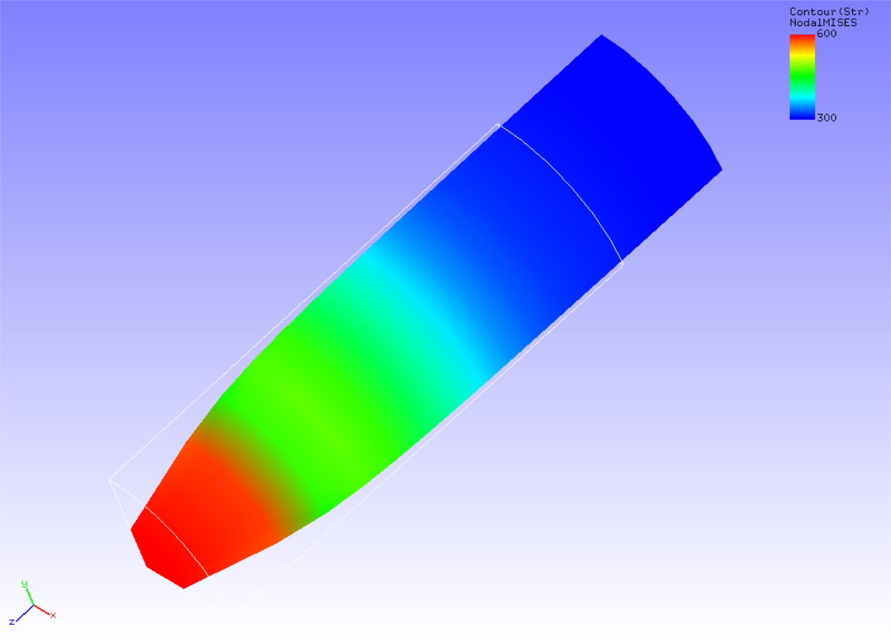

## Static Analysis (Elastoplastic, Part 1)

This analysis uses the data of `tutorial/05_plastic_cylinder`.

### Analysis target

The target of this analysis is the same 1/8 model of a round bar used in Section 4.3, Static Analysis (Hyperelasticity, Part 1).

### Analysis content

The necking phenomenon of round bars caused by plastic deformation is analyzed. The Mises model was used as the yield function. The analysis control data are presented below.

```
# Control File for FISTR
## Analysis Control
!VERSION
  3
!SOLUTION, TYPE=NLSTATIC
!WRITE,RESULT,FREQUENCY=10
!WRITE,VISUAL,FREQUENCY=10
## Solver Control
### Boundary Conditon
!BOUNDARY, GRPID=1
  LOADS, 3, 3, -7.0
  FIX, 3, 3, 0.0
  XSYMM, 1, 1, 0.0
  YSYMM, 2, 2, 0.0
### STEP
!STEP, SUBSTEPS=40, CONVERG=4.6e-3
  BOUNDARY, 1
### Material
!MATERIAL, NAME=MAT1
!ELASTIC
  206900.0, 0.29
!PLASTIC, YIELD=MISES, HARDEN=MULTILINEAR
  450.0, 0.0
  608.0, 0.05
  679.0, 0.1
  732.0, 0.2
  752.0, 0.3
  766.0, 0.4
  780.0, 0.5
### Output
!OUTPUT_VIS
  NSTRAIN, ON
!OUTPUT_RES
  ISTRESS, ON
### Solver Setting
!SOLVER,METHOD=CG,PRECOND=1,ITERLOG=NO,TIMELOG=YES
  2000, 2
  1.0e-8, 1.0, 0.0
```

### Analysis results

The analysis results of the 35<sup>th</sup> sub-step are shown in Fig. 4.5.1 as a deformation diagram with a Mises stress contour created with REVOCAP\_PrePost. Furthermore, a part of the log files of the analysis results is shown below as numerical data of the analysis.

<div style="text-align: center;">
<br>
Fig. 4.5.1: Analysis results of deformation and Mises stress
</div>

```
#### Result step=    40
 ##### Local Summary @Node    :Max/IdMax/Min/IdMin####
 //U1    0.0000E+00         1 -7.2695E-01         7
 //U2    0.0000E+00         1 -7.2695E-01        13
 //U3    0.0000E+00         1 -7.0000E+00        38
 //E11  -1.0810E-01        38 -1.2378E-01         7
 //E22  -1.0810E-01        50 -1.2378E-01        13
 //E33   2.4788E-01        13  2.1876E-01        38
 //E12   9.9178E-04        53 -1.1026E-03        10
 //E23   8.1094E-08        38 -3.4137E-03        86
 //E31   8.1094E-08        50 -3.4137E-03        93
 //S11   1.0846E+01         1 -1.2094E+01        44
 //S22   1.0846E+01         1 -1.2094E+01        44
 //S33   7.5130E+02         1  7.2331E+02        44
 //S12   1.3859E+00       148 -2.0846E+00       136
 //S23   1.7004E+00       100 -5.6058E+00        80
 //S31   1.7004E+00        79 -5.6058E+00        99
 //SMS   7.4086E+02        13  7.3505E+02        38
```
