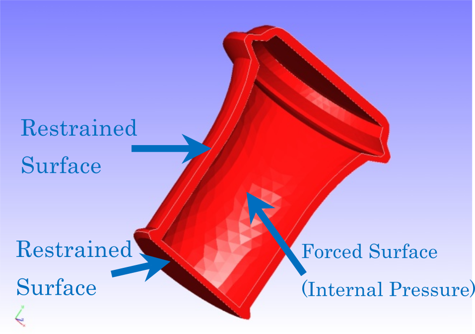

## Static Analysis (Elastoplastic, Part 2)

This analysis uses the data of `tutorial/06_plastic_can`.

### Analysis target

The target of this analysis is a 1/2 model of a container whose shape and mesh data are shown in Figs. 4.6.1 and 4.6.2, respectively. The mesh is a tetrahedral secondary element with 7236 elements and 14119 nodes.

{.center width="350px"}
<div style="text-align: center;">
Fig. 4.6.1: Shape of the container
</div>

{.center width="350px"}
<div style="text-align: center;">
Fig. 4.6.2: Mesh data of the container
</div>

### Analysis content

In this stress analysis, the displacement of the constrained surface shown in Fig. 4.6.1 is restrained, and a concentrated load is applied to the internal part of the container (the forced surface). The Drucker–Prager model is used as the yield function. The analysis control data are presented below.

```
# Control File for FISTR
## Analysis Control
!VERSION
  3
!SOLUTION, TYPE=NLSTATIC
## Solver Control
### Boundary Conditon
!BOUNDARY, GRPID=1
  BND0, 3, 3, 0.000000
!BOUNDARY, GRPID=1
  BND1, 1, 1, 0.000000
  BND1, 2, 2, 0.000000
  BND1, 3, 3, 0.000000
!DLOAD,GRPID=1
  DL0, S, 1.0
!DLOAD,GRPID=1
  DL1, S, 1.0
!DLOAD,GRPID=1
  DL2, S, 0.5
### STEP
!STEP, SUBSTEPS=10, CONVERG=1.0e-5
  BOUNDARY, 1
  LOAD, 1
### Material
!MATERIAL, NAME=M1
!ELASTIC
  24000.0, 0.2
!PLASTIC, YIELD = DRUCKER-PRAGER
  500.0, 20.0, 0.0
### Solver Setting
!SOLVER,METHOD=CG,PRECOND=1,ITERLOG=NO,TIMELOG=YES
  20000, 2
  1.0e-8, 1.0, 0.0
```

### Analysis results

The analysis results of the 10<sup>th</sup> sub-step are shown in Fig. 4.6.3 as a deformation diagram with a Mises stress contour created with REVOCAP\_PrePost. The deformation magnification was set to 30. Furthermore, a part of the log files of the analysis results is shown below as numerical data of the analysis.

{.center width="350px"}
<div style="text-align: center;">
Fig. 4.6.3: Analysis results of deformation and Mises stress
</div>

```
#### Result step=    10
 ##### Local Summary @Node    :Max/IdMax/Min/IdMin####
 //U1    1.6169E+00      1600 -1.6123E+00     11901
 //U2    1.9278E+01      6877 -4.5292E-01      7096
 //U3    1.6086E+00      7016 -1.5103E+00      6934
 //E11   9.9223E-04     11242 -6.5878E-04      1404
 //E22   1.5016E-03     13972 -5.4206E-04      2367
 //E33   9.8440E-04      6833 -6.4767E-04      7000
 //E12   1.6817E-03      2698 -1.7171E-03     11906
 //E23   1.7077E-03      6749 -1.4466E-03     13509
 //E31   1.2095E-03     12475 -1.1185E-03     11342
 //S11   2.7784E+01      1086 -1.9437E+01      2363
 //S22   3.7880E+01     13972 -1.4554E+01      2367
 //S33   2.7338E+01      1086 -1.9739E+01     13082
 //S12   1.6819E+01      2698 -1.7172E+01     11906
 //S23   1.7079E+01      6749 -1.4466E+01     13509
 //S31   1.2089E+01     12475 -1.1180E+01     11342
 //SMS   3.7455E+01      2834  2.7593E-04      7333
```


