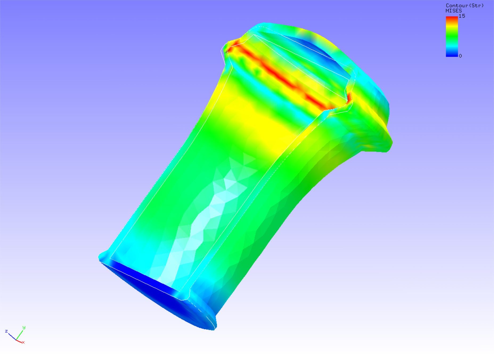

## Non-linear Static Analysis (Elastoplastic, Part 2)

This analysis uses the data of `tutorial/06_plastic_can`.

### Analysis target

The target of this analysis is a 1/2 model of a container whose shape and mesh data are shown in Figs. 4.6.1 and 4.6.2, respectively. The mesh is a tetrahedral secondary element with 7236 elements and 14119 nodes.

 | Item              | Description                          | Notes                                | Reference |
 |-------------------|--------------------------------------|--------------------------------------|-----------|
 |Type of analysis   |Non-linear static analysis(plastic)   |!SOLUTION,TYPE=NLSTATIC               |           |
 |Number of nodes    |14,119                                |                                      |           |
 |Number of elements |7,236                                 |                                      |           |
 |Element type       |Ten node tetrahedral quadratic element|!ELEMENT,TYPE=342                     |           |
 |Material name      |M1                                    |!MATERIAL,NAME=M1                     |           |
 |Material property  |ELASTIC, PLASTIC                      |!ELASTIC !PLASTIC,YIELD=DRACKER-PRAGER|           |
 |Boundary conditions|Restraint, Distribution force         |!DLOAD                                |           |
 |Matrix solution    |CG/SSOR                               |!SOLVER,METHOD=CG,PRECOND=1           |           |

{.center width="350px"}
<div style="text-align: center;">
Fig. 4.6.1: Shape of the container
</div>

{.center width="350px"}
<div style="text-align: center;">
Fig. 4.6.2: Mesh data of the container
</div>

### Analysis content

A stress analysis is performed by restraining the displacement of the restraining surface as shown in Fig. 4.6.1 and applying distributed loads to the inside of the vessel as a forced surface. The Drucker-Prager model is used for the yield function. The analytical control data are shown below.

#### Analysis control data `can.cnt`

```
#  Control File for FISTR
## Analysis Control
!VERSION
 3
!SOLUTION, TYPE=NLSTATIC
!WRITE,RESULT
!WRITE,VISUAL
## Solver Control
### Boundary Conditon
!BOUNDARY, GRPID=1
 BND0, 3, 3, 0.000000
!BOUNDARY, GRPID=1
 BND1, 1, 1, 0.000000
 BND1, 2, 2, 0.000000
 BND1, 3, 3, 0.000000
!DLOAD, GRPID=1
 DL0, S, 1.0
!DLOAD, GRPID=1
 DL1, S, 1.0
!DLOAD, GRPID=1
 DL2, S, 0.5
### STEP
!STEP, SUBSTEPS=10, CONVERG=1.0e-5
 BOUNDARY, 1
 LOAD, 1
### Material
!MATERIAL, NAME=M1
!ELASTIC
 24000.0, 0.2
!PLASTIC, YIELD=DRUCKER-PRAGER
 500.0, 20.0, 0.0
### Solver Setting
!SOLVER,METHOD=CG,PRECOND=1,ITERLOG=NO,TIMELOG=YES
 20000, 1
 1.0e-8, 1.0, 0.0
## Post Control
!VISUAL,metod=PSR
!surface_num=1
!surface 1
!output_type=VTK
!END
```

### Analysis procedure

Execute the FrontISTR execution command `fistr1`.

```
$ cd FrontISTR/tutorial/06_plastic_can
$ fistr1 -t 4
(Runs in 4 threads.)
```

### Analysis results

For the results of the tenth substep analysis, a deformation diagram with the Mises stress contours added is created by REVOCAP_PrePost and shown in Figure 4.6.3. The deformation factor is set to 30. A part of the log file is shown below as numerical data of the analysis results.

{.center width="350px"}
<div style="text-align: center;">
Fig. 4.6.3: Analysis results of deformation and Mises stress
</div>

#### Analysis results log `0.log`.

```
 fstr_setup: OK
#### Result step=     0
 ##### Local Summary @Node    :Max/IdMax/Min/IdMin####
 //U1    0.0000E+00         1  0.0000E+00         1
 //U2    0.0000E+00         1  0.0000E+00         1
 //U3    0.0000E+00         1  0.0000E+00         1
 //E11   0.0000E+00         1  0.0000E+00         1
 //E22   0.0000E+00         1  0.0000E+00         1
 //E33   0.0000E+00         1  0.0000E+00         1
 //E12   0.0000E+00         1  0.0000E+00         1
 //E23   0.0000E+00         1  0.0000E+00         1
 //E31   0.0000E+00         1  0.0000E+00         1
 //S11   0.0000E+00         1  0.0000E+00         1
 //S22   0.0000E+00         1  0.0000E+00         1
 //S33   0.0000E+00         1  0.0000E+00         1
 //S12   0.0000E+00         1  0.0000E+00         1
 //S23   0.0000E+00         1  0.0000E+00         1
 //S31   0.0000E+00         1  0.0000E+00         1
 //SMS   0.0000E+00         1  0.0000E+00         1
 ##### Local Summary @Element :Max/IdMax/Min/IdMin####
 //E11   0.0000E+00         1  0.0000E+00         1
 //E22   0.0000E+00         1  0.0000E+00         1
```

