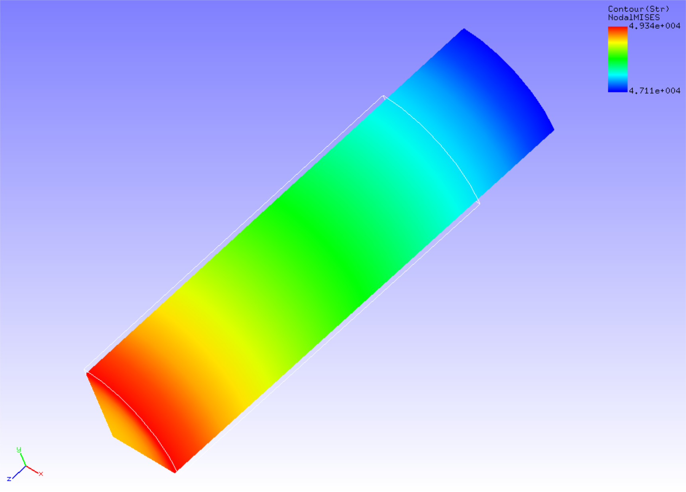

## Non-Linear Static Analysis (Creep)

This analysis uses the data of `tutorial/08_creep_cylinder`.

### Analysis target

The analysis targets are the same round bar 1/8 model as in the [Non-Linear Static Analysis (Hyperelasticity, part 1)](tutorial_03.md) in section 4.3.

 | Item              | Description                 | Notes                     | Reference |
 |-------------------|-----------------------------|---------------------------|-----------|
 |Type of analysis   |Non-linear static analysis   |!SOLUTION,TYPE=NLSTATIC    |           |
 |Number of nodes    |629                          |                           |           |
 |Number of elements |432                          |                           |           |
 |Element type       |Eight node hexahedral element|!ELEMENT,TYPE=361          |           |
 |Material name      |MAT1                         |!MATERICAL,NAME=MAT1       |           |
 |Material property  |ELASTIC,CREEP                |!ELASTIC !CREEP,TYPE=NORTON|           |
 |Boundary conditions|Restraint,Forced displacement|                           |           |
 |Matrix solution    |CG/SSOR                      |!SOLVER,METHOD=CG,PRECOND=1|           |

### Analysis content

Creep behavior analysis is performed by applying tensile displacement in the axial direction to a round bar. The analysis control data is shown below.

#### Analysis control data `cylinder.cnt`.

```
#  Control File for FISTR
## Analysis Control
!VERSION
 3
!SOLUTION, TYPE=NLSTATIC
!WRITE,RESULT
!WRITE,VISUAL
## Solver Control
### Boundary Conditon
!BOUNDARY, GRPID=1
 LOADS, 3, 3, -7.0
 FIX,   3, 3, 0.0
 XSYMM, 1, 1, 0.0
 YSYMM, 2, 2, 0.0
### STEP
!STEP, SUBSTEPS=5, CONVERG=1.0e-5
 BOUNDARY, 1
### Material
!MATERIAL, NAME=MAT1
!ELASTIC
 206900.0, 0.29
!CREEP, TYPE=NORTON
 1.e-10, 5.0, 0.0
### Solver Setting
!SOLVER,METHOD=CG,PRECOND=1,ITERLOG=YES,TIMELOG=YES
 10000, 1
 1.0e-8, 1.0, 0.0
## Post Control
!VISUAL,metod=PSR
!surface_num=1
!surface 1
!output_type=VTK
!END
```
### Analysis procedure

Execute the FrontISTR execution command fistr1.

```
$ cd FrontISTR/tutorial/08_creep_cylinder
$ fistr1 -t 4
(Runs in 4 threads.)
```

### Analysis results

The results of the 5th substep are shown in Figure 4.8.1. A deformation diagram with Mises stress contours is created by REVOCAP_PrePost. A part of the analysis results log file is shown below as numerical data for the analysis results.

{.center width="350px"}
<div style="text-align: center;">
Fig. 4.8.1: Analysis results of deformation and Mises stress
</div>

#### Log file `0.log`.

<div style="height: 400px; overflow-y: scroll;">
```
 fstr_setup: OK
#### Result step=     0
 ##### Local Summary @Node    :Max/IdMax/Min/IdMin####
 //U1    0.0000E+00         1  0.0000E+00         1
 //U2    0.0000E+00         1  0.0000E+00         1
 //U3    0.0000E+00         1  0.0000E+00         1
 //E11   0.0000E+00         1  0.0000E+00         1
 //E22   0.0000E+00         1  0.0000E+00         1
 //E33   0.0000E+00         1  0.0000E+00         1
 //E12   0.0000E+00         1  0.0000E+00         1
 //E23   0.0000E+00         1  0.0000E+00         1
 //E31   0.0000E+00         1  0.0000E+00         1
 //S11   0.0000E+00         1  0.0000E+00         1
 //S22   0.0000E+00         1  0.0000E+00         1
 //S33   0.0000E+00         1  0.0000E+00         1
 //S12   0.0000E+00         1  0.0000E+00         1
 //S23   0.0000E+00         1  0.0000E+00         1
 //S31   0.0000E+00         1  0.0000E+00         1
 //SMS   0.0000E+00         1  0.0000E+00         1
 ##### Local Summary @Element :Max/IdMax/Min/IdMin####
 //E11   0.0000E+00         1  0.0000E+00         1
 //E22   0.0000E+00         1  0.0000E+00         1
 //E33   0.0000E+00         1  0.0000E+00         1
 //E12   0.0000E+00         1  0.0000E+00         1
 //E23   0.0000E+00         1  0.0000E+00         1
 //E31   0.0000E+00         1  0.0000E+00         1
 //S11   0.0000E+00         1  0.0000E+00         1
 //S22   0.0000E+00         1  0.0000E+00         1
 //S33   0.0000E+00         1  0.0000E+00         1
 //S12   0.0000E+00         1  0.0000E+00         1
 //S23   0.0000E+00         1  0.0000E+00         1
 //S31   0.0000E+00         1  0.0000E+00         1
 //SMS   0.0000E+00         1  0.0000E+00         1
 ##### Global Summary @Node    :Max/IdMax/Min/IdMin####
 //U1    0.0000E+00         1  0.0000E+00         1
 //U2    0.0000E+00         1  0.0000E+00         1
 //U3    0.0000E+00         1  0.0000E+00         1
 //E11   0.0000E+00         1  0.0000E+00         1
 //E22   0.0000E+00         1  0.0000E+00         1
 //E33   0.0000E+00         1  0.0000E+00         1
 //E12   0.0000E+00         1  0.0000E+00         1
 //E23   0.0000E+00         1  0.0000E+00         1
 //E31   0.0000E+00         1  0.0000E+00         1
 //S11   0.0000E+00         1  0.0000E+00         1
 //S22   0.0000E+00         1  0.0000E+00         1
 //S33   0.0000E+00         1  0.0000E+00         1
 //S12   0.0000E+00         1  0.0000E+00         1
 //S23   0.0000E+00         1  0.0000E+00         1
 //S31   0.0000E+00         1  0.0000E+00         1
 //SMS   0.0000E+00         1  0.0000E+00         1
 ##### Global Summary @Element :Max/IdMax/Min/IdMin####
 //E11   0.0000E+00         1  0.0000E+00         1
 //E22   0.0000E+00         1  0.0000E+00         1
 //E33   0.0000E+00         1  0.0000E+00         1
 //E12   0.0000E+00         1  0.0000E+00         1
 //E23   0.0000E+00         1  0.0000E+00         1
 //E31   0.0000E+00         1  0.0000E+00         1
 //S11   0.0000E+00         1  0.0000E+00         1
 //S22   0.0000E+00         1  0.0000E+00         1
 //S33   0.0000E+00         1  0.0000E+00         1
 //S12   0.0000E+00         1  0.0000E+00         1
 //S23   0.0000E+00         1  0.0000E+00         1
 //S31   0.0000E+00         1  0.0000E+00         1
 //SMS   0.0000E+00         1  0.0000E+00         1

 ...

#### Result step=     5
 ##### Local Summary @Node    :Max/IdMax/Min/IdMin####
 //U1    0.0000E+00         1 -4.1863E-01        91
 //U2    0.0000E+00         1 -4.1863E-01        88
 //U3    0.0000E+00         1 -7.0000E+00        38
 //E11  -6.5748E-02        38 -6.9459E-02         7
 //E22  -6.5748E-02        50 -6.9459E-02        13
 //E33   2.3884E-01        13  2.2745E-01        50
 //E12   5.5591E-04        53 -5.7135E-04        10
 //E23   1.0510E-04        72 -2.0805E-03        84
 //E31   1.0510E-04        64 -2.0805E-03        95
 //S11   1.1232E+02        14 -1.1026E+02        49
 //S22   1.1232E+02         6 -1.1026E+02        39
 //S33   4.7484E+04         7  4.5271E+04        50
 //S12   4.2781E+01        53 -4.3872E+01        10
 //S23   7.8190E+00        72 -1.6257E+02        84
 //S31   7.8190E+00        64 -1.6257E+02        95
 //SMS   4.7448E+04         7  4.5307E+04        50
 ##### Local Summary @Element :Max/IdMax/Min/IdMin####
 //E11  -6.6010E-02       759 -6.9186E-02       354
 //E22  -6.6010E-02       768 -6.9186E-02       363
 //E33   2.3840E-01       363  2.2788E-01       768
 //E12   4.9263E-04       766 -5.0184E-04       360
 //E23  -1.6179E-05       753 -1.9977E-03       498
 //E31  -1.6179E-05       749 -1.9977E-03       489
 //S11   1.0954E+02       363 -1.0744E+02       768
 //S22   1.0954E+02       354 -1.0744E+02       759
 //S33   4.7416E+04       354  4.5337E+04       759
 //S12   3.7890E+01       766 -3.8501E+01       360
 //S23  -1.3249E+00       753 -1.5632E+02       498
 //S31  -1.3250E+00       749 -1.5632E+02       489
 //SMS   4.7346E+04       363  4.5406E+04       759
 ##### Global Summary @Node    :Max/IdMax/Min/IdMin####
 //U1    0.0000E+00         1 -4.1863E-01        91
 //U2    0.0000E+00         1 -4.1863E-01        88
 //U3    0.0000E+00         1 -7.0000E+00        38
 //E11  -6.5748E-02        38 -6.9459E-02         7
 //E22  -6.5748E-02        50 -6.9459E-02        13
 //E33   2.3884E-01        13  2.2745E-01        50
 //E12   5.5591E-04        53 -5.7135E-04        10
 //E23   1.0510E-04        72 -2.0805E-03        84
 //E31   1.0510E-04        64 -2.0805E-03        95
 //S11   1.1232E+02        14 -1.1026E+02        49
 //S22   1.1232E+02         6 -1.1026E+02        39
 //S33   4.7484E+04         7  4.5271E+04        50
 //S12   4.2781E+01        53 -4.3872E+01        10
 //S23   7.8190E+00        72 -1.6257E+02        84
 //S31   7.8190E+00        64 -1.6257E+02        95
 //SMS   4.7448E+04         7  4.5307E+04        50
 ##### Global Summary @Element :Max/IdMax/Min/IdMin####
 //E11  -6.6010E-02       759 -6.9186E-02       354
 //E22  -6.6010E-02       768 -6.9186E-02       363
 //E33   2.3840E-01       363  2.2788E-01       768
 //E12   4.9263E-04       766 -5.0184E-04       360
 //E23  -1.6179E-05       753 -1.9977E-03       498
 //E31  -1.6179E-05       749 -1.9977E-03       489
 //S11   1.0954E+02       363 -1.0744E+02       768
 //S22   1.0954E+02       354 -1.0744E+02       759
 //S33   4.7416E+04       354  4.5337E+04       759
 //S12   3.7890E+01       766 -3.8501E+01       360
 //S23  -1.3249E+00       753 -1.5632E+02       498
 //S31  -1.3250E+00       749 -1.5632E+02       489
 //SMS   4.7346E+04       363  4.5406E+04       759
```
</div>

