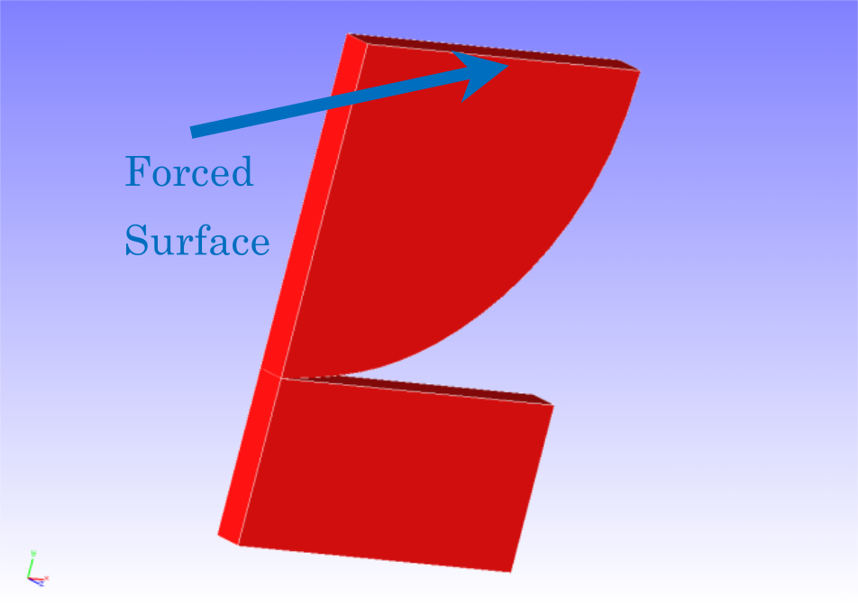
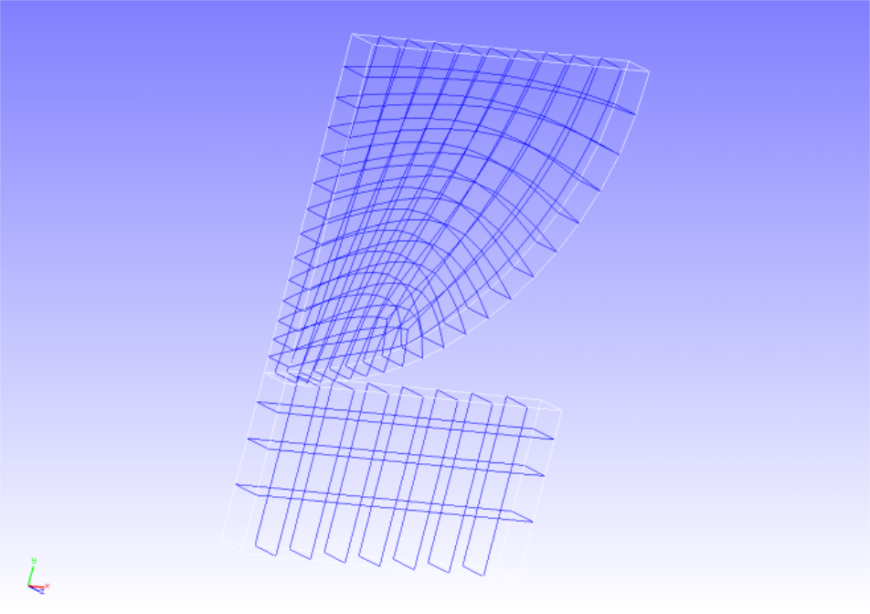
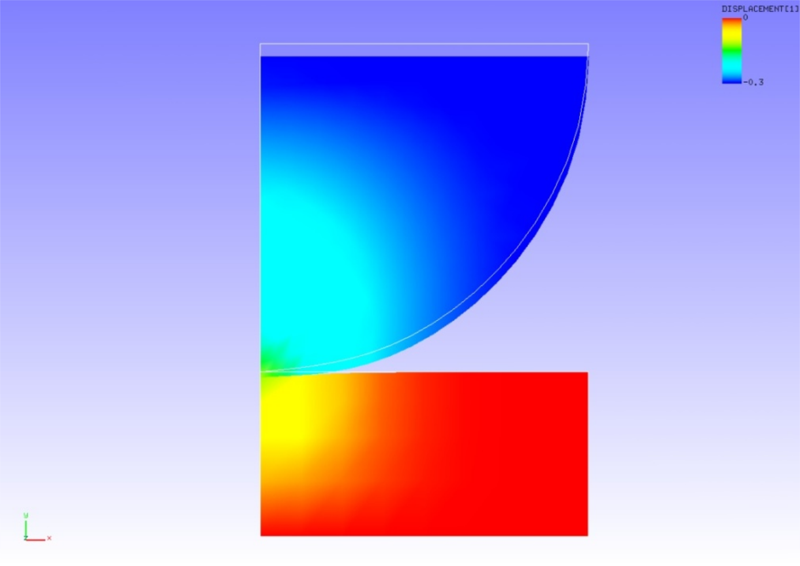

## Contact Analysis (Part 1)

This analysis uses the data of `tutorial/09_contact_hertz`.

### Analysis target

This analysis is a Hertz contact problem with a target whose shape and mesh data of the analysis are shown in Figs. 4.9.1 and 4.9.2, respectively. The mesh is a hexahedral primary element with 168 elements and 408 nodes.

<div style="text-align: center;">
<br>
Fig. 4.9.1: Shape of the analysis target
</div>

<div style="text-align: center;">
<br>
Fig. 4.9.2: Mesh data of the analysis target
</div>

### Analysis content

This is a contact analysis performed with the expanded method of Lagrange multipliers. A forced displacement in the compression direction is applied to the surface of a 1/4 model of a disk. The analysis control data are presented below.

```
# Control File for FISTR
## Analysis Control
!VERSION
  3
!SOLUTION, TYPE=NLSTATIC
!WRITE,RESULT
!WRITE,VISUAL
## Solver Control
### Boundary Conditon
!BOUNDARY, GRPID=1
  ALL, 3, 3, 0.0
  BOTTOM, 2, 2, 0.0
  CENTER, 1, 1, 0.0
  UPPER, 2, 2, -0.306
!CONTACT_ALGO, TYPE=ALAGRANGE
!CONTACT, GRPID=1
  CP1, 0.0
### STEP
!STEP, SUBSTEPS=5, CONVERG=1.0e-5
  BOUNDARY, 1
  CONTACT, 1
```

### Analysis results

The analysis results of the fifth sub-step are shown in Fig. 4.9.3 as a deformation diagram with a y-direction displacement contour created with REVOCAP_PrePost. Furthermore, a part of the log files of the analysis results is shown below as numerical data of the analysis.

<div style="text-align: center;">
<br>
Fig. 4.9.3: Analysis results of deformation and y-direction displacement
</div>


