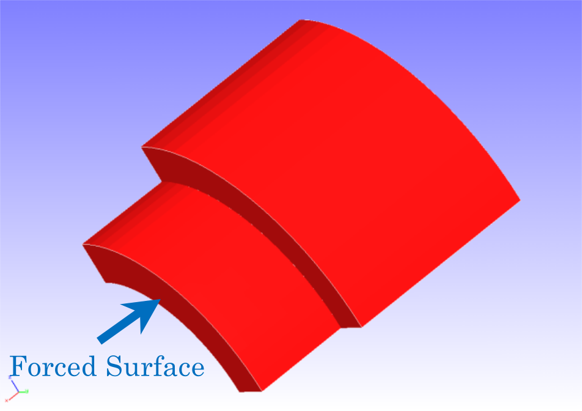
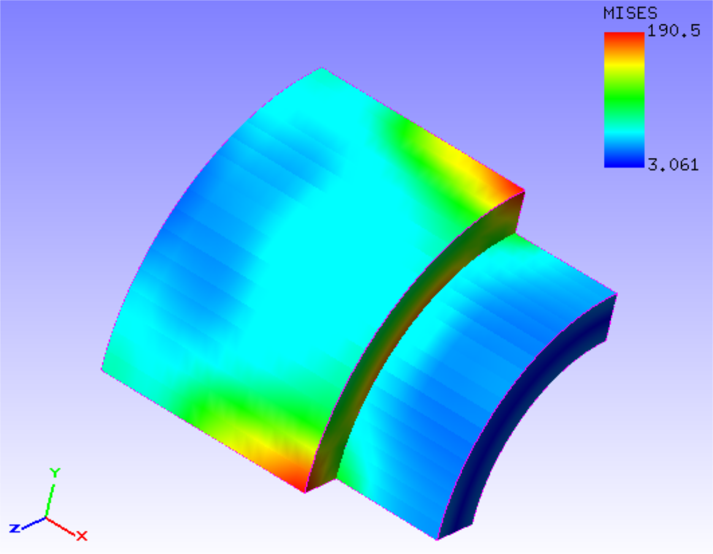

## Contact Analysis (Part 2)

This analysis uses the data of `tutorial/10_contact_2tubes`.

### Analysis target

This analysis is a pushing problem of a cylinder with a target whose shape and mesh data are shown in Figs. 4.10.1 and 4.10.2, respectively. The mesh is a hexahedral primary element with 2888 elements and 4000 nodes.

{: .center width="350px"}
<div style="text-align: center;">
Fig. 4.10.1: Shape of the analysis target
</div>

{: .center width="350px"}
<div style="text-align: center;">
Fig. 4.10.2: Mesh data of the analysis target
</div>

### Analysis content

This is a contact analysis performed with the method of Lagrange multipliers. A forced displacement in the pushing direction is applied to the forced surface shown in Fig. 4.10.1. The analysis control data are presented below.

```
# Control File for FISTR
## Analysis Control
!VERSION
  3
!SOLUTION, TYPE=NLSTATIC
!WRITE,RESULT
!WRITE,VISUAL
## Solver Control
### Boundary Conditon
!BOUNDARY, GRPID=1
  X0, 1, 3, 0.0
  Y0, 2, 2, 0.0
  Z0, 3, 3, 0.0
!BOUNDARY, GRPID=2
  X1, 1, 1, 0.0
!BOUNDARY, GRPID=3
  X1, 1, 1, -1.0
!CONTACT_ALGO, TYPE=SLAGRANGE
!CONTACT, GRPID=1, INTERACTION=FSLID, NPENALTY=1.0e+2
CP1, 0.0, 1.0e+5
### STEP
!STEP, SUBSTEPS=4, CONVERG=1.0e-5
BOUNDARY, 1
BOUNDARY, 3
CONTACT, 1
### Material
!MATERIAL, NAME=M1
!ELASTIC
2.1e+5, 0.3
### Solver Setting
!SOLVER,METHOD=MUMPS
```

### Analysis results

The analysis results of the fourth sub-step are shown in Fig. 4.10.3 as a deformation diagram with a Mises stress contour created with REVOCAP\_PrePost. Furthermore, a part of the log files of the analysis results is shown below as numerical data of the analysis.

{: .center width="350px"}
<div style="text-align: center;">
Fig. 4.10.3: Analysis results of deformation and Mises stress
</div>

```
#### Result step=     4
 ##### Local Summary @Node    :Max/IdMax/Min/IdMin####
 //U1    8.6939E-04        32 -1.0021E+00      2006
 //U2    8.7641E-03       104 -7.0520E-03      2006
 //U3    8.7641E-03         4 -7.0519E-03      1901
 //E11   7.5294E-04      1901 -4.1253E-04       105
 //E22   9.8421E-04         2 -9.2894E-04      2058
 //E33   9.8423E-04       102 -9.2886E-04      3843
 //E12   5.3499E-04       133 -2.8306E-04       278
 //E23   1.2480E-03      1901 -1.4177E-03         4
 //E31   5.3509E-04        33 -2.8312E-04      1678
 //S11   7.7145E+01       103 -8.9999E+01       101
 //S22   2.0117E+02         2 -2.2935E+02      1905
 //S33   2.0117E+02       102 -2.2937E+02      2010
 //S12   4.3211E+01       133 -2.2863E+01       278
 //S23   1.0080E+02      1901 -1.1451E+02         4
 //S31   4.3219E+01        33 -2.2867E+01      1678
 //SMS   2.9963E+02      1901  3.1611E+00      2454
```


