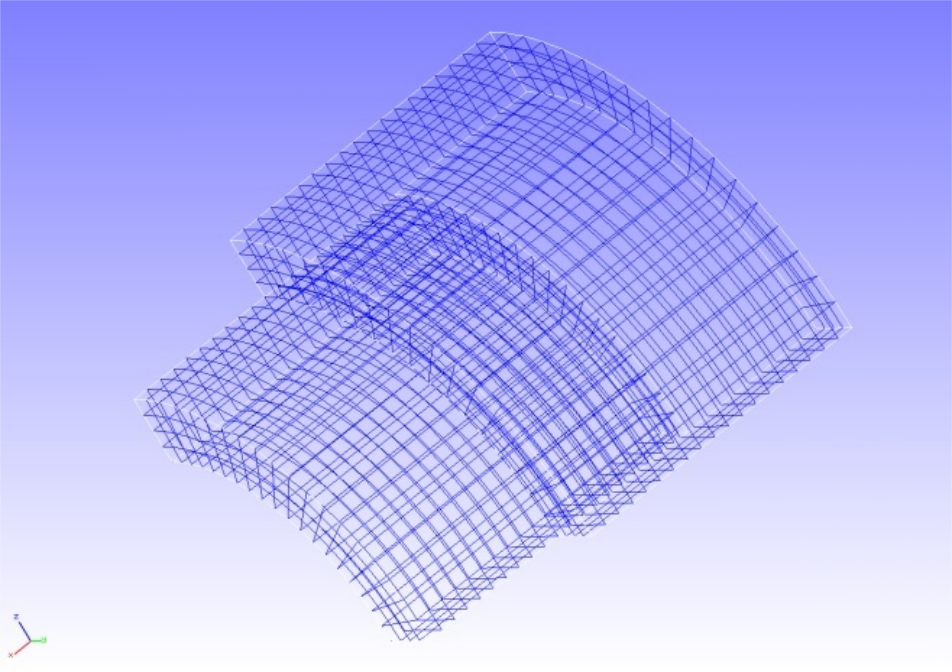

## Contact Analysis (Part 2)

Data of `tutorial/10_contact_2tubes/` is used to implement this analysis.

### Analysis Object

A pinched cylindrical problem was applied in this analysis. The shape of the analysis object is shown in Figure 4.10.1, and the mesh data is shown in Figure 4.10.2. Hexahedral linear elements are used for the mesh, and the scale of the mesh consists of 2,888 elements and 4,000 nodes.

<div style="text-align: center;">
<br>
Figure 4.10.1: Shape of Analysis Object
</div>

<div style="text-align: center;">
<br>
Figure 4.10.2: Mesh Data of Analysis Object
</div>

### Analysis Content

The Lagrange multiplier method is used to implement the contact analysis where forced displacement is applied to the forced surface shown in Figure 4.10.1 in the pinched direction.  The analysis control data is shown in the following.

```
# Control File for FISTR
## Analysis Control
!VERSION
  3
!SOLUTION, TYPE=NLSTATIC
!WRITE,RESULT
!WRITE,VISUAL
## Solver Control
### Boundary Conditon
!BOUNDARY, GRPID=1
  X0, 1, 3, 0.0
  Y0, 2, 2, 0.0
  Z0, 3, 3, 0.0
!BOUNDARY, GRPID=2
  X1, 1, 1, 0.0
!BOUNDARY, GRPID=3
  X1, 1, 1, -1.0
!CONTACT_ALGO, TYPE=SLAGRANGE
!CONTACT, GRPID=1, INTERACTION=FSLID, NPENALTY=1.0e+2
CP1, 0.0, 1.0e+5
### STEP
!STEP, SUBSTEPS=4, CONVERG=1.0e-5
BOUNDARY, 1
BOUNDARY, 3
CONTACT, 1
### Material
!MATERIAL, NAME=M1
!ELASTIC
2.1e+5, 0.3
### Solver Setting
!SOLVER,METHOD=MUMPS
```

### Analysis Results

As analysis results of the 4th sub step, a deformed figure applied with a contour of the
Mises stress was created by REVOCAP_PrePost, and is shown in Figure 4.10.3. Moreover, a
portion of the analysis results log file is shown in the following as numeric data of the analysis results.

<div style="text-align: center;">
<br>
Figure 4.10.3: Analysis Results of Deformation and Mises Stress
</div>

```
#### Result step=     4
 ##### Local Summary @Node    :Max/IdMax/Min/IdMin####
 //U1    8.6939E-04        32 -1.0021E+00      2006
 //U2    8.7641E-03       104 -7.0520E-03      2006
 //U3    8.7641E-03         4 -7.0519E-03      1901
 //E11   7.5294E-04      1901 -4.1253E-04       105
 //E22   9.8421E-04         2 -9.2894E-04      2058
 //E33   9.8423E-04       102 -9.2886E-04      3843
 //E12   5.3499E-04       133 -2.8306E-04       278
 //E23   1.2480E-03      1901 -1.4177E-03         4
 //E31   5.3509E-04        33 -2.8312E-04      1678
 //S11   7.7145E+01       103 -8.9999E+01       101
 //S22   2.0117E+02         2 -2.2935E+02      1905
 //S33   2.0117E+02       102 -2.2937E+02      2010
 //S12   4.3211E+01       133 -2.2863E+01       278
 //S23   1.0080E+02      1901 -1.1451E+02         4
 //S31   4.3219E+01        33 -2.2867E+01      1678
 //SMS   2.9963E+02      1901  3.1611E+00      2454
```
