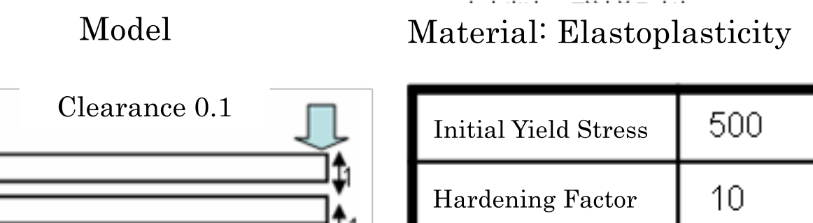

*** Last updated 2019-04-18 ***

## Contact Analysis (Part 3)

This analysis uses the data of `tutorial/11_contact_2beam`.

### Analysis target

This analysis is a contact problem of two beams. The outline of the analysis model is shown in Fig. 4.11.1. The mesh is a hexahedral primary element with 80 elements and 252 nodes.

<div style="text-align: center;">
<br>
Fig. 4.11.1 Outline of Analysis Model
</div>

### Analysis contents

This is a contact analysis performed with the method of Lagrange multipliers. A forced displacement is applied to the upper side of the edge of the beam. The analysis control data are presented below.

```
!!
!! Control File for FISTR
!!
!VERSION
3
!SOLUTION, TYPE=NLSTATIC
!WRITE,RESULT
!WRITE,VISUAL
!BOUNDARY, GRPID=1
ng1, 1, 3, 0.0
ng2, 1, 3, 0.0
ng3, 3, 3, -3.0
!CONTACT_ALGO, TYPE=SLAGRANGE
!CONTACT, GRPID=1, INTERACTION=FSLID
CP1, 0.0, 1.0e+5
!STEP, SUBSTEPS=100, CONVERG=1.0e-4
BOUNDARY, 1
CONTACT, 1
!MATERIAL, NAME=M1
!ELASTIC
2.1e+5, 0.3
!PLASTIC,YIELD=MISES
500.0, 10.0
!SOLVER,METHOD=MUMPS
```

### Analysis results

The analysis results of the 100<sub>th</sub> sub-step are shown in Fig. 4.11.2 as a deformation diagram with a Mises stress contour created with REVOCAP\_PrePost. Furthermore, a part of the log files of the analysis results is illustrated below as numerical data of the analysis.

<div style="text-align: center;">
<br>
Fig. 4.11.2: Analysis results of deformation and Mises stress
</div>

```
#### Result step=   100
 ##### Local Summary @Node    :Max/IdMax/Min/IdMin####
 //U1    1.4100E-01       196 -6.1103E-01         6
 //U2    4.5708E-02        11 -4.5708E-02       195
 //U3    0.0000E+00         1 -3.0000E+00         8
 //E11   1.6026E-01       195 -1.3021E-01        49
 //E22   5.9692E-02        49 -7.5443E-02       195
 //E33   7.3913E-02       152 -8.7368E-02        30
 //E12   8.6161E-02         7 -8.6161E-02       192
 //E23   9.8977E-02        11 -9.8977E-02       195
 //E31   6.0651E-02        90 -1.2885E-01       192
 //S11   5.7685E+02        30 -6.3641E+02       152
 //S22   1.2740E+02       129 -1.2723E+02       194
 //S33   1.4934E+02       129 -1.4146E+02         1
 //S12   1.4662E+02        70 -1.4662E+02       235
 //S23   1.7892E+02       109 -1.7892E+02       172
 //S31   1.6198E+02       153 -2.4815E+02       194
 //SMS   6.2475E+02       152  8.3120E+00         2
```
