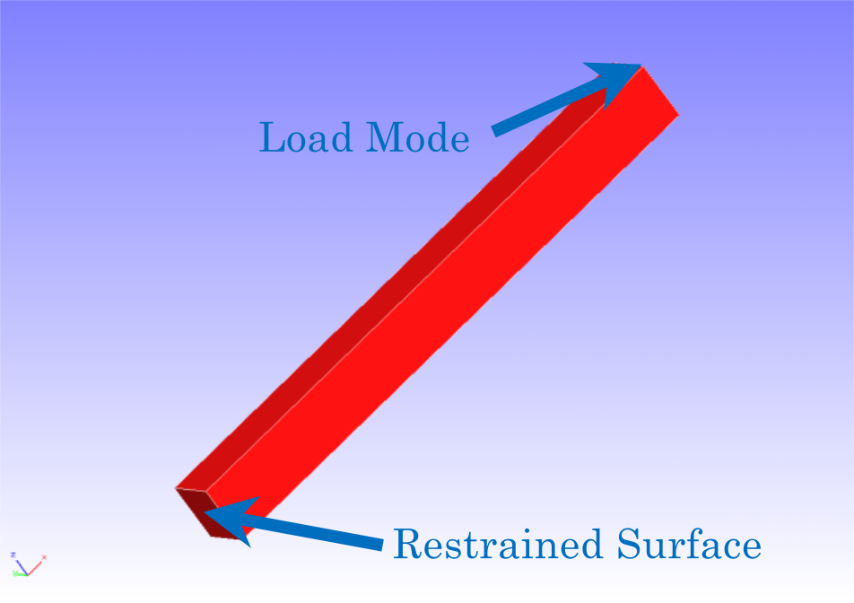
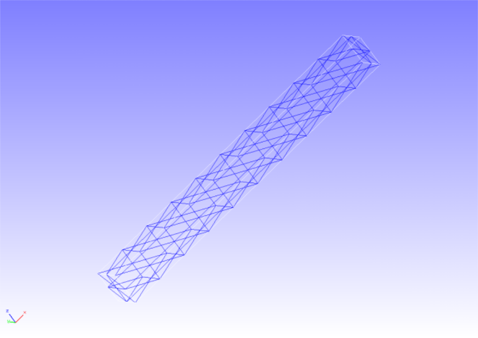
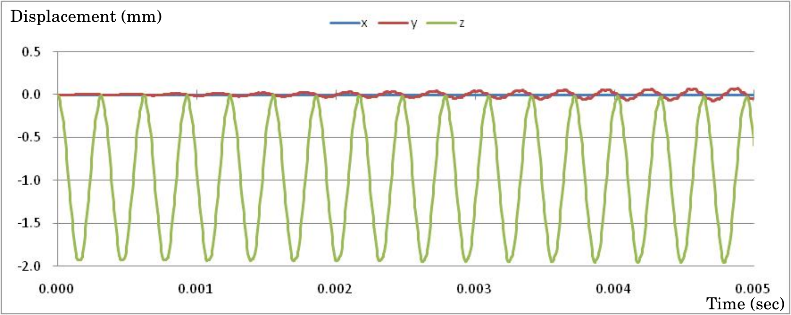

## Linear Dynamic Analysis

This analysis uses the data of `tutorial/12_dynamic_beam`.

### Analysis target

The target of this analysis is a cantilever whose shape and mesh data are shown in Figs. 4.12.1 and 4.12.2, respectively. The mesh is a tetrahedral secondary element with 240 elements and 525 nodes.

<div style="text-align: center;">
<br>
Fig. 4.12.1: Shape of the cantilever
</div>

<div style="text-align: center;">
<br>
Fig. 4.12.2: Mesh data of the cantilever
</div>

### Analysis contents

A linear dynamic analysis is performed after restraining the displacement of the constrained surface shown in Fig. 4.12.1 and applying a concentrated load to the load nodes. The analysis control data are presented below.

```
# Control File for FISTR
## Analysis Control
!VERSION
                  3
!WRITE,LOG,FREQUENCY=5000
!WRITE,RESULT,FREQUENCY=5000
!SOLUTION, TYPE=DYNAMIC
!DYNAMIC, TYPE=LINEAR
  11 , 1
  0.0, 1.0, 500000, 1.0000e-8
  0.5, 0.25
  1, 1, 0.0, 0.0
  100000, 3121, 500
  1, 1, 1, 1, 1, 1
## Solver Control
### Boundary Conditon
!BOUNDARY, AMP=AMP1
  FIX, 1, 3, 0.0
!CLOAD, AMP=AMP1
  CL1, 3, -1.0
### Solver Setting
!SOLVER,METHOD=CG,PRECOND=1,ITERLOG=NO,TIMELOG=NO
  10000, 2
  1.0e-06, 1.0, 0.0
```

### Analysis results

The time-series display of the displacement of the monitoring nodes, specified with the analysis control data (load nodes, nodal number 3121) and created with Microsoft Excel, is shown in Fig. 4.12.3. Furthermore, a part of the displacement output files of the monitoring nodes (dyna\_disp\_p1.out) is shown in Fig. 4.12.3 as numerical data of the analysis.

<div style="text-align: center;">
<br>
Fig. 4.12.3: Time-series displacement of monitoring nodes
</div>

```
         0  0.0000E+000      3121  0.0000E+000  0.0000E+000  0.0000E+000
       500  5.0000E-006      3121  5.5959E-005 -2.0679E-006 -1.5563E-002
      1000  1.0000E-005      3121  5.3913E-005  2.0947E-005 -4.3950E-002
      1500  1.5000E-005      3121  7.6105E-005  5.8799E-005 -8.0795E-002
      2000  2.0000E-005      3121  6.8543E-006  4.0956E-005 -1.2329E-001
      2500  2.5000E-005      3121  5.4725E-005  7.0881E-005 -1.7742E-001
      3000  3.0000E-005      3121  6.8226E-005  1.7597E-004 -2.2801E-001
      3500  3.5000E-005      3121  4.2923E-005  1.1791E-004 -2.7290E-001
      4000  4.0000E-005      3121 -1.2087E-005  1.2552E-004 -3.2393E-001
      4500  4.5000E-005      3121  3.4969E-005 -3.4512E-005 -3.8844E-001
      5000  5.0000E-005      3121  6.1592E-005  1.2820E-004 -4.6425E-001
      5500  5.5000E-005      3121  1.3188E-005  1.9002E-005 -5.4590E-001
      6000  6.0000E-005      3121  3.1393E-005 -7.4604E-005 -6.4556E-001
      6500  6.5000E-005      3121  9.8931E-005 -1.9078E-004 -7.5561E-001
      7000  7.0000E-005      3121  4.2308E-005  1.1593E-004 -8.6826E-001
      7500  7.5000E-005      3121 -2.7019E-005  3.0277E-004 -9.6826E-001
```
