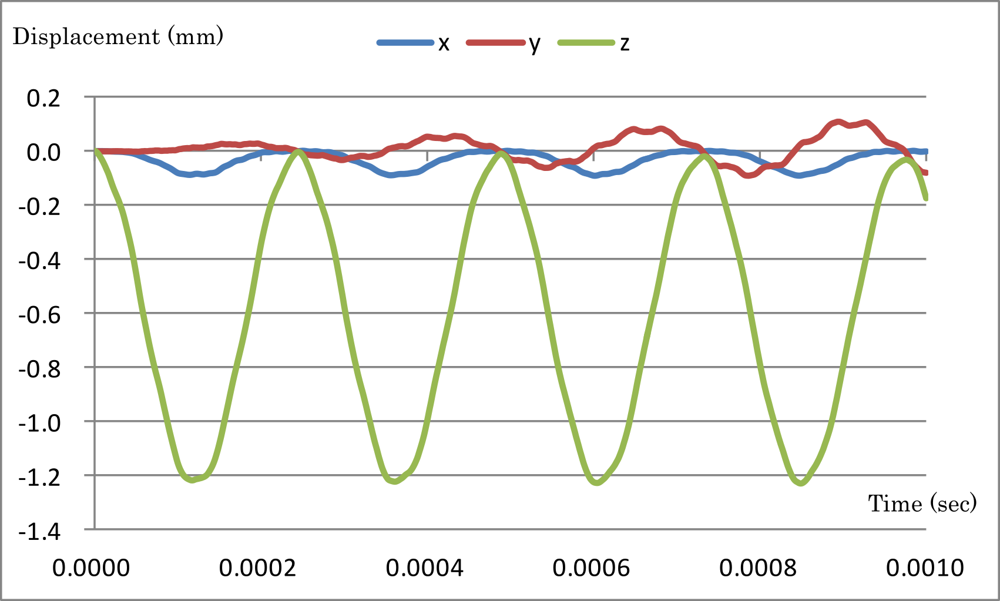

## Non-Linear Dynamic Analysis

This analysis uses the data of `tutorial/13_dynamic_beam_nonlinear`.

### Analysis target

The target of this analysis is the same cantilever used in Section 4.12, Linear Dynamic Analysis.

### Analysis content

A non-linear dynamic analysis is performed after restraining the displacement of the constrained surface shown in Fig. 4.12.1 and applying a concentrated load to the load nodes. The analysis control data are presented below.

```
node. The analysis control data is shown in the following.
# Control File for FISTR
## Analysis Control
!VERSION
  3
!WRITE,RESULT,FREQUENCY=100
!SOLUTION, TYPE=DYNAMIC
!DYNAMIC, TYPE=NONLINEAR
  1 , 1
  0.0, 0.1, 100000, 1.0000e-8
  0.5, 0.25
  1, 1, 0.0, 0.0
  1000, 3121, 100
  1, 1, 1, 1, 1, 1
## Solver Control
### Boundary Conditon
!BOUNDARY, GRPID=1, AMP=AMP1
  FIX, 1, 3, 0.0
!CLOAD, GRPID=1, AMP=AMP1
  CL1, 3, -1.0
### STEP
!STEP, CONVERG=1.0e-3
  BOUNDARY, 1
  LOAD, 1
### Material
!DENSITY
  1.0e-8
!HYPERELASTIC, TYPE=NEOHOOKE
  1000.0, 0.00005
### Solver Setting
!SOLVER,METHOD=CG,PRECOND=1,ITERLOG=NO,TIMELOG=NO
  10000, 2
  1.0e-06, 1.0, 0.0
```

### Analysis results

The time-series display of the displacement of the monitoring nodes, specified with analysis control data (load nodes, nodal number 3121) and created with Microsoft Excel, is shown in Fig. 4.13.1. Furthermore, a part of the displacement output files of the monitoring nodes (dyna\_disp\_p1.out) is shown below as numerical data of the analysis.

{.center width="350px"}
<div style="text-align: center;">
Fig. 4.13.1: Time-series displacement of monitoring nodes
</div>

```
         0  0.0000E+000      3121  0.0000E+000  0.0000E+000  0.0000E+000
       100  1.0000E-006      3121  7.6535E-005 -7.4007E-005 -6.0637E-004
       200  2.0000E-006      3121  3.3644E-005 -7.8807E-006 -8.2096E-004
       300  3.0000E-006      3121  8.7159E-005 -5.5454E-005 -1.2450E-003
       400  4.0000E-006      3121  6.2478E-005 -2.8447E-005 -1.9154E-003
       500  5.0000E-006      3121  2.9599E-005 -4.1870E-005 -2.6827E-003
       600  6.0000E-006      3121  9.3686E-005 -2.0169E-005 -3.4036E-003
       700  7.0000E-006      3121  4.8174E-005 -2.4760E-005 -4.1900E-003
       800  8.0000E-006      3121  4.1022E-005 -3.2953E-005 -5.2161E-003
       900  9.0000E-006      3121  8.1994E-005  4.0719E-006 -6.1061E-003
      1000  1.0000E-005      3121  2.7155E-005 -2.5723E-005 -7.1002E-003
      1100  1.1000E-005      3121  6.8486E-005 -1.8213E-005 -8.3100E-003
      1200  1.2000E-005      3121  4.9497E-005 -9.4011E-006 -9.3339E-003
      1300  1.3000E-005      3121  3.4481E-005 -1.6904E-006 -1.0512E-002
      1400  1.4000E-005      3121  6.7383E-005 -1.3895E-005 -1.1826E-002
      1500  1.5000E-005      3121  8.2829E-006  3.2817E-006 -1.3019E-002

```


