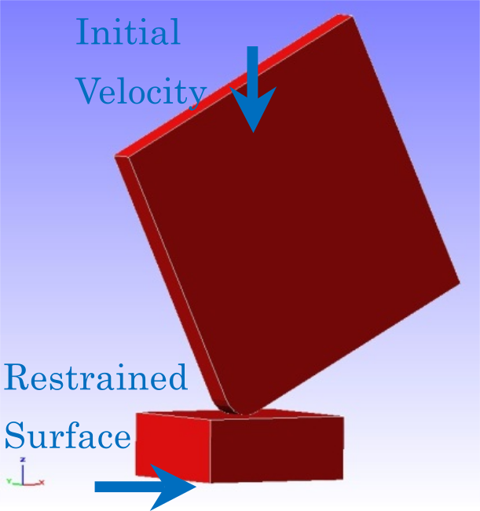
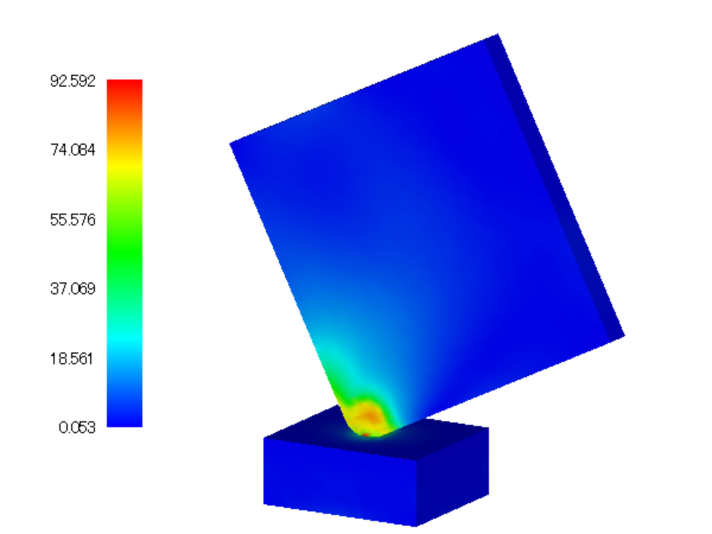

## Non-Linear Contact Dynamic Analysis

This analysis uses the data of `tutorial/14_dynamic_plate_contact`.

### Analysis target

The target of this analysis is the falling impact of a square material on the floor surface. The shape and mesh data of the material are shown in Figs. 4.14.1 and 4.14.2, respectively. The mesh is a hexahedral primary element with 8232 elements and 10712 nodes.

{: .center width="350px"}
<div style="text-align: center;">
Fig. 4.14.1: Shape of the floor surface and square material
</div>

{: .center width="350px"}
<div style="text-align: center;">
Fig. 4.14.2: Mesh data of the floor surface and square material
</div>

### Analysis content

A contact dynamic analysis is performed with the analysis target (square material) configured with an initial speed of 4427 mm/s. The analysis control data are presented below.

```
!! Control File for FISTR
!VERSION
                  3
!WRITE,LOG,FREQUENCY=20
!WRITE,RESULT,FREQUENCY=20
!SOLUTION, TYPE=DYNAMIC
!DYNAMIC, TYPE=NONLINEAR
  1 , 1
  0.0, 1.0, 200, 1.0000e-8
  0.65, 0.330625
  1, 1, 0.0, 0.0
  20, 2621, 1
  1, 1, 1, 1, 1, 1
!BOUNDARY, GRPID = 1
  bottom, 1, 3, 0.0
!VELOCITY, TYPE = INITIAL
  plate, 3, 3, -4427.0
!CONTACT_ALGO, TYPE=SLAGRANGE
!CONTACT, GRPID=1, INTERACTION=FSLID
  CP1, 0.0, 1.0e+5
!STEP, CONVERG=1.0e-8, ITMAX=100
  BOUNDARY, 1
  CONTACT, 1
!MATERIAL, NAME = M1
!ELASTIC
  2.00000e+5, 0.3
!PLASTIC
  1.0e+8, 0.0
!MATERIAL, NAME = M2
!ELASTIC
  1.16992e+5, 0.3
!PLASTIC
  70.0, 0.0
!SOLVER,METHOD=MUMPS
```

### Analysis Results

A contour diagram of a Mises stress of the falling impact is shown in Fig. 4.14.3. Furthermore, a part of the energy output files of the monitoring nodes (dyna_energy.txt) is shown below as numerical data of the analysis.

{: .center width="350px"}
<div style="text-align: center;">
Fig. 4.14.3: Mises stress of the falling impact
</div>


