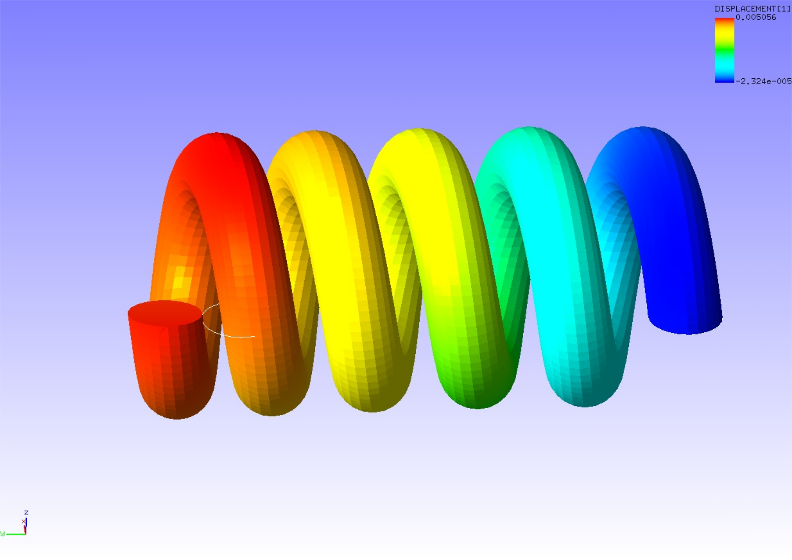

## Eigenvalue Analysis

This analysis uses the data of `tutorial/15_eigen_spring`.

### Analysis target

The target of this analysis is the same spring used in Section 4.4, Static Analysis (Hyperelasticity, Part 2).

### Analysis content

The displacement of the constrained surface shown in Fig. 4.4.1 is restrained, and the eigenvalue analysis is performed up to the fifth order. The analysis control data are presented below.

```
# Control File for FISTR
## Analysis Control
!VERSION
  3
!SOLUTION, TYPE=EIGEN
!EIGEN
  5, 1.0E-8, 60
!WRITE,RESULT
!WRITE,VISUAL
## Solver Control
### Boundary Conditon
!BOUNDARY
  XFIX, 1, 1, 0.0
  YFIX, 2, 2, 0.0
  ZFIX, 3, 3, 0.0
### Material
# define in mesh file
### Solver Setting
!SOLVER,METHOD=DIRECT
```

### Analysis results

The third vibration mode (compression and decompression in y-direction of the spring,) created with REVOCAP_PrePost using the analysis result data file spring.res.0.3, is shown in Fig. 4.15.1. The deformation magnification was set to 1000. Furthermore, a list of eigenfrequency output to the analysis result log file is shown below as numerical data of the analysis.

{: .center width="350px"}
<div style="text-align: center;">
Fig. 4.15.1: Third vibration mode of a spring
</div>

```
********************************
*RESULT OF EIGEN VALUE ANALYSIS*
********************************

NUMBER OF ITERATIONS =        7
TOTAL MASS =   3.4184E-06

                   ANGLE       FREQUENCY   PARTICIPATION FACTOR                EFFECTIVE MASS
  NO.  EIGENVALUE  FREQUENCY   (HZ)        X           Y           Z           X           Y           Z
  ---  ----------  ----------  ----------  ----------  ----------  ----------  ----------  ----------  ----------
    1  7.8309E+06  2.7984E+03  4.4537E+02  1.0289E+00 -8.8864E-02 -7.0531E-01  1.3005E-06  9.7019E-09  6.1117E-07
    2  7.8718E+06  2.8057E+03  4.4654E+02  6.9690E-01  1.0754E-01  1.0106E+00  6.1297E-07  1.4597E-08  1.2891E-06
    3  3.2601E+07  5.7097E+03  9.0873E+02  4.5547E-03  1.2343E+00 -7.9889E-02  3.5327E-11  2.5942E-06  1.0869E-08
    4  3.8393E+07  6.1962E+03  9.8616E+02  2.8996E-02 -3.6087E-01 -4.1346E-03  7.8507E-10  1.2161E-07  1.5963E-11
    5  1.2966E+08  1.1387E+04  1.8122E+03  5.3557E-01  6.2747E-02  5.9258E-01  3.3022E-07  4.5327E-09  4.0426E-07
```


