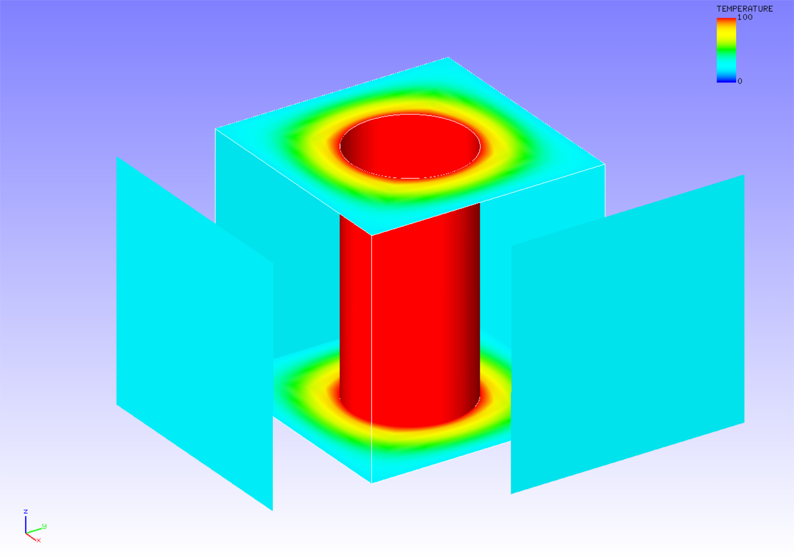

## Heat Conduction Analysis

This analysis uses the data of `tutorial/16_heat_block`.

### Analysis target

The target of this analysis is a perforated block whose shape and mesh data are shown in Figs. 4.16.1 and 4.16.2, respectively. The mesh is a hexahedral primary element with 32160 elements and 37386 nodes.

{: .center width="350px"}
<div style="text-align: center;">
Fig. 4.16.1: Shape of the perforated block
</div>

{: .center width="350px"}
<div style="text-align: center;">
Fig. 4.16.2: Mesh data of the perforated block
</div>

### Analysis content

This is a steady-state heat conduction analysis wherein a heat source is provided to the cylindric internal surface of the analysis target. The analysis control data are presented below.

```
#  Control File for FISTR
## Analysis Control
!VERSION
 3
!SOLUTION, TYPE=HEAT
!HEAT
 0.0
!WRITE,RESULT
!WRITE,VISUAL
## Solver Control
### Boundary Conditon
!FIXTEMP
 FTMPC,  100.0
 FTMPS1, 20.0
 FTMPS2, 20.0
 FTMPS3, 20.0
 FTMPS4, 20.0
### Material
# define in mesh file
### Solver Setting
!SOLVER,METHOD=CG,PRECOND=1,ITERLOG=YES,TIMELOG=YES
 100, 1
 1.0e-8, 1.0, 0.0
```

### Analysis results

This analysis uses the data of `tutorial/17_freq_beam`. The first step of the analysis is to change the overall control data for eigenvalue analysis, `hecmw_ctrl_eigen.dat`, to `hecmw_ctrl.dat` and perform eigenvalue analysis. Further, change the overall control data for frequency response analysis, `hecmw_ctrl_freq.dat`, to `hecmw_ctrl.dat`, and the eigenvalue analysis result log file, `0.log`, to \`eigen_0.log` (which is specified within the analysis control data for frequency response analysis.) Finally, frequency response analysis is performed.

{: .center width="350px"}
<div style="text-align: center;">
Fig. 4.16.3: Analysis results of temperature
</div>

```
 ISTEP =     1
 Time  =     0.000
 Maximum Temperature :   100.000
 Maximum Node No.    :         9
 Minimum Temperature :    20.000
 Minimum Node No.    :        85
```


