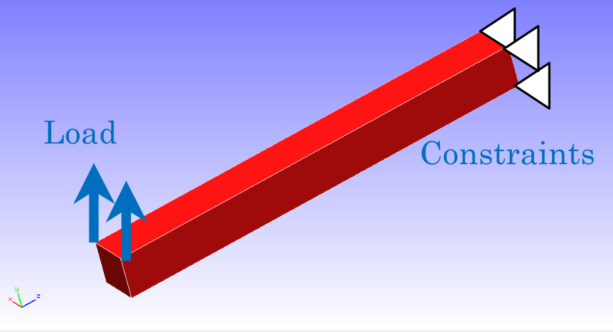
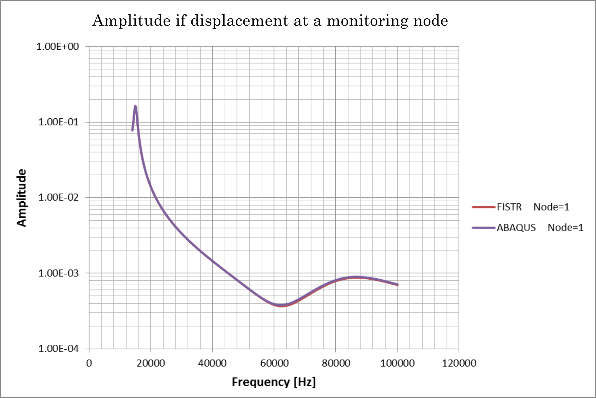

## Frequency Response Analysis

This analysis uses the data of `tutorial/17_freq_beam`. The first step of the analysis is to change the overall control data for eigenvalue analysis, `hecmw_ctrl_eigen.dat`, to `hecmw_ctrl.dat` and perform eigenvalue analysis. Further, change the overall control data for frequency response analysis, `hecmw_ctrl_freq.dat`, to `hecmw_ctrl.dat`, and the eigenvalue analysis result log file, `0.log`, to `eigen_0.log` (which is specified within the analysis control data for frequency response analysis.) Finally, frequency response analysis is performed.

### Analysis target

The target of this analysis is a cantilever whose shape and mesh data are shown in Figs. 4.17.1 and 4.17.2, respectively. The mesh is a tetrahedral primary element with 126 element and 55 nodes.

<div style="text-align: center;">
<br>
Fig. 4.17.1 : Shape of the cantilever
</div>

<div style="text-align: center;">
<br>
Fig. 4.17.2 : Mesh data of the cantilever
</div>

### Analysis content

This is a frequency response analysis in which the edge of the cantilever was fully restrained, and concentrated load was added to two nodes on the opposite edge. After performing eigenvalue analysis up to the tenth order with the same boundary conditions, the frequency response analysis was conducted with the eigenvalues and eigenvectors up to the fifth order. The analysis control data for frequency response analysis is shown below.

```
# Control File for FISTR
!VERSION
  3
!WRITE,RESULT
!WRITE,VISUAL
!SOLUTION, TYPE=DYNAMIC
!DYNAMIC
  11 , 2
  14000, 16000, 20, 15000.0
  0.0, 6.6e-5
  1, 1, 0.0, 7.2E-7
  10, 2, 1
  1, 1, 1, 1, 1, 1
!EIGENREAD
  eigen_0.log
  1, 5
!BOUNDARY
  _PickedSet4, 1, 3, 0.0
!FLOAD, LOAD CASE=2
  _PickedSet5, 2, 1.
!FLOAD, LOAD CASE=2
  _PickedSet6, 2, 1.
!SOLVER,METHOD=CG,PRECOND=1,ITERLOG=NO,TIMELOG=YES
  10000, 2
  1.0e-8, 1.0, 0.0
```

### Analysis results

The relationship between frequency and displacement amplitude of the monitoring nodes, specified with analysis control data (nodal number 1) and created with Microsoft Excel, is shown in Fig. 4.17.3. Furthermore, a part of the log files of the analysis results is shown below as numerical data of the analysis.

<div style="text-align: center;">
<br>
Fig.4.17.3 Relationship between frequency and displacement amplitude of the monitoring nodes
</div>

```
 Rayleigh alpha:   0.0000000000000000
 Rayleigh beta:   7.1999999999999999E-007
 read from=eigen_0.log
 start mode=           1
 end mode=           5
 start frequency:   14000.000000000000
 end frequency:   16000.000000000000
 number of the sampling points          20
 monitor nodeid=           1
   14100.000000000000      [Hz] :    8.3957630463152688E-002
   14100.000000000000      [Hz] :            1 .res
   14200.000000000000      [Hz] :    9.1237051959262350E-002
   14200.000000000000      [Hz] :            2 .res
   14300.000000000000      [Hz] :    9.9610213760033539E-002
   14300.000000000000      [Hz] :            3 .res
   14400.000000000000      [Hz] :   0.10918495323840580
   14400.000000000000      [Hz] :            4 .res
   14500.000000000000      [Hz] :   0.11996212788265602
   14500.000000000000      [Hz] :            5 .res
   14600.000000000000      [Hz] :   0.13169277524043285
   14600.000000000000      [Hz] :            6 .res
   14700.000000000000      [Hz] :   0.14365135321213662
   14700.000000000000      [Hz] :            7 .res
   14800.000000000000      [Hz] :   0.15439888482329628
   14800.000000000000      [Hz] :            8 .res
   14900.000000000000      [Hz] :   0.16182392983620905
   14900.000000000000      [Hz] :            9 .res

```
