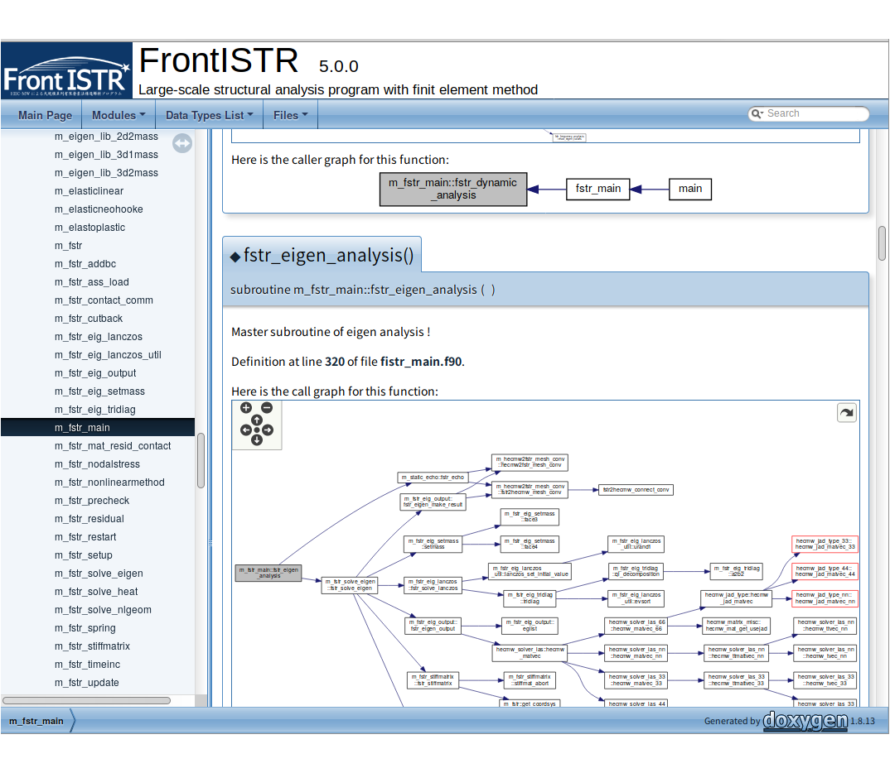

# Compile with cmake

## Compile with cmake

cmake will find libraries and headers automatically. You can also specify libraries and headers manually.

Detiled usage of cmake command, see [https://cmake.org/](https://cmake.org/documentation/).

### Preparation


In advance, required software install as following directory structure.

```
  $HOME
    |-- local
          |-- bin
          |-- include
          |-- lib
```

Add `$HOME/local/bin` in `$PATH` environment variable.

Next, check whether already installed `cmake`. You may need to install version 2.8.11 or later.

```
$ cmake --version
cmake version 2.8.12.2
```

### Compile

Compile FrontISTR.

```
$ cd `${FSTRBUILDDIR}`
$ mkdir build
$ cd build
$ cmake ..
$ make -j2
```

`-j2` option follows `make` command tells make to execute simultaneously. Reduce compile time when increasing the number of simultaneous.

### Execute `make install`

When finished to compile, execute following command.

```
$ make install
```

This software will be installed in the `/usr/local/bin` directory or in the directory specified by `-DCMAKE_INSTALL_PREFIX`.

```
$ cmake -DCMAKE_INSTALL_PREFIX=$HOME/local ..
```

Which options enabled in compiled FrontISTR(`fistr1`) can confirm as following command.

```
$ ./fistr1 -v
FrontISTR version 5.0.0 (2d3fdb51979459c7ea9357a7c9b790fa69dfd4e2) 
MPI: Enabled
OpenMP: Enabled
HECMW_METIS_VER: 5
Compile Option: -p --with-tools --with-metis --with-mumps --with-lapack --with-ml 
```

### cmake options

You can explicitly various options at configuration time.

| Options (Default)  | Contents                                    | Remarks                      |
|:-------------------|:--------------------------------------------|:-----------------------------|
| -DWITH\_TOOLS=ON   | Compiling tools such as partitioners        | hecmw_part1 etc.             |
| -DWITH\_MPI=ON     | Enable MPI                                  | require libraries            |
| -DWITH\_OPENMP=ON  | Enable OpenMP                               | require supported compiler   |
| -DWITH\_REFINER=ON | Enable REVOCAP_Refiner functionality        | require libraries            |
| -DWITH\_REVOCAP=ON | Enable REVOCAP_Coupler functionality        | require libraries            |
| -DWITH\_METIS=ON   | Enable METIS functionality                  | 4.0.3 and 5.1.0 supported    |
| -DMETIS\_VER_4=OFF | In case of using metis-4.0.3, specify ON    | In case of using metis-5.1.0, it isn't necessary to specify it. |
| -DWITH_PARMETIS=ON | Enable ParMETIS functionality               | 3.2.0 and 4.0.3 supported    |
| -DMETIS\_VER_3=OFF | In case of using ParMetis-3.2.0, specify ON | In case of using parmetis-4.0.3, it isn't necessary to specify it. |
| -DWITH\_MKL=ON     | Enable MKL PARDISO functionality            | require libraries            |
| -DWITH\_MUMPS=ON   | Enable MUMPS functionality                  | require libraries            |
| -DWITH\_LAPACK=ON  | Enable LAPACK functionality                 | require libraries            |
| -DWITH\_ML=ON      | Enable Trilinos ML functionality            | require libraries            |
| -DWITH\_DOC=OFF    | Documentation of the source code            | require doxygen and graphviz |

The list of variables that can be set with cmake can be confirmed with the following command.

```
$ cmake -L
```
Other options are as follows.

| Options                     | Contents                                         | Remarks                                          |
|:----------------------------|:-------------------------------------------------|:-------------------------------------------------|
| -DBLA\_VENDOR=              | Specify vendor name of BLAS and LAPACK           | Refer to the FindBLAS.cmake                      |
| -DBLAS\_LIBRARIES=          | Directly specifies BLAS library                  | Absolute path                                    |
| -DLAPACK\_LIBRARIES=        | Directly specifies LAPACK library                | Absolute path                                    |
| -DCMAKE\_INSTALL\_PREFIX=   | Specify installing path. Default is `/usr/local` | If specifies -DCMAKE\_INSTALL\_PREFIX=$HOME/local,<br/>binaries will copy to  $HOME/local/bin |
| -DCMAKE\_C\_COMPILER=       | Specify C compiler                               | -DCMAKE_C_COMPILER=icc  (ex. Intel C compiler)   |
| -DCMAKE\_CXX\_COMPILER=     | Specify C++ compiler                             | -DCMAKE_CXX_COMPILER=icpc  (ex. Intel C++ compiler) |
| -DCMAKE\_Fortran\_COMPILER= | Specify Fortran compiler                         | -DCMAKE_Fortran_COMPILER=ifort  (ex. Intel Fortran compiler)|
| -DCMAKE\_PREFIX\_PATH=      | Specify path of libraries                        | -DCMAKE_PREFIX_PATH=$HOME/tools |

## About test

This software includes test scripts for validating compiled binaries.

In order to execute the test you need to install `ruby` in advance. If `ruby` is already installed, test is automatically enabled.

Test is executed as follows.

```
$ make test
```

Results as follows.

```
Running tests...
Test project /home/fistr/FrontISTR/build
      Start  1: Static_exA_Test
 1/23 Test  #1: Static_exA_Test ..................   Passed    3.54 sec
      Start  2: Static_exB_Test
 2/23 Test  #2: Static_exB_Test ..................   Passed    2.51 sec
...
```

You can output verbosed messages as follow.

```
$ make test ARGS="-VV -j4 -O test_log.txt"
```

Results will output in `test_log.txt` file. For more information;

```
$ ctest --help
```


## About documentation of source code

For learning or investigating the source code, you can generate HTML documents that describes relationship functions from the source codes.

You need install `doxygen` and `graphviz` in advance.


```
$ cmake -DWITH_DOC=ON ..
$ make doc
```

Generated HTML can browse like as follow.

```
$ firefox doc/html/index.html
```



## Enable Debugging

To enable debugging, specify the following option.

```
$ cmake -DCMAKE_BUILD_TYPE="DEBUG" ..
```

To perform more advanced debugging, specifying the following options is useful for investigating memory leaks.

```
$ cmake -DCMAKE_BUILD_TYPE="DEBUG" -DDEBUG_EXTRA=ON ..
```
