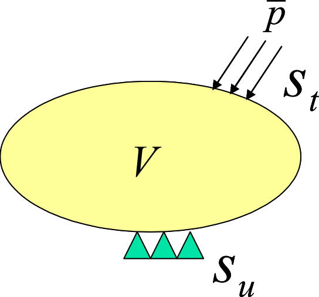

# Infinitesimal Deformation Linear Elasticity Static Analysis

The formulation for the elastic static analysis based on the infinitesimal deformation theory is described in this section. The linear elasticity is assumed as the stress and strain relationship.

### Basic Equation

The equilibrium equation of solid mechanics, dynamic boudary conditions and the geometric boundary conditions (basic boudary conditions) are given by the following equation (Refer to Figure 2.1.1).

$$
\begin{equation}
\nabla \cdot \sigma + \overline{b} = 0 \quad in \ V
\label{eq:2.1.1}
\end{equation}
$$

$$
\begin{equation}
\sigma \cdot n = \overline{t} \quad on \ S_t
\label{eq:2.1.2} 
\end{equation}
$$

$$
\begin{equation}
u = \overline{u} \quad on \ S_u
\label{eq:2.1.3}
\end{equation}
$$

Herein, $\sigma$ is the stress, $\overline{t}$ is the surface force, $\overline{b}$ is the body force, and $S_t$ expresses the dynamic boundary and $S_u$ expresses the geometric boundary.

** Figure 2.1.1 Boundry Value Problem in Solid Mechanics(Infinitesimal Deformation Problem) **

The strain and displacement relational expression in the infinitesimal deformation problem is given by the following equation.

$$
\begin{equation}
\varepsilon = \nabla_S u
\label{eq:2.1.4}
\end{equation}
$$

The stress and strain relational expression (constitutive equation) in the linear elastic body is given by the following equation.

$$
\begin{equation}
\sigma = C : \varepsilon
\label{eq:2.1.5}
\end{equation}
$$

Herein, $C$ is the fourth order elastic tensor.

## Principle of Virtual work

The principle of the virtual work regarding the infinitesimal deformation linear elasticity problem equivalent to the basic equations $\eqref{eq:2.1.1}$, $\eqref{eq:2.1.2}$ and $\eqref{eq:2.1.3}$, is expressed as in the following equation.

$$
\begin{equation}
\int_V \sigma : \delta \varepsilon\, dV = \int_{S_t} \overline{t} \cdot \delta u\, dS + \int_V \overline{b} \cdot \delta u\,dV
\label{eq:2.1.6}
\end{equation}
$$

$$
\begin{equation}
\delta u = 0 \quad on \ S_u
\label{eq:2.1.7}
\end{equation}
$$

Furthermore, in consideration of the constitutive equation $\eqref{eq:2.1.5}$, equation $\eqref{eq:2.1.6}$ is expressed as in the following equation.

$$
\begin{equation}
\int_V (C : \varepsilon) : \delta \varepsilon\, dV = \int_{S_t} \overline{t} \cdot \delta u\, dS + \int_V \overline{b} \cdot \delta u\, dV
\label{eq:2.1.8}
\end{equation}
$$

In equation $\eqref{eq:2.1.8}$, $\varepsilon$ is the strain tensor and $C$ is the forth order elastic tensor, In this case, when stress tensor $\sigma$ and strain tensor $\varepsilon$ are expressed by each vector forms $\hat{\sigma}$ and $\hat{\varepsilon}$, the consitutive equation $\eqref{eq:2.1.5}$ is expressed as in the following equation.

$$
\begin{equation}
\hat{\sigma} = D \hat{\varepsilon}
\label{eq:2.1.9}
\end{equation}
$$

Herein, $D$ is the elastic matrix.

In consideration of stress $\hat{\sigma}$ and $\hat{\varepsilon}$ expressed by the vector forms and equation $\eqref{eq:2.1.9}$, equation $\eqref{eq:2.1.8}$ is the expressed as in the following equation.

$$
\begin{equation}
\int_V \hat{\varepsilon}^T D \delta \hat{\varepsilon}\, dV = \int_{S_t}
\delta u^T \overline{t}\, dS + \int_V \delta u^T \overline{b}\, dV
\label{eq:2.1.10}
\end{equation}
$$

Equation $\eqref{eq:2.1.10}$ and equation $\eqref{eq:2.1.7}$ are the principles of the virtual work discretized in this development code.

## Formulation

The principle equation $\eqref{eq:2.1.10}$ of the virtual work is discretized for each finite element to acquire the following equation.

$$
\begin{equation}
\sum_{e} = \int_{V^e} \hat{\varepsilon}^T D \delta \hat{\varepsilon}\, dV = \sum_{e} \int_{S^e_t}
\delta u^T \overline{t}\, dS + \sum_{e} \int_{V^e} \delta u^T \overline{b}\,dV
\label{eq:2.1.11}
\end{equation}
$$

Using the displacement of the nodes which consist of elements, the displacement field is interpolated for each element as in the following equation.

$$
\begin{equation}
u = \sum^m_{i=1} N_i u_i = N U
\label{eq:2.1.12}
\end{equation}
$$

The strain in this case, is given as in the following equation using equation $\eqref{eq:2.1.4}$.

$$
\begin{equation}
\hat{\varepsilon} = B U
\label{eq:2.1.13}
\end{equation}
$$

Equations $\eqref{eq:2.1.12}$ and $\eqref{eq:2.1.13}$ are substituted with equation $\eqref{eq:2.1.11}$ to acquire the following equation.

$$
\begin{equation}
\sum_e \delta U^T \left( \int_{V^e} B^T DB\, dV \right)
U = \sum_e \delta U^T \cdot \int_{S_t^e}
N^T \overline{t}\, dS + \sum_{e} \delta U^T \int_{V^e} N^T
\overline{b}\, dV
\label{eq:2.1.14}
\end{equation}
$$

Equation $\eqref{eq:2.1.14}$ can be summarized as in the following equation.

$$
\begin{equation}
\delta U^T K U = \delta U^T F
\label{eq:2.1.15}
\end{equation}
$$

Where,

$$
\begin{equation}
K = \sum_e \int_{V^e} B^T DB dV
\label{eq:2.1.16}
\end{equation}
$$

$$
\begin{equation}
F = \sum_e (\int_{S_t^e} N^T \overline{t}\, dS + \int_{V^e} N^T \overline{b}\, dV )
\label{eq:2.1.17}
\end{equation}
$$

The components of the matrix and vectors defined by the following equations $\eqref{eq:2.1.16}$ and $\eqref{eq:2.1.17}$ can be calculated and overlapped for each finite element.

The following equation can be acquired by forming equation $\eqref{eq:2.1.15}$ for the arbitary virtual displacement $\delta U$.

$$
\begin{equation}
K U = F
\label{eq:2.1.18}
\end{equation}
$$

On the other hand, the displacement boundary condition equation $\eqref{eq:2.1.3}$ is expressed as in the following equation.

$$
\begin{equation}
U = \overline{U}
\label{eq:2.1.19}
\end{equation}
$$

Node displacement $U$ can be determined by solving equation $\eqref{eq:2.1.18}$ by the restriction condition equation $\eqref{eq:2.1.19}$.
