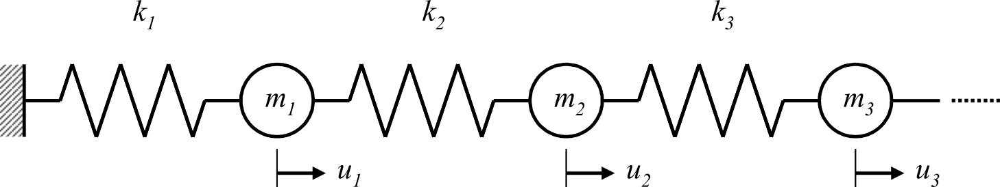
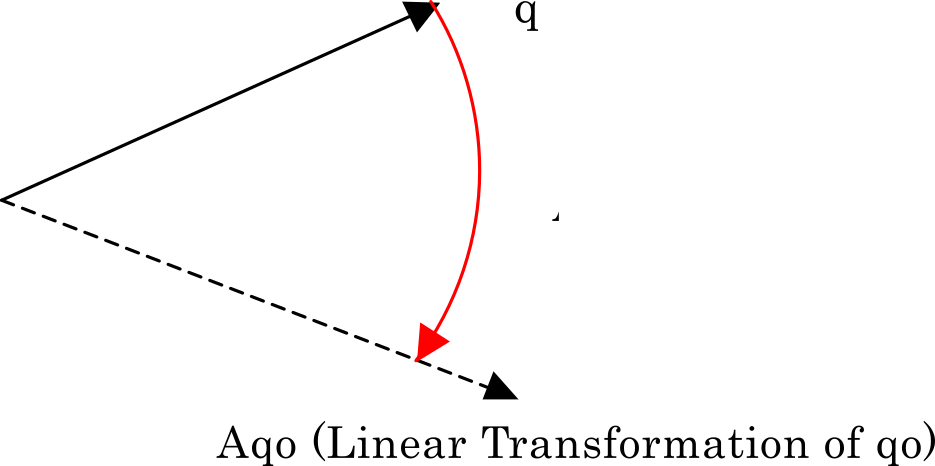
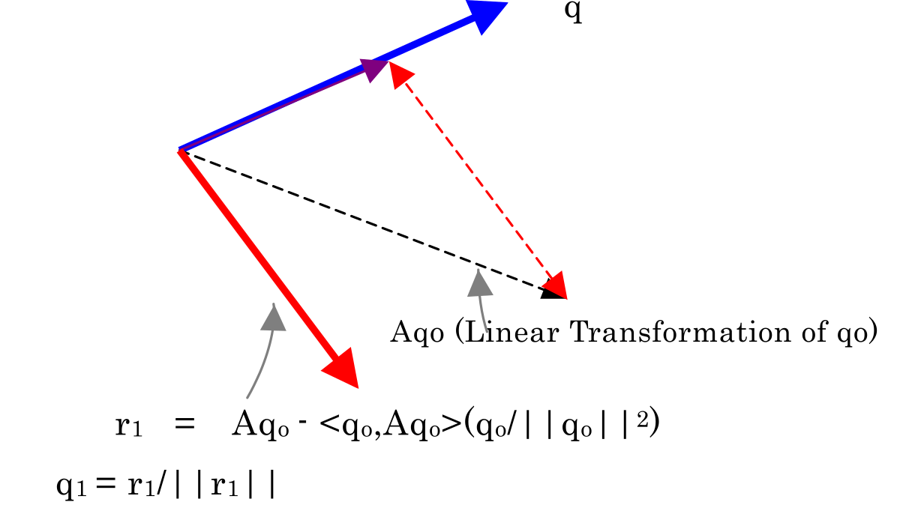
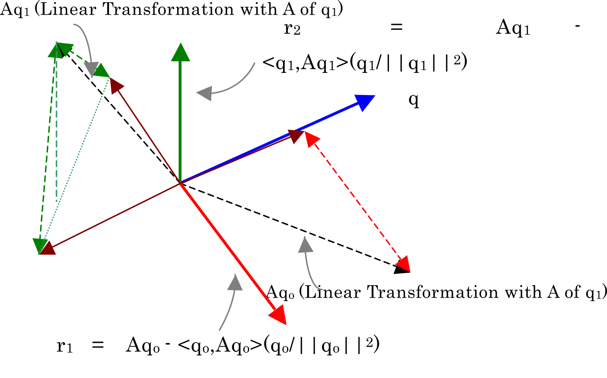

# Eigenvalue Analysis

## Generalized Eigenvalue Problem

When conducting a free oscillation analysis of the continuum, spatial discretization is performed, and a model is created with the multi degrees of freedom system by a central mass point as shown in Figure 2.3.1. In the case of the freeoscillation problem without attenuation, the governing equation (equation of motion) is as follows.

$$
\begin{equation}
M\ddot{u} + K u = 0
\label{eq:2.3.1}
\end{equation}
$$

However, $u$ is the generalized displacement vector, $M$ is the mass matrix and $K$ is the stiffness matrix. Now, the function is defined assuming the natural angular frequency as $\omega$, $a$ and $b$ as the arbitary constants, and $x$ as the vector as follows.

$$
\begin{equation}
u(t) = (a \sin \omega t + b \cos \omega t ) x
\label{eq:2.3.2}
\end{equation}
$$

Herein, when this equation and this second order differential,

$$
\begin{equation}
\ddot{u}(t) = -\omega^2 (a \sin \omega t + b \cos \omega t) x
\label{eq:2.3.3}
\end{equation}
$$

is substituted with equation $\eqref{eq:2.3.1}$, it will become as follows.

$$
\begin{equation}
M\ddot{u} + K u = (a \sin \omega t + b \cos \omega t) (- \omega^2 M + K x ) =  ( -\lambda M + K x) = 0
\label{eq:2.3.4}
\end{equation}
$$

Which becomes,

$$
\begin{equation}
K x = \lambda M x
\label{eq:2.3.5}
\end{equation}
$$

That is to say, if factor $\lambda(=\omega^2)$ and vector $x$ which satisfies equation $\eqref{eq:2.3.5}$ can be found, function $u(t)$ becomes the solution of equation $\eqref{eq:2.3.1}$. Factor $\lambda$ is called the eigenvalue, vector $x$ is called the eigenvector, and the problem in which these values are calculated by equation $\eqref{eq:2.3.1}$ is called the generalized eigenvalue problem.

** Figure 2.3.1: Example of Multi Degrees of Freedom System of Free Oscillation without Attenuation **

## Problem Settings

Equation $\eqref{eq:2.3.5}$ can be expanded to arbitary order frequencies, and appears in many situations. In order to handle many physical problems, there are many cases where the matrix is Hermitian (symmetrical). Thus, in a complex matrix, the transposed matrix is transposed into cojugate complex number, and a symmetric matrix in the real matrix. That is to say, when the $ij$ component of matrix $K$ is assumed to be $k_{ij}$, if the conjugate complex number of $k$ is transposed to $\overline{k}$, the relationship becomes as in the following equation.

$$
\begin{equation}
k_{ij} = \bar{k}_{ji}
\label{eq:2.3.6}
\end{equation}
$$

In this manual, the matrix is symmetrical, and assumes a positive definite. Positive definite means that all the eigenvalues are positive, in other words, it refers to a matrix which always satisfies the following equation $\eqref{eq:2.3.7}$.

$$
\begin{equation}
x^\mathrm{T} A x > 0
\label{eq:2.3.7}
\end{equation}
$$

## Shifted Inverse Iteration Method

In the structural analysis by the finite element method, all the eigenvalues are not required in practical use, and there are many cases where an extensive number of low order eigenvalues is sufficient. Now, the handling of large-scale problems is assumed in HEC-MW, and the size of the matrix is large and extremely sparse (many zero elements). Therefore, considering this fact, it is important to efficiently calculate the eigenvalues of the low order modes.

When the lower limit of eigenvalue is set too, equation $\eqref{eq:2.3.5}$ is deformed as in the following equation (mathmatically equivalent equation).

$$
\begin{equation}
(K - \sigma M)^{-1} M x = \frac{1}{(\lambda-\sigma)} x
\label{eq:2.3.8}
\end{equation}
$$

In this case, there are the following convenient characteristics for calculation.

  1. The mode is reversed.
  2. The eigenvalue around $\rho$ is maximized.

In actual calculations, there are many cases where the maximum eigenvalue is calculated first. For this reason, the main convergence calculation is applied the equation $\eqref{eq:2.3.8}$, rather than equation $\eqref{eq:2.3.5}$, aiming to calculate from the eigenvalues around $\rho$. This method is called the shifted inverse iteration.

## Algorithm to Solve Eigenvalues

The Jacobi method is well known as a classic method. This method is effective when the size of the matrix is small and dense. However, since large-scale and sparse matrices are handled by *HEC-MW*, this method is not used, the Lanczos iterative solution method is adopted.

## Lanczos Method

This method was proposed by C.Lanczos in the 1950s, and is calculation algorithm which perform tridiagonalization of matrices, and has the following features.

  1. This is an iterative convergence solution, where caluculations can be advanced with sparse matricses.
  2. The algorithm is mainly structured with matrix and vector products, and is sutable for parallelization.
  3. This is suitable for the geometric domain decomposition method (DDM) accompanying the finite element mesh.
  4. The number of the eigenvalues to be calculated and the mode range can be restricted, and efficient calculations can be performed.

The Lanczos method is for performing calculations to acquire the base of partial spaces, by sequentially creating orthogonal vectors starting from the initial vector. This method is said to be faster than sub space method which is another iterative solution method, and is by errors of the calculator, which impairs the orthogonality of the vector, and the risks of failing in th middle can not be avoided. Therefore, it is essential to take measure against errors.

## Geometric Meaning in the Lanczos Method

Transforming the variables of equation $\eqref{eq:2.3.8}$ as follows,

$$
\begin{align}
  a^T &= \frac{\partial F}{\partial \sigma}\ ,
& \left[ \frac{1}{(\lambda-\sigma)}\right] &= \zeta
\label{eq:2.3.9}
\end{align}
$$

to rewrite the problem, the following equation can be acquired.

$$
\begin{equation}
A x = \zeta x
\label{eq:2.3.10}
\end{equation}
$$

The linear transformation with matrix $A$ is performed for proper vector $q_0$ (refer to Figure 2.3.2).

** Figure 2.3.2: Linear Transformation of $q_0$ with Matrix $A$ **

The transformed vector is orthogonalized in the space created with the original vector. Thus, as Figure 2.3.2 the so called Gram-Schmidt orthogonalization is performed. The vector acquired in such a way, is normalized as $r_1$ (to length 1), to acquire $q_1$ (Figure 2.3.3). $q_2$ is acquired from $q_1$ with the same algorithm. At this time, $q_2$ is orthogonal to both $q_1$ and $q_0$ (Figure 2.3.4). When the same calculation is continued, the mutually orthogonal vectors can be acquired up to the order frequency of the maximum matrix.

** Figure 2.3.3: Vector $q_1$ Orthogonal to $q_0$ **

** Figure 2.3.4: Vector $q_2$ Orthogonal to $q_1$ and $q_0$ **

Particularly, the algorithm of the Lanczos method is the Gram-Schmidt orthogonalization for column vectors $\\{A_{q_0}, A^2_{q_0}, A^3_{q_0}, \ldots, A^n_{q_0} \\}$ rephrased from $\\{A_{q_0}, A_{q_1}, A_{q_2}, \ldots \\}$. This column vector is called the columns of Krylov, and the space created by this is called the Krylov subspace. When the Gram-Schmidt orthogonalization is performed in this space, the vectors can be acquired using the two nearest vectors. This is called the principle of Lanczos.

## Tridiagonalization

While repeating the above calculation, the $i + 1$th calculation can be expressed as follows.

$$
\begin{equation}
\beta_{i+1} q_{i+1} + \alpha_{i+1} q_{i} + \gamma_{i+1} q_{i-1} = Aq_{i}
\label{eq:2.3.11}
\end{equation}
$$

However,

$$
\begin{align}
  \beta_{i+1} &= \frac{1}{|r_{i+1}|}\ ,
& \alpha_{i+1} &= \frac{(q_i, Aq_i)}{q_i, q_i}\ ,
& \gamma_{i+1} &= \frac{(q_{i-1}, Aq_i)}{(q_{i-1}, q_{i-1})}
\label{eq:2.3.12}
\end{align}
$$

When the above equation is indicated in the matrix, it becomes as follows.

$$
\begin{equation}
AQ_m = Q_m T_m
\label{eq:2.3.13}
\end{equation}
$$

Which becomes, 

$$
\begin{align}
Q_m &= [q_1, q_2, q_3, \ldots , q_m]\ ,
&T &=
  \begin{pmatrix}
  \alpha_{1} & \gamma_{1} & & &\\\
  \beta_{2}  & \alpha_{2} & \gamma_{2} & &  \\\
             & \cdots & & &\\\
  & & & \beta_{m} & \alpha_{m}
  \end{pmatrix}
\label{eq:2.3.14}
\end{align}
$$

Thus, the eigenvalue can be acquired by performing the eigenvalue calculation for the tridiagonal matrix acquired by equation $\eqref{eq:2.3.13}$.

