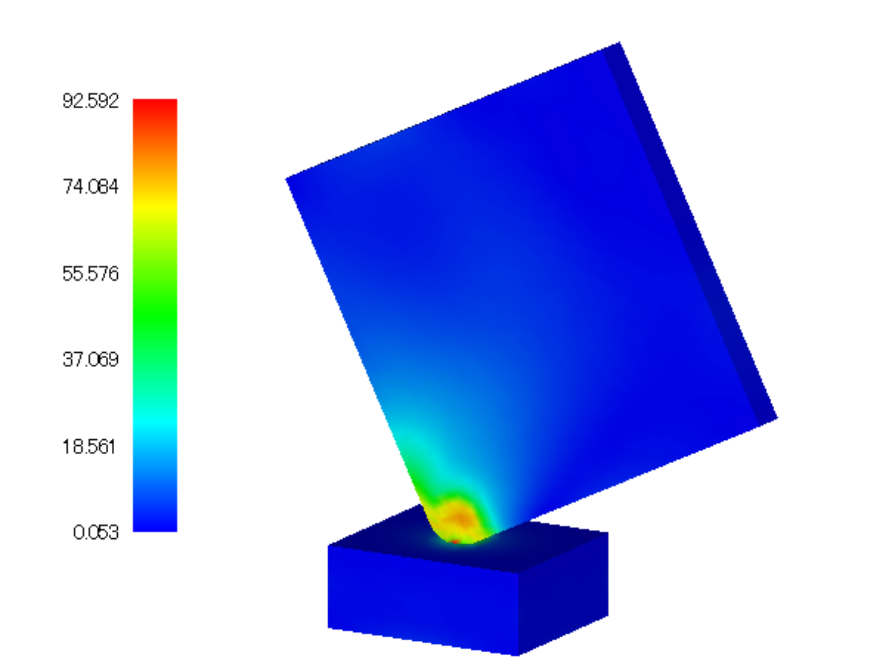

## Nonlinear Contact Dynamic Analysis

Data of `tutorial/14_dynamic_plate_contact/` is used to implement this analysis.

### Analysis Object

A drop impact analysis of a square plate on a floor is the subject of the analysis. The shape is shown in Figure 4.14.1, and the mesh data is shown in Figure 4.14.2. Hexahedral linear elements are used for the mesh, and the scale of the mesh consists of 8,232 elements and 10,712 nodes.

<div style="text-align: center;">
<br>
Figure 4.14.1: Shape of Floor and Square Plate
</div>

<div style="text-align: center;">
<br>
Figure 4.14.2: Mesh Data of Floor and Square Plate
</div>

### Analysis Content

An initial velocity of 4,427 mm/s is set for the square plate of the analysis object, to implement the contact dynamic analysis. The analysis control data is shown in the following.

```
!! Control File for FISTR
!VERSION
                  3
!WRITE,LOG,FREQUENCY=20
!WRITE,RESULT,FREQUENCY=20
!SOLUTION, TYPE=DYNAMIC
!DYNAMIC, TYPE=NONLINEAR
  1 , 1
  0.0, 1.0, 200, 1.0000e-8
  0.65, 0.330625
  1, 1, 0.0, 0.0
  20, 2621, 1
  1, 1, 1, 1, 1, 1
!BOUNDARY, GRPID = 1
  bottom, 1, 3, 0.0
!VELOCITY, TYPE = INITIAL
  plate, 3, 3, -4427.0
!CONTACT_ALGO, TYPE=SLAGRANGE
!CONTACT, GRPID=1, INTERACTION=FSLID
  CP1, 0.0, 1.0e+5
!STEP, CONVERG=1.0e-8, ITMAX=100
  BOUNDARY, 1
  CONTACT, 1
!MATERIAL, NAME = M1
!ELASTIC
  2.00000e+5, 0.3
!PLASTIC
  1.0e+8, 0.0
!MATERIAL, NAME = M2
!ELASTIC
  1.16992e+5, 0.3
!PLASTIC
  70.0, 0.0
!SOLVER,METHOD=MUMPS
```

### Analysis Results

The contour figure of the Mises stress at the time of the drop impact is shown in Figure
4.14.3. A portion of the energy output file (dyna_energy.txt) of the monitoring node is shown in the following as numeric data of the analysis results.

<div style="text-align: center;">
<br>
Figure 4.14.3: Mises Stress at time of Drop Impact
</div>
