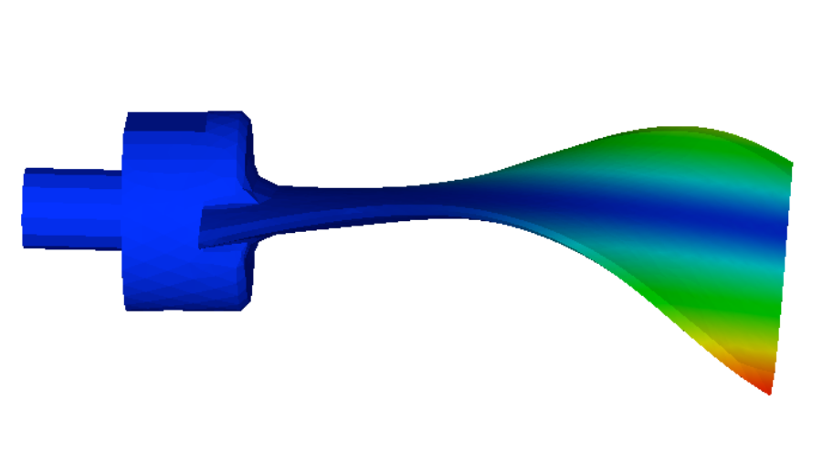
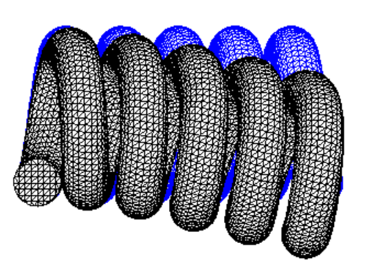
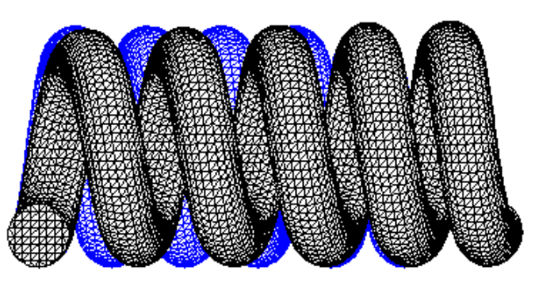
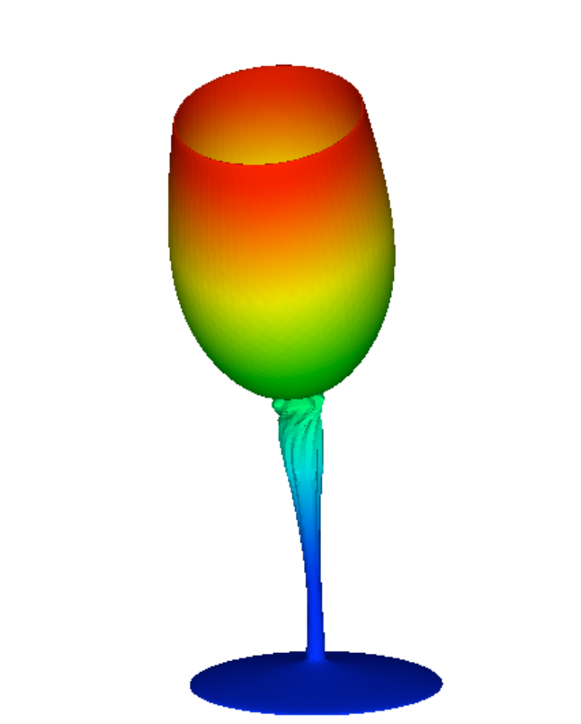
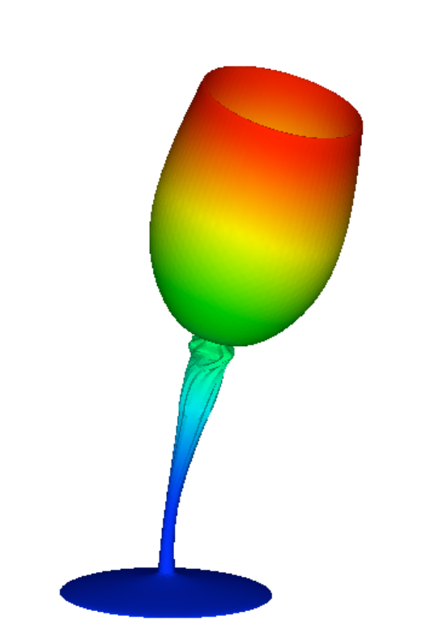
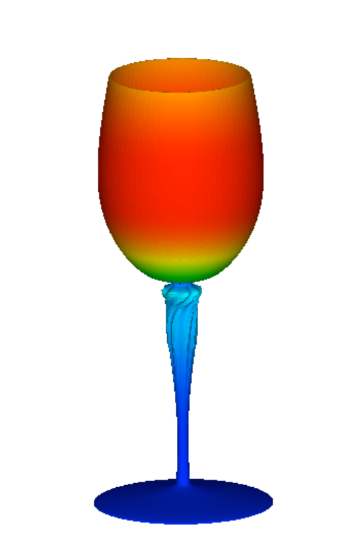
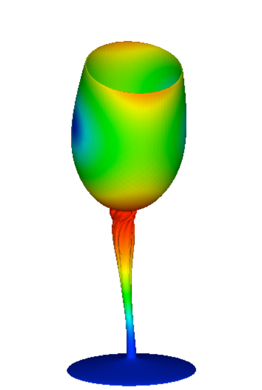
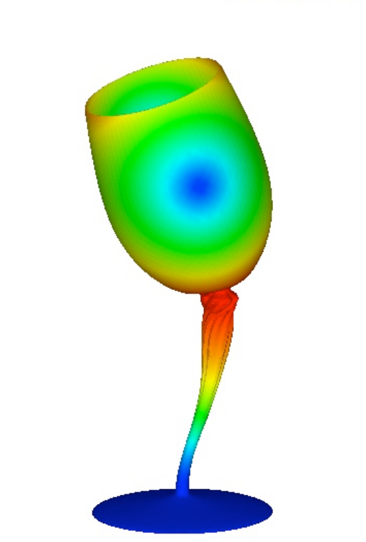

## Example of Actual Model for Eigenvalue Analysis

### Analysis Model

A list of the verification examples of an actual model for the eigenvalue analysis is shown in Table 9.3.1. Among these models, the shapes of the model of EX07 (turbine rotor) and EX08 (spring) are shown in Figure 9.3.1 and Figure 9.3.2. The same shapes as in the verification example for the elastic static analysis where the verification contents are the same is used for the shape of the other models, and is already shown in the above. In order to execute an example of element type 731 and 741, a separate direct method solver is required.

Table 9.3.1: Verification Example of Actual Model for Eigenvalue Analysis

| Case Name | Element Type | Verification Model  | No. of Nodes | No. of Degrees of Freedom |
|:--|:--|:--|:--|:--|
| EX06     | 342        | Turbine blade       | 10,095  | 30,285 |
| EX07     | 361        | Turbine rotor       | 127,440 | 382,320 |
| EX08     | 342        | Spring              | 78,771  | 236,313 |
| EX09     | 741        | Cylindrical shell   | 10,100  | 60,600 |
| EX10A    | 731        | Wine glass (coarse) | 7,240   | 43,440 |
| EX10B    | 731        | Wine glass (midium) | 48,803  | 292,818 |

 
Figure 9.3.1: Turbine Rotor (EX07)

 
Figure 9.3.2: Spring (EX08)

### Analysis Results

The vibration mode and natural frequency are shown in the following.

#### (1) EX06 Turbine blade

|  |  |
|--|--|
|||
|(a) Mode 1 (1170 kHz)                            |(b) Mode 2(3250kHz)                              |
|                                                 |                                                 |
|||
|(c) Mode 3(4130kHz)                              |(d) Mode 4(4140kHz)                              | 
|| |
|(e) Mode 5(8210kHz)                              | |

Figure 9.3.3: EX06 Turbine Blade Vibration Mode

#### (2) EX07 Turbine rotor

|  |  |
|--|--|
|||
|(a) Mode 1(1067Hz)|(b) Mode 2(1072Hz)|
|  |  |
|||
|(c) Mode 3(1072Hz)|(d) Mode 4(1093Hz)|
|  |  |
|| |
|(e) Mode 5(1093Hz)| |
|  |  |

Figure 9.3.4: EX07 Turbine Rotor Vibration Mode

#### EX08 Spring

|  |  |  |
|--|--|--|
|Mode 1 (445Hz)                                   |Mode 2 (446Hz)                                   |Mode 3 (908Hz)                                   |
||||
|  |  |
|Mode 4 (985Hz)                                   |Mode 5 (1819Hz)                                  |   |
|||   |

|  | FrontISTR | NASTRAN |
|--|----------:|--------:|
| 1|445 Hz     |445 Hz    |
| 2|446 Hz     |446 Hz    |
| 3|908 Hz     |908 Hz    |
| 4|985 Hz     |986 Hz    |
| 5|1810 Hz    |1810 Hz   |

Figure 9.3.5: EX08 Spring Vibration Mode

#### (4) EX09 Cylindrical shell

 
(a) Mode 1, 2 (109 Hz)

 
(b) Mode 3,4(570Hz)

 
(c) Mode 5(615Hz)

Figure 9.3.6: EX09 Cylindrical Shell Vibration Mode

#### EX10A Wine glass

|   |   |   |
|---|---|---|
||||
|(a) Mode 1(101Hz)|(b) Mode 2(102Hz)|(c) Mode 3(354Hz)|
|   |   |   |
|||   |
|(d) Mode 4(1335Hz)|(e) Mode 5(1336Hz)|   |

Figure 9.3.7: EX10A Wine Glass Vibration Mode

