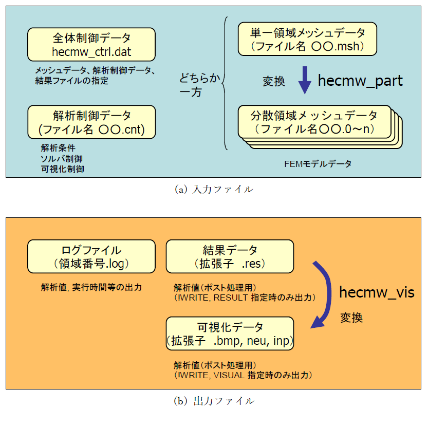

## 解析の流れと入出力データの概略


### 解析の流れ

ここでは、FrontISTRの解析の流れについて説明します。

1. FrontISTRならびに、周辺プログラムの実行ファイルのダウンロード、またはインストールを行います。
1. 指定のフォーマットに従って作成した入力ファイル (mesh.mshデータ、mesh.cntデータ、hecmw_ctrl.datなど) を準備します。
1. 並列計算を行う場合は、領域分割（メッシュパーティショニング）を行うプログラム hecmw_part1 を実行します。逐次計算の場合、この手順は必要ありません。
1. FrontISTRを実行します。
1. 並列計算を行った場合は、データマージプログラム rmerge を実行します。出力時に単一ファイルに出力する可視化フォーマットや、逐次計算の場合、この手順は必要ありません。


### 入力データの概略

ここでは、FrontISTRの入力ファイルの概略について説明します。

FrontISTRは入力ファイルとして、全体制御データ、メッシュデータおよび解析制御データの3つのファイルが必要である。

モデル全体を単体のCPUで解析する場合には、単一領域メッシュファイルを使用する。
複数のCPUで並列実行する場合には、HEC-MWの領域分割ツールである hecmw_partプログラムにより、予め単一領域メッシュデータを領域分割し、その結果としての分散領域メッシュデータを用いる。

hecmw_partの詳細はHEC-MW領域分割マニュアルを参照すること。

全体制御データ、解析制御データおよび単一領域メッシュデータはテキストデータであり、ユーザーはこのマニュアルの説明にしたがって、適当なエディタを用いて作成、編集することが可能であるが、FrontISTRの付属のツールとして、市販のプリポストプロセッサである Femapのサポートするニュートラルファイル（\*.neu）をFrontISTR入力データに変換する neu2fstr を用いて作成することもできる。

neu2fstrの詳細は neu2fstr マニュアルを参照すること。


### 出力ファイルの概略

ここでは、FrontISTRの出力ファイルの概略について説明します。  

FrontISTRの実行により、ログデータファイルと結果データファイルおよび可視化データを出力する。
これらの出力の有無、内容は、解析制御ファイル中の記述および解析内容に依存する。可視化データは FrontISTRの実行後、作成された結果ファイルより、HEC-MW付属のツールであるhecmw_vis プログラムにより生成することも出来る。hecmw_vis の詳細はHEC-MW 可視化マニュアルを参照すること。

{.center width="80%"}

図 3.1.1　FrontISTR入出力ファイル


以下、上記入出力ファイルの概要について説明する。

### 全体制御データ

このファイルは、メッシュデータと解析制御データの入力ファイルおよび結果出力ファイルを指定する。

全体制御データの詳細は第5章に記載する。

```
#分散メッシュデータファイルのヘッダーの定義（領域分散モデルでは必須）
!MESH, NAME=fstrMSH,TYPE=HECMW-DIST
mesh.msh

#メッシュデータファイル名の定義（単一領域モデルでは必須）
!MESH, NAME=fstrMSH,TYPE=HECMW-ENTIRE
mesh.msh

#解析制御データファイル名の定義（必須）
!CONTROL,NAME=fstrCNT
mesh.cnt

#解析結果データファイル名の定義（任意）
!RESULT,NAME=fstrRES,IO=OUT
mesh.res

#可視化データファイル名の定義（任意）
!RESULT,NAME=vis_out,IO=OUT
mesh.vis
```

### メッシュデータ

このファイルは有限要素メッシュを定義し、その材料データとセクションデータを定義する。
また、解析制御データにて使用するグループデータを定義する。

メッシュデータの詳細は第6章に記載する。

```
#メッシュタイトルの設定
!HEADER
TEST MODEL A361

#節点座標の定義
!NODE
1, 0.0, 0.0, 0.0

#要素コネクティビティの定義
!ELEMENT, TYPE=361
1001, 1, 2, 3, 4, 5, 6, 7, 8

#セクションデータの定義
!SECTION, TYPE=SOLID, EGRP=ALL, MATERIAL=M1

#材料データの定義
!MATERIAL, NAME=M1, ITEM=1
!ITEM=1, SUBITEM=2
4000., 0.3

#節点グループの定義
!NGROUP, NGRP=FIX, GENERATE
1001, 1201, 50

#要素グループの定義
!EGROUP, EGRP=TOP, GENERATE
1001, 1201, 1

!END
```

### 解析制御データ

このファイルは解析の種別、変位境界条件、集中荷重など解析制御データを定義する。
またソルバーの制御やビジュアライザーの制御データも、解析制御データに含まれる。

解析制御データの詳細は第7章に記載する。

```
#解析の種別の指定
!SOLUTION, TYPE=STATIC

#変位境界条件の定義
!BOUNDARY
FIX, 1, 3, 0.0

#集中荷重条件の定義
!CLOAD
CL1, 1, -1.0

#分布荷重条件の定義
!DLOAD
ALL, BX, 1.0

#参照温度の定義
!REFTEMP
20.0

#熱荷重（温度）条件の定義
!TEMPERATURE
ALL, 100.0

#ソルバーの制御
!SOLVER, METHOD=CG, PRECOND=1, TIMELOG=YES, ITERLOG=YES
10000,2
1.0e-8,1.0,0.0

#結果データ出力
!WRITE,RESULT

#メモリ渡しビジュアライザ制御
!WRITE, VISUAL

#以下、ビジュアライザーの制御データ
!visual
!surface_num =1
!surface_style =1

!END
```

### 出力ファイル

実行が終了すると、ログファイル(拡張子 .log)が出力される。
また、出力の指示により可視化用解析結果ファイル（拡張子.res）が出力される。
ログファイルは、以下に示す内容が出力される。

-  変位、ひずみ、応力成分の最大・最小値
-  固有値
-  固有ベクトル値

### 実行方法

#### FrontISTR の準備

FrontISTR の本体（Linux 版は fistr1、Windows 版はfistr1.exe）をパスの通ったディレクトリまたは実行時のカレントディレクトリに格納する。

#### 入力ファイルの準備

3種類の入力ファイル hecmw_ctrl.dat、解析制御データおよび（単一または分散領域）メッシュデータ用意し、hecmw_ctrl.dat
に解析制御データとメッシュデータのファイル名（パス名）を記述する。
必要ならば、解析結果データファイルおよび可視化データファイルの指定も行っておくこと。

#### 単一領域の解析実行

Linux のターミナルもしくは Windows
のコマンドプロンプトを立ち上げ、入力ファイルのあるディレクトリへカレントディレクトリを移動し、下記のように実行する
（ただし'$' はプロンプトを表す）

例） Linux の場合

```
$ ./fistr1
```

例） Window の場合

```
$ fistr１
```

#### Linux 上での並列実行

Linux 版では予め MPIをインストールした環境で、並列実行用にコンパイルしなければならない。
コンパイル方法の詳細はインストールマニュアルを参照のこと。
実行は、MPIの実行環境の設定に依存する。以下に4領域での実行例を示す。

```
$ mpirun -np 4 ./fistr1
```

#### Windows 上での並列実行

Windows版では、MPICH2 のライブラリを下記 URLよりダウンロードし、インストールする必要がある。
並列実行の方法についてはMPICH2 のマニュアルを参照すること。

http://www-unix.mcs.anl.gov/mpi/mpich/

#### 並列接触解析の実行 (Ver.3.xからのユーザーへの注意)

Ver.3.xまでは、並列接触解析の場合のみ、分散メッシュデータではなく、単一領域メッシュデータを入力する必要があったが、
Ver.5.xからは、並列接触解析の場合も、他の解析と同様に、分散メッシュデータを入力する使用方法に統一された。

### 実行時の制約

FrontISTR Ver.3.5において、正常実行が確認できている機能と要素タイプを表
3.1.1に示す。

表 3.1.1　解析機能別対応要素一覧

| 要素番号 | 線形静解析 | 固有値解析 | 熱伝導解析 | 線形動解析 | 周波数応答解析 | 材料非線形 幾何学的非線形 静/動解析 | 境界非線形 静/動解析 |
|----------|------------|------------|------------|------------|----------------|-------------------------------------|----------------------|
| 111      | ×          | ×          | ○          | ×          | ×              | ×                                   | ×                    |
| 112      | ×          | ×          | ×          | ×          | ×              | ×                                   | ×                    |
| 231      | ○          | ○          | ○          | ○          | ×              | ×                                   | ×                    |
| 232      | ○          | ○          | ○          | ○          | ×              | ×                                   | ×                    |
| 241      | ○          | ○          | ○          | ○          | ×              | ×                                   | ×                    |
| 242      | ○          | ○          | ○          | ○          | ×              | ×                                   | ×                    |
| 301      | ○          | ×          | ×          | ○          | ×              | ○                                   | ○                    |
| 341      | ○          | ○          | ○          | ○          | ○              | ○                                   | ○                    |
| 342      | ○          | ○          | ○          | ○          | ○              | ○                                   | ×                    |
| 351      | ○          | ○          | ○          | ○          | ○              | ○                                   | ○                    |
| 352      | ○          | ○          | ○          | ○          | ○              | ○                                   | ×                    |
| 361      | ○          | ○          | ○          | ○          | ○              | ○                                   | ○                    |
| 362      | ○          | ○          | ○          | ○          | ○              | ○                                   | ×                    |
| 541      | ×          | ×          | ○          | ×          | ×              | ×                                   | ×                    |
| 542      | ×          | ×          | ×          | ×          | ×              | ×                                   | ×                    |
| 611      | ○          | ×          | ×          | ○          | ×              | ×                                   | ×                    |
| 641      | ○          | ×          | ×          | ○          | ×              | ×                                   | ×                    |
| 731      | ○          | ○          | ○          | ○          | ×              | ×                                   | ×                    |
| 732      | ×          | ×          | ×          | ×          | ×              | ×                                   | ×                    |
| 741      | ○          | ○          | ○          | ○          | ×              | ×                                   | ×                    |
| 743      | ○          | ○          | ×          | ○          | ×              | ×                                   | ×                    |
| 761      | ○          | ×          | ×          | ×          | ×              | ×                                   | ×                    |
| 781      | ○          | ×          | ×          | ×          | ×              | ×                                   | ×                    |

注）○：対応×：未対応

-   線形動解析では要素番号731、741、743で並列計算は未対応であるが、それ以外の要素番号での並列計算は可能である。

-   接触解析についての並列計算は直接法のみ対応している。

-   要素番号611は熱応力、重力、圧力、遠心力を考慮した解析には対応していない。

-   要素番号641は圧力、遠心力を考慮した解析には対応していない。

-   梁要素をソリッド要素と混在して解析を行う場合、利用可能な梁要素は要素番号641である。

-   シェル要素をソリッド要素と混在して解析を行う場合、利用可能なシェル要素は要素番号761および781である。


## 解析手順

### 逐次処理による解析

#### 実行の流れ

FrontISTRを利用した、シングルプロセッサーの逐次処理による実行の流れを図3.1.2に示します。


図3.1.2　逐次処理による実行の流れ

#### 準備する入力ファイル

##### (1) 全体制御データ（拡張子dat）

このファイルではメッシュデータと解析制御データの入力ファイルおよび解析結果出力ファイルを指定します。ファイル名は固定のhecmw_ctrl.datです。

全体制御データの例を以下に示します。本例では、FrontSTRは単一領域メッシュデータmodel.mshと解析制御データmodel.cntを読み込み、解析結果データmodel.res.0.1を書き出します。また、hecmw_visは単一領域メッシュデータmodel.mshと解析結果データmodel.res.0.1を読み込み、出力指定に対応するmodel_vis_psf.0000.(拡張子)を書き出します。詳細はユーザーマニュアル第5章を参照ください。

##### (2) 単一領域メッシュデータ（拡張子msh）

このファイルでは、解析対象の全体メッシュ構成、材料データ、解析制御データで使用するグループデータなどを定義します。詳細はユーザーマニュアル第6章を参照ください。

##### (3) 解析制御データ（拡張子cnt）

このファイルでは、解析種別、変位境界条件、荷重境界条件などを定義します。また、ソルバーの制御データやビジュアライザーの制御データも指定します。3章で解析制御データの例を示します。詳細はユーザーマニュアル第7章を参照ください。

##### (4) 可視化制御データ（拡張子ini）

このファイルでは、hecmw_visの制御データを指定します。ディフォルトのファイル名はhecmw_vis.iniです。可視化制御データの例を以下に示します。本例では、MicroAVS用の非構造格子型データ（拡張子inp）を出力します。詳細はユーザーマニュアル7.3.3節および7.4.7節を参照ください。

#### 実行方法

FrontISTRは、入力ファイルがあるディレクトリにおいて以下のコマンドラインで実行します。

```
$ fistr1
```

可視化はふたつの方法で実行することができます。ひとつは、FrontISTRの後処理として実行する場合で、解析制御データに

```txt
!WRITE, VISUAL
```

を指定することにより、自動的に実行されます。この場合、可視化制御データを解析制御データに含めて記述することが必要です。

FrontISTRの実行終了後に可視化を行う場合は、まず解析制御データに

```txt
!WRITE, RESULT
```

を指定し、FrontISTRを実行します。

FrontISTRの実行終了後、入力ファイルと解析結果ファイルがあるディレクトリにおいて以下のコマンドラインでhecmw_visを実行します。

```txt
$ hecmw_vis1
```

#### 出力ファイルの説明

##### (1) 解析結果メッセージファイル（拡張子msg）

本ファイルには、FrontISTRの解析進行過程などのメッセージが出力されます。1回の実行でひとつのファイルが作成され、フィル名は固定のFSTR.msgです。

##### (2) 解析結果ログファイル（拡張子log）

本ファイルには、FrontISTRの節点ごとおよび要素ごとの物理量の解析結果が出力されます。また、物理量の最大/最小値や固有値解析結果も出力されます。動解析の場合、すべてのステップの解析結果が本ファイルに出力されます。1回の実行でひとつのファイルが作成され、フィル名は固定の0.logです。

##### (3) 解析結果ファイル（拡張子なし）

本ファイルは、!WRITE, RESULTオプションを指定した場合に出力されます。

本ファイルには、FrontISTRの節点ごとおよび要素ごとの物理量の解析結果が出力されます。ステップごとにファイルが生成され、ファイル名は全体制御データで指定したファイルヘッダーを用いて、以下のように命名されます。

命名則：(!RESULTで指定したファイルヘッダー).0.(ステップ番号)

例：model.res.0.1

##### (4) 解析結果ビットマップファイル（拡張子bmp）

本ファイルは、可視化制御データで指定した場合に出力されます。

本ファイルには、可視化処理を行ったビットマップデータが出力されます。ファイル名は全体制御データで指定したファイルヘッダーを用いて命名されます。命名則の詳細は、hecmw1のドキュメント（0803_001f_hecmw_PC_cluster_201_vis.pdf）を参照ください。

##### (5) 解析結果非構造格子型データファイル（拡張子inp）

本ファイルは、可視化制御データで指定した場合に出力されます。

本ファイルを用いて、REVOCAP_PrePostやMicroAVSなどでポスト処理が可能です。ファイル名は全体制御データで指定したファイルヘッダーを用いて、以下のように命名されます。

命名則：(!RESULTで指定したファイルヘッダー)_psf.(ステップ番号).inp

例：model_vis_psf.0000.inp

##### (6) 解析結果ニュートラルファイル（拡張子neu）

本ファイルは、可視化制御データで指定した場合に出力されます。

本ファイルを用いて、Femapでポスト処理が可能です。ファイル名は全体制御データで指定したファイルヘッダーを用いて、以下のように命名されます。

命名則：(!RESULTで指定したファイルヘッダー)_psf.(ステップ番号).neu

例：model_vis_psf.0000.neu

注：この他にFSTR.dbgファイルが出力されますが、デバッグ用ですので通常は参照不要です。

*****
### 並列処理による解析

#### 実行の流れ

FrontISTRを利用した、マルチプロセッサーの並列処理による実行の流れを図3.1.3に示します。

図3.1.3 並列処理による実行の流れ

#### 準備する入力ファイル

##### (1) 全体制御データ（拡張子dat）

このファイルではメッシュデータと解析制御データの入力ファイルおよび解析結果出力ファイルを指定します。ファイル名は固定のhecmw_ctrl.datです。

全体制御データの例を以下に示します。本例ではまず、hecmw_partが単一領域メッシュデータmodel.msh
を読み込み、分散領域メッシュデータmodel_8.0～nを書き出します。FrontSTRは分散領域メッシュデータmodel_8.0～nと解析制御データmodel.cntを読み込み、解析結果データmodel.res.0～n.1を書き出します。また、hecmw_visは分散領域メッシュデータmodel_8.0～nと解析結果データmodel.res.0～n.1を読み込み、出力指定に対応するmodel_vis_psf.0000.(拡張子)を書き出します。詳細はユーザーマニュアル第5章を参照ください。

##### (2) 単一領域メッシュデータ（拡張子msh）

このファイルでは、解析対象の全体メッシュ構成、材料データ、解析制御データで使用するグループデータなどを定義します。詳細はユーザーマニュアル第6章を参照ください。

##### (3) 解析制御データ（拡張子cnt）

このファイルでは、解析種別、変位境界条件、荷重境界条件などを定義します。また、ソルバーの制御データやビジュアライザーの制御データも指定します。3章で解析制御データの例を示します。詳細はユーザーマニュアル第7章を参照ください。

##### (4) 領域分割ユーティリティ制御データ（拡張子dat）

このファイルでは、hecmw_partの制御データを指定します。ファイル名は固定のhecmw_part_ctrl.datです。領域分割ユーティリティ制御データの例を以下に示します。本例では、領域分割法PMETISにより、単一領域を8分割します。また、領域分割後のメッシュを表示するためのファイルmodel_8.inpを出力します。詳細はhecmw1のドキュメント（0803_001x_hecmw_part_201_users.pdf）を参照ください。

##### (5) 可視化制御データ（拡張子ini）

このファイルでは、hecmw_visの制御データを指定します。ディフォルトのファイル名はhecmw_vis.iniです。可視化制御データの例を以下に示します。本例では、MicroAVS用の非構造格子型データ（拡張子inp）を出力します。詳細はユーザーマニュアル7.3.3節および7.4.7節を参照ください。

#### 実行方法

hecmw_partは、入力ファイルがあるディレクトリにおいて以下のコマンドラインで実行します。

```
$ hecmw_part1
```

FrontISTRは、入力ファイルがあるディレクトリにおいて以下のコマンドラインで実行します。なお、MPIプロセスの実行方法はそれぞれの環境に合わせて、修正が必要です。

```
$ mpirun –np 8 fistr1
```

可視化はふたつの方法で実行することができます。ひとつは、FrontISTRの後処理として実行する場合で、解析制御データに

!WRITE, VISUAL

を指定することにより、自動的に実行されます。この場合、可視化制御データを解析制御データに含めて記述することが必要です。

FrontISTRの実行終了後に可視化を行う場合は、まず解析制御データに

!WRITE, RESULT

を指定し、FrontISTRを実行します。

FrontISTRの実行終了後、入力ファイルと解析結果ファイルがあるディレクトリにおいて以下のコマンドラインでhecmw_visを実行します。なお、MPIプロセスの実行方法はそれぞれの環境に合わせて、修正が必要です。

```
$ mpirun –np 8 hecmw_vis1
```

#### 出力ファイルの説明

##### (1) 領域分割ユーティリティログファイル（拡張子log）

本ファイルには、hecmw_partの解析進行過程などのメッセージが出力されます。フィル名は固定のhecmw_part.logです。

##### (2) 分散領域メッシュファイル（拡張子なし）

本ファイルには、領域分割されたメッシュ構成、材料データ、解析制御データで使用するグループデータなどが出力されます。ファイルは分散領域ごとに作成され、ファイル名は全体制御データで指定したファイルヘッダーを用いて、以下のように命名されます。

命名則：(!MESHで指定したファイルヘッダー).(分散領域番号)

例：model_8.0　～　model_8.7

##### (3) 領域分割メッシュ表示用ファイル（拡張子inp）

本ファイルには、領域分割されたメッシュを表示するための非構造格子型データが出力されます。MicroAVSなどで表示できます。

##### (4) 解析結果メッセージファイル（拡張子msg）

本ファイルには、FrontISTRの解析進行過程などのメッセージが出力されます。1回の実行でひとつのファイルが作成され、フィル名は固定のFSTR.msgです。

##### (5) 解析結果ログファイル（拡張子log）

本ファイルには、FrontISTRの節点ごとおよび要素ごとの物理量の解析結果が出力されます。また、物理量の最大/最小値や固有値解析結果も出力されます。動解析の場合、すべてのステップの解析結果が本ファイルに出力されます。ファイルは分散領域ごとに作成され、フィル名は固定のn.log（nは分散領域番号）です。

##### (6) 解析結果ファイル（拡張子なし）

本ファイルは、!WRITE, RESULTオプションを指定した場合に出力されます。

本ファイルには、FrontISTRの節点ごとおよび要素ごとの物理量の解析結果が出力されます。分散領域ごとかつステップごとにファイルが生成され、ファイル名は全体制御データで指定したファイルヘッダーを用いて、以下のように命名されます。

命名則：(!RESULTで指定したファイルヘッダー).(分散領域番号).(ステップ番号)

例：model_8.res.0.1　～　model_8.res.7.1

##### (7) 解析結果ビットマップファイル（拡張子bmp）

本ファイルは、可視化制御データで指定した場合に出力されます。

本ファイルには、可視化処理を行ったビットマップデータが出力されます。ファイル名は全体制御データで指定したファイルヘッダーを用いて命名されます。命名則の詳細は、hecmw1のドキュメント（0803_001f_hecmw_PC_cluster_201_vis.pdf）を参照ください。

##### (8) 解析結果非構造格子型データファイル（拡張子inp）

本ファイルは、可視化制御データで指定した場合に出力されます。

本ファイルを用いて、REVOCAP_PrePostやMicroAVSなどでポスト処理が可能です。ファイル名は全体制御データで指定したファイルヘッダーを用いて、以下のように命名されます。

命名則：(!RESULTで指定したファイルヘッダー)_psf.(ステップ番号).inp

例：model_vis_psf.0000.inp

##### (9) 解析結果ニュートラルファイル（拡張子neu）

本ファイルは、可視化制御データで指定した場合に出力されます。

本ファイルを用いて、Femapでポスト処理が可能です。ファイル名は全体制御データで指定したファイルヘッダーを用いて、以下のように命名されます。

命名則：(!RESULTで指定したファイルヘッダー)_psf.(ステップ番号).neu

例：model_vis_psf.0000.neu

注：この他にFSTR.dbg.0～nファイルが出力されますが、デバッグ用ですので通常は参照不要です。


