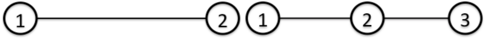
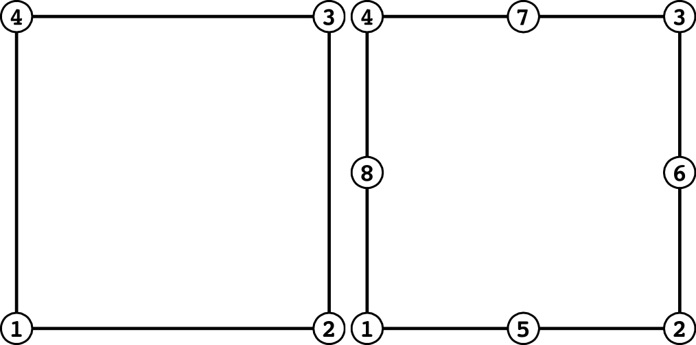
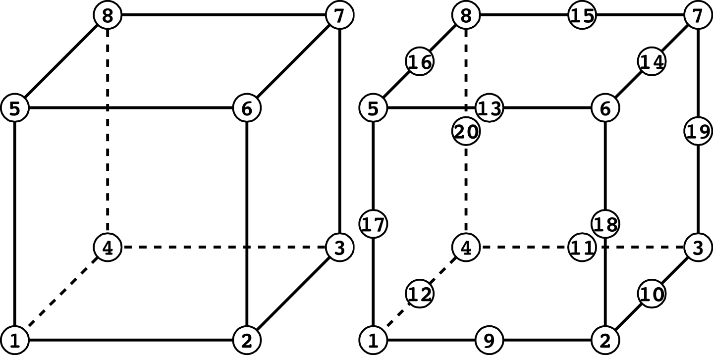
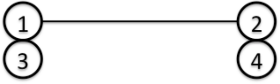
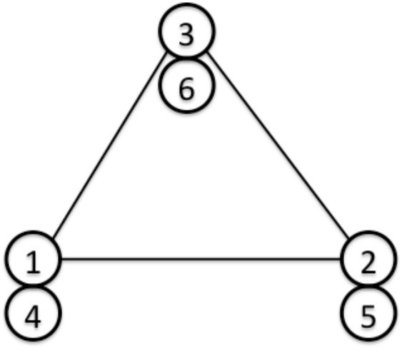
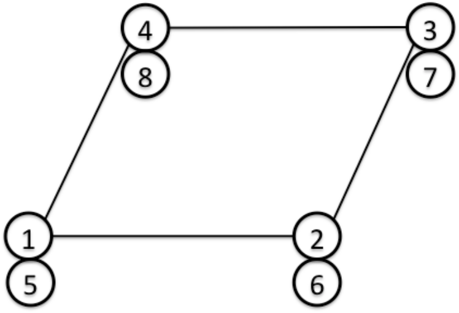

# 要素ライブラリおよび材料データ

## 要素ライブラリ

FrontISTRは、表 4.1.1に示す要素群を解析に使用することができる。
FrontISTRはメッシュデータをHEC-MWを使用して入力するので、以下の要素ライブラリの記述はHEC-MWの説明に準じたものである。
要素ライブラリを図 4.1.1に、要素コネクティビティおよび面番号の定義を 図 4.1.2に示す。

表 4.1.1　要素ライブラリ一覧

| 要素種類             | 要素番号  |説明                                         |
|:---------------------|:----------|:--------------------------------------------|
| 線要素               | 111       |2節点リンク要素                              |
|                      | 112       |3節点リンク要素                              |
| 平面要素             | 231       |3節点三角形要素                              |
|                      | 232       |6節点三角形二次要素                          |
|                      | 241       |4節点四角形要素                              |
|                      | 242       |8節点四角形二次要素                          |
| ソリッド要素         | 301       |2節点トラス要素                              |
|                      | 341       |4節点四面体要素                              |
|                      | 342       |10節点四面体二次要素                         |
|                      | 351       |6節点五面体要素                              |
|                      | 352       |15節点五面体二次要素                         |
|                      | 361       |8節点六面体要素                              |
|                      | 362       |20節点六面体二次要素                         |
| インターフェース要素 | 541       |四角形断面一次要素                           |
|                      | 542       |四角形断面二次要素                           |
| 梁要素               | 611       |2節点梁要素                                  |
|                      | 641       |2節点梁要素（3自由度節点4点による）          |
| シェル要素           | 731       |3節点三次元一次要素                          |
|                      | 732       |6節点三次元二次要素                          |
|                      | 741       |4節点三次元一次要素                          |
|                      | 743       |9節点三次元二次要素                          |
|                      | 761       |3節点三次元一次要素（3自由度節点6点による）  |
|                      | 781       |4節点三次元一次要素（3自由度節点8点による）  |

<div style="text-align:center;"></div>
図 4.1.1　要素ライブラリ

### (線要素)

<div style="text-align:center;"></div>

### (三角形平面要素)

<div style="text-align:center;"></div>

| 面番号 | 一次  | 二次      |
|--------|-------|-----------|
| 1      | 1 - 2 | 1 - 6 - 2 |
| 2      | 2 - 3 | 2 - 4 - 3 |
| 3      | 3 - 1 | 3 - 5 - 1 |

### (四角形平面要素)

<div style="text-align:center;"></div>

| 面番号 | 一次  | 二次      |
|--------|-------|-----------|
| 1      | 1 - 2 | 1 - 5 - 2 |
| 2      | 2 - 3 | 2 - 6 - 3 |
| 3      | 3 - 4 | 3 - 7 - 4 |
| 4      | 4 - 1 | 4 - 8 - 1 |

### (四面体要素)

<div style="text-align:center;"></div>

| 面番号 | 一次      | 二次                   |
|--------|-----------|------------------------|
|1       | 1 - 2 - 3 | 1 - 7 - 2 - 5 - 3 - 6  |
|2       | 1 - 2 - 4 | 1 - 7 - 2 - 9 - 4 - 8  |
|3       | 2 - 3 - 4 | 2 - 5 - 3 - 10 - 4 - 9 |
|4       | 3 - 1 - 4 | 3 - 6 - 1 - 10 - 4 - 8 |

### (五面体要素)

<div style="text-align:center;"></div>

| 面番号 | 一次          | 二次                              |
|--------|---------------|-----------------------------------|
| 1      | 1 - 2 - 3     | 1 - 9 - 2 - 7 - 3 - 8             |
| 2      | 4 - 5 - 6     | 4 - 12 - 5 - 10 - 6 - 11          |
| 3      | 1 - 2 - 5 - 4 | 1 - 9 - 2 - 14 - 5 - 12  - 4 - 13 |
| 4      | 2 - 3 - 6 - 5 | 2 - 7 - 3 - 15 - 6 - 10  - 5 - 14 |
| 5      | 3 - 1 - 4 - 6 | 3 - 8 - 1 - 13 - 4 - 11  - 6 - 15 |

### (六面体要素)

<div style="text-align:center;"></div>

| 面番号 | 一次          | 二次                              |
|--------|---------------|-----------------------------------|
| 1      | 1 - 2 - 3 - 4 | 1 - 9 - 2 - 10 - 3 - 11 - 4 - 12  |
| 2      | 5 - 6 - 7 - 8 | 5 - 13 - 6 - 14 - 7 - 15 - 8 - 16 |
| 3      | 1 - 2 - 6 - 5 | 1 - 9 - 2 - 18 - 6 - 13 - 5 - 17  |
| 4      | 2 - 3 - 7 - 6 | 2 - 10 - 3 - 19 - 7 - 14 - 6 - 18 |
| 5      | 3 - 4 - 8 - 7 | 3 - 11 - 4 - 20 - 8 - 15 - 7 - 19 |
| 6      | 4 - 1 - 5 - 8 | 4 - 12 - 1 - 17 - 5 - 16 - 8 - 20 |

### (梁要素)

<div style="text-align:center;"></div>

### (3自由度節点による梁要素)

<div style="text-align:center;"></div>

節点1, 2は並進自由度、節点3, 4は回転自由度

### (三角形シェル要素)

<div style="text-align:center;"></div>

| Surface No. |  Linear             | Quadratic                       |
|-------------|---------------------|---------------------------------|
| 1           | 1 - 2 - 3 \[front\] | 1 - 6 - 2 - 4 - 3 - 5 \[front\] |
| 2           | 3 - 2 - 1 \[back\]  | 3 - 4 - 2 - 6 - 1 - 5 \[back\]  |

### (3自由度節点による三角形シェル要素)

<div style="text-align:center;"></div>

節点1, 2, 3は並進自由度、節点4, 5, 6は回転自由度

| Surface No. | Linear              |
|-------------|---------------------|
| 1           | 1 - 2 - 3 \[front\] |
| 2           | 3 - 2 - 1 \[back\]  |

### (四角形シェル要素)

<div style="text-align:center;"></div>

| Surface No. | Linear                  | Quadratic                               |
|-------------|-------------------------|-----------------------------------------|
| 1           | 1 - 2 - 3 - 4 \[front\] | 1 - 5 - 2 - 6 - 3 - 7 - 4 - 8 \[front\] |
| 2           | 4 - 3 - 2 - 1 \[back\]  | 4 - 7 - 3 - 6 - 2 - 5 - 1 - 8 \[back\]  |

### (3自由度節点による四角形シェル要素)

<div style="text-align:center;"></div>

節点1, 2, 3, 4は並進自由度、節点5, 6, 7, 8は回転自由度

| Surface No. | Linear                  |
|-------------|-------------------------|
| 1           | 1 - 2 - 3 - 4 \[front\] |
| 2           | 4 - 3 - 2 - 1 \[back\]  |

図 4.1.2　コネクティビティおよび面番号

## 材料データ

### 弾性静解析、線形動的解析および固有値解析

FrontISTRの弾性静解析および固有値解析では、等方性弾性材料を使用し、要素ごとにヤング率、ポアソン比、密度、線膨張係数を定義する必要がある。
これらの材料物性値はメッシュデータのヘッダー`!SECTION`と`!MATERIAL`にて定義する。以下にその例を示す。

```
#SECTIONの定義
!SECTION, TYPE=SOLID, EGRP=ALL, MATERIAL=M1
```

上記の`!SECTION,`では、ソリッドタイプの要素で、グループ名`=ALL`に所属する要素の、材料データ名を`M1`とすることを意味する。

次に材料データの定義方法を示す。

```
#材料名M1の材料では3種の物値を定義の意
!MATERIAL, NAME=M1, ITEM=3

#!ITEM=1ではヤング率とポアソン比を定義（必須）
!ITEM=1, SUBITEM=2
  4000., 0.3

#!ITEM=2で質量密度を定義すること（ITEM=3のときには必須）
!ITEM=2
  8.0102E-10

#!ITEM=3で線膨張係数を定義すること
!ITEM=3
  1.0E-5
```

各`ITEM`の番号と物性種別が対応しており、`ITEM`番号さえ正しければ定義する順番は任意である。
ただし、`ITEM=1`内ではヤング率、ポアソン比の順に定義しなければならない。

### 熱伝導解析

FrontISTRの熱伝導解析では、温度依存性を考慮した等方性材料が使用できる。
定義する物性値はリンク、平面、ソリッドおよびシェル要素では、密度、比熱および熱伝導率を、インターフェース要素ではギャップ熱伝達係数とギャップ輻射係数である。
これらの物性値の定義方法の例を以下に示す。

##### リンク、平面およびソリッド要素の場合

`!SECTION`と`!MATERIAL`ヘッダーにて定義する。

```
#セクションの定義
!SECTION, TYPE=SOLID, EGRP=ALL, MATERIAL=M1
```

上記の`!SECTION`では、ソリッドタイプの要素で、グループ名`=ALL`に所属する要素の、材料データ名を`M1`とすることを意味する。
以下、その材料データの定義方法である。

```
#材料名M1の材料では3種の物値を定義の意
!MATERIAL, NAME=M1, ITEM=3

#!ITEM=1では密度と温度を定義（必須）
!ITEM=1, SUBITEM=1
7850., 300.
7790., 500.
7700., 800.

#!ITEM=2では比熱と温度を定義（必須）
!ITEM=2
0.465, 300.
0.528, 500.
0.622, 800.

#!ITEM=3では熱伝導率と温度を定義（必須）
!ITEM=3
43., 300.
38.6, 500.
27.7, 800.
```

FrontISTRでは各`ITEM`の番号により物性の種類を識別しているので、両者の整合がとれていれば定義する順番は任意である。

##### インターフェース要素の場合

`!SECTION`ヘッダーで定義する。（材料データは不要）

```
#セクションの定義
!SECTION, TYPE=INTERFACE, EGRP=GAP
1.0, 20.15, 8.99835E-9, 8.99835E-9
```

上記の`!SECTION`では、インターフェース要素で、グループ名`=GAP`に所属する要素のギャップパラメータを定義している。

  * 第1パラメータ: ギャップ幅
  * 第2パラメータ: ギャップ熱伝達係数
  * 第3パラメータ: ギャップ輻射係数1
  * 第4パラメータ: ギャップ輻射係数2

##### シェル要素の場合

`!SECTION`と`MATERIAL`ヘッダーで定義する。

```
#セクションの定義
!SECTION, TYPE=SHELL, EGRP=SH, MATERIAL=M2
10.0, 5
```

上記の`!SECTION`では、シェルタイプの要素で、グループ名`=SH`に所属する要素の、シェル特性を定義している。

  * 第1パラメータ: シェル厚さ
  * 第2パラメータ: 厚さ方向積分点数

また、同グループに所属する要素の材料物性を、材料データ名を`M2`とすることを意味する。

材料物性の定義方法は、等方性材料による単層シェルの場合は、ソリッド要素の場合と全く同様の指定方法が可能である。
ソリッド要素の説明を参照のこと。

これに加え、異方性材料や、積層シェルのために、以下に示す定義方法が可能である。


** (例) 等方性材料 単層の場合 **

```
!MATERIAL, NAME=M1, ITEM=1
!ITEM=1,SUBITEM=4
0, 200000, 0.3, 2.0
```

  * 第1パラメータ: 等方性0
  * 第2パラメータ: ヤング率
  * 第3パラメータ: ポアソン比
  * 第4パラメータ: シェル厚さ

** (例) 等方性材料 複層の場合(2層) **

```
!MATERIAL, NAME=M1, ITEM=1
!ITEM=1,SUBITEM=7
0, 200000, 0.3, 2.0, 200000, 0.3, 2.0
```

  * 第1パラメータ: 等方性0
  * 第2パラメータ: ヤング率(第1層)
  * 第3パラメータ: ポアソン比(第1層)
  * 第4パラメータ: シェル厚さ(第1層)
  * 第5パラメータ: ヤング率(第2層)
  * 第6パラメータ: ポアソン比(第2層)
  * 第7パラメータシェル厚さ(第2層)

積層数分の材料定数を入力することで，自動的に積層シェルを考慮した解析を行う．

シェルの総厚さは，自動的に各層の総和が入力される．積層順は，シェル法線方向，上から順に積層される．

** (例) 異方性材料 単層の場合 **

```
!MATERIAL, NAME=M1, ITEM=1
!ITEM=1, SUBITEM=9
1, 28600., 0.15, 32.3 , 28600., 12434., 12434., 12434., 0.0
```

  * 第1パラメータ: 異方性1
  * 第2パラメータ: ヤング率E1
  * 第3パラメータ: ポアソン比12
  * 第4パラメータ: シェル厚さ
  * 第5パラメータ: ヤング率E2
  * 第6パラメータ: せん断係数G12
  * 第7パラメータ: せん断係数G23
  * 第8パラメータ: せん断係数G13
  * 第9パラメータ: 異方性角度θ

異方性角度はθ\[degree\]で指定する．

** (例) 異方性材料 複層の場合(2層) **

```
!MATERIAL, NAME=M1, ITEM=1
!ITEM=1, SUBITEM=17
1, 28600., 0.15, 32.3 , 28600., 12434., 12434., 12434., 0.0, 28600., 0.15, 32.3 , 28600., 12434., 12434., 12434., 0.0　
```

  * 第1パラメータ: 異方性1
  * 第2パラメータ: ヤング率E1(第1層)
  * 第3パラメータ: ポアソン比12(第1層)
  * 第4パラメータ: シェル厚さ(第1層)
  * 第5パラメータ: ヤング率E2(第1層)
  * 第6パラメータ: せん断係数G12(第1層)
  * 第7パラメータ: せん断係数G23(第1層)
  * 第8パラメータ: せん断係数G13(第1層)
  * 第9パラメータ: 異方性角度θ(第1層)
  * 第10パラメータ: ヤング率E1(第2層)
  * 第11パラメータ: ポアソン比12(第2層)
  * 第12パラメータ: シェル厚さ(第2層)
  * 第13パラメータ: ヤング率E2(第2層)
  * 第14パラメータ: せん断係数G12(第2層)
  * 第15パラメータ: せん断係数G23(第2層)
  * 第16パラメータ: せん断係数G13(第2層)
  * 第17パラメータ: 異方性角度θ(第2層)

### 非線形静解析

FrontISTRの非線形静解析では、4.2.1に示した`!SECTION`と`!MATERIAL`にて定義する方法の他、解析制御データ中の`!ELASTIC`、`!HYPERELASTIC`、`!PLASTIC`なども定義することができる。
以下にその例を示す。

** (例) 超弾性材料の定義 **

```
!MATERIAL

#Neo Hooke超弾性材料の定義
!HYPERELASTIC, TYPE=NEOHOOKE
#C 10とDを定義（必須）
1000.0, 0.00005
```

** (例) 弾塑性材料の定義 **

```
!MATERIAL

#等方性弾性材料の定義
!ELASTIC, TYPE=ISOTROPIC

#ヤング率とポアソン比を定義（必須）
21000.0, 0.3

#Drucker-Prager塑性材料の定義
!PLASTIC, TYPE=DRUCKER-PRAGER

#粘着力、摩擦角および硬化係数を定義（必須）
500.0, 4.0, 10.0
```

