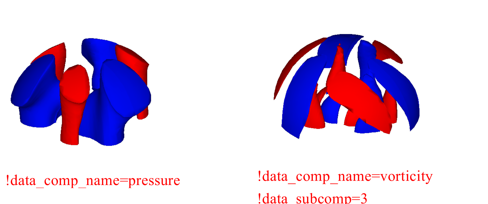

## 解析制御データ

### 解析制御データ概要

FrontISTRは、解析制御データファイルを入力して、下図に示す計算制御データ、ソルバー制御データおよびポスト処理（可視化）制御データを取得し、解析計算を実施する。

{.center width="50%"}

解析制御データファイルの特徴は以下のとおりである。

  * 自由書式に基づくASCII形式のファイルである。
  * "`!`" で始まるヘッダーとそれに続くデータから構成されている。
  * ヘッダーの記述の順番は基本的に自由である。
  * データの区切り記号には "`,`" を使用する。
  * ファイル内は大きく分けて3つのゾーンに分かれている。
  * ファイルの最後に "`!END`" を入力して終了とする。

#### 解析制御データ例

```
########## 計算制御データ部分 ##########
### Control File for HEAT solver
!SOLUTION,TYPE=HEAT
!FIXTEMP
 XMIN, 0.0
 XMAX, 500.0

########## ソルバー制御データ部分 ##########
### Solver Control
!SOLVER,METHOD=CG,PRECOND=1,ITERLOG=NO,TIMELOG=NO
 100, 1
 1.0e-8,1.0,0.0

########## ポスト制御(可視化)データ部分 ##########
### Post Control
!WRITE,RESULT
!WRITE,VISUAL
!VISUAL, method=PSR
!surface_num = 1
!surface 1
!surface_style = 1
!display_method 1
!color_comp_name = TEMPERATURE
!color_subcomp = 1
!output_type = BMP
!x_resolution = 500
!y_resolution = 500
!num_of_lights = 1
!position_of_lights = -20.0, 5.8, 80.0
!viewpoint = -20.0 10.0 8.0
!up_direction = 0.0 0.0 1.0
!ambient_coef= 0.3
!diffuse_coef= 0.7
!specular_coef= 0.5
!color_mapping_style= 1
!!interval_mapping= -0.01, 0.02
!color_mapping_bar_on = 1
!scale_marking_on = 1
!num_of_scale = 5
!font_size = 1.5
!font_color = 1.0 1.0 1.0
```
### 入力規則

解析制御データは、ヘッダー行、データ行、コメント行から構成される。

ヘッダー行には必ず一つのヘッダーが含まれる。


ヘッダー
:   解析制御データ内で、データの意味とデータブロックを特定する。
:   行頭が "`!`" で始まる場合、ヘッダーであるとみなされる。

ヘッダー行
:   ヘッダーとそれに伴うパラメータを記述する。
:   ヘッダー行はヘッダーで始まっていなければならない。パラメータが必要な場合は、"`,`" を用いてその後に続けなければならない。パラメータが値をとる場合は、パラメータの後に "`=`" が続き、その後に値を記述する。
:    ヘッダー行を複数行にわたって記述することはできない。

データ行
:    ヘッダー行の次の行から開始され、必要なデータを記述する。
:    データ行は複数行にわたる可能性があるが、それは各ヘッダーで定義されるデータ記述の規則により決定される。
:    データ行は必要ない場合もある。

区切り文字
:    データの区切り文字にはカンマ "`,`" を用いる。

空白の扱い
:    空白は無視される。

名前
:    名前に使用可能な文字は、アンダースコア "`_`"、ハイフン "`-`"、英数字 "`a-z A-Z 0-9`" であるが、最初の一文字は "`_`" または英字 "`a-z A-Z`" で始まっていなければならない。大文字小文字の区別はなく、内部的にはすべて大文字として扱われる。
:    また、名前の最大長は63文字である。

ファイル名
:    ファイル名に使用可能な文字は、アンダースコア "`_`"、ハイフン "`-`"、ピリオド "`.`"、スラッシュ "`/`"、英数字 "`a-z A-Z 0-9`" である。
:    ファイル名は、特に記述がない限りパスを含んでもよい。相対パス、絶対パスのいずれも指定可能である。
:    また、ファイル名の最大長は1023文字である。

浮動小数点データ
:    指数はあってもなくてもよい。指数の前には、"`E`" または "`e`" の記号をつけなければならない。
:    "`E`" または "`e`" どちらを使用してもかまわない。

コメント行
:    行頭が "`!!`" または"`#`" で始まる行はコメント行とみなされ、無視される。
:    コメント行はファイル中の任意の位置に挿入でき、その数に制限はない。

!END
:    メッシュデータの終端
:    このヘッダーが表れると、メッシュデータの読み込みを終了する。

### 解析制御データ

#### 計算制御データのヘッダー一覧

FrontISTRでは、計算制御データに使用できる境界条件として以下のものがあげられる。

  * 分布荷重条件 (物体力, 圧力荷重, 重力, 遠心力)
  * 集中荷重条件
  * 熱荷重
  * 単点拘束条件 (SPC条件)
  * ばね境界条件
  * 接触
  * 集中熱流束
  * 分布熱流束
  * 対流熱伝達境界
  * 輻射熱伝達境界
  * 規定温度境界

上記境界条件の定義方法は、メッシュデータ同様に "`!`" ヘッダーの形式で定義する。

以下、表 7.3.1に全解析に共通な制御データのヘッダー一覧を示し、表
7.3.2から解析種別別のヘッダー一覧を示す。

** 表 7.3.1 全解析に共通な制御データ **

| ヘッダー                                          | 意味                     | 備考 | 説明番号 |
|-------------------------------------------------|--------------------------|------|----------|
| [`!VERSION`](#version-1-1)                      | ソルバーバージョン番号       |      | 1-1      |
| [`!SOLUTION`](#solution-1-2)                    | 解析の種別の指定            | 必須 | 1-2      |
| [`!WRITE,VISUAL`](#write-visual-1-3)            | 可視化データ出力の指定       |      | 1-3      |
| [`!WRITE,RESULT`](#write-result-1-4)            | 解析結果データ出力の指定     |      | 1-4      |
| [`!WRITE,LOG`](#write-log-1-5)                  | 結果出力の指定              |      | 1-5      |
| [`!OUPUT_VIS`](#output-vis-1-6)                 | 可視化データ出力制御         | 　   | 1-6      |
| [`!OUTPUT_RES`](#output-res-1-7)                | 解析結果データ出力制御       | 　   | 1-7      |
| [`!RESTART`](#restart-1-8)                      | リスタートの制御            |      | 1-8      |
| [`!ECHO`](#echo-1-9)                            | エコー出力                 |      | 1-9      |
| [`!ORIENTATION`](#orientation-1-10)             | 局所座標系の定義            |      | 1-10     |
| [`!SECTION`](#section-1-11)                     | セクションの局所座標系の定義  |      | 1-11     |
| [`!END`](#end-1-12)                             | 制御データの指定の終了       |      | 1-12     |
| [`!OUTPUT_SSTYPE`](#output_sstype-1-13)         | 結果出力の応力ひずみ測度の指定 |      | 1-13     |
| [`!INITIAL_CONDITION`](#initial_condition-1-14) | 初期条件の指定              |      | 1-14     |

** 表 7.3.2 静解析用制御データ **

| ヘッダー                                      | 意味                       | 備考 | 説明番号 |
|----------------------------------------------|----------------------------|------|----------|
| [`!STATIC`](#static-1-2)                     | 静解析の制御               | 　   | 2-1      |
| [`!MATERIAL`](#material-2-2)                 | 材料名                     |      | 2-2      |
| [`!ELASTIC`](#elastic-2-2-1)                 | 弾性材料物性               |      | 2-2-1    |
| [`!PLASTIC`](#plastic-2-2-2)                 | 塑性材料物性               |      | 2-2-2    |
| [`!HYPERELASTIC`](#hyperelastic-2-2-3)       | 超弾性材料物性             |      | 2-2-3    |
| [`!VISCOELASTIC`](#viscoelastic-2-2-4)       | 粘弾性材料物性             |      | 2-2-4    |
| [`!CREEP`](#creep-2-2-5)                     | クリープ材料物性           |      | 2-2-5    |
| [`!DENSITY`](#density-2-2-6)                 | 質量密度                   |      | 2-2-6    |
| [`!EXPANSION_COEFF`](#expansion_coeff-2-2-7) | 線膨張係数                 |      | 2-2-7    |
| [`!TRS`](#trs-2-2-8)                         | 粘弾性温度依存性           |      | 2-2-8    |
| [`!FLUID`](#fluid-2-2-9)                     | 流体物性                   |      | 2-2-9    |
| [`!USER_MATERIAL`](#user_material-2-2-10)    | ユーザー定義材料           |      | 2-2-10   |
| [`!BOUNDARY`](#boundary-2-3)                 | 変位境界条件               |      | 2-3      |
| [`!SPRING`](#spring-2-3-1)                   | ばね境界条件               |      | 2-3-1    |
| [`!CLOAD`](#cload-2-4)                       | 集中荷重                   |      | 2-4      |
| [`!DLOAD`](#dload-2-5)                       | 分布荷重                   |      | 2-5      |
| [`!ULOAD`](#uload-2-6)                       | ユーザー定義外部荷重       |      | 2-6      |
| [`!CONTACT_ALGO`](#contact_algo-2-7)         | 接触解析アルゴリズム       |      | 2-7      |
| [`!CONTACT`](#contact-2-8)                   | 接触                       |      | 2-8      |
| [`!TEMPERATURE`](#temperature-2-9)           | 熱応力解析における節点温度 |      | 2-9      |
| [`!REFTEMP`](#reftemp-2-10)                  | 熱応力解析における参照温度 |      | 2-10     |
| [`!STEP`](#step-2-11)                        | 解析ステップ制御           | 　   | 2-11     |
| [`!AUTOINC_PARAM`](#autoinc_param-2-12)      | 自動増分制御               | 　   | 2-12     |
| [`!TIME_POINTS`](#time_points-2-13)          | 計算及び出力時刻の指定     | 　   | 2-13     |

** 表 7.3.3 固有値解析用制御データ **

| ヘッダー | 意味             | 備考             | 説明番号 |
|----------|------------------|------------------|----------|
|[`!EIGEN`](#eigen-3-1)  | 固有値解析の制御 | 固有値解析で必須 | 3-1      |

** 表 7.3.4 熱伝導解析用制御データ **

| ヘッダー   | 意味                              | 備考             | 説明番号 |
|------------|-----------------------------------|------------------|----------|
|[`!HEAT`](#heat-4-1)     | 熱伝導解析の制御                  | 熱伝導解析で必須 | 4-1      |
|[`!FIXTEMP`](#fixtemp-4-2)  | 節点温度                          |                  | 4-2      |
|[`!CFLUX`](#cflux-4-3)    | 節点に与える集中熱流束            |                  | 4-3      |
|[`!DFLUX`](#dflux-4-4)    | 要素面に与える分布熱流束/内部発熱 |                  | 4-4      |
|[`!SFLUX`](#sflux-4-5)    | 面グループによる分布熱流束        |                  | 4-5      |
|[`!FILM`](#film-4-6)     | 境界面に与える熱伝達係数          |                  | 4-6      |
|[`!SFILM`](#sfilm-4-7)    | 面グループによる熱伝達係数        |                  | 4-7      |
|[`!RADIATE`](#radiate-4-8)  | 境界面に与える輻射係数            |                  | 4-8      |
|[`!SRADIATE`](#sradiate-4-9) | 面グループによる輻射係数          |                  | 4-9      |
|[`!WELD_LINE`](#weld_line-4-10)| 溶接線                            |                  | 4-10     |

** 表 7.3.5　動解析用制御データ **

| ヘッダー      | 意味                           | 備考                 | 説明番号 |
|---------------|--------------------------------|----------------------|----------|
|[`!DYNAMIC`](#dynamic-5-1)     | 動解析の制御                   | 動解析で必須         | 5-1      |
|[`!VELOCITY`](#velocity-5-2)    | 速度境界条件                   |                      | 5-2      |
|[`!ACCELERATION`](#acceleration-5-3)| 加速度境界条件                 |                      | 5-3      |
|[`!COUPLE`](#couple-5-4)      | 連成面定義                     | 連成解析で必要       | 5-4      |
|[`!EIGENREAD`](#eigenread-5-5)   | 固有値・固有モードの指定       | 周波数応答解析で必須 | 5-5      |
|[`!FLOAD`](#fload-5-6)       | 周波数応答解析用集中荷重の定義 |                      | 5-6      |

各ヘッダーには、パラメータとそれぞれのヘッダーに対応したデータの項目がある。

以下、上記各ヘッダーについて、解析種別別にデータ作成例とともに説明する。上記表の説明番号はデータ作成例の右端に示している番号である。

#### 全解析に共通な制御データ

##### 解析制御データ例

```
### Control File for FISTR
!VERSION                                        1-1
  5
!SOLUTION, TYPE=STATIC                          1-2
!WRITE, VISUAL                                  1-3
!WRITE, RESULT                                  1-4
!ECHO                                           1-9
!BOUNDARY                                       2-3
  FIX, 1, 3, 0.0
!CLOAD                                          2-4
  CL1, 3, -1.0
!END                                            1-12
```

##### ヘッダーの説明

###### 1-1 `!VERSION`

ソルバーバージョンを示す。

###### 1-2 `!SOLUTION, TYPE=STATIC`

TYPE＝解析の種類

###### 1-3 `!WRITE, VISUAL`

メモリ渡しビジュアライザーによる可視化データの出力

記載するだけでファイルを出力

###### 1-4 `!WRITE, RESULT`

解析結果データの出力

記載するだけでファイルを出力

###### 1-6 `!ECHO`

節点データ、要素データおよび材料データをログファイルに出力

記載するだけでファイルに出力

###### 1-8 `!END`

制御データの終わりを示す

#### 静解析制御データ

##### 静解析制御データ例

```
### Control File for FISTR
!SOLUTION, TYPE=STATIC                          1-2
!WRITE, VISUAL                                  1-3
!WRITE, RESULT                                  1-4
!ECHO                                           1-9
!MATERIAL, NAME=M1                              2-2
!ELASTIC, TYPE=ISOTROPIC                        2-2-1
  210000.0, 0.3
!BOUNDARY                                       2-3
  FIX, 1, 3, 0.0
!SPRING 2-3-1
  200, 1, 0.03
!CLOAD 2-4
  CL1, 3, -1.0
!DLOAD 2-5
  1, P1, 1.0
!TEMPERATURE                                    2-9
  1, 10.0
!REFTEMP                                        2-10
!STEP, CONVERG=1.E-5, MAXITER=30                2-11
!END                                            1-12
```

##### ヘッダーの説明

  * <font color="Red">赤字</font>は例に記載されている数値、
  * 表2行目の英字は変数名をあらわす。

###### 2-1 `!STATIC`

静解析方法の設定

###### 2-2 `!MATERIAL`
材料物性の定義

`NAME=`材料物性の名前

###### 2-2-1 `!ELASTIC, TYPE=ISOTROPIC`

弾性物質の定義

`TYPE＝`弾性タイプ

| ヤング率                          | ポアソン比                   |
|-----------------------------------|------------------------------|
| YOUNG_MODULUS                     | POISSON_RATIO                |
| <font color="Red">210000.0</font> | <font color="Red">0.3</font> |

###### 2-3 `!BOUNDARY`

変位境界条件の定義

| 接点番号または接点グループ名  | 拘束自由度の開始番号        | 拘束自由度の終了番号          | 拘束値                         |
|-------------------------------|-----------------------------|-------------------------------|--------------------------------|
| NODE_ID                       | DOF_idS                     | DOF_idE                       | Value                          |
| <font color="Red">FIX</font>, | <font color="Red">1</font>, | <font color="color">3</font>, | <font color="color">0.0</font> |

###### 2-3-1 `!SPRING`

ばね境界条件の定義

| 節点番号またはグループ名      | 拘束自由度                  | ばね定数                      |
|-------------------------------|-----------------------------|-------------------------------|
| NODE_ID                       | DOF_id                      | Value                         |
| <font color="Red">200</font>, | <font color="Red">1</font>, | <font color="Red">0.03</font> |

###### 2-4 `!CLOAD`

集中荷重の定義

| 節点番号または節点グループ名  | 自由度番号                  | 荷重値                        |
|-------------------------------|-----------------------------|-------------------------------|
| NODE_ID                       | DOF_id                      | Value                         |
| <font color="Red">CL1</font>, | <font color="Red">3</font>, | <font color="Red">-1.0</font> |

###### 2-5 `!DLOAD`

分布荷重の定義

| 要素番号または要素グループ名 | 荷重タイプ番号               | 荷重パラメータ               |
|------------------------------|------------------------------|------------------------------|
| ELEMENT_ID                   | LOAD_type                    | param                        |
| <font color="Red">1</font>,  | <font color="Red">P1</font>, | <font color="Red">1.0</font> |

###### 2-9 `!TEMPERATURE`

熱応力解析に用いる節点温度の指定

| 節点番号または節点グループ名 | 温度                        |
|------------------------------|-----------------------------|
| NODE_ID                      | Temp_Value                  |
| <font color="Red">1</font>,  | <font color="Red">10</font> |

###### 2-10 `!REFTEMP`

熱応力解析における参照温度の定義

###### 2-11 `!STEP`

非線形静解析の制御 (線形解析の場合省略可)

| 収束値判定閾値<br/>(デフォルト:1.0E-06) | サブステップ数<br/>(AMPがある場合、AMPが優先) | 最大反復計算回数            | 時間関数名<br/>(AMPLITUDEで指定) |
|-----------------------------------------|-----------------------------------------------|-----------------------------|----------------------------------|
| CONVERG                                 | SUBSTEPS                                      | MAXITER                     | AMP                              |
| <font color="Red">1.0E-05</font>        | <font color="Red">10</font>                   | <font color="Red">30</font> |                                  |

#### 固有値解析制御データ

##### 固有値解析制御データ例

```
### Control File for FISTR
!SOLUTION, TYPE=EIGEN                           1-2
!WRITE, VISUAL                                  1-3
!WRITE, RESULT                                  1-4
!ECHO                                           1-9
!EIGEN                                          3-1
  3, 1.0E-8, 60
!BOUNDARY                                       2-3
  FIX, 1, 2, 0.0
!END                                            1-12
```

##### ヘッダーの説明

  * <font color="Red">赤字</font>は例に記載されている数値

###### 3-1 `!EIGEN`

固有値解析のパラメータ設定

| 固有値数                    | 許容差                            | 最大反復数                  |
|-----------------------------|-----------------------------------|-----------------------------|
| NSET                        | tolerance                         | LCZMAX                      |
| <font color="Red">3</font>, | <font color="Red">1.0E-08</font>, | <font color="Red">60</font> |

###### 2-3 `!BOUNDARY` (静解析におけるものと同一)

変位境界条件の定義

| 節点番号または節点グループ名  | 拘束自由度の開始番号        | 拘束自由度の終了番号        | 拘束値                       |
|-------------------------------|-----------------------------|-----------------------------|------------------------------|
| NODE_ID                       | DOF_idS                     | DOF_idE                     | Value                        |
| <font color="Red">FIX</font>, | <font color="Red">1</font>, | <font color="Red">3</font>, | <font color="Red">0.0</font> |

#### 熱伝導解析制御データ

##### 熱伝導解析制御データ例

```
### Control File for FISTR
!SOLUTION, TYPE=HEAT                            1-2
!WRITE, VISUAL                                  1-3
!WRITE, RESULT                                  1-4
!ECHO                                           1-9
!HEAT                                           4-1
!FIXTEMP                                        4-2
  XMIN, 0.0
  XMAX, 500.0
!CFLUX                                          4-3
　ALL, 1.0E-3
!DFLUX                                          4-4
　ALL, S1, 1.0
!SFLUX                                          4-5
　SURF, 1.0
!FILM                                           4-6
  FSURF, F1, 1.0, 800
!SFILM                                          4-7
　SFSURF, 1.0, 800.0
!RADIATE                                        4-8
　RSURF, R1, 1.0E-9, 800.0
!SRADIATE                                       4-9
　RSURF, R1, 1.0E-9, 800.0
!END                                            1-12
```

##### ヘッダーの説明

  * <font color="Red">赤字</font>は例に記載されている数値

###### 4-1 `!HEAT`

計算に関する制御データの定義

```
!HEAT
  (データなし) --------------------------- 定常計算
!HEAT
  0.0 ------------------------------------ 定常計算
!HEAT
  10.0, 3600.0 --------------------------- 固定時間増分非定常計算
!HEAT
  10.0, 3600.0, 1.0 ---------------------- 自動時間増分非定常計算
!HEAT
  10.0, 3600.0, 1.0, 20.0 ---------------- 自動時間増分非定常計算
```

###### 4-2 `!FIXTEMP`

節点グループ名または節点番号と固定温度

###### 4-3 `!CFLUX`

節点にあたえる集中熱流束の定義

| 節点グループ名または節点番号  | 熱流束値                         |
|-------------------------------|----------------------------------|
| NODE_GRP_NAME                 | Value                            |
| <font color="Red">ALL</font>, | <font color="Red">1.0E-03</font> |

###### 4-4 `!DFLUX`

要素の面にあたえる分布熱流束と内部発熱の定義

| 要素グループ名または要素番号  | 荷重タイプ番号               | 熱流束値                     |
|-------------------------------|------------------------------|------------------------------|
| ELEMENT_GRP_NAME              | LOAD_type                    | Value                        |
| <font color="Red">ALL</font>, | <font color="Red">S1</font>, | <font color="Red">1.0</font> |

####### 荷重パラメータ

| 荷重タイプ番号 | 作用面   | パラメータ |
|----------------|----------|------------|
| BF             | 要素全体 | 発熱量     |
| S1             | 第１面   | 熱流束値   |
| S2             | 第2面    | 熱流束値   |
| S3             | 第3面    | 熱流束値   |
| S4             | 第4面    | 熱流束値   |
| S5             | 第5面    | 熱流束値   |
| S6             | 第6面    | 熱流束値   |
| S0             | シェル面 | 熱流束値   |

###### 4-5 `!SFLUX`

面グループによる分布熱流束の定義

| 面グループ名                   | 熱流束値                     |
|--------------------------------|------------------------------|
| SURFACE_GRP_NAME               | Value                        |
| <font color="Red">SURF</font>, | <font color="Red">1.0</font> |

###### 4-6 `!FILM`

境界面にあたえる熱伝達係数の定義

| 要素グループ名または要素番号    | 荷重タイプ番号               | 熱伝達係数                    | 雰囲気温度                     |
|---------------------------------|------------------------------|-------------------------------|--------------------------------|
| ELEMENT_GRP_NAME                | LOAD_type                    | Value                         | Sink                           |
| <font color="Red">FSURF</font>, | <font color="Red">F1</font>, | <font color="Red">1.0</font>, | <font color="Red">800.0</font> |

####### 荷重パラメータ

| 荷重タイプ番号 | 作用面   | パラメータ             |
|----------------|----------|------------------------|
| F1             | 第1面    | 熱伝達係数と雰囲気温度 |
| F2             | 第2面    | 熱伝達係数と雰囲気温度 |
| F3             | 第3面    | 熱伝達係数と雰囲気温度 |
| F4             | 第4面    | 熱伝達係数と雰囲気温度 |
| F5             | 第5面    | 熱伝達係数と雰囲気温度 |
| F6             | 第6面    | 熱伝達係数と雰囲気温度 |
| F0             | シェル面 | 熱伝達係数と雰囲気温度 |

###### 4-7 `!SFILM`

面グループによる熱伝達係数の定義

| 面グループ名                     | 熱伝達率                      | 雰囲気温度                     |
|----------------------------------|-------------------------------|--------------------------------|
| SURFACE_GRP_NAME                 | Value                         | Sink                           |
| <font color="Red">SFSURF</font>, | <font color="Red">1.0</font>, | <font color="Red">800.0</font> |

###### 4-8 `!RADIATE`

境界面にあたえる輻射係数の定義

| 要素グループ名または要素番号    | 荷重タイプ番号               | 輻射係数                          | 雰囲気温度                     |
|---------------------------------|------------------------------|-----------------------------------|--------------------------------|
| ELEMENT_GRP_NAME                | LOAD_type                    | Value                             | Sink                           |
| <font color="Red">RSURF</font>, | <font color="Red">R1</font>, | <font color="Red">1.0E-09</font>, | <font color="Red">800.0</font> |

####### 荷重パラメータ

|荷重タイプ番号|作用面  |パラメータ          |
|--------------|--------|--------------------|
| R1           |第1面   |輻射係数と雰囲気温度|
| R2           |第2面   |輻射係数と雰囲気温度|
| R3           |第3面   |輻射係数と雰囲気温度|
| R4           |第4面   |輻射係数と雰囲気温度|
| R5           |第5面   |輻射係数と雰囲気温度|
| R6           |第6面   |輻射係数と雰囲気温度|
| R0           |シェル面|輻射係数と雰囲気温度|

###### 4-9 `!SRADIATE`

面グループによる輻射係数の定義

| 面グループ名                     | 輻射係数                          | 雰囲気温度                     |
|----------------------------------|-----------------------------------|--------------------------------|
| SURFACE_GRP_NAME                 | Value                             | Sink                           |
| <font color="Red">SRSURF</font>, | <font color="Red">1.0E-09</font>, | <font color="Red">800.0</font> |

#### 動解析制御データ

##### 動解析制御データ例

```
### Control File for FISTR
!SOLUTION, TYPE=DYNAMIC                         1-2
!DYNAMIC, TYPE=NONLINEAR                        5-1
  1 , 1
  0.0, 1.0, 500, 1.0000e-5
  0.5, 0.25
  1, 1, 0.0, 0.0
  100, 5, 1
  0, 0, 0, 0, 0, 0
!BOUNDARY, AMP=AMP1                             2-3
  FIX, 1, 3, 0.0
!CLOAD, AMP=AMP1                                2-4
  CL1, 3, -1.0
!COUPLE, TYPE=1                                 5-4
  SCOUPLE
!STEP, CONVERG=1.E-6, MAXITER=20                  2-11
!END                                            1-12
```

##### ヘッダーの説明

◆非線形動解析の制御（線形解析の場合省略可、陽解法の場合は不要）
  * <font color="Red">赤字</font>は例に記載されている数値、
  * 表2行目の英字は変数名をあらわす。

###### 5-1 `!DYNAMIC`

線形動解析の制御を行う。

|運動方程式の解法|解析の種類|
|----------------|----------|
|idx_eqa         |idx_resp  |
|<font color="Red">11</font>|<font color="Red">1</font>|

|解析開始時間|解析終了時間|全STEP数|時間増分|
|------------|------------|--------|--------|
|t_start     |t_end       |n_step  |t_delta |
|<font color="Red">0.0</font>|<font color="Red">1.0</font>|<font color="Red">500</font>|<font color="Red">1.0000e-5</font>|

| Newmark-i\(\beta\)法のパラメータ \(\gamma\) | Newmark-\(\beta\)法のパラメータ \(\beta\) |
|----------------------------------------|---------------------------------------|
| gamma                                  | beta                                  |
|<font color="Red">0.5</font>            |<font color="Red">0.25</font>          |

|質量マトリックスの種類|減衰の種類|Rayleigh減衰のパラメータR<sub>m</sub>|Rayleigh減衰のパラメータR<sub>k</sub>|
|----------------------|----------|----------------------------|--------------------------|
| idx_mas              | idx_dmp  | ray_m                      | ray_k                    |
|<font color="Red">1</font>|<font color="Red">1</font>|<font color="Red">0.0</font>|<font color="Red">0.0</font>|

|結果出力間隔|モニタリング節点番号または節点グループ名|変位モニタリングの結果出力間隔|
|------------|----------------------------------------|------------------------------|
| nout       | node_monit_1                           | nout_monit                   |
|<font color="Red">100</font>|<font color="Red">55</font>|<font color="Red">1</font>|

|出力制御変位|出力制御速度|出力制御加速度|出力制御反力|出力制御ひずみ|出力制御応力|
|------------|------------|--------------|------------|--------------|------------|
|iout_list(1)|iout_list(2)|iout_list(3)  |iout_list(4)|iout_list(5)  |iout_list(6)|
|<font color="Red">0</font>|<font color="Red">0</font>|<font color="Red">0</font>|<font color="Red">0</font>|<font color="Red">0</font>|<font color="Red">0</font>|

###### 2-3 `!BOUNDARY` (静解析におけるものと同一)

変位境界条件の定義

|節点番号または節点グループ名|拘束自由度の開始番号|拘束自由度の終了番号|拘束値|
|----------------------------|--------------------|--------------------|------|
|NODE_ID                     |DOF_idS             |DOF_idE             |Value |
|<font color="Red">FIX</font>,|<font color="Red">1</font>,|<font color="Red">3</font>,|<font color="Red">0.0</font>|

###### 2-4 `!CLOAD` (静解析におけるものと同一)

集中荷重の定義

|節点番号または節点グループ名|自由度番号|荷重値|
|----------------------------|----------|------|
|NODE_ID                     |DOF_id    |Value |
|<font color="Red">CL1</font>,|<font color="Red">3</font>,|<font color="Red">-1.0</font>|

###### 5-4 `!COUPLE, TYPE=1`

連成面の定義

|連成する面グループ名|
|--------------------|
|COUPLING_SURFACE_ID |
|<font color="Red">SCOUPLE</font>|

###### 2-11 `!STEP, CONVERG=1.E-10, ITMAX=20`

非線形静解析の制御 (線形解析の場合省略可、陽解法の場合は不要)

|収束値判定閾値<br/>(デフォルト:1.0E-06)|サブステップ数<br/>(AMPがある場合、AMPが優先)|最大反復計算回数|
|----------------------------------|----------------------------------------|----------------|
|CONVERG                           |SUBSTEPS                                |ITMAX           |
|<font color="Red">1.0E-10</font>  |                                        |<font color="Red">20</font>|

#### 動解析(周波数応答解析)制御データ

##### 動解析(周波数応答解析)制御データ例

```
!SOLUTION, TYPE=DYNAMIC                         1-2
!DYNAMIC                                        5-1
  11 , 2
  14000, 16000, 20, 15000.0
  0.0, 6.6e-5
  1, 1, 0.0, 7.2E-7
  10, 2, 1
  1, 1, 1, 1, 1, 1
!EIGENREAD                                      5-5
  eigen0.log
  1, 5
!FLOAD, LOAD CASE=2                             5-6
  _PickedSet5, 2, 1.0
!FLOAD, LOAD CASE=2
  _PickedSet6, 2, 1.0
```

##### ヘッダーの説明

  * <font color="Red">赤字</font>は例に記載されている数値、
  * 表2行目の英字は変数名をあらわす。

###### 5-1 `!DYNAMIC`

周波数応答解析の設定を行う。

#### ソルバー制御データ
|運動方程式の解法|解析の種類|
|----------------|----------|
| idx_eqa        | idx_resp |
|<font color="Red">11</font>|<font color="Red">2</font>|

|下限周波数|上限周波数|応答計算点数|変位を測定する周波数|
|----------|----------|------------|--------------------|
| f_start  | f_end    | n_freq     | f_disp             |
|<font color="Red">14000</font>|<font color="Red">16000</font>|<font color="Red">20</font>|<font color="Red">15000.0</font>|

|実時間での開始時間|実時間での終了時間|
|------------------|------------------|
| t_start          | t_end            |
|<font color="Red">0.0</font>|<font color="Red">6.6e-5</font>|

|質量マトリックスの種類|減衰の種類|Rayleigh減衰のパラメータR<sub>m</sub>|Rayleigh減衰のパラメータR<sub>k</sub>|
|----------------------|----------|-------------------------------------|-------------------------------------|
|idx_mas               | idx_dmp  | ray_m                               | ray_k                               |
|<font color="Red">1</font>|<font color="Red">1</font>|<font color="Red">0.0</font>|<font color="Red">7.2E-7</font>|

|時間空間でのサンプリング数|可視化データ出力指定<br/>(1:モード空間, 2:物理空間)|周波数空間モニタリング節点ID|
|--------------------------|----------------------------------------------|----------------------------|
| nout                     | vistype                                      | nodeout                    |
|<font color="Red">10</font>|<font color="Red">2</font>|<font color="Red">1</font>|

|出力制御変位|出力制御速度|出力制御加速度|出力制御無視|出力制御無視|出力制御無視|
|------------|------------|--------------|------------|------------|------------|
|iout_list(1)|iout_list(2)|iout_list(3)  |iout_list(4)|iout_list(5)|iout_list(6)|
|<font color="Red">1</font>|<font color="Red">1</font>|<font color="Red">1</font>|<font color="Red">1</font>|<font color="Red">1</font>|<font color="Red">1</font>|

###### 5-5 `!EIGENREAD`

周波数応答解析に用いる固有値・固有モードの指定

|固有値解析のログファイル名|
|--------------------------|
| eigenlog_filename        |
|<font color="Red">eigen0.log</font>|

|固有値解析に使用する指定モード始点|固有値解析に使用する指定モード終点|
|----------------------------------|----------------------------------|
| start_mode                       | end_mode                         |
|<font color="Red">1</font>        |<font color="Red">5</font>        |

###### 5-6 `!FLOAD`

周波数応答解析用集中荷重の定義

|節点番号または節点グループ名または面グループ名|自由度番号|荷重値|
|----------------------------------------------|----------|------|
|NODE_ID                                       |DOF_id    |Value |
|<font color="Red">_PickedSet5</font>|<font color="Red">2</font>|<font color="Red">1.0</font>

#### ソルバー制御データ

##### ソルバー制御データ例

```
### SOLVER CONTROL
!SOLVER, METHOD=CG, PRECOND=1, ITERLOG=YES, TIMELOG=YES        6-1
  10000, 1                                                     6-2
  1.0e-8, 1.0, 0.0                                             6-3
```

##### ヘッダーの説明

  * <font color="Red">赤字</font>は例に記載されている数値

###### 6-1 `!SOLVER,`

```
    METHOD=    解析方法
               (CG、BiCGSTAB、GMRES、GPBiCGなどがある)
    TIMELOG=   ソルバー計算時間出力の有無
    MPCMETHOD= 多点拘束処理の手法
               (1: ペナルティ法、2: MPC-CG法、3: 陽的自由度消去法)
    DUMPTYPE=  行列ダンプ型式
    DUMPEXIT=  行列ダンプ直後にプログラムを終了するか

    以下のパラメータは解析方法で直接法を選択するとすべて無視される。
    PRECOND=   前処理の手法
    ITERLOG=   ソルバー収束履歴出力の有無
    SCALING=   行列の対角成分が1となるスケーリングの有無
    USEJAD=    ベクトル機向けオーダリングの有無
    ESTCOND=   条件数推定の頻度
               (指定された反復回数ごと、および、反復終了時に推定を実施。0の場合は推定なし。)
```

###### 6-2

|反復回数,|前処理の繰り返し数,|クリロフ部分空間数|マルチカラーの色数|前処理セットアップ情報の再利用回数|
|---------|-------------------|------------------|------------------|----------------------------------|
| NITER   |iterPREMAX         |NREST             |NCOLOR_IN         |RECYCLEPRE                        |
|<font color="Red">10000</font>|<font color="Red">1</font>|    |    |                                  |

###### 6-3

|打ち切り誤差, |前処理行列計算時の対角成分の倍率, |未使用|
|--------------|----------------------------------|------|
| RESID        | SIGMA_DIAG                       |SIGMA |
|<font color="Red">1.0e-8</font>,|<font color="Red">1.0</font>,|<font color="Red">0.0</font>|

#### ポスト処理(可視化)制御データ

以下にポスト処理（可視化）制御データの例とその内容を示す。

##### 可視化制御データ例

  * 各説明番号(P1-0, P1-1等)はのちの詳細説明の番号とリンクしている。
  * **P1**-XX は共通データ、**P2**-XX はレンダリングのためのパラメータをあらわす。

なおレンダリングについては `output_type=BMP` のときのみ有効となる。

 * `surface_style` が `!surface_style=2`(等値面)、`!surface_style=3` (ユーザー指定曲面)の場合、別途設定が必要となる。その記載については共通データ後にまとめて記載する。<br/>(**P3**-XX は`!surface_style=2`における等値面での説明。<br/> **P4**-XX は`!surface_style=3`におけるユーザー指定曲面での説明。)

  * `!!`のように`!`が2つ記載されているものはコメント文と認識され解析に影響を及ぼさない。

```
### Post Control 　　                           説明番号
!VISUAL, method=PSR                             P1-0
!surface_num = 1                                P1-1
!surface 1                                      P1-2
!surface_style = 1                              P1-3
!display_method = 1                             P1-4
!color_comp_name = STRESS                       P1-5
!colorsubcomp_name                              P1-6
!color_comp 7                                   P1-7
!!color_subcomp = 1                             P1-8
!iso_number                                     P1-9
!specified_color                                P1-10
!deform_display_on = 1                          P1-11
!deform_comp_name                               P1-12
!deform_comp                                    P1-13
!deform_scale = 9.9e-1                          P1-14
!initial_style = 1                              P1-15
!deform_style = 3                               P1-16
!initial_line_color                             P1-17
!deform_line_color                              P1-18
!output_type = BMP                              P1-19
!x_resolution = 500                             P2-1
!y_resolution = 500                             P2-2
!num_of_lights = 1                              P2-3
!position_of_lights = -20.0, 5.8, 80.0          P2-4
!viewpoint = -20.0 -10.0 5.0                    P2-5
!look_at_point                                  P2-6
!up_direction = 0.0 0.0 1.0                     P2-7
!ambient_coef= 0.3                              P2-8
!diffuse_coef= 0.7                              P2-9
!specular_coef= 0.5                             P2-10
!color_mapping_style= 1                         P2-11
!!interval_mapping_num                          P2-12
!interval_mapping= -0.01, 0.02                  P2-13
!rotate_style = 2                               P2-14
!rotate_num_of_frames                           P2-15
!color_mapping_bar_on = 1                       P2-16
!scale_marking_on = 1                           P2-17
!num_of_scale = 5                               P2-18
!font_size = 1.5                                P2-19
!font_color = 1.0 1.0 1.0                       P2-20
!background_color                               P2-21
!isoline_color                                  P2-22
!boundary_line_on                               P2-23
!color_system_type                              P2-24
!fixed_range_on = 1                             P2-25
!range_value = -1.E-2, 1.E-2                    P2-26
```

##### 共通データ一覧 (P1-1からP1-19)

| 番号               | キーワード           | 型                 | 内容               |
|--------------------|----------------------|--------------------|--------------------|
| P1-0               | `!VISUAL`            |                    | 可視化手法の指定   |
| P1-1               | `surface_num`        |                    | 1つのサーフェスレンダリング内のサーフェス数|
| P1-2               | `surface`            |                    | サーフェスの内容の設定 |
| P1-3               | `surface_style`      | integer            | 表面タイプの指定 (省略値: 1)<br/>1: 境界表面<br/>2: 等値面<br />3: 方程式によるユーザー定義の曲面 |
| P1-4               | `display_method`     | integer            | 表示方法 (省略値: 1)<br/>1: 色コードの表示<br/>2: 境界線表示<br/>3: 色コード及び境界線表示<br/>4: 指定色一色の表示<br/>5: 色分けにによる等値線表示 |
| P1-5               | `color_comp_name`    | character(100)     | 変数名とカラーマップとの対応 (省略値: 第一変数名) |
| P1-6               | `color_subcomp_name` | character(4)       | 変数がベクトルの時、表示するコンポーネントを指定する。(省略値: x)<br> norm: ベクトルのノルム<br/>x: x成分<br/>y: y 成分<br/>z: z 成分|
| P1-7               | `color_comp`         | integer            | 変数名に識別番号をつける (省略値: 0) |
| P1-8               | `color_subcomp`      | integer            | 変数の自由度が1以上の時、表示される自由度番号を指定する。<br/>0: ノルム<br/>(省略値: 1)|
| P1-9               | `iso_number`         | integer            | 等値線数を指定する。(省略値: 5) |
| P1-10              | `specified_color`    | real               | `display_method = 4`の時のカラーを指定する<br/>0.0 &lt; `specified_color` &lt; 1.0 |
| P1-11              | `!deform_display_on` | integer            | 変形の有無を指定する。<br/>1: on, 0: off (省略値: 0) |
| P1-12              | `!deform_comp_name`  | character(100)     | 変形を指定する際の採用する属性を指定する。<br/>(省略値: `DISPLACEMENT`という名の変数) |
| P1-13              | `!deform_ comp`      | integer            | 変形を指定する際の変数の識別番号<br/>(省略値: 0)|
| P1-14              | `!deform_scale`      | real               | 変形を表示する際の変位スケールを指定する。<br/>Default:自動<br/>`standard_scale` = 0.1 * sqrt(`x_range`<sup>2</sup> + `y_range`<sup>2</sup> + `z_range`<sup>2</sup>) / `max_deform`<br/>`user_defined`: `real_scale` = `standard_scale` * `deform_scale`|
| P1-15              | `!initial_style`     | integer            | 変形表示のタイプを指定する(省略値: 1)<br/>0: 無し<br/>1: 実線メッシュ(指定がなければ青で表示)<br/>2: グレー塗りつぶし<br/>3: シェーディング(物理属性をカラー対応させる)<br/>4: 点線メッシュ(指定がなければ青で表示)|
| P1-16              | `!deform_style`      | integer            | 初期、変形後の形状表示スタイルを指定する(省略値: 4)<br/>0: 無し<br/>1: 実線メッシュ（指定がなければ青で表示)<br/>2: グレー塗りつぶし<br/>3: シェーディング(物理属性をカラー対応させる)<br/>4: 点線メッシュ(指定がなければ青で表示)|
| P1-17              | `!initial_line_color` | real (3)           | 初期メッシュを表示する際のカラーを指定する。<br/>これは実線、点線両者を含む。<br/>(省略値: 青(0.0, 0.0, 1.0)) |
| P1-18              | `!deform_line_color` | real (3)           | 変形メッシュを表示する際のカラーを指定する。<br/>これは実線、点線両者を含む。<br/>(黄色(1.0, 1.0, 0.0)) |
| P1-19              | `output_type`        | character(3)       | 出力ファイルの型を指定する。(省略値: AVS)<br/>`AVS`: AVS用UCDデータ(物体表面上のみ)<br/>`BMP`: イメージデータ(BMPフォーマット)<br/>`COMPLETE_AVS`: AVS用UCDデータ<br/>`COMPLETE_REORDER_AVS`: 節点・要素番号を並び替え<br/>`SEPARATE_COMPLETE_AVS`: 分割領域ごと<br/>`COMPLETE_MICROAVS`: 物理量スカラー出力<br/>`FSTR_FEMAP_NEUTRAL`: FEMAP用ニュートラルファイル|

##### レンダリングデータ一覧 (P2-1からP2-26)

(output_type = BMPの時のみ有効)　

|        | キーワード             | 型       |  内容 |
|--------|------------------------|----------|-------|
| P2-1   | `x_resolution`         | integer  | 最終図の幅を指定する。 (省略値: 512) |
| P2-2   | `y_resolution`         | integer  | 最終図の高さを指定する。 (省略値: 512) |
| P2-3   | `num_of_lights`        | integer  | 照明の個数を指定する。 (省略値: 1) |
| P2-4   | `position_of_lights`   | real(:)  | 照明の位置を座標で指定する。 (省略値: 正面真上)<br/>指定方法<br/> `!position_of_lights= x, y, z, x, y, z,...`<br/>例) `!position_of_lights=100.0, 200.0, 0.0`<br/>|
| P2-5   | `viewpoint`            | real(3)  | 視点の位置を座標で指定する。<br/>(省略値: x = (x<sub>min</sub> + x<sub>max</sub>)/2.0<br/> y = y<sub>min</sub> + 1.5 \*( y<sub>max</sub> - y<sub>min</sub>)<br/>z = z<sub>min</sub> + 1.5 \*( z<sub>max</sub> - z<sub>min</sub>) )
| P2-6   | `look_at_point`        | real(3)  | 視線の位置を指定する。<br/>(省略値: データの中心)|
| P2-7   | `up_direction`         | real(3)  | Viewpoint, `look_at_point` and `up_direction` にてビューフレーム を定義する。 (省略値: 0.0, 0.0, 1.0) |
| P2-8   | `ambient_coef`         | real     | 周囲の明るさを指定する。 (省略値: 0.3) |
| P2-9   | `diffuse_coef`         | real     | 乱反射光の強さを係数にて指定する。(省略値: 0.7)|
| P2-10  | `specular_coef`        | real     | 鏡面反射の強さを係数にて指定する。(省略値: 0.6)|
  P2-11  | `color_mapping_style`  | integer  | カラーマップの方法を指定する。 (省略値: 1)<br/> 1: 完全線形マップ (全色をRGBに線形に写像する)<br/> 2: クリップ線形マップ (`mincolor`から`maxcolor`)をRGBカラースペースに写像する。<br/> 3: 非線形カラーマップ (全領域を複数の区間に分割し、区間ごとには線形マップを行う) <br/>4: 最適自動調整 (データの分布を統計処理してカラーマップを決定する)|
| P2-12  | `interval_mapping_num` | integer  | `color_mapping_style = 3` の時の区間の数を指定する。|
| P2-13  | `interval_mapping`     | real(:)  | `color_mapping_style = 2` or `3` の時の区間位置とカラー番号を指定する。<br/>`color_mapping_style=2`の場合<br/> `!interval_mapping=[minimum color], [maximum color]`<br/> If `color_mapping_style=3`の場合<br/>`!interval_mapping=[区間,対応するカラー値\],・・・指定回繰り返し`<br/>注意：1行内に記述すること。|
| P2-14  | `rotate_style`         | integer  | アニメーションの回転軸を指定する。<br/>1: x軸で回転する。<br/>2: y軸で回転する。<br/>3: z軸で回転する。<br/>4: 特に視点を指定してアニメーションする。 (8フレーム)<br/>|
| P2-15  | `rotate_num_of_frames` | integer  | アニメーションのサイクルを指定する。<br/>(`rotate_style` = 1, 2, 3) (省略値: 8)|
| P2-16  | `color_mapping_bar_on` | integer  | カラーマップバーの有無を指定する。<br/>0: off 1: on　省略値: 0|
| P2-17  | `scale_marking_on`     | integer  | カラーマップバーに値の表示の有無を指定する。<br/>0: off 1: on　省略値: 0|
| P2-18  | `num_of_scale`         | integer  | カラーバーのメモリの数を指定する。 (省略値: 3)|
| P2-19  | `font_size`            | real     | カラーマップバーの値表示の際のフォントサイズを指定する。<br/>範囲: 1.0-4.0 (省略値: 1.0)|
| P2-20  | `font_color`           | real(3)  | カラーマップバーの値表示の際の表示色を指定する。<br/>(省略値: 1.0, 1.0, 1.0 (白)) |
| P2-21  | `background_color`     | real(3)  | 背景色を指定する。 (省略値: 0.0, 0.0, 0.0 (黒))|
| P2-22  | `isoline_color`        | real(3) | 等値線の色を指定する。(省略値: その値と同じ色)|
| P2-23  | `boundary_line_on`     | integer  | データの地域を表示の有無を指定する。<br/>0: off 1: on　省略値: 0|
| P2-24  | `color_system_type`    | integer  | カラーマップのスタイルを指定する(省略値: 1)<br/>1: (青－赤)(昇順に)<br/>2: レインボーマップ (赤から紫へ昇順に)<br/>3: (黒－白)(昇順に).|
| P2-25  | `fixed_range_on`       | integer  | カラーマップの方法を他のタイムステップに対して保持するか否かを指定する。<br/>0: off 1: on (省略値: 0)|
| P2-26  | `range_value`          | real(2) | 区間を指定する。|

##### `surface_style`の設定値別データ一覧

###### (等値面 (`surface_style=2`) の場合)

|      | キーワード          | 型             | 内容                                                                 |
|------|---------------------|----------------|----------------------------------------------------------------------|
| P3-1 | `data_comp_name`    | character(100) | 等値面の属性に名前をつける。                                         |
| P3-2 | `data_subcomp_name` | character(4)   | 変数がベクトルの時、表示するコンポーネントを指定する。 (省略値: x)<br/>norm: ベクトルのノルム<br/>x: x成分<br/>y: y成分<br/>z: z成分 |
| P3-3 | `data_comp`         | integer        | 変数名に識別番号をつける (省略値: 0)                                |
| P3-4 | `data_subcomp`      | integer        | 変数の自由度が1以上の時、表示される自由度番号を指定する。<br/>0: ノルム (省略値: 1)<br/>|
| P3-5 | `iso_value`         | real           | 等値面の値を指定する。                                               |

###### (ユーザーの方程式指定による曲面(`surface_sytle = 3`)の場合)

|      | キーワード | 型      | 内容 |
|------|------------|---------|-----------------------------------|
| P4-1 | method     | integer | 曲面の属性を指定する。(省略値: 5)<br/>1: 球面<br/>2: 楕円曲面<br/>3: 双曲面<br/>4: 方物面<br/>5: 一般的な2次曲面|
| P4-2 | point      | real(3) | method = 1, 2, 3, or 4　の時の中心の座標を指定する。(省略値: 0.0, 0.0, 0.0)|
| P4-3 | radius     | real    | method = 1 の時の半径を指定する。(省略値: 1.0)|
| P4-4 | length     | real    | method = 2, 3, 又は4)の時の径の長さを指定する。<br/>注意: 楕円曲面の場合一つの径の長さは1.0である。|
| P4-5 | coef       | real    | method=5の時、2次曲面の係数を指定する。<br/>coef[1]x<sup>2</sup> + coef[2]y<sup>2</sup> + coef[3]z<sup>2</sup> + coef[4]xy + coef[5]xz + coef[6]yz + coef[7]x + coef[8]y + coef[9]z + coef[10]=0<br/>例: coef=0.0, 0.0, 0.0, 0.0, 0.0, 0.0, 0.0, 1.0, 0.0, -10.0<br/>これはy=10.0　という平面を意味する。|

### 解析制御データのパラメータ詳細

上記で説明した各パラメータについて詳細を記述する。

解析制御データを

  1. 共通制御データ
  2. 静解析用制御データ
  3. 固有値解析用制御データ
  4. 熱伝導解析用制御データ
  5. 動解析用制御データ
  6. ソルバー制御データ
  7. ポスト処理（可視化）制御データ

に分類する。

#### 共通制御データ

##### `!VERSION` (1-1)

ソルバーバージョン番号を指定する。現時点ではバージョン番号5

###### 使用例

```
!VERSION
  5
```

##### `!SOLUTION` (1-2)

解析の種別を指定する。

必須の制御データ。

###### パラメータ

```
TYPE=
     STATIC       : 線形静解析
     NLSTATIC     : 非線形静解析
     HEAT         : 熱伝導解析
     EIGEN        : 固有値解析
     DYNAMIC      : 動解析
     STATICEIGEN  : 非線形静解析 -> 固有値解析
     ELEMCHECK    : 要素形状のチェック
```

###### 使用例

```
!SOLUTION, TYPE=STATIC
```

##### `!WRITE, VISUAL` (1-3)

メモリ渡しビジュアライザーによる可視化データ出力を指定する。

###### パラメータ

```
FREQUENCY = 出力するステップ間隔 (デフォルト: 1)
```

###### 使用例

```
!WRITE, VISUAL, FREQUENCY=2
```

##### `!WRITE, RESULT` (1-4)

解析結果データファイル出力を指定する。

###### パラメータ

```
FREQUENCY = 出力するステップ間隔 (デフォルト: 1)
```

###### 使用例

```
!WRITE, RESULT, FREQUENCY=2
```

##### `!WRITE, LOG` (1-5)

ログファイル出力するステップ間隔を指定する。

###### パラメータ

```
FREQUENCY = 出力するステップ間隔 (デフォルト: 1)
```

###### 使用例

```
!WRITE, LOG, FREQUENCY=2
```

##### `!OUTPUT_VIS` (1-6)

メモリ渡しビジュアライザーによる可視化データ出力の物理量を指定する。

`!WRITE, VISUAL`の指定が必要

###### パラメータ

なし

** 2行目以降 **

 (2行目以降) 変数名、 ON/OFF

以下の変数名が指定可能である。

| 変数名        | 物理量                           |
|---------------|----------------------------------|
| DISP          | 変位(デフォルト出力)             |
| ROT           | 回転(761, 781シェル要素のみ有効) |
| REACTION      | 節点反力                         |
| NSTRAIN       | 節点ひずみ                       |
| NSTRESS       | 節点応力(デフォルト出力)         |
| NMISES        | 節点Mises応力(デフォルト出力)    |
| TH_NSTRAIN    | 節点熱ひずみ(未実装)             |
| VEL           | 速度                             |
| ACC           | 加速度                           |
| TEMP          | 温度                             |
|PRINC_NSTRESS  | 節点主応力(スカラ値)             |
|PRINCV_NSTRESS | 節点主応力(ベクトル値)           |
|PRINC_NSTRAIN  | 節点主ひずみ(スカラ値)           |
|PRINCV_NSTRAIN | 節点主ひずみ(ベクトル値)         |
|SHELL_LAYER    | 積層シェル要素の積層ごとの出力   |
|SHELL_SURFACE  | シェル要素の表面情報の出力       |
|CONTACT_NFORCE | 接触法線力（ベクトル値）         |
|CONTACT_FRICTION | 接触摩擦力（ベクトル値）       |
|CONTACT_RELVEL | 接触相対滑り速度（ベクトル値）＊スレーブ節点のみ|
|CONTACT_STATE  | 接触状態（スカラ値）＊スレーブ節点のみ。-1:解離, 0:未定義, 1:接触（固着）, 2:接触（滑り）|

###### 使用例

```
!OUTPUT_VIS
  NSTRAIN, ON
  NSTRESS, OFF
```
##### `!OUTPUT_RES` (1-7)

解析結果データファイル出力の物理量を指定する。

`!WRITE, RESULT`の指定が必要

###### パラメータ

なし

** 2行目以降 **

(2行目以降) 変数名、 ON／OFF

以下の変数名が指定可能である。

| 変数名         | 物理量                           |
|----------------|----------------------------------|
| DISP           | 変位(デフォルト出力)             |
| ROT            | 回転(761, 781シェル要素のみ有効) |
| REACTION       | 節点反力                         |
| NSTRAIN        | 節点ひずみ                       |
| NSTRESS        | 節点応力(デフォルト出力)         |
| NMISES         | 節点Mises応力(デフォルト出力)    |
| ESTRAIN        | 要素ひずみ                       |
| ESTRESS        | 要素応力(デフォルト出力)         |
| EMISES         | 要素Mises応力(デフォルト出力)    |
| ISTRAIN        | 積分点ひずみ                     |
| ISTRESS        | 積分点応力                       |
| PL_ISTRAIN     | 積分点相当塑性ひずみ             |
| TH_NSTRAIN     | 節点熱ひずみ(未実装)             |
| TH_ESTRAIN     | 要素熱ひずみ(未実装)             |
| TH_ISTRAIN     | 積分点熱ひずみ(未実装)           |
| VEL            | 速度                             |
| ACC            | 加速度                           |
| TEMP           | 温度                             |
| PRINC_NSTRESS  | 節点主応力(スカラ値)             |
| PRINCV_NSTRESS | 節点主応力(ベクトル値)           |
| PRINC_NSTRAIN  | 節点主ひずみ(スカラ値)           |
| PRINCV_NSTRAIN | 節点主ひずみ(ベクトル値)         |
| PRINC_ESTRESS  | 要素主応力(スカラ値)             |
| PRINCV_ESTRESS | 要素主応力(ベクトル値)           |
| PRINC_ESTRAIN  | 要素主ひずみ(スカラ値)             |
| PRINCV_ESTRAIN | 要素主ひずみ(ベクトル値)             |
| SHELL_LAYER    | 積層シェル要素の積層ごとの出力   |
| SHELL_SURFACE  | シェル要素の表面情報の出力       |
|CONTACT_NFORCE | 接触法線力（ベクトル値）         |
|CONTACT_FRICTION | 接触摩擦力（ベクトル値）       |
|CONTACT_RELVEL | 接触相対滑り速度（ベクトル値）＊スレーブ節点のみ|
|CONTACT_STATE  | 接触状態（スカラ値）＊スレーブ節点のみ。-1:解離, 0:未定義, 1:接触（固着）, 2:接触（滑り）|

###### 使用例

```
!OUTPUT_RES
  ESTRESS, OFF
  ISTRESS, ON
```

##### `!RESTART` (1-8)

リスタートデータの入出力を指定する。

###### パラメータ

```
FREQUENCY = n        :出力するステップ間隔(デフォルト：0)
            n > 0    :nステップごとに出力
            n < 0    :まずリスタートデータファイルを読み込み、その後 nステップごとに出力
```

###### 使用例

```
!RESTART, FREQUENCY=-2
```

##### `!ECHO` (1-9)

節点データ，要素データおよび材料データをログファイルに出力する。

###### パラメータ

なし

##### `!ORIENTATION` (1-10)

局所座標系を定義する。

###### パラメータ

```
NAME = 局所座標系名
DEFINITION = COORDINATES (Default値)/NODES
```

####### `DEFINITION = COORDINATES`の場合

(2行目) a1, a2, a3, b1, b2, b3, c1, c2, c3

| 変数名        | 属性      | 内容          |
|---------------|-----------|---------------|
| a1, a2, a3    | R         | a点の全体座標 |
| b1, b2, b3    | R         | b点の全体座標 |
| c1, c2, c3    | R         | c点の全体座標 |

####### `DEFINITION= NODES`の場合

(2行目) a, b, c

| 変数名     | 属性  | 内容   |
|------------|-------|--------|
| a, b, c    | I     |節点番号|

{.center width="50%"}

##### `!SECTION` (1-11)

セクションの局所座標系および六面体1次要素(要素タイプ361)の定式化を指定する。
六面体1次要素の定式化はF-bar要素(FBAR)、B-Bar要素(BBAR)、非適合要素(IC)、完全積分要素(FI)が利用可能である。

###### パラメータ

```
SECNUM = メッシュデータ中の!SECTION入力順番号
ORIENTATION　=　局所座標系名
FORM361 = FBAR (非線形解析におけるDefault値)/IC (線形解析におけるDefault値)/BBAR/FI
```

##### `!END` (1-12)

制御データの終わりを示す。

###### パラメータ

なし

##### `!OUTPUT_SSTYPE` (1-13)

結果出力における応力ひずみ測度を指定する。
TYPE=SOLUTIONは!SOLUTIONで指定した解析種別で決まり、線形解析は線形の応力ひずみ、非線形解析は真応力対数ひずみが用いられる。
TYPE=MATERIALは材料種別で決まり、線形解析は線形の応力ひずみ、Updated Lagrange法で解かれる材料は真応力全ひずみ、
Total Lagrange法で解かれる材料は第2PK応力Greenひずみで出力される。

###### パラメータ

```
TYPE = SOLUTION(Default値)/MATERIAL
```

##### `!INITIAL_CONDITION` (1-14)

初期条件の指定。

###### パラメータ

```
TYPE = TEMPERATURE/VELOCITY/ACCELERATION
```

####### `TYPE = TEMPERATURE`の場合

(2行目) ng1, t1

(3行目) ng2, t2

...

| 変数名        | 属性      | 内容          |
|---------------|-----------|---------------|
| ng1,ng2, ...    | C/I         | 節点グループ名/節点番号 |
| t1, t2, ...    | R         | 温度値 |

####### `TYPE= VELOCITY/ACCELERATION`の場合

(2行目) ng1, dof1, v1

(3行目) ng2, dof2, v2

...

| 変数名        | 属性      | 内容          |
|---------------|-----------|---------------|
| ng1,ng2, ...    | C/I         | 節点グループ名/節点番号 |
| dof1, dof2, ... | I         | 自由度番号　|
| v1, v2, ...    | R         | 速度/加速度値 |

#### 静解析用制御データ

##### `!STATIC` (2-1)

静的解析を行う。(Default値、省略可)

###### パラメータ

なし

##### `!MATERIAL`　(2-2)

###### 材料物性の定義

材料物性の定義は`!MATERIAL`と以降に置く`!ELASTICITY`、`!PLASTICITY`などとセットで使用する。`!MATERIAL`の前に置く`!ELASTICITY`、`!PLASTICTY`などは無視される。

注: 解析制御データで`!MATERIAL`を定義すると、メッシュデータ内の`!MATERIAL`定義は無視される。解析制御データで`!MATERIAL`を定義しない場合は、メッシュデータ内の`!MATERIAL`定義が用いられる。

###### パラメータ

```
NAME = 材料名
```

##### `!ELASTIC` (2-2-1)

弾性材料の定義

###### パラメータ

```
TYPE = ISOTROPIC (Default値) / ORTHOTROPIC / USER
DEPENDENCIES = 0 (Default値) / 1
```

** 2行目以降 **

####### `TYPE = ISOTROPIC`の場合

(2行目) YOUNGS, POISSION, Temperature

| 変数名      | 属性 | 内容                             |
|-------------|------|----------------------------------|
| YOUNGS 　   | R    | ヤング率                         |
| POISSON     | R    | ポアソン比                       |
| Temperature | R    | 温度(`DEPENDENCIES`=1の時に必要) |

####### `TYPE= ORTHOTROPIC`の場合

```
(2行目) E1, E2, E3, ν12, ν13, ν23, G12, G13, G23, Tempreature
```
\[
\begin{bmatrix}
  \varepsilon_{11} \\\
  \varepsilon_{22} \\\
  \varepsilon_{33} \\\
  2\varepsilon_{12} \\\
  2\varepsilon_{23} \\\
  2\varepsilon_{31}
\end{bmatrix}
=
\begin{bmatrix}
  1/E_1 & -\nu_{12}/E_1 & -\nu_{13}/E_1 & 0        & 0        & 0 \\\
        & 1/E_2         & -\nu_{23}/E_2 & 0        & 0        & 0 \\\
	&               & 1/E_3         & 0        & 0        & 0 \\\
	&               &               & 1/G_{12} & 0        & 0 \\\
	& 対称          &               &          & 1/G_{23} & 0 \\\
	&               &               &          &          & 1/G_{31}
\end{bmatrix}
\begin{bmatrix}
  \sigma_{11} \\\
  \sigma_{22} \\\
  \sigma_{33} \\\
  \sigma_{12} \\\
  \sigma_{23} \\\
  \sigma_{31}
\end{bmatrix}
\]

####### `TYPE = USER`の場合

```
(2行目-10行目) v1, v2, v3, v4, v5, v6, v7, v8, v9, v10
```

##### `!PLASTIC` (2-2-2)

塑性材料の定義

###### パラメータ

```
YIELD        = MISES (Default値)、Mohr-Coulomb、DRUCKER-PRAGER、USER
HARDEN       = BILINEAR (Default値)、MULTILINEAR、SWIFT、RAMBERG-OSGOOD、KINEMATIC、COMBINED
DEPENDENCIES = 0 (Default値) / 1
```

** 2行目以降 **

####### `YIELD = MISES`の場合 (Default値)

** `HARDEN = BILINEAR` (Default値)の場合 **

```
(2行目) YIELD0, H
```

** `HARDEN = MULTILINEAR`の場合 **

```
(2行目) YIELD, PSTRAIN, Temperature
(3行目) YIELD, PSTRAIN, Temperature

...続く
```

** `HARDEN = SWIFT`の場合 **

```
(2行目) ε0, K, n
```

** `HARDEN = RAMBERG-OSGOOD`の場合 **

```
(2行目) ε0, D, n
```

** `HARDEN = KINEMATIC`の場合 **

```
(2行目) YIELD0, C
```

** `HARDEN = COMBINED`の場合 **

```
(2行目) YIELD0, H, C
```

####### `YIELD =` Mohr-Coulomb または Drucker-Pragerの場合

** `HARDEN = BILINEAR`(Default値)の場合 **

```
(2行目) c, FAI, H
```

** `HARDEN = MULTILINEAR`の場合 **

```
(2行目) FAI
(3行目) PSTRAIN, c
(4行目) PSTRAIN, c
...続く
```
`HARDEN = `他は無視され、Default値(`BILINEAR`)になる。

| 変数名     | 属性 | 内容                |
|------------|------|---------------------|
| YIELD0 　  | R    | 初期降伏応力        |
| H          | R    | 硬化係数            |
| PSTRAIN 　 | R    | 塑性ひずみ          |
| YIELD      | R    | 降伏応力            |
| \(\varepsilon0, K, n\)   | R    |\(\overline{\sigma} = k\left( \varepsilon_{0} + \overline{\varepsilon} \right)^{n}\)|
| \(\varepsilon0, D, n\)   | R    |\(\varepsilon = \frac{\sigma}{E} + \varepsilon_{0}\left( \frac{\sigma}{D} \right)^{n}\)|
| FAI        | R    | 内部摩擦角          |
| c          | R    | 粘着力              |
| C          | R    | 線形移動硬化係数    |
| Tempearture|R     | 温度(DEPENDENCIES=1の時に必要) |
| v1, v2...v10 | R  | 材料定数            |

** YIELD= USERの場合 **

```
(2行目以降) v1, v2, v3, v4, v5, v6, v7, v8, v9, v10
```

###### 使用例

```
!PLASTIC, YIELD=MISES, HARDEN=MULTILINEAR, DEPENDENCIES=1
  276.0, 0.0, 20.
  296.0, 0.0018, 20.
  299.0, 0.0053, 20.
  303.0, 0.008, 20.
  338.0, 0.0173, 20.
  372.0, 0.0271, 20.
  400.0, 0.037, 20.
  419.0, 0.0471, 20.
  437.0, 0.0571, 20.
  450.0, 0.0669, 20.
  460.0, 0.0767, 20.
  469.0, 0.0867, 20.
  477.0, 0.0967, 20.
  276.0, 0.0, 100.
  276.0, 0.0018, 100.
  282.0, 0.0053, 100.
  295.0, 0.008, 100.
  330.0, 0.0173, 100.
  370.0, 0.0271, 100.
  392.0, 0.037, 100.
  410.0, 0.0471, 100.
  425.0, 0.0571, 100.
  445.0, 0.0669, 100.
  450.0, 0.0767, 100.
  460.0, 0.0867, 100.
  471.0, 0.0967, 100.
  128.0, 0.0, 400.
  208.0, 0.0018, 400.
  243.0, 0.0053, 400.
  259.0, 0.008, 400.
  309.0, 0.0173, 400.
  340.0, 0.0271, 400.
  366.0, 0.037, 400.
  382.0, 0.0471, 400.
  396.0, 0.0571, 400.
  409.0, 0.0669, 400.
  417.0, 0.0767, 400.
  423.0, 0.0867, 400.
  429.0, 0.0967, 400.
```

指定の温度また塑性ひずみに関する上記の入力データから内挿して、加工硬化係数を計算することになる。各温度値に対して、同じ`PSTRAIN`配列を入力することが必要になる。

##### `!HYPERELASTIC` (2-2-3)

超弾性材料の定義

###### パラメータ

```
TYPE = NEOHOOKE（Default値）
       MOONEY-RIVLIN
       ARRUDA-BOYCE
       MOONEY-RIVLIN-ANISO
       USER
```

** 2行目以降 **

####### `TYPE = NEOHOOKE`の場合

(2行目) C<sub>10</sub>, D

| 変数名       | 属性      | 内容          |
|--------------|-----------|---------------|
|C<sub>10</sub>| R         | 材料定数      |
|D 　          | R         | 材料定数      |

####### `TYPE = MOONEY-RIVLIN`の場合

(2行目) C<sub>10</sub>, C<sub>01</sub>, D

| 変数名      | 属性       | 内容          |
|-------------|------------|---------------|
|C<sub>10</sub>| R         | 材料定数      |
|C<sub>01</sub>| R         | 材料定数      |
|D             | R         | 材料定数      |

####### `TYPE = ARRUDA-BOYCE`の場合

```
(2行目) mu, lambda_m, D
```

| 変数名   | 属性 | 内容     |
|----------|------|----------|
| mu       | R    | 材料定数 |
| lambda_m | R    | 材料定数 |
| D        | R    | 材料定数 |

####### `TYPE = MOONEY-RIVLIN-ANISO`の場合

(2行目) C<sub>10</sub>, C<sub>01</sub>, D, C<sub>42</sub>, C<sub>43</sub>

| 変数名      | 属性       | 内容          |
|-------------|------------|---------------|
|C<sub>10</sub>| R         | 材料定数      |
|C<sub>01</sub>| R         | 材料定数      |
|D             | R         | 材料定数      |
|C<sub>42</sub>| R         | 材料定数      |
|C<sub>43</sub>| R         | 材料定数      |

####### `TYPE = USER`の場合

```
(2行目-10行目) v1, v2, v3, v4, v5, v6, v7, v8, v9, v10
```

##### `!VISCOELASTIC` (2-2-4)

粘弾性材料の定義

###### パラメータ

```
DEPENDENCIES = 依存する変数の数(未実装)
```

** 2行目以降 **

```
(2行目) g, t
```

| 変数名 | 属性 | 内容             |
|--------|------|------------------|
| g      | R    | せん断緩和弾性率 |
| t      | R    | 緩和時間         |

##### `!CREEP` (2-2-5)

クリープ材料の定義

###### パラメータ

```
TYPE = NORTON (Default値)
DEPENDENCIES = 0 (Default値) / 1
```

** 2行目以降 **

```
(2行目) A, n, m, Tempearature
```

| 変数名      | 属性 | 内容     |
|-------------|------|----------|
| A           | R    | 材料係数 |
| n           | R    | 材料係数 |
| m           | R    | 材料係数 |
| Tempearture | R    | 温度(`DEPENDENCIES=1`の時に必要) |

##### `!DENSITY` (2-2-6)

質量密度の定義

###### パラメータ

```
DEPENDENCIES = 依存する変数の数(未実装)
```

** 2行目以降 **

```
(2行目) density
```

| 変数名  | 属性 | 内容     |
|---------|------|----------|
| density | R    | 質量密度 |

##### `!EXPANSION_COEFF`(2-2-7)

線膨張係数の定義

ここで入力する線膨張係数は、各温度における線膨張係数\(\alpha\)の値そのものではなく、
次式に示す、参照温度\(T_{ref}\)から各温度\(T\)までの区間平均値である。

\begin{equation}
\overline{\alpha}(T)=\frac{1}{T-T_{ref}} \int_{T_{ref}}^T \alpha(T) dT
\end{equation}

###### パラメータ

```
TYPE = 材質タイプ
       ISOTROPIC(等方性:Default) / ORTHOTROPIC(直交異方性)
DEPENDENCIES = 0(Default値) / 1
```

** 2行目以降 **

####### `TYPE=ISOTROPIC`の場合

```
(2行目) expansion, Temperature
```

####### `TYPE=ORTHOTROPIC`の場合

```
(2行目) α11, α22, α33, Temperature
```

| 変数名        | 属性 | 内容                           |
|---------------|------|--------------------------------|
| expansion     | R    | 線膨張係数                     |
| α11, α22, α33 | R    | 線膨張係数                     |
| Tempearture   | R    | 温度(DEPENDENCIES=1の時に必要) |

##### `!TRS` (2-2-8)

熱レオロジー単純化(Thermorheological Simplicity)による粘弾性材料の温度依存性の定義

この定義は`!VISCOELASTIC`の後ろに置かなければならない。前にある場合は、この定義が無視される。

###### パラメータ

```
DEFINITION = WLF(Default値)／ARRHENUS
```

** 2行目以降 **

(2行目) θ<sub>0</sub>, C<sub>1</sub>, C<sub>2</sub>

| 変数名                       | 属性 | 内容     |
|------------------------------|------|----------|
| θ<sub>0</sub>                | R    | 参照温度 |
| C<sub>1</sub>, C<sub>2</sub> | R    | 材料定数 |

##### `!FLUID` (2-2-9)

流体の定義

###### パラメータ

```
TYPE = INCOMP_NEWTONIAN (Default値)
```

** 2行目以降 **

```
(2行目) mu
```

| 変数名 | 属性 | 内容 |
|--------|------|------|
| mu     | R    | 粘度 |

##### !USER_MATERIAL　(2-2-10)

ユーザー定義材料の入力

###### パラメータ

```
NSTATUS = 材料の状態変数の数を指定する(デフォルト:1)
```

** 2行目以降 **

```
(2行目-10行目) v1, v2, v3, v4, v5, v6, v7, v8, v9, v10
```

##### !BOUNDARY　(2-3)

変位境界条件の定義

###### パラメータ

```
GRPID      = グループID
AMP        = 時間関数名 (!AMPLITUDEで指定、動解析で有効)
ROT_CENTER = 回転変位拘束の中心節点番号または節点集合名。
             指定した場合、その !BOUNDARY は回転変位拘束であると認識される。
```

** 2行目以降 **

```
(2行目) NODE_ID, DOF_idS, DOF_idE, Value
```

| 変数名  | 属性 | 内容                         |
|---------|------|------------------------------|
| NODE_ID | I/C  | 節点番号または節点グループ名 |
| DOF_idS | I    | 拘束自由度の開始番号         |
| DOF_idE | I    | 拘束自由度の終了番号         |
| Value   | R    | 拘束値(デフォルト：0)        |

###### 使用例

```
!BOUNDARY, GRPID=1
  1, 1, 3, 0.0
  ALL, 3, 3,
```

※ 拘束値は0.0

```
!BOUDARY, TORQUE_CENTER=7, GRPID=1
  ROT_NODES, 1, 1, 3.141
  ROT_NODES, 2, 2, -4.188
```

`ROT_NODES`に対して、節点7を中心とし、大きさ \(||(3.141, -4.188)|| = 5.233[rad]\)、回転軸 \((3/5, -4/5, 0)\) の回転を加える。

`ROT_CENTER`による回転は並進3自由度に対する変位拘束であり、シェル要素に対する 4, 5, 6 自由度拘束とは異なる。

`ROT_CENTER`を指定した場合

  * `ROT_CENTER`に指定する節点集合は、1つだけの節点からなる集合とする。
  * 1つの`!BOUNDARY`データブロックの中では、`NODE_ID`は全て同一にする。
  * 指定されない自由度は全て0で拘束される。

##### `!SPRING` (2-3-1)

ばね境界条件の定義

###### パラメータ

```
GRPID = グループID
```

** 2行目以降 **

```
(2行目) NODE_ID, DOF_id, Value
```

| 変数名  | 属性 | 内容                         |
|---------|------|------------------------------|
| NODE_ID | I/C  | 節点番号または節点グループ名 |
| DOF_id  | I    | 拘束自由度                   |
| Value   | R    | ばね定数                     |

###### 使用例

```
!SPRING, GRPID=1
  1, 1, 0.5
```

##### `!CLOAD` (2-4)

集中荷重の定義

###### パラメータ

```
GRPID      = グループID
AMP        = 時間関数名 (!AMPLITUDEで指定、動解析で有効)
ROT_CENTER = 回転中心節点番号または節点集合名。指定した場合、その !CLOAD はトルク荷重であると認識される。
```

** 2行目以降 **

```
(2行目) NODE_ID, DOF_id, Value
```

| 変数名  | 属性 | 内容                         |
|---------|------|------------------------------|
| NODE_ID | I/C  | 節点番号または節点グループ名 |
| DOF_id  | I    | 自由度番号                   |
| Value   | R    | 荷重値                       |

###### 使用例

```
!CLOAD, GRPID=1
  1, 1, 1.0e3
  ALL, 3, 10.0
!CLOAD, ROT_CENTER=7, GRPID=1
  TORQUE_NODES, 1, 3
  TORQUE_NODES, 3, -4
```

`ROT_NODES`に対して、節点7を中心とし、大きさ\(||(3, 0, -4)|| = 5\)、回転軸\((3/5, 0, -4/5)\)のトルク荷重を加える。

`ROT_CENTER`によるトルク荷重は、内部的には指定したトルク相当の節点荷重を与えるものであり、シェル要素に対する4, 5, 6自由度への節点荷重とは異なる。

`ROT_CENTER`を指定した場合

  * `ROT_CENTER`に指定する節点集合は、1つだけの節点からなる集合とする。
  * 1つの`!CLOAD`データブロックの中では、`NODE_ID`は全て同一にする。

##### `!DLOAD` (2-5)

分布荷重の定義

###### パラメータ

```
GRPID = グループID
AMP = 時間関数名 (!AMPLITUDEで指定、動解析で有効)
FOLLOW = YES(Default値) / NO
         (圧力荷重の方向を変形に追随させるか否かの指定、有限変形解析で有効)
```


** 2行目以降 **

```
(2行目) ID_NAME, LOAD_type, param1, param2,…
```

| 変数名    | 属性 |内 容                                       |
|-----------|------|--------------------------------------------|
| ID_NAME   | I/C  | 面グループ名、要素グループ名または要素番号 |
| LOAD_type | C    | 荷重タイプ番号                             |
| param\*   | R    | 荷重パラメータ(下記参照)                   |

####### 荷重パラメータ

| 荷重タイプ番号 |  種類                        | パラメータ数 | パラメータ並びとその意味                                 |
|----------------|------------------------------|--------------|----------------------------------------------------------|
| S              | 面グループで指定の面への圧力 | 1            | 圧力値                                                   |
| P0             | シェル要素への圧力           | 1            | 圧力値                                                   |
| PX             | シェル要素X方向への圧力      | 1            | 圧力値                                                   |
| PY             | シェル要素Y方向への圧力      | 1            | 圧力値                                                   |
| PZ             | シェル要素Z方向への圧力      | 1            | 圧力値                                                   |
| P1             | 第1面への圧力                | 1            | 圧力値                                                   |
| P2             | 第2面への圧力                | 1            | 圧力値                                                   |
| P3             | 第3面への圧力                | 1            | 圧力値                                                   |
| P4             | 第4面への圧力                | 1            | 圧力値                                                   |
| P5             | 第5面への圧力                | 1            | 圧力値                                                   |
| P6             | 第6面への圧力                | 1            | 圧力値                                                   |
| BX             | X方向への体積力              | 1            | 体積力値                                                 |
| BY             | Y方向への体積力              | 1            | 体積力値                                                 |
| BZ             | Z方向への体積力              | 1            | 体積力値                                                 |
| GRAV           | 重力                         | 4            | 重力加速度,重力の方向余弦                                |
| CENT           | 遠心力                       | 7            | 角速度，回転軸上の点の位置ベクトル、回転軸の方向ベクトル |

####### 使用例

```
!DLOAD, GRPID=1
  1, P1, 1.0
  ALL, BX, 1.0
  ALL, GRAV, 9.8, 0.0, 0.0, -1.0
  ALL, CENT, 188.495, 0.0, 0.0, 0.0, 0.0, 0.0, 1.0
```

##### `!ULOAD` (2-6)

ユーザー定義荷重の入力

###### パラメータ

```
FILE = ファイル名(必須)
```

##### `!CONTACT_ALGO` (2-7)

接触解析アルゴリズムの指定

###### パラメータ

```
TYPE = SLAGRANGE (Lagrange乗数法)
       ALAGRANGE (拡張Lagrange乗数法)
```

##### `!CONTACT` (2-8)

接触条件の定義

###### パラメータ

```
GRPID       = 境界条件グループID
INTERACTION = SSLID(Default値) / FSLID
NTOL        = 接触法線方向収束閾値(デフォルト：1.e-5)
TTOL        = 接触切線方向収束閾値(デフォルト：1.e-3)
NPENALTY    = 接触法線方向Penalty(デフォルト：剛性マトリクス×1.e3)
TPENALTY    = 接触切線方向Penalty(デフォルト：1.e3)
```

** 2行目以降 **

```
(2行目) PAIR_NAME, fcoef, factor
```

| 変数名    | 属性 | 内容                                 |
|-----------|------|--------------------------------------|
| PAIR_NAME | C    | 接触ペア名 (`!CONTACT_PAIR`にて定義) |
| fcoef 　  | R    | 摩擦係数 (デフォルト: 0.0)           |
| factor 　 | R    | 摩擦のペナルティ剛性                 |

###### 使用例

```
!CONTACT_ALGO, TYPE=SLAGRANGE
!CONTACT, GRPID=1, INTERACTION=FSLID
  CP1, 0.1, 1.0e+5
```

##### `!TEMPERATURE` (2-9)

熱応力解析に用いる節点温度の指定

###### パラメータ

```
READRESULT = 熱伝導解析の結果ステップ数。
             指定された場合、熱伝導解析の結果ファイルから順次に温度を入力し、2行目以降は無視される。
SSTEP      = 熱伝導解析結果の読み込むを行う最初のステップ番号 (デフォルト: 1)
INTERVAL   = 熱伝導解析結果の読み込むを行うステップ間隔 (デフォルト: 1)
READTYPE   = STEP(Default値) / TIME
             TIMEが指定された場合、熱伝導解析と熱応力解析の解析時刻を同期する(INTERVALの値は無視され、
             熱伝導解析結果のうち現在の解析時刻の直前と直後の結果から線形補間で温度を決める)。
```

熱伝導解析が自動時間増分を用いた非定常解析で、!TIME_POINTSを用いて指定時刻で結果を出力した場合、
出力ステップ間隔が一定ではなくなるため、READTYPE=TIME を指定する必要がある。


** 2行目以降 **

```
(2行目) NODE_ID, Temp_Value
```

| 変数名     | 属性 | 内容                         |
|------------|------|------------------------------|
| NODE_ID    | I/C  | 節点番号または節点グループ名 |
| Temp_Value | R    | 温度(デフォルト: 0)          |

###### 使用例

```
!TEMPERATURE
  1, 10.0
  2, 120.0
  3, 330.0
!TEMPERATURE
  ALL, 20.0
!TEMPERATURE, READRESULT=1, SSTEP=1
```

##### `!REFTEMP` (2-10)

熱応力解析における参照温度の定義

###### パラメータ

なし

** 2行目以降 **

```
(2行目) Value
```

| 変数名 | 属性 | 内容                    |
|--------|------|-------------------------|
| Value  | R    | 参照温度(デフォルト: 0) |

##### `!STEP` (2-11)

解析ステップの設定

非線形静解析、非線形動解析では必須

上記以外の解析でこの定義を省略すると、すべての境界条件が有効になり、1ステップで計算

材料特性が粘弾性およびクリープの場合、`TYPE=VISCO`を指定し、計算時間条件を設定

###### パラメータ

```
TYPE     = STATIC(default値) / VISCO (準静的解析)
SUBSTEPS = 境界条件の分割ステップ数(デフォルト: 1)
CONVERG  = 収束判定閾値(デフォルト: 1.0e-6)
MAXITER  = 非線形解析における最大反復計算回数(デフォルト: 50)
AMP      = 時間関数名(!AMPLITUDEで指定)
INC_TYPE = FIXED（固定増分・default値） / AUTO（自動増分）
MAXRES   = 最大許容残差の設定（デフォルト：1.0e+10）
TIMEPOINTS = 時刻リスト名（!TIME_POINTS, NAMEで指定）
AUTOINCPARAM = 自動増分パラメータセット名（!AUTOINC_PARAM, NAMEで指定）
MAXCONTITER = 接触解析における最大接触反復回数（デフォルト：10）
```

** 2行目 **

INC_TYPE=FIXEDの場合（TYPE=STATICの場合は省略可）

```
(2行目) DTIME, ETIME
```

| 変数名 | 属性 | 内容 |
| :-- | :-- | :-- |
|DTIME|R|時間増分（デフォルト：1/SUBSTEPS）|
|ETIME|R|ステップ時間幅（デフォルト：1）|

INC_TYPE=AUTOの場合（TYPEによらず指定）

```
(2行目) DTIME_INIT, ETIME, MINDT, MAXDT
```

| 変数名 | 属性 | 内容 |
| :-- | :-- | :-- |
|DTIME_INIT|R|初期時間増分|
|ETIME|R|ステップ時間幅|
|MINDT|R|時間増分下限|
|MAXDT|R|時間増分上限|

** 3行目以降 **

```
  BOUNDARY, id                                  id=!BOUNDARYで定義したGRPID
  LOAD, id                                      id=!CLOAD, !DLOAD, !SPRING, !TEMPERATUREで定義したGRPID
  CONTACT, id                                   id=!CONTACTで定義したGRPID
```

###### 使用例
固定時間増分の使用例

```
!STEP, CONVERG=1.E-8
  0.1, 1.0
  BOUNDARY, 1
  LOAD, 1
  CONTACT, 1
```

自動増分調整を有効にし、初期時間増分0.01、ステップ時間幅2.5、時間増分下限1E-5、時間増分上限0.3、最大サブステップ数を200に設定する

```
    !STEP, INC_TYPE=AUTO, SUBSTEPS=200
    0.01, 2.5, 1E-5, 0.3
```

自動増分調整を有効にし、時刻リストTP1を計算・結果出力時刻として指定する

```
    !STEP, INC_TYPE=AUTO, TIMEPOINTS=TP1
    0.1, 2.0, 1E-3, 0.2
```

###### 備考

- 自動増分調整の場合、SUBSTEPSは最大サブステップ数として扱われる
- 時刻リスト名TIMEPOINTSおよび自動接触パラメータセット名AUTOINCPARAMの指定はINC_TYPE=AUTOのときのみ有効
- TIMEPOINTSを指定する場合、指定先の!TIME_POINTは!STEPカードより前に定義されていなければならない。
- AUTOINCPARAMを指定する場合、指定先の!AUTOINC_PARAMは!STEPカードより前に定義されていなければならない。また、本パラメータ省略時はデフォルトの自動増分パラメータセットが使用される

##### `!AUTOINC_PARAM` (2-12)

自動増分パラメータの指定。

###### パラメータ

| パラメータ名 | 属性 | 内容                         |
|:-------------|:-----|:-----------------------------|
| NAME         | C    | 自動増分パラメータ名（必須） |

** 2行目 **

減少条件およびその際の時間増分減少率を指定する。

```
    （2行目）　RS, NS_MAX, NS_SUM, NS_CONT, N_S
```

| 変数名  | 属性 | 内容                                              |
|:--------|:-----|:--------------------------------------------------|
| RS      | R    | 時間増分減少率（デフォルト：0.25）                |
| NS_MAX  | I    | Netwon法最大反復数の閾値（デフォルト：10）        |
| NS_SUM  | I    | Netwon法合計反復数の閾値（デフォルト：50）        |
| NS_CONT | I    | 接触反復数の閾値（デフォルト：10）                |
| N_S     | I    | 減少条件成立までのサブステップ数（デフォルト：1） |

** 3行目 **

増加条件およびその際の時間増分増加率を指定する。

```
    （3行目）　RL, NL_MAX, NL_SUM, NL_CONT, N_L
```

| 変数名  | 属性 | 内容                                              |
|:--------|:-----|:--------------------------------------------------|
| RL      | R    | 時間増分増加率（デフォルト：1.25）                |
| NL_MAX  | I    | Netwon法最大反復数の閾値（デフォルト：1）         |
| NL_SUM  | I    | Netwon法合計反復数の閾値（デフォルト：1）         |
| NL_CONT | I    | 接触反復数の閾値（デフォルト：1）                 |
| N_L     | I    | 増加条件成立までのサブステップ数（デフォルト：2） |

** 4行目 **

カットバックの設定を行う。

```
    （4行目）　RC, N_C
```

| 変数名 | 属性 | 内容                                               |
|:-------|:-----|:---------------------------------------------------|
| RC     | R    | カットバック時の時間増分減少率（デフォルト：0.25） |
| N_C    | I    | 連続カットバック回数の許容上限（デフォルト：5）    |

###### 使用例
デフォルト設定と同じ設定の場合

```
    !AUTOINC_PARAM, NAME=AP1
    0.25, 10, 50, 10, 1
    1.25,  1,  1,  1, 2
    0.25,  5
```

##### `!TIME_POINTS` (2-13)

###### パラメータ

| パラメータ名 | 属性 | 内容 |
| :-- | :-- | :-- |
|NAME|C|時刻リスト名（必須）|
|TIME|C|STEP（ステップ開始時刻起点の時刻による入力・デフォルト値）／TOTAL（初期からの通算時刻による入力）|
|GENERATE|-|開始時間、終了時間、時間間隔による時刻点の自動生成|

** 2行目以降 **

GENERATEを使用しない場合

```
(2行目以降) TIME
```

| 変数名 | 属性 | 内容 |
| :-- | :-- | :-- |
|TIME|R|時刻|

GENERATEを使用する場合

```
(2行目) STIME, ETIME, INTERVAL
```

| 変数名 | 属性 | 内容 |
| :-- | :-- | :-- |
|STIME|R|開始時刻|
|ETIME|R|終了時刻|
|INTERVAL|R|時刻点の間隔|

###### 使用例

時刻 1.5, 2.7, 3.9 を通算時刻として GENERATE を使用せず定義する

```
!TIME_POINTS, TIME=TOTAL, TIME=,NAME=TP1
1.5
2.7
3.9
```

時刻 1.5, 2.7, 3.9 をステップ時刻として GENERATE を使用して定義

```
!TIME_POINTS, TIME=STEP, GENERATE, NAME=TP1
1.5, 3.9, 1.2
```

###### 備考

- 時刻点の入力は昇順に行わなければならない


#### 固有値解析用制御データ

##### `!EIGEN` (3-1)

固有値解析のパラメータ設定

###### パラメータ

なし

** 2行目以降 **

```
(2行目) NGET, LCZTOL, LCZMAX
```

| 変数名  | 属性 | 内容                        |
|---------|------|-----------------------------|
| NSET    | I    | 固有値数                    |
| LCZTOL  | R    | 許容差 (デフォルト: 1.0e-8) |
| LCZMAX  | I    | 最大反復数 (デフォルト: 60) |

###### 使用例

```
!EIGEN
  3, 1.0e-10, 40
```

#### 熱伝導解析用制御データ

##### `!HEAT` (4-1)

計算に関する制御データの定義

###### パラメータ

```
TIMEPOINTS = 時刻リスト名（!TIME_POINTS, NAMEで指定）
```

** 2行目以降 **

```
(2行目) DT, ETIME, DTMIN, DELTMX, ITMAX, ESP
```

| 変数名 | 属性 | 内容                                                        |
|--------|------|-------------------------------------------------------------|
| DT     | R    | 初期時間増分<br/>&#8806; 0: 定常計算<br/>&gt; 0: 非定常計算 |
| ETIME  | R    | 非定常計算時間(非定常計算時必須)                            |
| DTMIN  | R    | 最小時間増分<br/>&#8806; 0: 固定時間増分<br/>&gt; 0: 自動時間増分 |
| DELTMX | R    | 許容変化温度                                                |
| ITMAX  | I    | 非線形計算最大反復数(デフォルト: 20)                        |
| EPS    | R    | 収束判定値 (デフォルト: 1.0e-6)                             |

###### 使用例

```
!HEAT
  (データなし) -------------- 定常計算
!HEAT
  0.0 ----------------------- 定常計算
!HEAT
  10.0, 3600.0 -------------- 固定時間増分非定常計算
!HEAT
  10.0, 3600.0, 1.0 --------- 自動時間増分非定常計算
!HEAT
  10.0, 3600.0, 1.0, 20.0 --- 自動時間増分非定常計算
```

###### 備考

- 自動時間増分非定常計算の場合のみ、TIMEPOINTSパラメータを用いて任意時刻での結果・可視化出力が可能


##### `!FIXTEMP` (4-2)

規定温度の定義

###### パラメータ

```
AMP = 流束履歴テーブル名 (!AMPLITUDE で指定)
```

** 2行目以降 **

```
(2行目) NODE_GRP_NAME, Value
```

| 変数名        | 属性 | 内容                         |
|---------------|------|------------------------------|
| NODE_GRP_NAME | C/I  | 節点グループ名または節点番号 |
| Value         | R    | 温度(デフォルト：0)          |

###### 使用例

```
!FIXTEMP
  ALL, 20.0
!FIXTEMP, AMP=FTEMP
  ALL, 1.0
```

##### `!CFLUX` (4-3)

節点にあたえる集中熱流束の定義

###### パラメータ

```
AMP = 流束履歴テーブル名(!AMPLITUDE で指定)
```

** 2行目以降 **

```
(2行目) NODE_GRP_NAME, Value
```

| 変数名        | 属性 | 内容                         |
|---------------|------|------------------------------|
| NODE_GRP_NAME | C/I  | 節点グループ名または節点番号 |
| Value         | R    | 熱流束値                     |

###### 使用例

```
!CFLUX
  ALL, 1.0E-3
!CFLUX, AMP=FUX1
  ALL, 1.0
```

##### `!DFLUX` (4-4)

要素の面にあたえる分布熱流束と内部発熱の定義

###### パラメータ

```
AMP = 流束履歴テーブル名（!AMPLITUDE で指定）
```

** 2行目以降 **

```
(2行目) ELEMENT_GRP_NAME, LOAD_type, Value
```

| 変数名           | 属性 | 内容                         |
|------------------|------|------------------------------|
| ELEMENT_GRP_NAME | C/I  | 要素グループ名または要素番号 |
| LOAD_type 　     | C    | 荷重タイプ番号               |
| Value 　         | R    | 熱流束値                     |

###### 使用例

```
!DFLUX
  ALL, S1, 1.0
!DFLUX, AMP=FLUX2
  ALL, S0, 1.0
```

####### 荷重パラメータ

| 荷重タイプ番号 | 作用面   | パラメータ |
|----------------|----------|------------|
| BF             | 要素全体 | 発熱量     |
| S1             | 第1面    | 熱流束値   |
| S2             | 第2面    | 熱流束値   |
| S3             | 第3面    | 熱流束値   |
| S4             | 第4面    | 熱流束値   |
| S5             | 第5面    | 熱流束値   |
| S6             | 第6面    | 熱流束値   |
| S0             | シェル面 | 熱流束値   |

##### `!SFLUX` (4-5)

面グループによる分布熱流束の定義

###### パラメータ

```
AMP = 流束履歴テーブル名 (!AMPLITUDE で指定)
```

** 2行目以降 **

```
(2行目) SURFACE_GRP_NAME, Value
```

| 変数名           | 属性 | 内容         |
|------------------|------|--------------|
| SURFACE_GRP_NAME | C    | 面グループ名 |
| Value            | R    | 熱流束値     |

###### 使用例

```
!SFLUX
  SURF, 1.0
!SFLUX, AMP=FLUX3
  SURF, 1.0
```

##### `!FILM` (4-6)

境界面にあたえる熱伝達係数の定義

###### パラメータ

```
AMP1 = 熱伝達係数履歴テーブル名 (!AMPLITUDE で指定)
AMP2 = 雰囲気温度履歴テーブル名 (!AMPLITUDE で指定)
```

** 2行目以降 **

```
(2行目) ELEMENT_GRP_NAME, LOAD_type, Value, Sink
```

| 変数名           | 属性 | 内容                         |
|------------------|------|------------------------------|
| ELEMENT_GRP_NAME | C/I  | 要素グループ名または要素番号 |
| LOAD_type        | C    | 荷重タイプ番号               |
| Value            | R    | 熱伝達係数                   |
| Sink             | R    | 雰囲気温度                   |

###### 使用例

```
!FILM
  FSURF, F1, 1.0, 800.0
!FILM, AMP1=TFILM
  FSURF, F1, 1.0, 1.0
```

####### 荷重パラメータ

| 荷重タイプ番号 | 作用面   | パラメータ             |
|----------------|----------|------------------------|
| F1             | 第1面    | 熱伝達係数と雰囲気温度 |
| F2             | 第2面    | 熱伝達係数と雰囲気温度 |
| F3             | 第3面    | 熱伝達係数と雰囲気温度 |
| F4             | 第4面    | 熱伝達係数と雰囲気温度 |
| F5             | 第5面    | 熱伝達係数と雰囲気温度 |
| F6             | 第6面    | 熱伝達係数と雰囲気温度 |
| F0             | シェル面 | 熱伝達係数と雰囲気温度 |

##### `!SFILM` (4-7)

面グループによる熱伝達係数の定義

###### パラメータ

```
AMP1 = 熱伝達係数履歴テーブル名 (!AMPLITUDE で指定)
AMP2 = 雰囲気温度履歴テーブル名 (!AMPLITUDE で指定)
```

** 2行目以降 **

```
(2行目) SURFACE_GRP_NAME, Value, Sink
```

| 変数名           | 属性 | 内容         |
|------------------|------|--------------|
| SURFACE_GRP_NAME | C    | 面グループ名 |
| Valu             | R    | 熱伝達率     |
| Sink             | R    | 雰囲気温度   |

###### 使用例

```
!SFILM
  SFSURF, 1.0, 800.0
!SFILM, AMP1=TSFILM, AMP2=TFILM
  SFSURF, 1.0, 1.0
```

##### `!RADIATE` (4-8)

境界面にあたえる輻射係数の定義

###### パラメータ

```
AMP1 = 輻射係数履歴テーブル名 (!AMPLITUDE で指定)
AMP2 = 雰囲気温度履歴テーブル名 (!AMPLITUDE で指定)
```

** 2行目以降 **

```
(2行目) ELEMENT_GRP_NAME, LOAD_type, Value, Sink
```

| 変数名           | 属性 | 内容                         |
|------------------|------|------------------------------|
| ELEMENT_GRP_NAME | C/I  | 要素グループ名または要素番号 |
| LOAD_type        | C    | 荷重タイプ番号               |
| Value            | R    | 輻射係数                     |
| Sink             | R    | 雰囲気温度                   |

###### 使用例

```
!RADIATE
  RSURF, R1, 1.0E-9, 800.0
!RADIATE, AMP2=TRAD
  RSURF, R1, 1.0E-9, 1.0
```

####### 荷重パラメータ

| 荷重タイプ番号 | 作用面   | パラメータ           |
|----------------|----------|----------------------|
| R1             | 第1面    | 輻射係数と雰囲気温度 |
| R2             | 第2面    | 輻射係数と雰囲気温度 |
| R3             | 第3面    | 輻射係数と雰囲気温度 |
| R4             | 第4面    | 輻射係数と雰囲気温度 |
| R5             | 第5面    | 輻射係数と雰囲気温度 |
| R6             | 第6面    | 輻射係数と雰囲気温度 |
| R0             | シェル面 | 輻射係数と雰囲気温度 |

##### `!SRADIATE` (4-9)

面グループによる輻射係数の定義

###### パラメータ

```
AMP1 = 輻射係数履歴テーブル名 (!AMPLITUDE で指定)
AMP2 = 雰囲気温度履歴テーブル名 (!AMPLITUDE で指定)
```

** 2行目以降 **

```
(2行目) SURFACE_GRP_NAME, Value, Sink
```

| 変数名           | 属性 | 内容         |
|------------------|------|--------------|
| SURFACE_GRP_NAME | C    | 面グループ名 |
| Value            | R    | 輻射係数     |
| Sink             | R    | 雰囲気温度   |

###### 使用例

```
!SRADIATE
  RSURF, 1.0E-9, 800.0
!SRADIATE, AMP2=TSRAD
  RSURF, 1.0E-9, 1.0
```

##### `!WELD_LINE` (4-10)

溶接線（直線）の定義

###### パラメータ

なし

** 2行目 **

```
(2行目) I, U, Coef, V
```

| 変数名 | 属性 | 内容                 |
|--------|------|----------------------|
| I      | R    | 電流                 |
| U      | R    | 電圧                 |
| Coef   | R    | 入熱効率             |
| V      | R    | 溶接トーチの移動速度 |

** 3行目 **

```
(3行目) EGROUP, XYZ, C1, C2, H, tstart
```

| 変数名 | 属性 | 内容                                         |
|--------|------|----------------------------------------------|
| EGROUP | C    | 入熱する要素グループ名                       |
| XYZ    | I    | 溶接トーチの移動方向(自由度番号)             |
| C1     | R    | 溶接トーチの始点座標                         |
| C2     | R    | 溶接トーチの終点座標                         |
| H      | R    | 溶接源の幅、この幅範囲内の要素は入熱を受ける |
| tstart | R    | 溶接開始時刻                                 |

#### 動解析用制御データ

##### `!DYNAMIC` (5-1)

動解析の制御

`!BOUNDARY`、`!CLOAD`、`!DLOAD`で指定された各`!AMPLITUDE`における時刻 t は、0.0から始まっていなければならない。

###### パラメータ

```
TYPE = LINEAR    : 線形動解析
       NONLINEAR : 非線形動解析
```

** 2行目以降 **

```
(2行目) idx_eqa, idx_resp
```

| 変数名   | 属性 | 内容                                                                                                      |
|----------|------|-----------------------------------------------------------------------------------------------------------|
| idx_eqa  | I    | 運動方程式の解法(直接時間積分法)(デフォルト: 1)<br/>1: 陰解法(Newmark-β法)<br/>11: 陽解法(中央差分法)|
| idx_resp | I    | 解析の種類(デフォルト: 1)<br/>1: 時刻歴応答解析<br/>2: 周波数応答解析|

####### `idx_resp=1`の場合(時刻歴応答解析)

```
(3行目) t_start , t_end , n_step, t_delta
```

| 変数名  | 属性 | 内容                                  |
|---------|------|---------------------------------------|
| t_start | R    | 解析開始時間(デフォルト: 0.0)、未使用 |
| t_end   | R    | 解析終了時間(デフォルト: 1.0)、未使用 |
| n_step  | I    | 全STEP数(デフォルト: 1）              |
| t_delta | R    | 時間増分(デフォルト: 1.0)             |

```
(4行目) ganma , beta
```

| 変数名 | 属性 | 内容                                       |
|--------|------|--------------------------------------------|
| ganma  | R    | Newmark-β法のパラメータγ(デフォルト：0.5)  |
| beta   | R    | Newmark-β法のパラメータβ(デフォルト：0.25) |

```
(5行目) idx_mas ,idx_dmp , ray_m ,ray_k
```

| 変数名  | 属性 | 内容                                                                                                |
|---------|------|-----------------------------------------------------------------------------------------------------|
| idx_mas | I    | 質量マトリックスの種類(デフォルト: 1)<br/>1: 集中質量マトリックス<br/>2: consistent質量マトリックス |
| idx_dmp | I    | 1: Rayleigh減衰(デフォルト：1)                                                                      |
| ray_m   | R    | Rayleigh減衰のパラメータRm(デフォルト：0.0)                                                         |
| ray_k   | R    | Rayleigh減衰のパラメータRk(デフォルト：0.0)                                                         |

```
(6行目) nout, node_monit_1, nout_monit
```

| 変数名       | 属性 | 内容                                                 |
|--------------|------|------------------------------------------------------|
| nout         | I    | 未使用                                               |
| node_monit_1 | I    | モニタリング節点番号(グローバル)または節点グループ名 |
| nout_monit   | I    | モニタリングの結果出力間隔(デフォルト: 1)            |

注) 本行で指定したモニタリング節点の情報は、節点のグローバル番号を*NID*として、変位についてはファイル`<dyna_disp_NID.txt>`へ出力され、その並びは、step番号、当該時間、*NID*、u<sub>1</sub>、u<sub>2</sub>、u<sub>3</sub>である。速度および加速度についても、それぞれファイル`<dyna_velo_NID.txt>`、`<dyna_acce_NID.txt>`へ同様の並びで出力される。節点ひずみについてはファイル`<dyna_strain_NID.txt>`へ出力され、その並びは、step番号、当該時間、*NID*、e<sub>11</sub>、e<sub>22</sub>、e<sub>33</sub>、e<sub>12</sub>、e<sub>23</sub>、e<sub>13</sub>である。節点応力についてはファイル`<dyna_stress_NID.txt>`へ出力され、その並びは、step番号、当該時間、*NID*、s<sub>11</sub>、s<sub>22</sub>、s<sub>33</sub>、s<sub>12</sub>、s<sub>23</sub>、s<sub>13</sub>、s<sub>mises</sub>である。節点グループを用いて複数節点のモニタリングを指定した場合、上記の各ファイルは節点ごとに別ファイルに出力される。また、この出力を指定した場合、解析モデル全体の運動エネルギー、変形エネルギーおよび全エネルギーが`<dyna_energy.txt>`へ出力される。

```
(7行目) iout_list(1), iout_list(2), iout_list(3), iout_list(4), iout_list(5), iout_list(6)
```

| 変数名       | 属性 | 内容                                                                 |
|--------------|------|----------------------------------------------------------------------|
| iout_list(1) | I    | 変位の出力指定(デフォルト: 0)<br/>0: 出力しない<br/>1: 出力する |
| iout_list(2) | I    | 速度の出力指定(デフォルト: 0)<br/>0: 出力しない<br/>1: 出力する |
| iout_list(3) | I    | 加速度の出力指定(デフォルト: 0)<br/>0: 出力しない<br/>1: 出力する |
| iout_list(4) | I    | 反力の出力指定(デフォルト: 0)<br/>0: 出力しない<br/>1: 出力する |
| iout_list(5) | I    | ひずみの出力指定(デフォルト: 0)<br/>0: 出力しない(要素ベース及び節点ベース)<br/>1: 出力する<br/>2: 出力する(節点ベース)<br/>3: 出力する(要素ベース) |
| iout_list(6) | I    | 応力の出力指定(デフォルト: 0)<br/>0: 出力しない(要素ベース及び節点ベース)<br/>1: 出力する<br/>2: 出力する(節点ベース)<br/>3: 出力する(要素ベース) |

###### 使用例

```
!DYNAMIC, TYPE=NONLINEAR
  1 , 1
  0.0, 1.0, 500, 1.0000e-5
  0.5, 0.25
  1, 1, 0.0, 0.0
  100, 55, 1
  0, 0, 0, 0, 0, 0
```

###### `idx_resp=2`の場合(周波数応答解析)

```
(3行目) f_start, f_end, n_freq, f_disp
```

| 変数名  | 属性 | 内容                 |
|---------|------|----------------------|
| f_start | R    | 下限周波数           |
| f_end 　| R    | 上限周波数           |
| n_freq  | I    | 応答計算点数         |
| f_disp  | R    | 変位を測定する周波数 |

```
(4行目) t_start, t_end
```

| 変数名  | 属性 | 内容                   |
|---------|------|------------------------|
| t_start | R    | 実時間での振動開始時間 |
| t_end   | R    | 実時間での振動終了時間 |

```
(5行目) idx_mas, idx_dmp, ray_m ,ray_k
```

| 変数名  | 属性 | 内容                                            |
|---------|------|-------------------------------------------------|
| idx_mas | I    | 質量マトリクスの種類(1固定(集中質量マトリクス)) |
| idx_dmp | I    | 1: Rayleigh減衰                                 |
| ray_m 　| R    | Rayleigh減衰のパラメータRm(デフォルト: 0.0)     |
| ray_k 　| R    | Rayleigh減衰のパラメータRk(デフォルト: 0.0)     |

```
(6行目) nout, vistype, nodeout
```

| 変数名  | 属性 | 内容                                            |
|---------|------|-------------------------------------------------|
| nout    | I    | 時間空間でのサンプリング数                      |
| vistype | I    | 可視化データ出力指定(1: モード空間,2: 物理空間) |
| nodeout | I    | 周波数空間モニタリング節点ID                    |

```
(7行目) iout_list(1), iout_list(2), iout_list(3), iout_list(4), iout_list(5), iout_list(6)
```

| 変数名       | 属性 | 内容                                         |
|--------------|------|----------------------------------------------|
| iout_list(1) | I    | 出力制御 変位 (1: 出力する、0: 出力しない)   |
| iout_list(2) | I    | 出力制御 速度 (1: 出力する、0: 出力しない)   |
| iout_list(3) | I    | 出力制御 加速度 (1: 出力する、0: 出力しない) |
| iout_list(4) | I    | 無視                                         |
| iout_list(5) | I    | 無視                                         |
| iout_list(6) | I    | 無視                                         |

##### 使用例

```
!DYNAMIC
  11 , 2
  14000, 16000, 20, 15000.0
  0.0, 6.6e-5
  1, 1, 0.0, 7.2E-7
  10, 2, 1
  1, 1, 1, 1, 1, 1
```

#### `!VELOCITY` (5-2)

速度境界条件の定義

##### パラメータ

```
TYPE = INITIAL （初期速度境界条件）
     = TRANSIT (!AMPLITUDEで指定した時間歴速度境界条件；デフォルト)
AMP  = 時間関数名 (!AMPLITUDEで指定)
       !AMPLITUDEで時間 t と係数 f(t) の関係を与える。
       下記 Value に係数 f(t) を乗じた値がその時刻の拘束値になる
       (指定しない場合: 時間と係数関係は f(t) = 1.0 となる)。
```

** 2行目以降 **

```
（2行目) NODE_ID, DOF_idS, DOF_idE, Value
```

| 変数名  | 属性 | 内容                         |
|---------|------|------------------------------|
| NODE_ID | I/C  | 節点番号または節点グループ名 |
| DOF_idS | I    | 拘束自由度の開始番号         |
| DOF_idE | I    | 拘束自由度の終了番号         |
| Value   | R    | 拘束値(デフォルト: 0)        |

##### 使用例

```
!VELOCITY, TYPE=TRANSIT, AMP=AMP1
  1, 1, 1, 0.0
  ALL, 3, 3
  ※　拘束値は0.0
!VELOCITY, TYPE=INITIAL
  1, 3, 3, 1.0
  2, 3, 3, 1.0
  3, 3, 3, 1.0
```

  * 速度境界条件の場合、変位境界条件の場合とは異なり、複数の自由度をまとめて定義できないため、DOF_idSとDOF_idEは同一番号でなければならない。
  * `TYPE`が`INITIAL`の場合、`AMP`が無効になる。

#### `!ACCELERATION` (5-3)

加速度境界条件の定義

##### パラメータ

```
TYPE = INITIAL (初期加速度境界条件)
     = TRANSIT (AMPLITUDEで指定した時間歴加速度境界条件: デフォルト)
AMP  = 時間関数名 (!AMPLITUDEで指定)
       !AMPLITUDEで時間tと係数f(t)の関係を与える。
       下記 Value に係数f(t)を乗じた値がその時刻の拘束値になる
       (指定しない場合: 時間と係数関係はf(t) = 1.0となる)。
```

** 2行目以降 **

```
(2行目) NODE_ID, DOF_idS, DOF_idE, Value
```

| 変数名  | 属性 | 内容                         |
|---------|------|------------------------------|
| NODE_ID | I/C  | 節点番号または節点グループ名 |
| DOF_idS | I    | 拘束自由度の開始番号         |
| DOF_idE | I    | 拘束自由度の終了番号         |
| Value   | R    | 拘束値(デフォルト: 0)        |

##### 使用例

```
!ACCELERATION, TYPE=TRANSIT, AMP=AMP1
  1, 1, 3, 0.0
  ALL, 3, 3
  ※ 拘束値は0.0
!ACCELERATION, TYPE=INITIAL
  1, 3, 3, 1.0
  2, 3, 3, 1.0
  3, 3, 3, 1.0
```

  * 加速度境界条件の場合、変位境界条件の場合とは異なり、複数の自由度をまとめて定義できないため、DOF_idSとDOF_idEは同一番号でなければならない。
  * `TYPE`が`INITIAL`の場合、`AMP`が無効になる。

#### `!COUPLE` (5-4)

連成面の定義 (連成解析でのみ使用)

##### パラメータ

```
TYPE =    1: 片方向連成          (FrontISTRはデータ受信から開始)
          2: 片方向連成          (FrontISTRはデータ送信から開始)
          3: Staggered双方向連成 (FrontISTRはデータ受信から開始)
          4: Staggered双方向連成 (FrontISTRはデータ送信から開始)
          5: 分離反復双方向連成  (FrontISTRはデータ受信から開始)
          6: 分離反復双方向連成  (FrontISTRはデータ送信から開始)
ISTEP =   ステップ数
          解析初期からここで指定したステップ数まで流体力を0倍から1倍まで線形関数を乗じて増大させ、
          それ以降は入力流体力をそのまま適用する
WINDOW => 0 ：流体力にウィンドウ関数(*)を乗じて適用
```

(\*) \(\frac{1}{2}(1 - \cos\frac{2\pi i}{N}),(i: 現ステップ、N: 現在の解析の総ステップ数)\)

** 2行目以降 **

```
(2行目) COUPLING_SURFACE_ID
```

| 変数名     | 属性 | 内容         |
|------------|------|--------------|
| SURFACE_ID | C    | 面グループ名 |

##### 使用例

```
!COUPLE , TYPE=1
  SCOUPLE1
  SCOUPLE2
```

#### `!EIGENREAD` (5-5)

周波数応答解析に用いる固有値・固有モードの指定

##### パラメータ

なし

** 2行目以降 **

```
(2行目) eigenlog_filename
```

| 変数名            | 属性 | 内容                       |
|-------------------|------|----------------------------|
| eigenlog_filename | C    | 固有値解析のログファイル名 |

```
(3行目) start_mode, end_mode
```

| 変数名     | 属性 | 内容                               |
|------------|------|------------------------------------|
| start_mode | I    | 固有値解析に使用する指定モード始点 |
| end_mode   | I    | 固有値解析に使用する指定モード終点 |

##### 使用例

```
!EIGENREAD
  eigen_0.log
  1, 5
```

#### `!FLOAD` (5-6)

周波数応答解析用集中荷重の定義

##### パラメータ

```
LOAD CASE = (実部の指定: 1, 虚部の指定: 2)
```

** 2行目以降 **

```
(2行目) NODE_ID, DOF_id, Value
```

| 変数名  | 属性 | 内容                                           |
|---------|------|------------------------------------------------|
| NODE_ID | I/C  | 節点番号または節点グループ名または面グループ名 |
| DOF_id  | I    | 自由度番号                                     |
| Value   | R    | 荷重値                                         |

##### 使用例

```
!FLOAD, LOAD CASE=2
  _PickedSet5, 2, 1.0
```

### ソルバー制御データ

#### `!SOLVER` (6-1)

ソルバーの制御

必須の制御データ．

#### パラメータ

```
METHOD =    解法 (CG、BiCGSTAB、GMRES、GPBiCG、DIRECT、DIRECTmkl、MUMPS)
            DIRECT     : 接触解析以外での直接法(逐次処理のみ) (現在使用不可)
            DIRECTmkl  : Intel MKLによる直接法
            MUMPS      : MUMPSによる直接法
            直接法を選択したとき、データ行は無視される。
            3自由度用の反復法はOpenMPによるスレッド並列が利用可能

PRECOND =   反復法の前処理手法 (1､2､3､5､10､11､12)
            1, 2       : (Block) SSOR (3自由度用のみマルチカラーオーダリング付き)
            3          : (Block) Diagonal Scaling
            5          : マルチグリッド前処理パッケージMLによるAMG
            10         : Block ILU(0)
            11         : Block ILU(1)
            12         : Block ILU(2)
            10､11､12は3自由度問題でのみ利用可能
            OpenMPによるスレッド並列時はSSOR, Diagonal ScalingまたはMLを推奨

ITERLOG =   反復法ソルバー収束履歴出力の有無          (YES/NO)(デフォルト: NO)

TIMELOG =   ソルバー計算時間出力の有無                (YES/NO/VERBOSE)(デフォルト: NO）

USEJAD =    ベクトル機向けオーダリングの有無          (YES/NO)(デフォルト: NO)
            3自由度問題で反復法使用時のみ有効

SCALING =   行列の対角成分を1とするスケーリングの有無 (YES/NO)(デフォルト: NO)
            3自由度問題で反復法使用時のみ有効

DUMPTYPE =  行列ダンプ型式(NONE、MM、CSR、BSR) (主にデバッグ用)
            NONE : ダンプしない(デフォルト)
            MM   : マトリックスマーケット型式
            CSR  : Compressed Sparse Row（CSR）型式
            BSR  : Blocked CSR型式

DUMPEXIT =  行列ダンプ直後のプログラム終了            (YES/NO)(デフォルト: NO)

MPCMETHOD = 多点拘束条件の処理手法(1､2､3)
            1: ペナルティ法（直接法使用時のデフォルト）
            2: MPC-CG法
            3: 陽的自由度消去法（反復法使用時のデフォルト）

ESTCOND =   条件数推定の頻度 (試験的)
            指定された反復ごと、および、反復終了時に条件数推定を実施
            0の場合は推定を行わない

METHOD2 =   第2の解法 (BiCGSTAB、GMRES、GPBiCG) (試験的)
            METHODにCGを指定した場合のみ有効
            CG法が発散した場合に自動的に切り替えて求解を行う
            他のパラメータやデータ行の情報は同じものが利用される
```

** 2行目以降 **

```
(2行目) NITER, iterPREmax, NREST, NCOLOR_IN, RECYCLEPRE
```

| 変数名     | 属性 | 内容                      |
|------------|------|---------------------------|
| NITER      | I    | 反復回数(デフォルト: 100) |
| iterPREmax | I    | Additive Schwarzによる前処理の繰り返し数(デフォルト: 1)<br/>(推奨値は1 (並列計算では2が有効な場合もある))|
| NREST      | I    | クリロフ部分空間数(デフォルト: 10) <br/>(解法としてGMRESを選択したときのみ有効) |
| NCOLOR_IN  | I    | マルチカラーオーダリングにおける目標色数(デフォルト: 10)<br/> (OpenMPのスレッド数が2以上の時のみ有効) |
| RECYCLEPRE | I    | 前処理セットアップ情報の再利用回数(デフォルト: 3)<br/> (非線形解析でのみ有効) |

```
(3行目) RESID, SIGMA_DIAG, SIGMA
```

| 変数名     | 属性 | 内容                                 |
|------------|------|--------------------------------------|
| RESID      | R    | 打ち切り誤差(デフォルト値: 1.0e-8)   |
| SIGMA_DIAG | R    | 前処理行列計算時に対角成分にかける倍率(デフォルト値: 1.0) <br/>(ILU前処理でゼロ割や発散が起きる場合に1.0より大きい値を設定すると解ける場合がある) |
| SIGMA      | R    | 未使用(デフォルト値： 0.0)           |


###### PRECOND=5の場合(省略可)

PRECOND にその他の値が指定された場合は、4行目は無視される。

```
(4行目) ML_CoarseSolver, ML_Smoother, ML_MGCycle, ML_MaxLevels, ML_CoarseningScheme, ML_NumSweep
```

| 変数名              | 属性 | 内容                                 |
|---------------------|------|--------------------------------------|
| ML_CoarseSolver     | I    | MLの粗グリッド用ソルバ(1: スムーザーで代用、2: KLU(逐次直接法)、3: MUMPS(並列直接法))(デフォルト値: 1) <br/>(推奨値は、解き難い問題では3または2、通常の問題では1)  |
| ML_Smoother         | I    | MLのスムーザー(1: Chebyshev、2: SymBlockGaussSeidel、3: Jacobi)(デフォルト値: 1) <br/>(推奨値は1)  |
| ML_MGCycle          | I    | MLのマルチグリッドサイクル(1: V-cycle、2: W-cycle、3: Full-V-cycle)(デフォルト値: 1) <br/>(推奨値は、解き難い問題では2、通常の問題では1)  |
| ML_MaxLevels        | I    | MLの最大レベル数(デフォルト値: 10) <br/>(推奨値は、特に解き難い問題では、コースソルバを直接法にして、2(メモリが足りない場合は3)、通常の問題では10)  |
| ML_CoarseningScheme | I    | MLのコースニングスキーム(1: UncoupledMIS、2: METIS、3: ParMETIS、4: Zoltan、5: DD)(デフォルト値: 1) <br/>(推奨値は1または5)  |
| ML_NumSweep         | I    | MLのスムーザーのスウィープ数(Chebyshevの場合は多項式の次数)(デフォルト値: 2) <br/>(推奨値は、Chebyshevの場合は2、SymBlockGaussSeidelの場合は1)   |

##### 使用例

SSOR前処理付きCG法を利用し、最大反復階数を10000、打ち切り誤差を1.0e-8に設定する

```
!SOLVER, METHOD=CG, PRECOND=1, ITERLOG=YES, TIMELOG=YES
  10000, 1
  1.0e-8, 1.0, 0.0
```

SSOR前処理付きGMRES法を利用し、クリロフ部分空間数を40、マルチカラーオーダリングの目標色数を100に設定する

```
!SOLVER, METHOD=GMRES, PRECOND=1, ITERLOG=YES, TIMELOG=YES
  10000, 1, 40, 100
  1.0e-8, 1.0, 0.0
```

ILU(0)前処理付きCG法を利用し、前処理行列計算時に対角成分にかける倍率を1.1に設定する

```
!SOLVER, METHOD=CG, PRECOND=10, ITERLOG=YES, TIMELOG=YES
  10000, 1
  1.0e-8, 1.1, 0.0
```

CG法の前処理をMLによるAMG法とする

```
!SOLVER, METHOD=CG, PRECOND=5, ITERLOG=YES, TIMELOG=YES
  10000, 1
  1.0e-8, 1.0, 0.0
```

CG法の前処理をMLによるAMG法とし、粗グリッド用ソルバをMUMPSとする(解き難い問題向け)

```
!SOLVER, METHOD=CG, PRECOND=5, ITERLOG=YES, TIMELOG=YES
  10000, 1
  1.0e-8, 1.0, 0.0
  3
```

CG法の前処理をMLによるAMG法とし、マルチグリッドサイクルをW-cycleとする(解き難い問題向け)

```
!SOLVER, METHOD=CG, PRECOND=5, ITERLOG=YES, TIMELOG=YES
  10000, 1
  1.0e-8, 1.0, 0.0
  1, 1, 2
```

CG法の前処理をMLによるAMG法とし、粗グリッド用ソルバをMUMPS、最大レベル数を2とする(非常に解き難い問題向け)

```
!SOLVER, METHOD=CG, PRECOND=5, ITERLOG=YES, TIMELOG=YES
  10000, 1
  1.0e-8, 1.0, 0.0
  3, 1, 1, 2
```


### ポスト処理(可視化)制御データ

#### `!VISUAL` (P1-0）

可視化手法を指定する。

```
METHOD = PSR             : サーフェスレンダリング
  visual_start_step      : 可視化処理を始めるタイムステップ番号の指定  (デフォルト: 1)
  visual_end_step        : 可視化処理を終了するタイムステップ番号の指定(デフォルト: すべて)
  visual_interval_step   : 可視化処理を行うタイムステップ間隔の指定    (デフォルト: 1)
```

#### `!surface_num`, `!surface`, `!surface_style` (P1-1～3）

##### `!surface_num` (P1-1)

1つのサーフェスレンダリング内のサーフェス数

例: 図7.4.1は4つのサーフェスがあり、2つは等値面でpressure=1000.0 とpressure=-1000.0、 2つは平面の切り口で z= -1.0 とz= 1.0である。

{.center width="50%"}
図7.4.1 `surface_num`の設定例

##### `!surface` (P1-2)

サーフェスの内容を設定する。

例： 図7.4.2は4つのサーフェスがありその内容は以下の通りである。

{.center width="50%"}

図7.4.2 `surface`の設定例

```
!surface_num = 2
!SURFACE
!surface_style = 2
!data_comp_name = press
!iso_value = 1000.0
!display_method = 4
!specified_color = 0.45
!output_type = BMP
!SURFACE
!surface_style = 2
!data_comp_name = press
!iso_value = -1000.0
!display_method = 4
!specified_color = 0.67
```

##### `!surface_style` (P1-3)

サーフェスのスタイルを指定する。

  1. 境界面
  2. 等値面
  3. 任意の2次曲面<br/>coef[1]x2 + coef[2]y2 + coef[3]z2 + coef[4]xy + coef[5]xz<br/>+ coef[6]yz + coef[7]x + coef[8]y + coef[9]z + coef[10]=0

{.center width="80%"}

図7.4.3　surface/styleの設定例

##### `!display_method` (P1-4)

表示方法 (省略値: 1)

  1. 色コードの表示
  2. 境界線表示
  3. 色コード及び境界線表示
  4. 指定色一色の表示
  5. 色分けにによる等値線表示

{.center width="80%"}

図7.4.4　display_methodの設定例

#### `!color_comp_name`, `!color_comp`, `!color_subcomp` (P1-5, P1-7, P1-8)

物理量からマラマップへの対応を指定する。必要な物理量やその自由度番号に名前をつける。これにより結果データの構造体node_label(:)やnn_dof(:)に名前がはいる。

Then you can define which one you hope to map into color by

##### `!color_comp_name` (文字列、省略値: 初めの変数)

```
例:

!color_comp_name = pressure
     静解析では  = DISPLASEMENT   : 結果変位データの指定
               = STRAIN         : ひずみデータの指定
               = STRESS         : 応力データの指定
    伝熱解析では = TEMPERATURE    : 結果温度データの指定
```

###### `!color_comp` (整数、省略値: 0)

物理量の識別番号 (0以上の整数)

```
例:

!color_comp = 2
```

結果データ種別の識別番号指定と成分名だが、未実装。

###### `!color_subcomp` (整数、省略値: 1)

物理量がベクトル量のような自由度数１以上の時、その自由度番号

```
例:
!color_subcomp = 0

    !color_comp_name=DISPLACEMENT指定の場合
        1: X成分,  2: Y成分, 3: Z成分

    !color_comp_name=STRAIN指定の場合
        1: εx,  2: εy,  3: εz
        4: εxy, 5: εyz, 6: εzx

    !color_comp_name=STRESS指定の場合
        1: σx, 2: σy, 3: σz
        4 : τxy 5 : τyz 6 : τzx

    !color/comp_name=TEMPERATURE指定の場合
        1: 温度
```

構造解析において例えば

| 物理量   | 変位 | ひずみ | 応力 |
|----------|------|--------|------|
| 自由度数 | 3    | 6      | 7    |

{.center width="80%"}

図7.4.5 `color_comp`, `color_subcomp`および`color_comp_name`の設定例

##### `!isoline_number`, `!isoline_color` (P1-9, P2-22)

`display_method=2`,`3`または`5`の時

{.center width="80%"}

図7.4.6 `isoline_number`と`isoline_color`の設定例

##### `!initial_style`, `!deform_style` (P1-15, P1-16)

初期の形状、変形後の形状の表示スタイルを指定する。

  0. 無
  1. 実線メッシュ(指定がなければ青で表示)
  2. グレー塗りつぶし
  3. シェーディング(物理属性をカラー対応させる)
  4. 点線メッシュ(指定がなければ青で表示)

###### `!deform_scale` (P1-14)

変形を表示する際の変位スケールを指定する。

Default: 自動

`standard_scale` = 0.1 * sqrt(`x_range`<sup>2</sup> + `y_range`<sup>2</sup> + `z_range`<sup>2</sup>) / `max_deform`

{.center width="80%"}

図7.4.7 `display_styles`の設定例

{.center width="50%"}

図7.4.8 `deform_scale`の設定例

###### `!output_type` (P1-19)

出力ファイルの型を指定する。 (省略値: AVS)

```
AVS                   : AVS用UCDデータ（物体表面上のみ）
BMP                   : イメージデータ（BMPフォーマット）
VTK                   : ParaView用VTKデータ
COMPLETE_AVS          : AVS用UCDデータ
COMPLETE_REORDER_AVS  : AVS用UCDデータで 節点・要素番号を並び替える
SEPARATE_COMPLETE_AVS : 分割領域ごとのAVS用UCDデータ
COMPLETE_MICROAVS     : AVS用UCDデータで物理量をスカラーで出力する
BIN_COMPLETE_AVS      : COMPLETE_AVSをバイナリー形式で出力する
FSTR_FEMAP_NEUTRAL    : FEMAP用ニュートラルファイル
```

{.center width="80%"}

図7.4.9　output_typeの例

##### `!x_resolution`, `!y_resolution` (P2-1, P2-2)

`output_type=BMP`の時、解像度を指定する。

{.center width="80%"}

図7.4.10 `x_resolution`と`y_resolution`の設定例

##### `!viewpoint`, `!look_at_point`, `!up_direction` (P2-5, P2-6, P2-7)

###### `viewpoint`: 視点の位置を座標で指定する。

```
省略値
x = (xmin + xmax)/2.0,
y = ymin + 1.5 *(ymax – ymin),
z = zmin + 1.5 *(zmax – zmin)
```

###### `look_at_point`: 視線の位置を指定する。

```
(省略値: データの中心)

up_direction: Viewpoint, look_at_point とup_direction にてビューフレームを指定する。
              default : 0.0 0.0 1.0

View coordinate frame:
              原点    : look_at_point
              z軸     : viewpoint - look_at_point
              x軸     : up × z axis
              y軸     : z axis × x axis
```

{.center width="50%"}

図7.4.11　ビューフレームの決定法

{.center width="80%"}

図7.4.12 `!viewpoint`, `!look_at_point`と`up_direction`の設定例

##### `!ambient_coef`, `!diffuse_coef`, `!specular_coef` (P2-8, P2-9, P2-10)

照明モデルの係数設定

`ambient_coef`を増加すると3次元の奥行き方向の情報が損なわれる。

{.center width="80%"}

図7.4.13 照明モデルパラメータの設定例

##### `!color_mapping_bar_on`, `!scale_marking_on`, `!num_of_scales` (P2-16, P2-17, P2-18)

```
!color_mapping_bar_on : color mapping barの表示有無を指定する。
                         0: off 1: on (省略値: 0)

!scale_marking_on     : color mapping barのメモリの有無を指定する
                         0: off 1: on (省略値: 0)

!num_of_scales        : メモリの数を指定する。
                         (省略値: 3)
```

{.center width="80%"}

図7.4.14 `color_mapping_bar`の表示の例

##### `!font_size`, `!font_color`, `!backgroud_color` (P2-19, P2-20, P2-21)

背景色や文字フォントを指定する。

{.center width="80%"}

図7.4.15 `background`と`font`の設定例

##### `!data_comp_name`, `!data_comp`, `!data_subcomp` (P3-1, P3-3, P3-4)

`surface_style=2`の時、可視化する等値面の物理量を指定する。

{.center width="80%"}

図7.4.16 `data_comp`, `data_subcomp`及び`data_comp_name`の設定例

##### `!method` (P4-1)

面との切り口を指定する際、その面の設定方法を指定する。

```
!surface_num =2
!surface
!surface_style=3
!method=5
!coef=0.0, 0.0, 0.0, 0.0, 0.0, 0.0, 0.0, 0.0, 1.0, -0.35
!color_comp_name = temperature
```

図7.4.17 `method`の設定例

これにより平面z=0.35 とz=-0.35. の切り口が可視化される。
