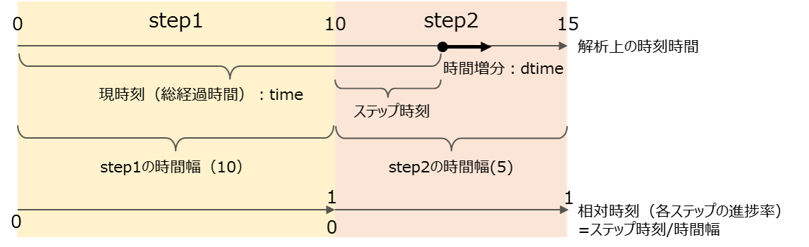

## ステップ制御

### 解析上の時間について
ここではFrontISTRの解析上の時間について、以下の通り用語の定義を行う：

- 現時刻：解析初期からの総経過時間
- ステップ時刻：ステップ開始からの経過時間
- 時間幅：ステップで解析する時間
- 相対時刻：時間幅に対するステップ開始からの経過時間の割合
- 時間増分：現時刻からつり合いを求める時刻までの増分

<div style="text-align:center;"></div>
図4.7.1　解析上の時間に関する用語定義

### 静解析の制御

本開発コードにおいて、静解析は１つまたは複数の連続した解析ステップからなる。各解析ステップごとに基本境界条件の組を１つ与え、これを前述の増分解法によって解いていく。以下では解析ステップの反復をステップループ、増分解法の反復をサブステップループと呼ぶ。
静解析の増分制御は、以下のいずれかから選択することができる。

- 固定増分による計算。収束に失敗した場合は直ちに計算を終了する。
- 自動増分・カットバックによる計算。収束状況に応じて増分量を変化させ、収束に失敗した場合には増分を小さくして再計算を行う。

#### 自動増分・カットバックの概要
自動増分・カットバックによる計算のフローは図4.7.2の通りである。

<div style="text-align:center;"></div>
図4.7.2　増分制御フロー

フローの骨格は次の通りである。

1. ステップ1から最終ステップN_stepまで、下記2.以降の手続きを繰り返す：
2. 時間増分の基準値dtime_baseを、現在のdtime_baseと前サブステップでの収束状況から定める。初回は初期時間増分initdtを用いる。
1. 実際の時間増分dtimeを、ステップ終了または直近の出力指定時刻までの残り時間とdtime_baseの小さい方で定める。
1. 時刻time+dtimeでのつり合い計算を試みる
1. 収束に成功した場合は時刻をdtimeだけ進め、失敗した場合は時刻timeの状態を復元して2.に戻る。
1. timeがステップ終了時刻に到達したらステップを終了する

解析途中で下記に挙げるケースに該当した場合、非線形静解析の手続きは失敗と判断され、エラー終了する。

- timeがステップ終了時刻に到達する前にサブステップ数が上限に到達した場合
- 時間増分の基準値dtime_baseが時間増分下限mindtを下回った場合
- 指定された N_C 回連続して収束に失敗した場合

#### 時間増分基準値dtime_baseの調整
ステップ初回のdtime_baseは、指定された初期時間増分initdtの値に設定される。
それ以外の場合は、前のサブステップの収束状況に応じて次の通り設定される。

1. 収束に失敗した場合（カットバックされた場合）…dtime_baseにカットバック縮小率 R_C を乗じた値
1. 収束に成功した場合
    1. 減少条件に該当する場合：dtime_baseに減少率 R_S を乗じた値
    2. 減少条件に該当せず、増加条件に該当する場合：dtime_baseに増加率 R_L を乗じた値と、時間増分上限maxdtの小さい方
    3. 減少条件にも増加条件にも該当しない場合：dtime_baseは変化しない

#### 増加・減少条件
自動増分調整機能では、増分を増加・減少させる条件を以下の変数を用いて判定する：

- N_max：前サブステップにおけるNewton法反復回数の最大値
- N_sum：前サブステップにおけるNewton法反復回数の合計値（接触反復が無い場合は N_max に一致）
- N_cont：前サブステップにおける接触反復回数

減少条件は以下の両方が満たされるときである：

- N_max, N_sum,N_contの「いずれか一つ」が、各々の閾値NS_max, NS_sum,NS_contを上回る
- 上記の状態が、N_S 回以上連続したサブステップで満たされる

増加条件は以下の両方が満たされるときである：

- N_max, N_sum,N_contの「すべて」が、各々の閾値NL_max, NL_sum, NL_cont以内である
- 上記の状態が、N_L 回以上連続したサブステップで満たされる

#### 計算および出力時刻の指定
自動時間増分は収束状況によって増分が変化するため、どの時刻につりあい計算および結果出力が行われるか事前に決定できない。これが不便である場合に、出力時刻のリストを与えることによって、希望する時刻におけるつり合い計算および結果出力を実行させることができる。出力時刻のリストが与えられたステップでは、指定された時刻にて必ず計算が行われるように、時間増分dtimeの値が調整される。

#### 時間増分の使用方法
本機能に関する設定はすべて解析制御ファイルで行う。
自動増分調整・カットバック機能は!STEPカードでTYPE_INC=AUTOを指定することで有効になる。
時間増分の調整関連のパラメータは、!AUTOINC_PARAMを定義の上、!STEP, AUTOINCPARAMパラメータで各ステップごとに指定する。指定がない場合は!AUTOINC_PARAMのデフォルトパラメータが使用される。
出力時刻の指定は、!TIME_POINTSで時刻リストの定義の上、!STEP, TIMEPOINTSパラメータで各ステップごとに行う。

##### 使用例
自動増分調整を有効にし、初期時間増分0.01、ステップ時間幅2.5、時間増分下限1E-5、時間増分上限0.3、最大サブステップ数を200に設定する。自動増分のパラメータセットはAP1（セット名）、出力時刻1.5, 2.7, 3.9を指定する。

```
    !AUTOINC_PARAM, NAME=AP1
    0.25, 10, 50, 10, 1
    1.25,  1,  1,  1, 2
    0.25,  5
    !TIME_POINTS, TIME=TOTAL, TIME=,NAME=TP1
    1.5
    2.7
    3.9
    !STEP, INC_TYPE=AUTO, SUBSTEPS=200, AUTOINCPARAM=AP1, TIMEPOINTS=TP1
    0.01, 2.5, 1E-5, 0.3
```

### 動解析の制御
本開発コードにおいて、動解析直接時間積分法は１つの解析ステップからなる。また動解析の増分制御は固定増分のみであり、自動時間増分機能を使用することはできない。


