## `hecmw_part1`

`hecmw_part1`は単一領域のメッシュデータを部分領域に領域分割し、並列有限要素法の計算に使用する分散メッシュデータを作成するユーティリティソフトウェアである。

データ入力にHEC-MWライブラリのデータ入力機能を用いており、同機能で読み込みが可能な単一領域のメッシュデータ「NASTRAN，ABAQUS，FEMAP Neutral またはGeoFEM フォーマットメッシュデータ」「単一領域メッシュデータ」を任意の数の部分領域に領域分割する。また、HEC-MW ライブラリのデータ出力機能を用いて「分散メッシュデータ」の出力を行っており、HEC-MW を用いて開発したソフトウェアにおいては、`hecmw_part1`により作成した分散メッシュデータを用いて解析を行うことが可能である。

`hecmw_part1`では、単一領域メッシュの領域分割の実施の仕方として、節点単位で領域分割を行う「節点ベース分割」、および、要素単位で領域分割を行う「要素ベース分割」の2種類の領域分割タイプを実装している。

領域分割手法としては、座標値を基準として部分領域への分割を行うRCB 法を用いた領域分割手法を実装しており、また、グラフ理論を領域分割に応用したMETIS のライブラリへのインターフェイスを実装することで、同ライブラリにおけるkMETIS とpMETIS を用いた領域分割も可能にしている。さらに、節点ベース分割においては，部分領域間のオーバーラップ深さを任意に設定することが可能であり、また、MicroAVSなどで利用可能な UCDファイルフォーマットで領域分割イメージを表示するためのファイルを出力機能も実装されている。

### 領域分割手法

`hecmw_part1`は、以下の領域分割手法が利用可能である。

#### RCB

Recursive Coordinate Bisectionの略であり、座標値の大小の基準に領域分割を行う方法である。高速で安定した手法であるが、部分領域が$2^n$に限定される。単純な形状においては、有効な手法である。

#### METIS

高速、かつ安定した手法であり、複雑形状においても良好な領域分割が得られることから、世界中で広く利用されているオーブンソースのフリーソフトウェアである。本ソフトウェアにおいては、このMETIS のライブラリへのインターフェイスを備えており、pMETIS とkMETIS を直接利用して領域分割を行うことが可能である。但し、METISが予め利用環境にインストールされていることが前提となる。METIS は以下のURL よりダウンロード可能である。

[METIS - Serial Graph Partitioning and Fill-reducing Matrix Ordering](http://glaros.dtc.umn.edu/gkhome/metis/metis/download)

またはフォークしたリポジトリ

[https://gitlab.com/FrontISTR-Commons/METIS](https://gitlab.com/FrontISTR-Commons/METIS)
[https://gitlab.com/FrontISTR-Commons/GKlib](https://gitlab.com/FrontISTR-Commons/GKlib)

### 領域分割タイプ

本ソフトウェアにおいては、単一領域メッシュの部分領域への分割の仕方として、以下の2種類の領域分割タイプに対応している。

#### 節点単位での領域分割(節点ベース分割)

図1.3-1に示すように、節点単位で領域分割を行う方法であり、この場合、全ての節点に対して唯一の所属部分領域が決定し、隣接する部分領域間でオーバーラップする要素が生じる。そのため、節点ベース分割においては、各部分領域は、以下に示す節点および要素の情報を所持する(図1.3-2)。

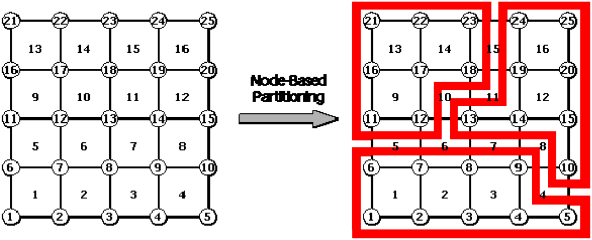{.center width="80%"}

図1.3-1 節点単位での領域分割

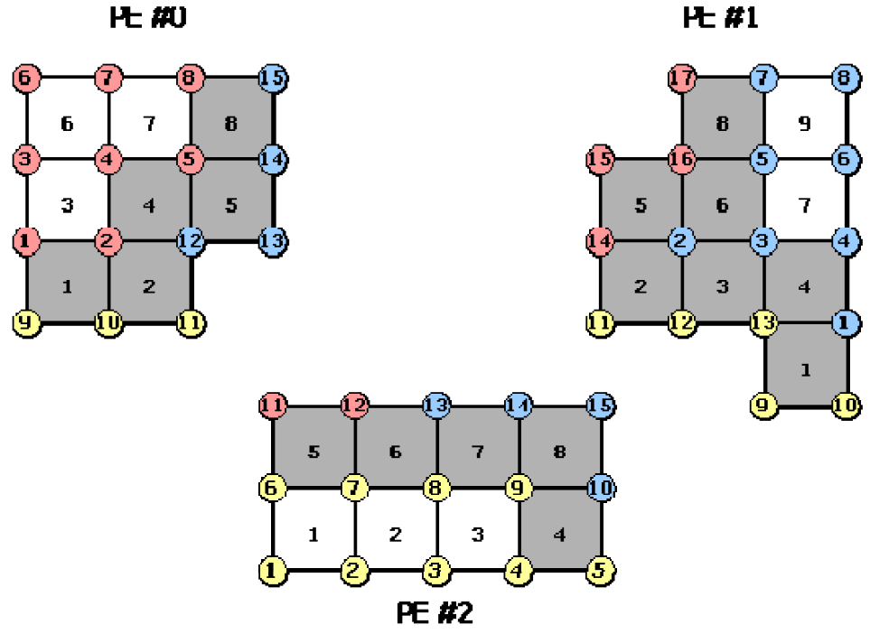{.center width="80%"}

図1.3-2 各部分領域が保持する節点および要素(節点ベース分割)

  - その部分領域に属している節点(内部節点)
  - 内部節点を含む要素
  - 内部節点を含む要素を構成する節点

また、隣接する部分領域間での通信に関する情報(通信テーブル)として、以下に示す情報を所持する。

  - 輸入節点 : 部分領域内の節点のうち、他の部分領域に属する節点
  - 輸出節点 : 他の部分領域の輸入節点となっている内部節点
  - 共有要素 : 他の部分領域と共有する要素

図1.3-1の第2番の部分領域における輸入節点、輸出節点、および共有要素を図1.3-3、図1.3-4、図1.3-5に示す。

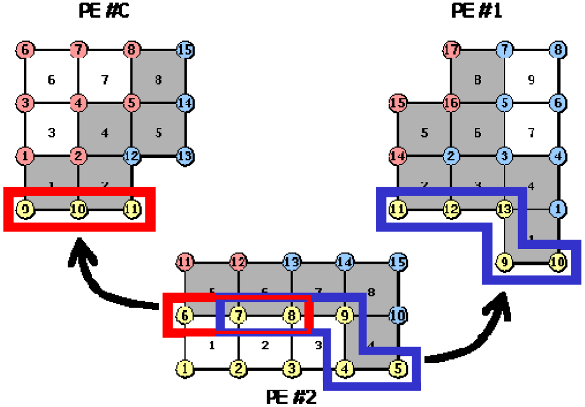{.center width="80%"}

図1.3-3 第2番の部分領域における輸入節点

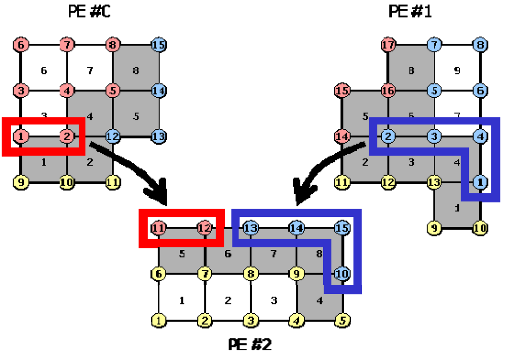{.center width="80%"}

図1.3-4 第2番の部分領域における輸出節点

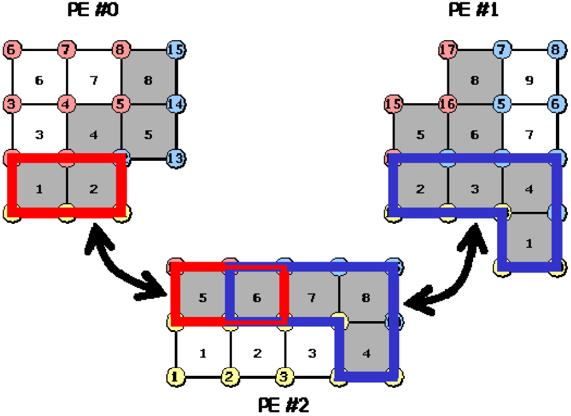{.center width="80%"}

図1.3-5 第2番の部分領域における共有要素

#### 要素単位で領域分割(要素ベース分割)

図1.3-6に示すように、要素単位で領域分割を行う方法であり、この場合、全ての要素に対して唯一の所属部分領域が決定し、隣接する部分領域間でオーバーラップする節点が生じる。ゆえに、要素ベース分割においては、各部分領域は、以下に示す節点および要素の情報を所持する(図1.3-7)。

{.center width="80%"}

図1.3-6 要素単位での領域分割

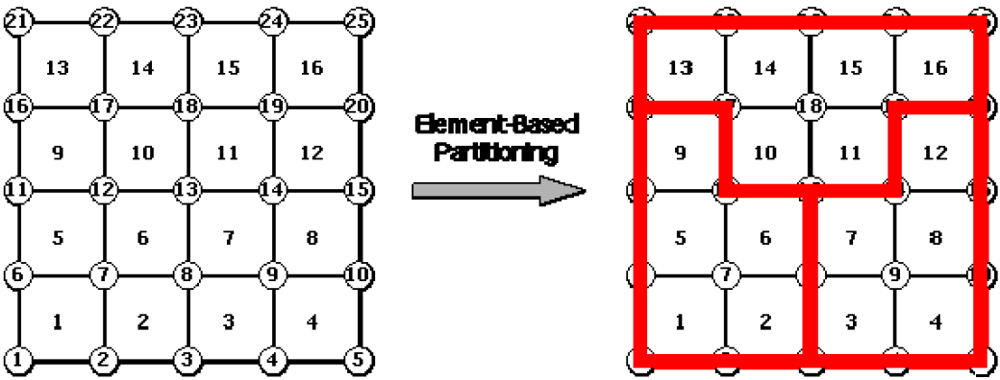{.center width="80%"}

図1.3-7 各部分領域が保持する節点および要素(要素ベース分割)

- その部分領域に属している要素(内部要素)
- 内部要素を構成する節点
- 内部要素を構成する節点を含む要素

また、隣接する部分領域間での通信に関する情報(通信テーブル)として、以下に示す情報を所持する。

  - 輸入要素 : 部分領域内の要素のうち、他の部分領域に属する要素
  - 輸出要素 : 他の部分領域の輸入要素となっている内部要素
  - 共有節点 : 他の部分領域と共有する節点

図1.3-7の第2 番の部分領域における輸入要素、輸出要素、および共有節点を図1.3-8、図1.3-9、図1.3-10に示す。

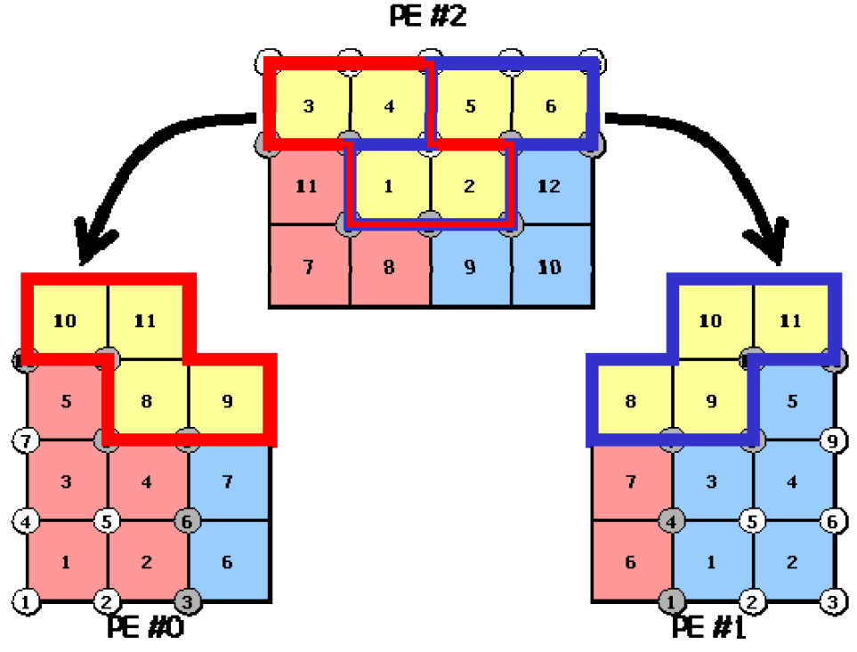{.center width="80%"}

図1.3-8 第2番の部分領域における輸入要素

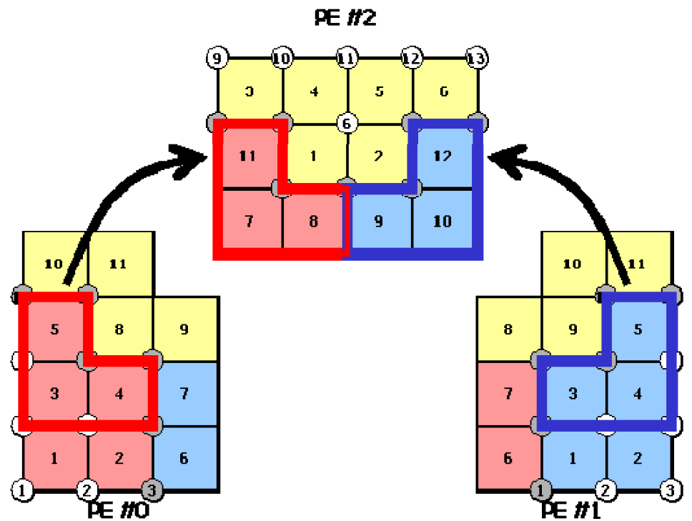{.center width="80%"}

図1.3-9 第2番の部分領域における輸出要素

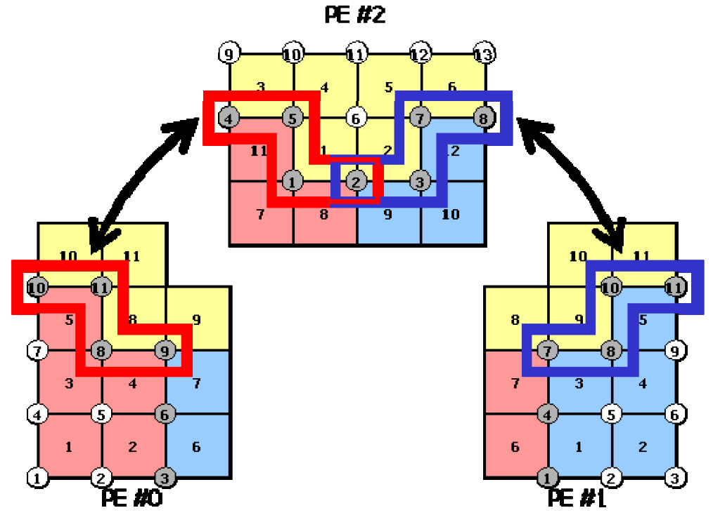{.center width="80%"}

図1.3-10 第2番の部分領域における共有節点

どちらの領域分割タイプにおいても、その通信テーブルは領域分割ユーティリティが自動的に作成し、分散メッシュデータに書き込むため、ユーザは通信に関して考慮する必要はない。

#### 可変オーバーラップ深さ

`hecmw_part1`は、部分領域間のオーバーラップ深さを任意に設定可能である(但し、領域分割タイプが節点単位での領域分割の場合に限られる)。通常、オーバーラップ深さは1で構わないのであるが、前処理にSAI(Sparse Approximate Inverse)を用いて接触問題やMPC 拘束問題等を解く際には、オーバーラップ深さを深くする必要がある。

#### 領域分割イメージ図生成用UCDファイルの作成

`hecmw_part1`は、MicroAVS 等において領域分割イメージ図を表示させるためのUCDファイルを出力することが可能である。

#### 接触点の扱い

`hecmw_part1`は、接触問題を取り扱うとき、接触点に関して

```
CONTACT=[DEFAULT|AGGREGATE|DISTRIBUTE|SIMPLE]
```

を指定することができる。


### 実行に必要なファイル

`hecmw_part1`の実行には、以下のファイルが必要である。

- 領域分割する単一領域のメッシュデータ
- 全体制御ファイル
- 領域分割ユーティリティ制御ファイル

以下、これらのファイルについて述べる。

#### 領域分割する単一領域のメッシュデータファイル

本ソフトウェアのデータ入力機能については HEC-MW ライブラリのデータ入力機能を利用しており、同機能が入力可能な単一領域のメッシュデータを入力データとして領域分割を行うことが可能である。

#### 全体制御ファイル

本ソフトウェアは、表示するメッシュデータの指定に HEC-MW の全体制御ファイルを用いている。本ソフトウェアの実行にあたっては、全体制御ファイルに以下の指定が必要である。

- 領域分割する単一領域のメッシュデータのファイル名
- 作成する分散メッシュデータのファイル名のヘッダー

以下に、全体制御ファイルの記述例を示す。

`mesh.dat` というファイル名の単一領域メッシュデータをを領域分割し，`mesh.dist.0`，`mesh.dist.1`，… というファイル名の分散メッシュデータを作成する場合、その全体制御ファイル(`hecmw_ctrl.dat`)の記述は以下の通りである。

```
# 領域分割する単一領域メッシュデータの定義
!MESH, NAME=part_in, TYPE=HECMW-ENTIRE
mesh.dat
# 作成する分散メッシュデータの定義
!MESH, NAME=part_out, TYPE=HECMW-DIST
mesh.dist
```

ここで、領域分割する単一領域メッシュデータの定義(記述例1 つ目の`!MESH`)において，その`NAME`オプションに指定する文字列は`part_in`に固定されている。また，作成する分散メッシュデータの定義(記述例2 つ目の`!MESH`)において，その`NAME` オプションに指定する文字列は`part_out`に，`TYPE`オプションに指定するファイルフォーマットの指定子は`HECMW-DIST`に固定されている。これらのオプションに指定の文字列等が記述されていない場合にはエラーとなる。

#### 領域分割ユーティリティ制御ファイル

`hecmw_part1`は、領域分割手法、領域分割数などの領域分割条件を「領域分割ユーティリティ制御ファイル(`hecmw_part_ctrl.dat`)」にて設定する。この制御マニュアルの記述法を以下に示す。

この制御ファイルのデフォルトのファイル名は`hecmw_part_ctrl.dat` である。

適用例の章において，各例題の領域分割ユーティリティ制御ファイルの内容を示してある。記述の際に参考にされたい。

##### 1行目

```
!PARTITION, TYPE=<type>, METHOD=<method>, DOMAIN=<domain> [, optional parameter]
```

| パラメータ |                                               |
| ---------- | --------------------------------------------- |
| TYPE       | 領域分割タイプ (必須)                         |
| METHOD     | 領域分割手法 (必須)                           |
| DOMAIN     | 領域分割数 (必須)                             |
| DEPTH      | オーバーラップ深さ (省略可)                   |
| UCD        | 領域分割イメージ用UCD ファイルの出力 (省略可) |
| CONTACT    |                                               |

| パラメータ | パラメータ値  | 内容                                                         |
| ---------- | ------------- | ------------------------------------------------------------ |
| TYPE       | NODE-BASED    | 節点ベース分割                                               |
|            | ELEMENT-BASED | 要素ベース分割                                               |
| METHOD     | RCB           | RCB 法、2 行目に分割基準軸の指定が必須                       |
|            | KMETIS        | kMETIS                                                       |
|            | PMETIS        | pMETIS                                                       |
| DOMAIN     | <domain>      | 領域分割数                                                   |
| DEPTH      | <depth>       | 部分領域のオーバーラップ深さ(省略時はDEPTH=1)</br>TYPE=ELEMENT-BASEDの時は指定不可 |
| UCD        | <filename>    | UCDファイル名(省略可)                                        |
| CONTACT    | DEFAULT       |                                                              |
|            | AGGREGATE     |                                                              |
|            | DISTRIBUTE    |                                                              |
|            | SIMPLE        |                                                              |

##### 2行目 (METHOD=RCBの場合のみ必須)

```
(2行目) DIR1, DIR2, DIR3, ... (分割回数分指定)
```

| 変数名 | 属性 | 内容                               |
| ------ | ---- | ---------------------------------- |
| DIRX   | C    | 分割基準軸 (小文字のx, y, zで指定) |

##### 制御ファイルの実例

実例1

```
!PARTITION, TYPE=NODE-BASED, METHOD=RCB, DOMAIN=8, DEPTH=1, UCD=mesh.inp
x, y, z
```

実例2

```
!PARTITION, TYPE=ELEMENT-BASED, METHOD=PMETIS, DOMAIN=32
```

### 実行方法

本ソフトウェアの起動コマンドは以下の通り。

```
$ hecmw_part1 [-f <part_ctrl_filename>]
```

ここで，-f オプションにより，領域分割ユーティリティ制御ファイルのファイル名の指定が可能である。このオプションが省略された場合には，実行ディレクトリにあるデフォルトのファイル名（`hecmw_part_ctrl.dat`）のファイルから領域分割ユーティリティ制御情報を読み込む。

また，`hecmw_part1`の実行時には，全体制御ファイルは実行ディレクトリに，領域分割する単一領域メッシュデータファイルは全体制御ファイルで指定したディレクトリに配置する。

### 適用例

#### 単純立方体モデル (48節点×48節点×48節点)

- 要素タイプ : 六面体1次要素
- 節点数 : 110,592
- 要素数 : 103,823

##### 領域分割ユーティリティ制御ファイル記述例

```
!PARTITION, TYPE=NODE-BASED, METHOD=RCB, DOMAIN=64, UCD=cube.rcb.inp
x, y, z, x, y, z
```

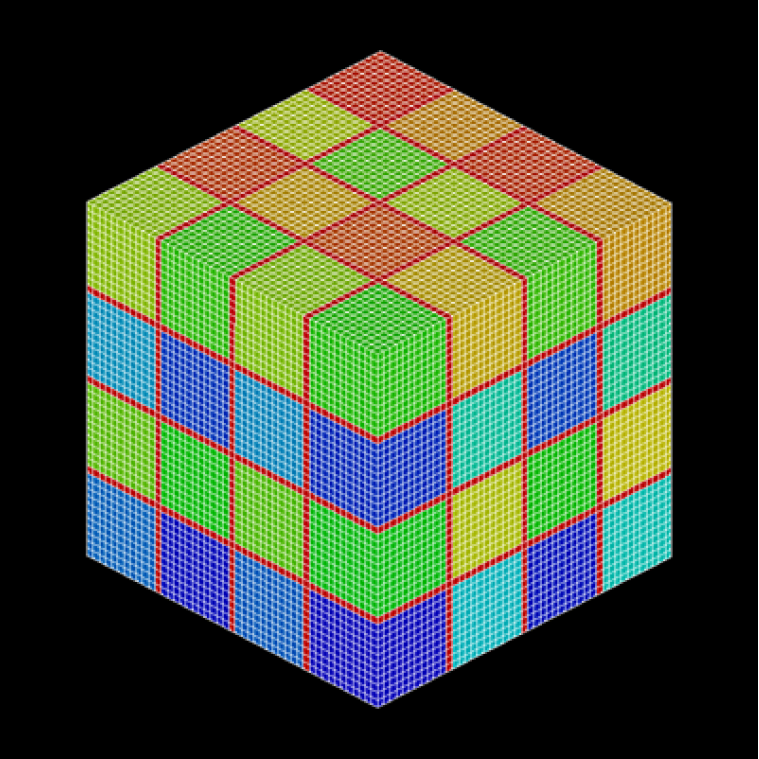{.center width="80%"}

図4.1-1 領域分割ユーティリティ適用例1:単純立方体モデル(節点ベース分割,RCB法,edgecut数:20,736/324,864)

##### 領域分割ユーティリティ制御ファイル記述例

```
!PARTITION, TYPE=NODE-BASED, METHOD=KMETIS, DOMAIN=64, UCD=cube.kmetis.inp
```

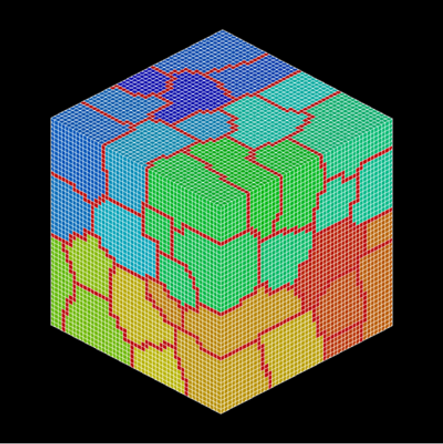{.center width="80%"}

図4.1-2 領域分割ユーティリティ適用例1:単純立方体モデル(節点ベース分割,kMETIS,edgecut数:26,160/324,864)

#### 赤門(東京大学本郷キャンパス)モデル

- 要素タイプ : 四面体一次要素
- 節点数 : 3,550
- 要素数 : 10,156

##### 領域分割ユーティリティ制御ファイル記述例

```
!PARTITION, TYPE=NODE-BASED, METHOD=RCB, DOMAIN=32, UCD=akamon.rcb.inp
x, y, z, x, y
```

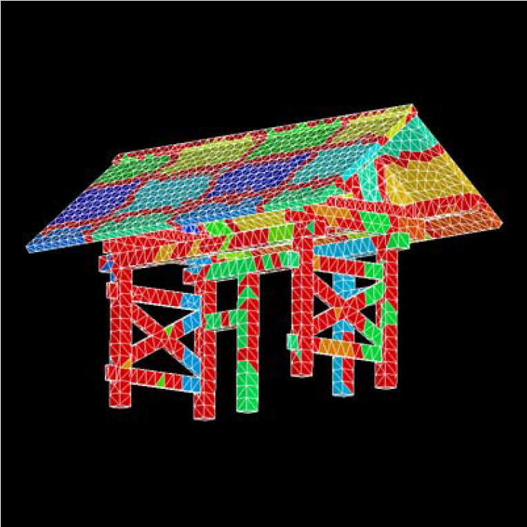{.center width="80%"}

図4.2-1 領域分割ユーティリティ適用例2:赤門モデル(節点ベース分割,RCB法,edgecut:4,396/17,180)

##### 領域分割ユーティリティ制御ファイル記述例

```
!PARTITION, TYPE=NODE-BASED, METHOD=PMETIS, DOMAIN=32, UCD=akamon.kmetis.inp
```

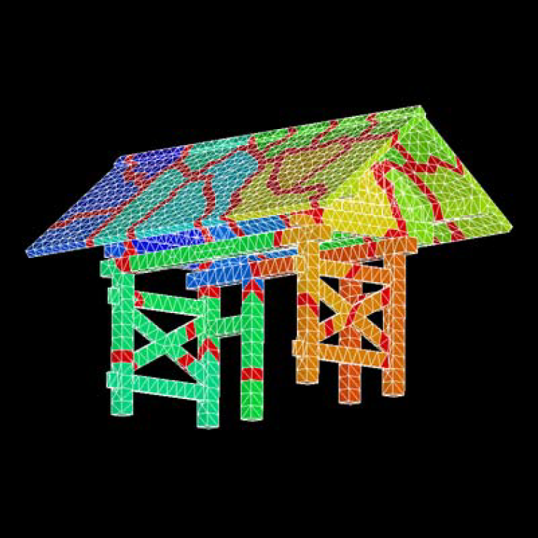{.center width="80%"}

図4.2-2 領域分割ユーティリティ適用例2:赤門モデル(節点ベース分割,pMETIS,edgetcut:2,119/17,180)

#### 本州モデル

- 要素タイプ : 三角形一次要素
- 節点数 : 21,285
- 要素数 : 40,548

##### 領域分割ユーティリティー制御ファイル記述例

```
!PARTITION, TYPE=ELEMENT-BASED, METHOD=RCB, DOMAIN=64, UCD=honshu.rcb.inp
x, y, x, y, x, y
```

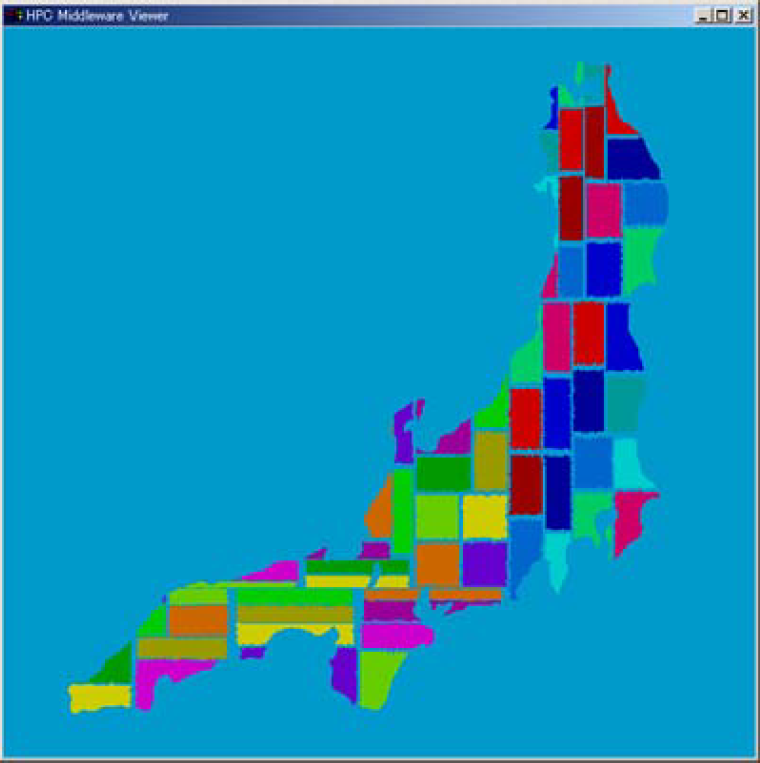{.center width="80%"}

図4.3-1 領域分割ユーティリティ適用例3:本州モデル(要素ベース分割,RCB法,edgecut:17,241/237,627)

##### 領域分割ユーティリティー制御ファイル記述例

```
!PARTITION, TYPE=ELEMENT-BASED, METHOD=KMETIS, DOMAIN=64, UCD=honshu.kmetis.inp
```

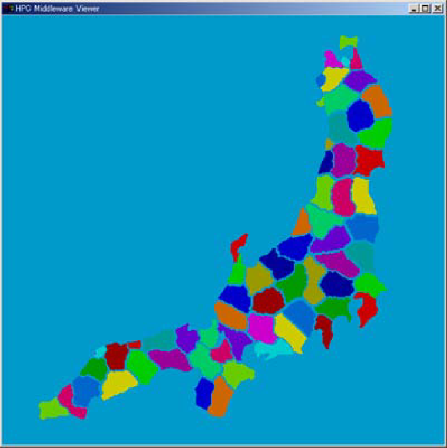{.center width="80%"}

図4.3-2 領域分割ユーティリティ適用例3:本州モデル(要素ベース分割,kMETIS,edgecut:11,657/237,627)

#### 黒鉛ブロックモデル

- 要素タイプ : 六面体一次要素
- 節点数 : 1,308
- 要素数 : 795

##### 領域分割ユーティリティ制御ファイル記述例

```
!PARTITION, TYPE=NODE-BASED, METHOD=RCB, DOMAIN=4, DEPTH=1, UCD=carbon.1.inp
x, y
```

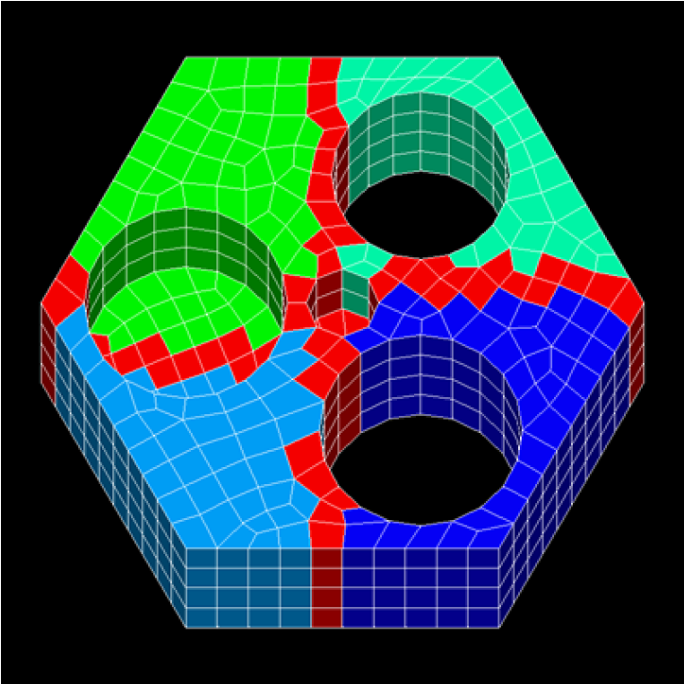{.center width="80%"}

図4.4-1 領域分割ユーティリティ適用例4:黒鉛ブロックモデル(オーバーラップ深さ変更例,DEPTH=1)

##### 領域分割ユーティリティ制御ファイル記述例

```
!PARTITION, TYPE=NODE-BASED, METHOD=RCB, DOMAIN=4, DEPTH=2, UCD=carbon.2.inp
x, y
```

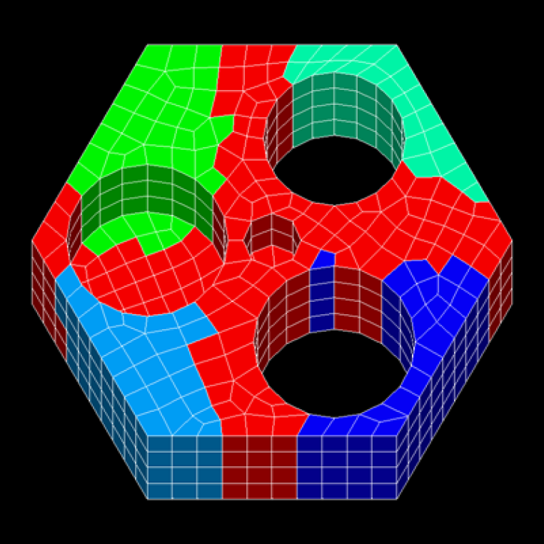{.center width="80%"}

図4.4-2 領域分割ユーティリティ適用例4:黒鉛ブロックモデル(オーバーラップ深さ変更例,DEPETH=2)

### エラーメッセージ

#### `HECMW-PART-E0001: No such file or directory`

指定したファイルが存在しない

#### `HECMW-PART-E0002: File close error`

ファイルを閉じる際に予期せぬエラーが発生した

#### `HECMW-PART-E0003: Too long file name`

ファイル名が長すぎる

#### `HECMW-PART-E0004: NULL pointer was found`

不正なヌルポインタを検出した

#### `HECMW-PART-E0005: Invalid EOF is found`

予期せぬEOF を検出した

#### `HECMW-PART-E0006: Invalid argument is found`

不正な引数を検出した

#### `HECMW-PART-E0101: Invalid token found`

無効なトークンを検出した

#### `HECMW-PART-E0111: 'TYPE' must not be omitted`

!PARTITION の必須のオプションである'TYPE'が見つからない

#### `HECMW-PART-E0121: 'METHOD' must not be omitted`

!PARTITION の必須のオプションである'METHOD'が見つからない

#### `HECMW-PART-E0131: 'DOMAIN' must not be omitted`

!PARTITION の必須のオプションである'DOMAIN'が見つからない

#### `HECMW-PART-E0134: 'METHOD' is 'RCB', but 'DOMAIN' is not n-th power of 2`

'METHOD'に'RCB'が指定されているが'DOMAIN'の値が2 のべき乗でない

#### `HECMW-PART-E0161: Partitioning directions are not enough`

分割軸方向の指定が足りない

#### `HECMW-PART-E0201: Invalid partitioning type is found`

不正な領域分割タイプを検出した

#### `HECMW-PART-E0202: Invalid partitioning method is found`

不正な領域分割法を検出した

#### `HECMW-PART-E0203: Invalid element type is found`

不正な要素タイプを検出した

#### `HECMW-PART-E0204: Invalid partitioning direction is found`

不正な分割軸方向を検出した

#### `HECMW-PART-E0205: Invalid number of sub-domains is found`

不正な部分領域数を検出した

#### `HECMW-PART-E0206: Invalid overlapping depth is found`

不正な部分領域間オーバーラップ深さを検出した

#### `HECMW-PART-E0211: Stack overflow`

スタック配列がオーバーフローした

#### `HECMW-PART-E0301: Domain number is outside of the range`

部分領域番号が部分領域数を超えている

#### `HECMW-PART-E0311: Number of nodes is outside of the range`

不正な節点数を検出した

#### `HECMW-PART-E0312: Number of internal nodes is outside of the range`

不正な内部節点数を検出した

#### `HECMW-PART-E0321: Number of elements is outside of the range`

不正な要素数を検出した

#### `HECMW-PART-E0322: Number of internal elements is outside of the range`

不正な内部要素数を検出した

#### `HECMW-PART-E0331: Number of neighboring sub-domains must be grater than or equal 0`

隣接部分領域数が0 より小さい

#### `HECMW-PART-E0501: Log file has not initialized yet`

ログファイルの初期化処理が行われていない

#### `HECMW-PART-E9999: Fatal error`

深刻なエラーが発生した

#### `HECMW-PART-W0162: Too many partitioning directions are specified`

必要数以上の分割軸方向が指定された

#### `HECMW-PART-W0401: EQUATION_BLOCK is not found`

EQUATION_BLOCK が見つからない

#### `HECMW-PART-W0502: Log file for practitioner has already initialized`

ログファイルの初期化処理が複数回呼び出された

## `hecmw_vis1`

## `hec2rcap`

## `rconv`

## `rmerge`
