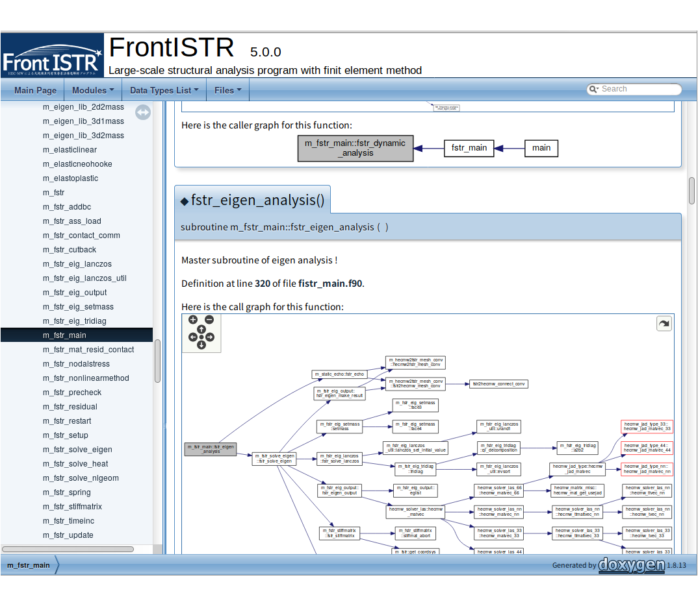

## cmakeでのインストール

cmakeには、ライブラリの自動探索機能が備わっています。それらを手動で明示することもできます。

cmakeコマンドの詳細は、 [https://cmake.org/](https://cmake.org/documentation/) をご覧ください。

### 準備

本ソフトウェアの構築に必要なライブラリを予めインストールします。

インストールするライブラリのディレクトリ構成は

```
  $HOME
    |-- local
          |-- bin
          |-- include
          |-- lib
```

の様な構成を推奨します。

その際、上記の場合 `$PATH` 環境変数に `$HOME/local/bin` を追加してください。

cmakeがインストールされているかを確認します。cmakeはバージョン2.8.11以上が必要になります。

```
$ cmake --version
cmake version 2.8.12.2
```

### 構築

次にFrontISTRを構築します。

```
$ cd `${FSTRBUILDDIR}`
$ mkdir build
$ cd build
$ cmake ..
$ make -j2
```

`make` のオプション `-j2` は、並列コンパイルの数を示しています。構築するコンピュータのコア数に併せて数を増やすことで、コンパイル時間の短縮が期待できます。

### make installの実行

makeの実行が正常に終了したあと、本ソフトウェアをインストールするため、以下のコマンドを実行します。

```
$ make install
```

以上で`/usr/local/bin`もしくは、`-DCMAKE_INSTALL_PREFIX`で指定したディレクトリに、本ソフトウェアがインストールされます。

インストールする場所を変えるには、cmakeコマンドにオプションを追加します。


```
$ cmake -DCMAKE_INSTALL_PREFIX=$HOME/local ..
```

などとオプションを追加してください。

コンパイルされたFrontISTR(`fistr1`)が、どの機能を有効になっているかは

```
 ./fistr1 -v
FrontISTR version 5.0.0 (eb7fb1c1a3d210b0c1f70b41c92995bfcb050e82)
MPI: Enabled
OpenMP: Enabled
HECMW_METIS_VER: 5
Compile Option: -p --with-tools --with-metis --with-mumps --with-lapack --with-ml
```

で確認することができます。

### cmakeのオプション

cmakeコマンドを実行する際、オプションを指定することで挙動を明示的に指定することができます。

| オプション(デフォルト) | 説明                                           | 備考                         |
|:-----------------------|:-----------------------------------------------|:-----------------------------|
| -DWITH_TOOLS=ON        | パーティショナなどのツールもコンパイル         | hecmw_part1などツール        |
| -DWITH_MPI=ON          | MPIを有効                                      | ライブラリが必要             |
| -DWITH_OPENMP=ON       | OpenMPを有効                                   | コンパイラの対応が必要       |
| -DWITH_REFINER=ON      | REVOCAP_Refinerの機能を有効                    | ライブラリが必要             |
| -DWITH_REVOCAP=ON      | REVOCAP_Couplerの機能を有効                    | ライブラリが必要             |
| -DWITH_METIS=ON        | METISの機能を有効                              | 4.0.3と5.1.0に対応           |
| -DMETIS_VER_4=OFF      | metis-4.0.3を使う場合に設定                    | metis-5.1.0の場合指定不要    |
| -DWITH_PARMETIS=ON     | ParMETISの機能を有効                           | 3.2.0と4.0.3に対応           |
| -DMETIS_VER_3=OFF      | ParMetis-3.2.0を使う場合に設定                 | parmetis-4.0.3の場合指定不要 |
| -DWITH_MKL=ON          | MKL PARDISOの機能を有効                        | ライブラリが必要             |
| -DWITH_MUMPS=ON        | MUMPSの機能を有効                              | ライブラリが必要             |
| -DWITH_LAPACK=ON       | LAPACKの機能を有効                             | ライブラリが必要             |
| -DWITH_ML=ON           | Trilinos MLの機能を有効                        | ライブラリが必要             |
| -DWITH_DOC=OFF         | FrontISTRのソースコードをドキュメント化        | doxygenとgraphvizが必要      |
| -DOLD_RES_FORMAT=OFF   | ONでresultファイルの旧フォーマット出力を有効化 |                              |

cmakeで設定されている変数の一覧は

```
$ cmake -L
```

で確認できます。

その他、使用するコンパイラの指定やライブラリの指定をするオプションは以下の通りです。

| オプション                | 説明                                                 | 備考                                                                                       |
|:--------------------------|:-----------------------------------------------------|:-------------------------------------------------------------------------------------------|
| -DBLA_VENDOR=             | 利用するBLASのベンダーを指定                         | FindBLAS.cmakeを参照                                                                       |
| -DBLAS_LIBRARIES=         | BLASライブラリを直接指定                             | ライブラリを絶対パスで直接指定                                                             |
| -DLAPACK_LIBRARIES=       | LAPACKライブラリを直接指定                           | ライブラリを絶対パスで直接指定                                                             |
| -DCMAKE_INSTALL_PREFIX=   | インストールするパスを設定。デフォルトは`/usr/local` | -DCMAKE_INSTALL_PREFIX=$HOME/local で $HOME/local/bin などにプログラムがインストールされる |
| -DCMAKE_C_COMPILER=       | Cコンパイラを指定                                    | -DCMAKE_C_COMPILER=icc  (Intel Cコンパイラ）                                               |
| -DCMAKE_CXX_COMPILER=     | C++コンパイラを指定                                  | -DCMAKE_CXX_COMPILER=icpc  (Intel C++コンパイラ)                                           |
| -DCMAKE_Fortran_COMPILER= | Fortranコンパイラを指定                              | -DCMAKE_Fortran_COMPILER=ifort  (Intel Fortranコンパイラ)                                  |
| -DCMAKE_PREFIX_PATH=      | ライブラリ等の格納場所を指定                         | -DCMAKE_PREFIX_PATH=$HOME/tools (ライブラリなどを探索するパス)                             |

## 簡易テスト機能について

本ソフトウェアには、コンパイルしたオブジェクトが正しく動くことを確認するための簡易テストスクリプトが同梱されています。

テストを行うには`ruby`を予めインストールします。`ruby`がインストールされていれば、`cmake`時にテストが自動的に有効になります。

`cmake`で本ソフトウェアをコンパイル後、以下のようにしてテストを実行します。

```
$ make test
```

テストは以下のように実行されます。

``` 
/home/fistr/Work/FrontISTR/build$ make test
Running tests...
Test project /home/fistr/Work/FrontISTR/build
      Start  1: Static_exA_Test
 1/23 Test  #1: Static_exA_Test ..................   Passed    6.85 sec
      Start  2: Static_exB_Test
 2/23 Test  #2: Static_exB_Test ..................   Passed    6.48 sec
      Start  3: Static_exC_Test
...
```

更に詳細なメッセージを出力する場合

```
$ make test ARGS="-VV -O test_log.txt"
```

とすると、`test_log.txt`ファイルの中に結果が出力されます。オプションの詳細は

```
$ ctest --help
```

を参照してください。

## ソースコードのドキュメンテーションについて

本ソフトウェアのソースコードを学習に用いる際、各サブルーチンの相関やソースコードに埋め込まれているコメントを、ブラウザで参照することができます。

ソースコードのドキュメントをHTMLで構築するには、予め`doxygen`と`graphviz`をインストールします。

以下の手順でHTMLを構築します。

```
$ cmake -DWITH_DOC=ON ..
$ make doc
```

作成されたHTMLを以下のようにして参照します。

```
$ firefox doc/html/index.html
```

{: .center width="80%"}

## デバッグを有効にする

デバッグを有効にするには、

```
$ cmake -DCMAKE_BUILD_TYPE="DEBUG" ..
```

としてから`make`をします。更に高度なデバッグオプションを有効にするには

```
$ cmake -DCMAKE_BUILD_TYPE="DEBUG" -DDEBUG_EXTRA=ON ..
```

とすると、メモリリークなどの検出に役立ちます。


