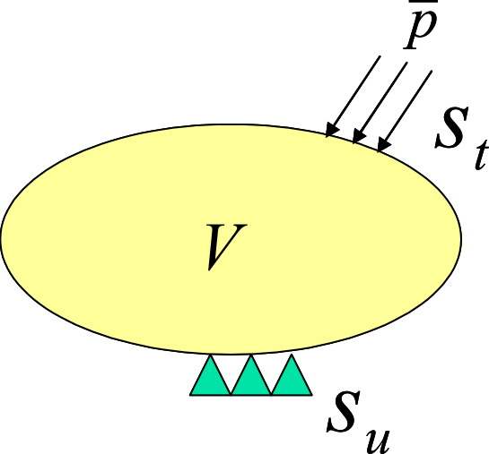

## 微小変形線形弾性静解析

ここでは微小変形理論に基づく弾性静解析についての定式化を示す。応力・ひずみ関係として線形弾性を仮定している。

### 基礎方程式

固体力学の平衡方程式、力学的境界条件、幾何学的境界条件（基本境界条件）は次式で与えられる（図2.1.1参照）。

$$
\begin{equation}
\nabla \cdot \sigma + \overline{b} = 0 \; in \; V
\label{eq:2.1.1}
\end{equation}
$$

$$
\begin{equation}
\sigma \cdot n = \overline{t} \; on \; S_t
\label{eq:2.1.2}
\end{equation}
$$

$$
\begin{equation}
u = \overline{u} \; on \; S_u
\label{eq:2.1.3}
\end{equation}
$$

ここで、$\sigma$は応力、$\overline{t}$は表面力、$S_t$は物体力であり、$S_t$は力学的境界、$S_u$は幾何学的境界を表す。

図 2.1.1 固体力学における境界値問題(微小変形問題)

微小変形問題におけるひずみ・変位関係式は次式で与えられる。

$$
\begin{equation}
\varepsilon = \nabla _s u
\label{eq:2.1.4}
\end{equation}
$$

また、線形弾性体での応力・ひずみ関係式（構成式）は次式で与えられる。

$$
\begin{equation}
\sigma = C : \varepsilon
\label{eq:2.1.5}
\end{equation}
$$

ここで$C$は4階の弾性テンソルである。

### 仮想仕事の原理

基礎方程式$\eqref{eq:2.1.1}$、式$\eqref{eq:2.1.2}$、式$\eqref{eq:2.1.3}$と等価である、微小変形線形弾性問題についての仮想仕事の原理は次式のように表される。

$$
\begin{equation}
\int_V \sigma : \delta \varepsilon dV = \int_{S_t} \overline{t} \cdot \delta u dS + \int_V \overline{b} \cdot \delta u dV
\label{eq:2.1.6}
\end{equation}
$$

$$
\begin{equation}
\delta u = 0 \; on \; S_u
\label{eq:2.1.7}
\end{equation}
$$

さらに構成式$\eqref{eq:2.1.5}$を考慮して式$\eqref{eq:2.1.6}$は次式のように表される。

$$
\begin{equation}
\int_V (C : \varepsilon) : \delta \varepsilon dV = \int_{S_t} \overline{t} \cdot \delta u dS + \int_V \overline{b} \cdot \delta u dV
\label{eq:2.1.8}
\end{equation}
$$

式$\eqref{eq:2.1.8}$において、$\varepsilon$はひずみテンソル、$C$は4階の弾性テンソルである。
ここで、応力テンソル$\sigma$とひずみテンソル$\varepsilon$を、
それぞれベクトル形式で$\hat{\sigma}$、$\hat{\varepsilon}$と表すと、構成式$\eqref{eq:2.1.5}$は次式のように表される。

$$
\begin{equation}
\hat{\sigma} = D \hat{\varepsilon}
\label{eq:2.1.9}
\end{equation}
$$

ここで、$D$ は弾性マトリクスである。

ベクトル形式で表された応力$\hat{\sigma}$、$\hat{\varepsilon}$および式$\eqref{eq:2.1.9}$を考慮して、式$\eqref{eq:2.1.8}$は次式のように表わされる。

$$
\begin{equation}
\int_V \hat{\varepsilon}^T D \delta \hat{\varepsilon} dV = \int_{S_t}
\delta u^T \overline{t} dS + \int_V \delta u^T \overline{b} dV
\label{eq:2.1.10}
\end{equation}
$$

式$\eqref{eq:2.1.10}$および式$\eqref{eq:2.1.7}$が、本開発コードにおいて離散化される仮想仕事の原理である。

### 定式化

仮想仕事の原理式$\eqref{eq:2.1.10}$を有限要素ごとに離散化して次式を得る。

$$
\begin{equation}
\sum_{e} = \int_{V^e} \hat{\varepsilon}^T D \delta \hat{\varepsilon} dV = \sum_{e} \int_{S^e_t}
\delta u^T \overline{t} dS + \sum_{e} \int_{V^e} \delta u^T \overline{b} dV
\label{eq:2.1.11}
\end{equation}
$$

要素ごとに、要素を構成する節点の変位を用いて変位場を次式のように内挿する。

$$
\begin{equation}
u = \sum^m_{i=1} N_i u_i = N U
\label{eq:2.1.12}
\end{equation}
$$

このときひずみは、式$\eqref{eq:2.1.4}$を用いて次式のように与えられる。

$$
\begin{equation}
\hat{\varepsilon} = B U
\label{eq:2.1.13}
\end{equation}
$$

式$\eqref{eq:2.1.12}$、式\eqref{eq:2.1.13}$を式\eqref{eq:2.1.11}$に代入して、次式を得る。

$$
\begin{equation}
\sum_e \delta U^T ( \int_{V^e} B^T DB dV )
U = \sum_e \delta U^T \cdot \int_{S_t^e}
N^T \overline{t} dS + \sum_{e} \delta U^T \int_{V^e} N^T
\overline{b} dV
\label{eq:2.1.14}
\end{equation}
$$

式$\eqref{eq:2.1.14}$は次式のようにまとめることができる。

$$
\begin{equation}
\delta U^T K U = \delta U^T F
\label{eq:2.1.15}
\end{equation}
$$

ここで、
式$\eqref{eq:2.1.16}$、式$\eqref{eq:2.1.17}$で定義されるマトリクスおよびベクトルの成分は、有限要素ごとに計算し、重ねあわせることができる。

$$
\begin{equation}
K = \sum_e \int_{V^e} B^T DB dV
\label{eq:2.1.16}
\end{equation}
$$

$$
\begin{equation}
F = \sum_e (\int_{S_t^e} N^T \overline{t} dS + \int_{V^e} N^T \overline{b} dV )
\label{eq:2.1.17}
\end{equation}
$$

式$\eqref{eq:2.1.15}$が、任意の仮想変位$\delta U$について成立することにより次式を得る。

$$
\begin{equation}
K U = F
\label{eq:2.1.18}
\end{equation}
$$

一方、変位境界条件式$\eqref{eq:2.1.3}$は次式のように表される。

$$
\begin{equation}
U = \overline{U}
\label{eq:2.1.19}
\end{equation}
$$

式$\eqref{eq:2.1.18}$を拘束条件式$\eqref{eq:2.1.19}$のもとで解くことにより、節点変位$U$を決定することができる。
