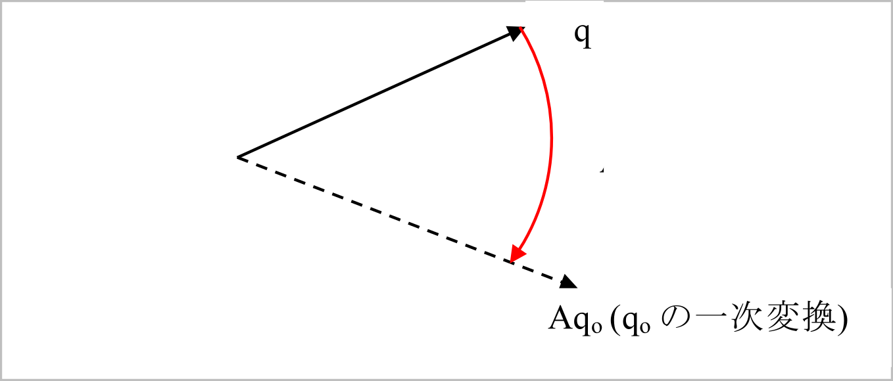
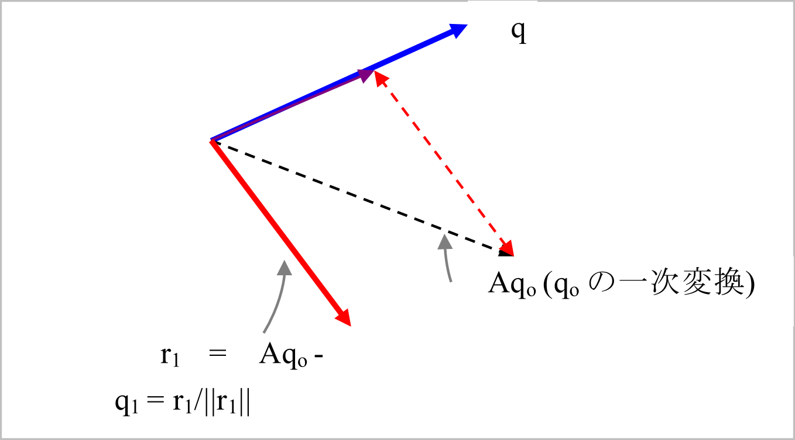
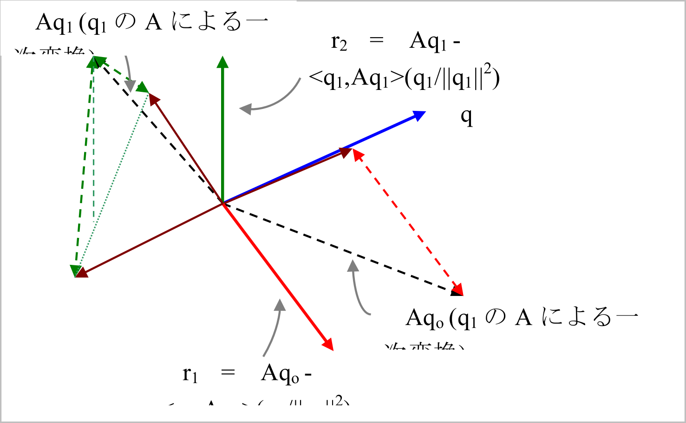

## 固有値解析

### 一般化固有値問題

連続体の自由振動解析を行う場合、空間的離散化を行い、図2.3.1に示すような集中質点による多自由度系でモデル化さられる。
減衰のない自由振動問題の場合、支配方程式（運動方程式）は以下のとおりである。

\begin{equation}
M u + K \ddot{u} = 0
\label{eq:2.3.1}
\end{equation}

ただし、\(u\) は一般化変位ベクトル、\(M\) は質量マトリックス、\(K\)は剛性マトリックスである。
ところで、固有角振動数を\(\omega\)とし、\(a\)、\(b\)、\(c\)を任意定数、\(x\)をベクトルとして、関数

\begin{equation}
u(t) = (a \sin \omega t + b \cos \omega t ) x
\label{eq:2.3.2}
\end{equation}

を定義する。ここで、この式と、この2階の微分、すなわち、

\begin{equation}
\ddot{u}(t) = -\omega^2 (a \sin \omega t + b \cos \omega t) x
\label{eq:2.3.3}
\end{equation}

を式\(\eqref{eq:2.3.1}\)に代入すれば、

\begin{equation}
M u + K \ddot{u} = (a \sin \omega t + b \cos \omega t) (- \omega^2 M + K x ) =  ( -\lambda M + K x) = 0
\label{eq:2.3.4}
\end{equation}

となる。すなわち、

\begin{equation}
K x = \lambda M x
\label{eq:2.3.5}
\end{equation}

を得る。

つまり、方程式\(\eqref{eq:2.3.5}\)を満たす係数\(\lambda = \omega^2\)
およびベクトル\(x\)を見つけられれば、関数\(u(t)\)は、方程式\(\eqref{eq:2.3.1}\)の解となっている。

係数\(\lambda\)を固有値、ベクトル\(x\)を固有ベクトルと呼び、これらを式\(\eqref{eq:2.3.1}\)から求める問題を一般化固有値問題と呼ぶ。

{.center width="80%"}

図 2.3.1　減衰のない自由振動の多自由度系の例

### 問題設定

式\(\eqref{eq:2.3.5}\)は任意の次数に拡張でき、多くの場面で登場する。多くの物理問題を扱う上では行列はエルミート（対称）であることが多い。
即ち、複素行列においては、転置行列が共役複素数になっており、実行列においては対称行列である。つまり、行列\(K\)の\(ij\)成分を\(k_{ij}\)とした時、\(k\)の共役複素数を\(\bar{k}\)とおけば、

\begin{equation}
k_{ij} = \bar{k}_{ji}
\label{eq:2.3.6}
\end{equation}

の関係にある。

このマニュアル内では、行列は対称で正定値を仮定する。正定値とは固有値がすべて正、言い換えれば下記の式\(\eqref{eq:2.3.7}\)を常に満足する行列である。

\begin{equation}
x^{t} A x > 0
\label{eq:2.3.7}
\end{equation}

### シフト付逆反復法

有限要素法による構造解析では、実用上、全ての固有値は必要とせず、高々数個の低次の固有値で十分な場合が多い。
ところで、HEC-MWでは大規模な問題を扱うことを想定しており、行列はサイズが大きく非常に疎（零要素が多い）である。
したがって、この事を念頭に低次のモードの固有値を効率よく求めることが重要である。

固有値の下限を\(\sigma\)とした時、式\(\eqref{eq:2.3.5}\)を次式のように変形する（数学的には等価な式である）。

\begin{equation}
(K - \sigma M)^{-1} M x = \frac{1}{(\lambda-\sigma)} x
\label{eq:2.3.8}
\end{equation}

この時、計算に当たっては次のような好都合な性質がある。

  1.  モードが反転している。
  2.  \(\rho\)周辺の固有値が最大化されている。

実際の計算では最大固有値が最初に求まることが多い。そのため主要な収束計算を式\(\eqref{eq:2.3.5}\)よりむしろ式\(\eqref{eq:2.3.8}\)に適用し、\(\rho\)周辺の固有値から求めることを狙うものとする。この手法は、シフト付逆反復と呼ばれている。

### 固有値解法のための算法

古典的な方法ではJacobi法がよく知られている。

この方法は、行列サイズが小さく密行列である時、有効である。
しかしながら、HEC-MWで扱う行列は大規模で疎であるため、この方法は採用せずランチョス(Lanczos)反復解法を採用している。

### ランチョス法

1950年台にC. Lanczosにより提案されたこの手法は、行列を3重対角化する計算算法であり、下記のような特徴を有している。

  -  反復収束解法であり、行列を疎のまま計算を進めることができる。
  -  算法は行列、ベクトル積が中心となっており並列化に適している。
  -  有限要素メッシュに伴う幾何学的領域分割法に適している。
  -  求める固有値の個数やモード範囲を限定して効率よい計算を行える。

ランチョス法は、初期ベクトルからスタートして順次直交ベクトルを作成し部分空間の基底を求める計算を行うものである。
この方法は、別の反復解法であるサブスペース法より高速であると言われ、有限要素法プログラムにて広く使われている。
しかしこの手法では、計算機の誤差の影響を受けやすく、ベクトルの直交性が損なわれ、途中で破綻する恐れを避けられない。
そのため誤差に対する対策は不可欠である。

### ランチョス法が持つ幾何学的意味

式\(\eqref{eq:2.3.8}\)を次のように変数変換することにより

\[
A = (K - \sigma M)^{-1} M
\]

\begin{equation}
\frac{1}{\lambda-\sigma}= \zeta
\label{eq:2.3.9}
\end{equation}

問題を書き直すと

\begin{equation}
A x = \zeta x
\label{eq:2.3.10}
\end{equation}

を得る。

適当なベクトル \(q_0\)に対して行列\(A\)による一次変換を行う（図2.3.2参照）。

{.center width="70%"}

図 2.3.2　行列\(A\)による\(q_0\)の一次変換

変換されたベクトルは、元のベクトルとつくる空間の中で直交化される。
すなわち、図2.3.2のようないわゆるグラム・シュミットの直交化を行う。
そうして得られたベクトルを\(r_1\)としてそれを正規化（長さ1に）して\(q_1\)を得る（図2.3.3）。
同様な算法により\(q_1\)から\(q_2\)を得る。
このとき\(q_2\)は\(q_1\), \(q_0\) 両方に直交している（図2.3.4）。
同様の計算を続けると互いに直交するベクトルが最大行列の次数まで求まる。

{.center width="70%"}

図 2.3.3　 \(q_0\)に直交なベクトル\(q_1\)

{.center width="70%"}

図 2.3.4　 \(q_1\)と\(q_0\)に直交なベクトル\(q_2\)

特にランチョス法の算法はベクトル列 \(A q_0\), \(A q_1\), \(A q_2\)

言い換えて \(A q_0\), \(A^2 q_0\), \(A^3 q_0\), ,\(A^n q_0\)

に対するグラム・シュミットの直交化である。
このベクトル列をKrylov列と呼び、それがつくる空間をKrylov部分空間とよぶ。
この空間においてグラム・シュミットの直交化を行うと、直近の２つのベクトルを用いることによりベクトルが求まる。
これをランチョスの原理と呼ぶ。

### 三重対角化

上記繰り返しの中でi+1番目の計算は

\begin{equation}
\beta_{i+1} q_{i+1} + \alpha_{i+1} q_{i} + \gamma_{i+1} q_{i-1} = Aq_{i}
\label{eq:2.3.11}
\end{equation}

と表せる。ただし、

\[
\beta_{i+1} = \frac{1}{||r_{i+1}||}
\]

\[
\alpha_{i+1} = \frac{(q_i, Aq_i)}{(q_i, q_i)}
\]

\begin{equation}
\gamma_{i+1} = \frac{(q_{i-1}, Aq_i)}{(q_{i-1}, q_{i-1})}
\label{eq:2.3.12}
\end{equation}

である。これを行列表記すると

\begin{equation}
AQ_m = Q_m T_m
\label{eq:2.3.13}
\end{equation}

となる。ここで、

\[
Q_m = [q_{1}, q_{2}, q_{3}, \ldots ,q_{m}]
\]

\begin{equation}
T=
\begin{pmatrix}
  \alpha_{1} & \gamma_{1} & & &\\
  \beta_{2}  & \alpha_{2} & \gamma_{2} & &  \\
             & \cdots & & &\\
  & & & \beta_{m} & \alpha_{m}
\end{pmatrix}
\label{2.3.14}
\end{equation}

である。すなわち、式\(\eqref{eq:2.3.13}\)で得られる3重対角行列について固有値計算を行うことにより固有値が得られる。

