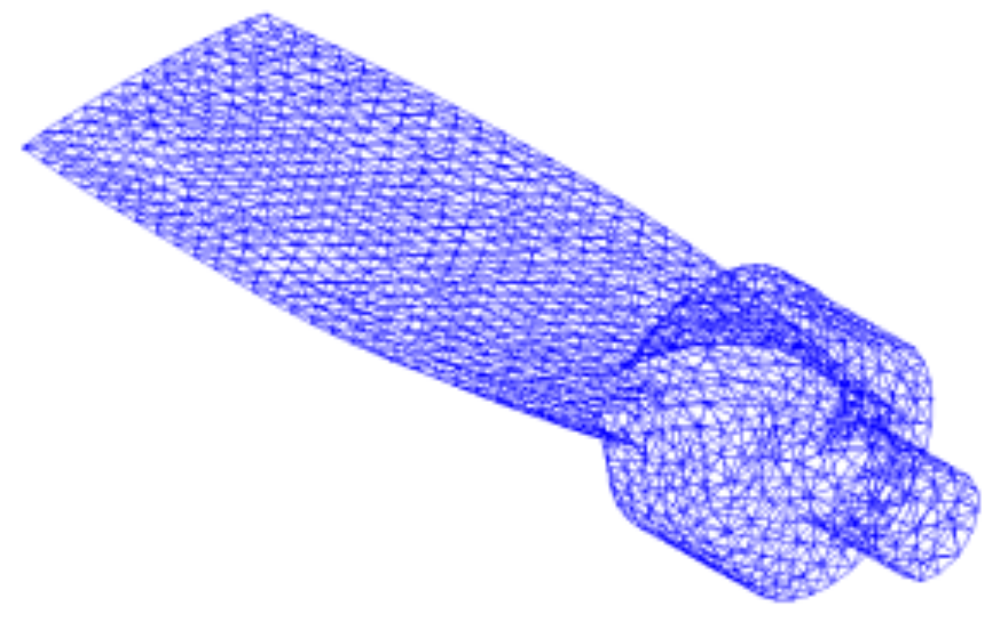
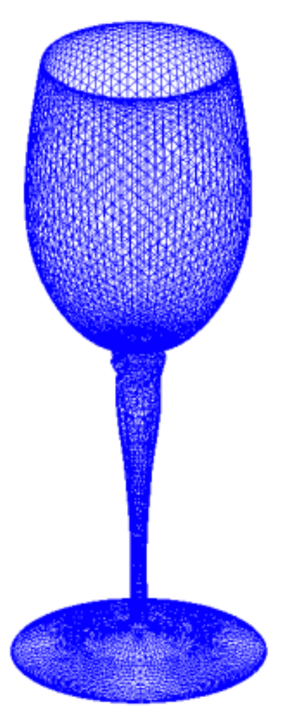
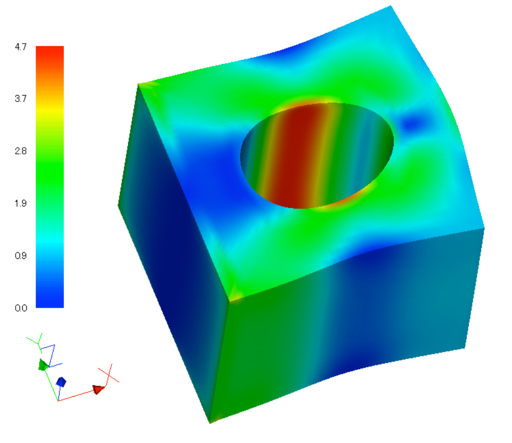
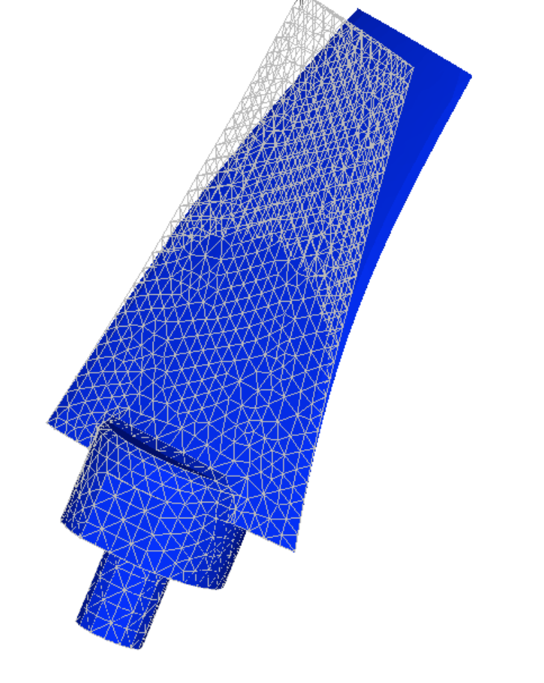
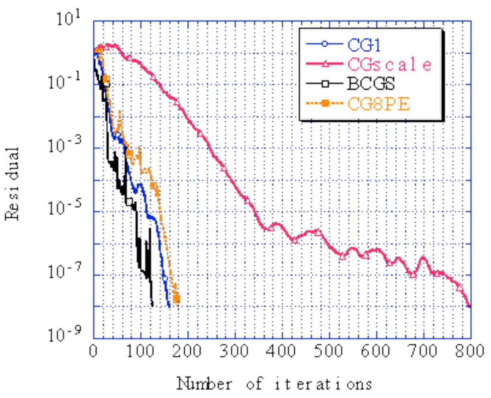

*** Last updated 2019-04-18 ***

## 弾性静解析用実モデル例題

### 解析モデル

弾性静解析を対象とした実モデル検証例題の一覧を表9.2.1に示す。
また、モデルの形状（一部を除く）を図 9.2.1～図9.2.5に示す。
なお、要素タイプ731および741の例題を実行するには、別途直接法ソルバーが必要である。

表 9.2.1　弾性静解析用実モデル検証例題

| ケース名 | 要素タイプ | 検証モデル           | 節点数  | 自由度数 |
|:--|:--|:--|:--|:--|
| EX01A    | 342        | コンロッド(10万節点) | 94,074  | 282,222 |
| EX01B    | 342        | コンロッド(33万節点) | 331,142 | 993,426 |
| EX02     | 361        | 穴あきブロック       | 37,386  | 112,158 |
| EX03     | 342        | タービンブレード     | 10,095  | 30,285 |
| EX04     | 741        | 円筒シェル           | 10,100  | 60,600 |
| EX05A    | 731        | ワイングラス(coarce) | 7,240   | 43,440 |
| EX05B    | 731        | ワイングラス(midium) | 48,803  | 292,818 |
| EX05C    | 731        | ワイングラス(fine)   | 100,602 | 603,612 |

 
図 9.2.1　コンロッド（EX01A）

 
図 9.2.2　穴あきブロック（EX02）

 
図 9.2.3　タービンブレード（EX03，EX06）

 
図 9.2.4　円筒シェル（EX04，EX09）

 
図 9.2.5　ワイングラス（EX05，EX10A）

### 解析結果

#### 解析結果例

解析結果の例を図 9.2.6～図 9.2.9に示す。

 
図 9.2.6　 EX01A解析結果（Mises応力と変形図(10倍））

 
図 9.2.7　 EX02解析結果（Mises応力と変形図(100倍））

 
図 9.2.8　 EX03解析結果（変形図(10倍））

 
図 9.2.9　 EX04解析結果（変形図(100倍））

#### 検証例題EX02による解析性能の検証結果

検証例題EX02穴あきブロックモデルと同等のモデルを用い汎用商用ソフトABAQUSによる解析を行った。
FrontISTRと応力成分の最大値、最小値を比較した結果を図9.2.10に示す。
同図より応力成分は非常によく一致していることが分かる。

次に、応力分布への領域分割の影響を調べた結果を示す。
領域分割はRCB法により行い、X、Y、Zそれぞれの軸方向に2分割し、全体で8領域に分割した。
図9.2.11に分割状態を示す。
図9.2.12には単一領域と8領域分割による解析結果の応力分布を示す。

 
図 9.2.10　 EX02における汎用ソフトとの応力成分の比較

 
図 9.2.11　 RCB法によるEX02の8領域分割結果

 
図 9.2.12　領域分割によるミゼス応力分布の相違

図 9.2.12より、両者の違いは見られず、完全に一致していることが分かる。

次に、使用したHEC-MW ソルバーの設定による実行時間を比較した結果を表9.2.2に示す。
また、図 9.2.13求解までの収束履歴を示す。

表 9.2.2　HEC-MWソルバーによる実行時間の比較

| ソルバー | 実行時間(s) |
|:--|:--|
| CGI      | 38.79 |
| CGscale  | 52.75 |
| BCGS     | 60.79 |
| CG8      | 6.65 |

 
図 9.2.13　HEC-MWソルバーによる収束履歴の比較（収束判定閾値：1.0x10^-8^）

#### 検証例題EX01A による計算時間の比較

検証例題EX01A（コンロッド）を用い、領域分割による計算速度の増速率について検証した。
計算にはXeon 2.8GHz 24ノードクラスタ計算機を用いた。
結果を図9.2.14に示す。
同図より計算速度は領域数と比例して増速することが分かる。

また、計算時間の計算機環境による差も調べた。
結果を表9.2.3に示す。

 
図 9.2.14　領域分割による増速効果

表 9.2.3　計算時間の計算機による比較（1CPU）

|CPU | Frequancy [GHz] | OS | CPU Time [sec] | solver time [sec] |
|:--|:--|:--|:--|:--|
| Xeon        | 2.8   | Linux   | 850  | 817 |
| Pentium III | 0.866 | Win2000 | 2008 | 1980 |
| Pentium M   | 0.760 | WinXP   | 1096 | 1070 |
| Pentium 4   | 2.0   | WinXP   | 802  | 785 |
| Pentium 4   | 2.8   | WinXP   | 738  | 718 |
| Celeron     | 0.700 | Win2000 | 2252 | 2215 |
| Pentium 4   | 2.4   | WinXP   | 830  | 804 |

