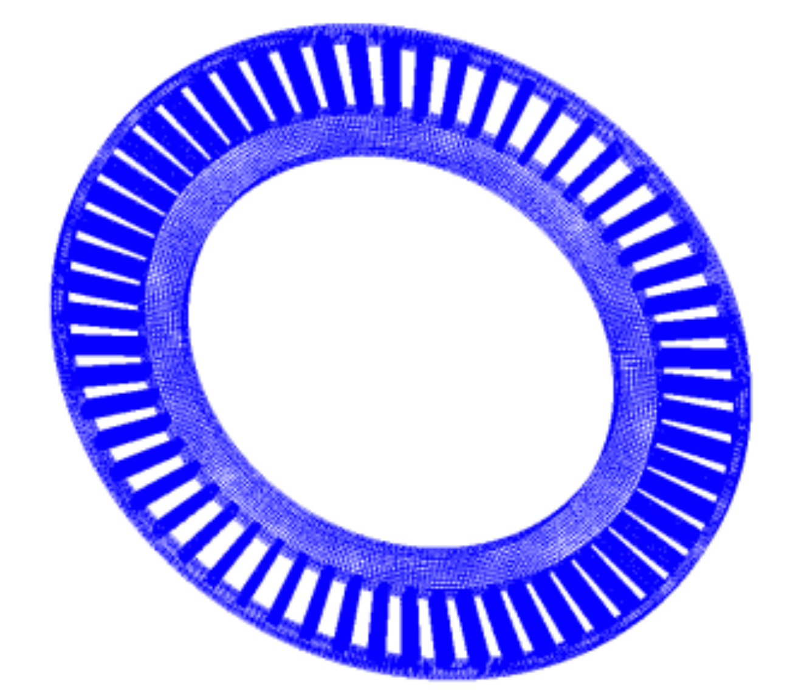
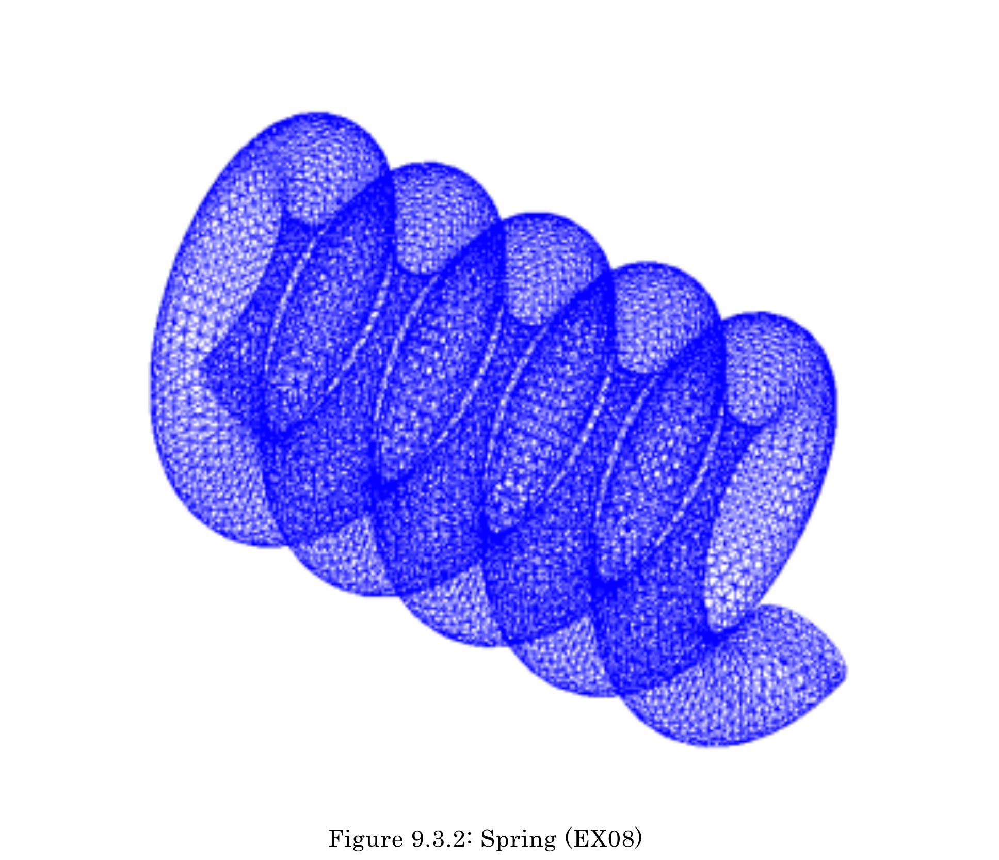
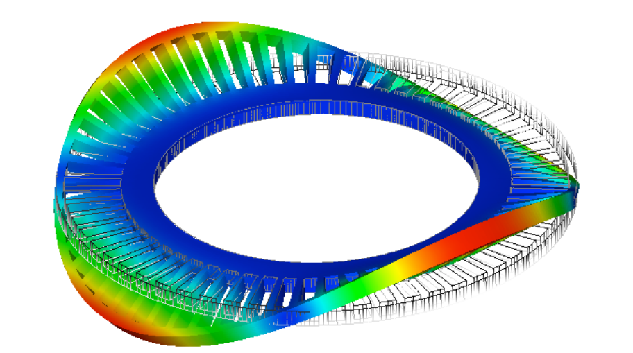
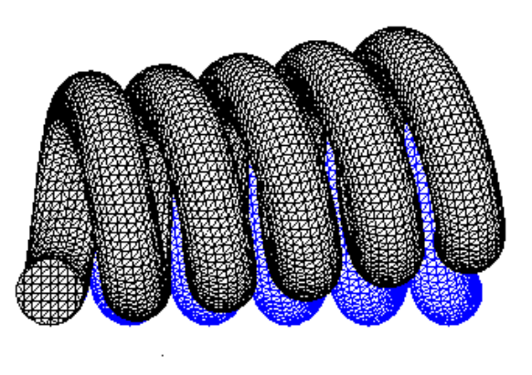
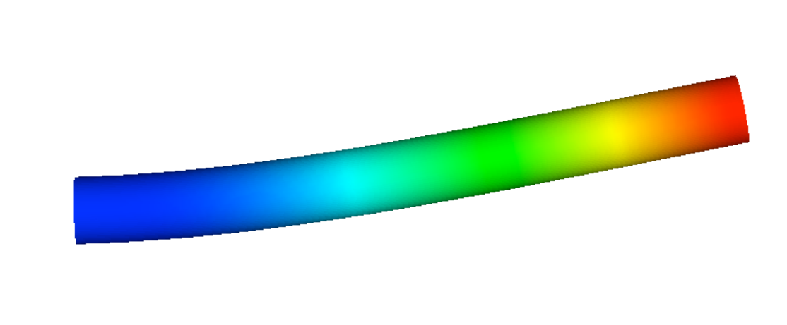
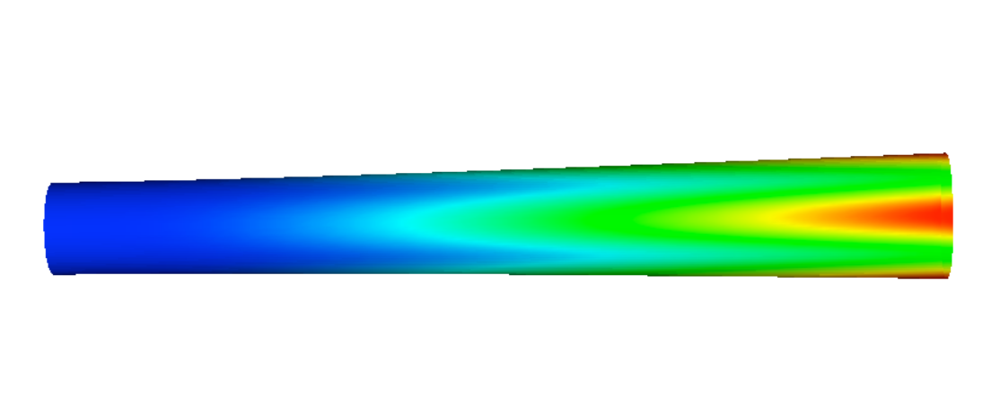

## 固有値解析用実モデル例題

### 解析モデル

固有値解析を対象とした実モデル検証例題の一覧を表9.3.1に示す。
また、これらのうち、EX07（タービンローダ）およびEX08（スプリング）のモデル形状を図9.3.1、図9.3.2に示す。
そのほかのモデル形状は検証内容が一致する弾性静解析用検証例題と同じ形状であり、すでに示してある。
なお、要素タイプ731および741の例題を実行するには、別途直接法ソルバーが必要である。

表 9.3.1　固有値解析用実モデル検証例題

| ケース名 | 要素タイプ | 検証モデル           | 節点数  | 自由度数 |
|:---------|:-----------|:---------------------|:--------|:---------|
| EX06     | 342        | タービンブレード     | 10,095  | 30,285   |
| EX07     | 361        | タービンロータ       | 127,440 | 382,320  |
| EX08     | 342        | スプリング           | 78,771  | 236,313  |
| EX09     | 741        | 円筒シェル           | 10,100  | 60,600   |
| EX10A    | 731        | ワイングラス(coarse) | 7,240   | 43,440   |
| EX10B    | 731        | ワイングラス(midium) | 48,803  | 292,818  |

{: .center width="350px"}

図 9.3.1　タービンロータ（EX07）

{: .center width="350px"}

図 9.3.2　スプリング（EX08）

### 解析結果

振動モードおよび固有振動数を以下に示す。

#### EX06 タービンブレード

|                                                    |                                                    |
|----------------------------------------------------|----------------------------------------------------|
| {width="200px"} | {width="200px"} |
| (a) モード 1 (1170 kHz)                            | (b) モード 2(3250kHz)                              |
| {width="200px"}   | {width="200px"} |
| (c) モード 3(4130kHz)                              | (d) モード 4(4140kHz)                              |
| {width="200px"} |                                                    |
| (e) モード 5(8210kHz)                              |                                                    |

図 9.3.3　EX06タービンブレード振動モード

#### EX07 タービンロータ

|                                                    |                                                    |
|----------------------------------------------------|----------------------------------------------------|
| {width="300px"} | {width="300px"} |
| (a) モード 1(1067Hz)                               | (b) モード 2(1072Hz)                               |
|                                                    |                                                    |
| {width="300px"} | {width="300px"} |
| (c) モード 3(1072Hz)                               | (d) モード 4(1093Hz)                               |
|                                                    |                                                    |
| {width="300px"} |                                                    |
| (e) モード 5(1093Hz)                               |                                                    |
|                                                    |                                                    |

図 9.3.4　EX07タービンロータ振動モード

#### EX08スプリング

|                                                    |                                                    |                                                    |
|----------------------------------------------------|----------------------------------------------------|----------------------------------------------------|
| モード 1 (445Hz)                                   | モード 2 (446Hz)                                   | モード 3 (908Hz)                                   |
| {width="160px"} | {width="160px"} | {width="160px"} |
|                                                    |                                                    |
| モード 4 (985Hz)                                   | モード 5 (1819Hz)                                  |                                                    |
| {width="160px"} | {width="160px"} |                                                    |

|   | FrontISTR | NASTRAN |
|---|----------:|--------:|
| 1 | 445 Hz    | 445 Hz  |
| 2 | 446 Hz    | 446 Hz  |
| 3 | 908 Hz    | 908 Hz  |
| 4 | 985 Hz    | 986 Hz  |
| 5 | 1810 Hz   | 1810 Hz |

図 9.3.5　EX08スプリング振動モード

#### EX09 円筒シェル

{: .center width="350px"}

(a) モード 1, 2 (109 Hz)

{: .center width="350px"}

(b) モード 3,4(570Hz)

{: .center width="350px"}

(c) モード 5(615Hz)

図 9.3.6　EX09円筒シェル振動モード

#### EX10Aワイングラス

|                                                    |                                                    |                                                    |
|----------------------------------------------------|----------------------------------------------------|----------------------------------------------------|
| {width="120px"} | {width="120px"} | {width="120px"} |
| (a) モード 1(101Hz)                                | (b) モード 2(102Hz)                                | (c) モード 3(354Hz)                                |
|                                                    |                                                    |                                                    |
| {width="120px"} | {width="120px"} |                                                    |
| (d) モード 4(1335Hz)                               | (e) モード 5(1336Hz)                               |                                                    |

図 9.3.7　EX10Aワイングラス振動モード

