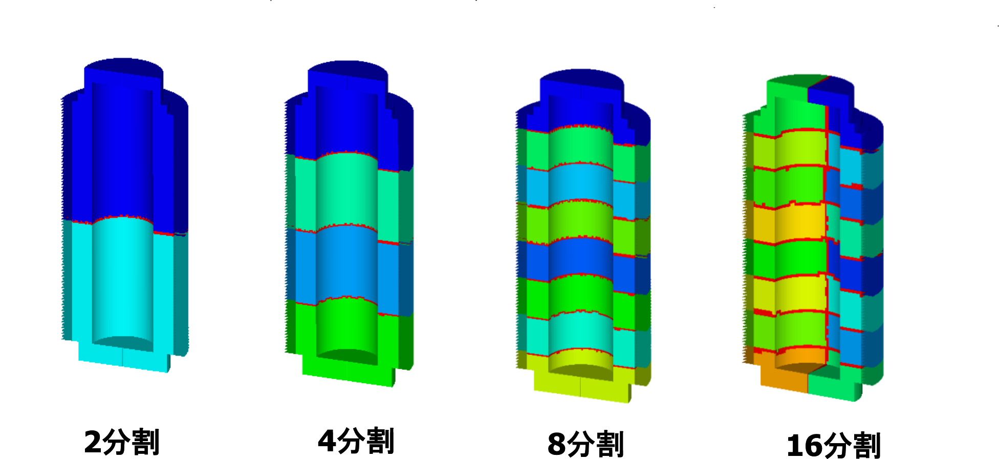

## 熱伝導解析用実モデル例題

### 解析モデル

熱伝導解析では、実モデルとして使用済核燃料輸送容器を対象とする。
この実モデルについて、メッシュの粗さを変えた３種類の検証例題を設定する。
その一覧を表9.4.1に示す。
また、モデルの形状を図 9.4.1～図 9.4.4に示す。

表 9.4.1　熱伝導解析用実モデル検証例題

| ケース名 | 要素タイプ | 検証モデル           | 節点数    | 自由度数 |
|:--|:--|:--|:--|:--|
| EX21A    | 361        | 使用済核燃料輸送容器 | 88,938    | 79,920 |
| EX21B    | 361        |                      | 309,941   | 289,800 |
| EX21C    | 361        |                      | 1,205,765 | 1,159,200 |

 
図 9.4.1　使用済核燃料輸送容器

 
図 9.4.2　使用済核燃料輸送容器の寸法

 
図 9.4.3　モデル概念図

 
図 9.4.4　モデル境界条件とメッシュ分割図（EX21A）

### 解析結果

解析結果の例を図 9.4.5～図 9.4.7に示す。

 
図 9.4.5　温度分布図

 
図 9.4.6　分散モデル図

 
図 9.4.7　分散処理による速度向上度

