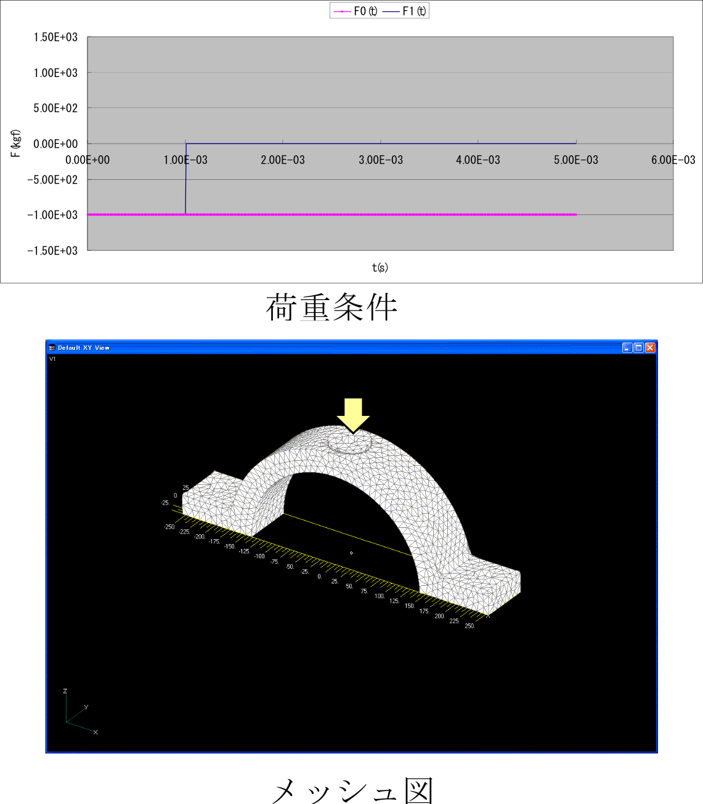
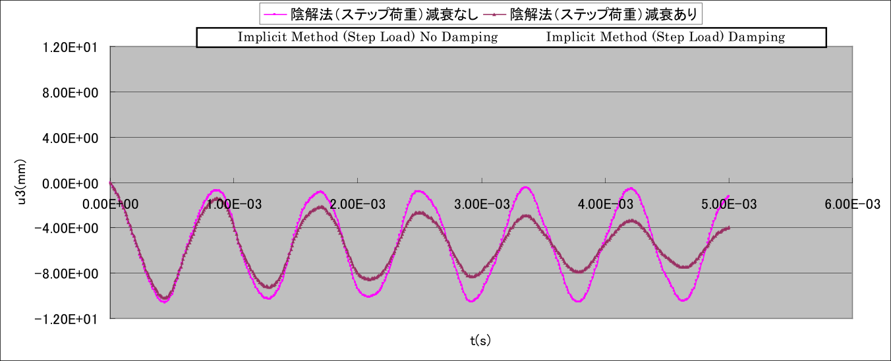
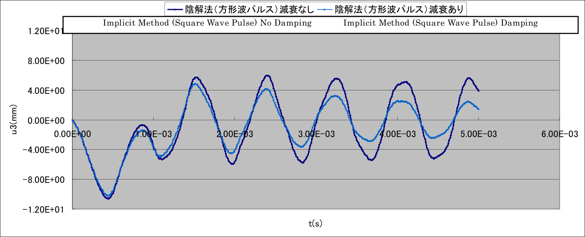

## 線形動的解析用実モデル例題

### 解析モデル

線形動解析では、実モデルとして図9.5.1に示す機械部品を対象とする。
この実モデルについて、荷重条件及び減衰係数の異なる4ケースに対して検証例題を設定する。
その一覧を表9.5.1に示す。

表 9.5.1　線形動的解析用実モデル検証例題

| ケース名 | 要素タイプ | 検証モデル     | 荷重条件         | 減衰条件 | 節点数 | 自由度数 |
|:---------|:-----------|:---------------|:-----------------|:---------|:-------|:---------|
| EX31A    | 342        | かみ合いモデル | ステップ荷重(F0) | なし     | 15,214 | 45,642   |
| EX31B    | 342        |                | ステップ荷重(F0) | あり     | 15,214 | 45,642   |
| EX31C    | 342        |                | 方形波パルス(F1) | なし     | 15,214 | 45,642   |
| EX31D    | 342        |                | 方形波パルス(F1) | あり     | 15,214 | 45,642   |

 
図 9.5.1　かみあいモデル

### 解析結果

解析結果の例を図 9.5.2～図 9.5.3に示す。

 
図 9.5.2　加振点変位u~z~の時刻歴

 
図 9.5.3　変形図及び相当応力分布(変形倍率5.0)　：EX31C

