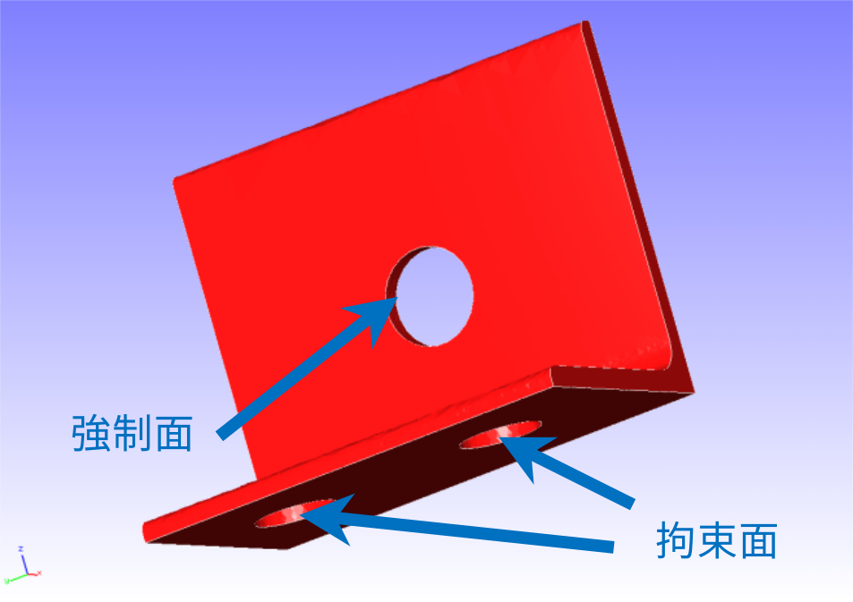
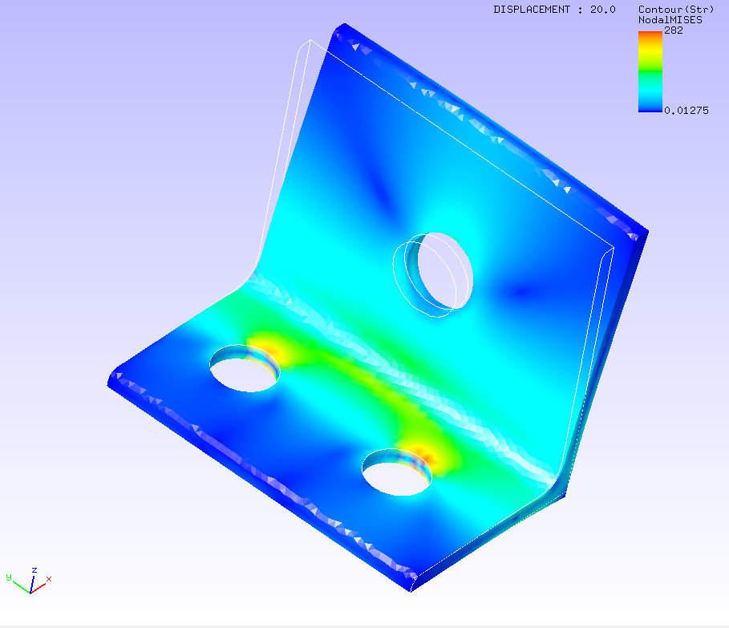

## 静解析（弾性）

本解析の実施には、`tutorial/01_elastic_hinge` のデータを用います。

### 解析対象

解析対象はヒンジ部品で、形状を図4.1.1に、メッシュデータを図4.1.2に示します。

|項目|内容|備考|
|----|----|----|
|解析の種別|線形静解析||
|節点数|84,056||
|要素数|49,871||
|要素タイプ|四面体2次要素||
|材料物性名|STEEL|ELASTIC||
|境界条件|拘束,集中荷重||
|行列解法|CG/SSOR||

{.center width="350px"}
<div style="text-align: center;">
図4.1.1　ヒンジ部品の形状
</div>

{.center width="350px"}
<div style="text-align: center;">
図4.1.2　ヒンジ部品のメッシュデータ
</div>

### 解析内容

FrontISTRのソースコードを展開し、本例題のディレクトリへ移動し解析に必要なファイル


  | ファイル名       | 種別           |
  |------------------|----------------|
  | `hecmw_ctrl.dat` | 全体制御データ |
  | `hinge.cnt`      | 解析制御データ |
  | `hinge.msh`      | メッシュデータ |

が有るか確認してください。

```
$ tar xvf FrontISTR.tar.gz
$ cd FrontISTR/tutorial/01_elastic_hinge
$ ls
hecmw_ctrl.dat  hinge.cnt  hinge.msh
```

図4.1.1に示す拘束面の変位を拘束し、強制面に集中荷重を負荷する応力解析を実施します。
全体制御データと解析制御データを以下に示します。

#### `hecmw_ctrl.dat`

全体制御データ

```
#
# for solver
#
!MESH, NAME=fstrMSH, TYPE=HECMW-ENTIRE
 hinge.msh
!CONTROL, NAME=fstrCNT
 hinge.cnt
!RESULT, NAME=fstrRES, IO=OUT
 hinge.res
!RESULT, NAME=vis_out, IO=OUT
 hinge_vis
```

#### `hinge.cnt`

解析制御データ

```
#  Control File for FISTR
## Analysis Control
!VERSION
 3
!SOLUTION, TYPE=STATIC
!WRITE,RESULT              # 結果データを出力する
!WRITE,VISUAL              # 可視化データを出力する
## Solver Control
### Boundary Conditon
!BOUNDARY
 BND0, 1, 3, 0.000000      # 拘束面1を指定
!BOUNDARY
 BND1, 1, 3, 0.000000      # 拘束面2を指定
!CLOAD
 CL0, 1, 0.01000           # 強制面を指定
### Material
!MATERIAL, NAME=STEEL
!ELASTIC
 210000.0, 0.3
!DENSITY
 7.85e-6
### Solver Setting
!SOLVER,METHOD=CG,PRECOND=1,ITERLOG=YES,TIMELOG=YES
 10000, 1
 1.0e-08, 1.0, 0.0
## Post Control
!VISUAL,metod=PSR
!surface_num=1
!surface 1
!output_type=VTK        # 可視化データのフォーマットをVTKに指定
!END
```

### 解析手順


FrontISTRの実行コマンド `fistr1` を実行します。

```
$ fistr1
```

```
##################################################################
#                         FrontISTR                              #
##################################################################
---
version:    5.1.0
git_hash:   acab000c8c633b7b9d596424769e14363f720841
build:
  date:     2020-10-05T07:39:55Z
  MPI:      enabled
  OpenMP:   enabled
  option:   "-p --with-tools --with-refiner --with-metis --with-mumps --with-lapack --with-ml --with-mkl "
  HECMW_METIS_VER: 5
execute:
  date:       2020-10-05T16:44:34+0900
  processes:  1
  threads:    8
  cores:      8
  host:
    0: flow-p06
---
...
 Step control not defined! Using default step=1
 fstr_setup: OK
 Start visualize PSF 1 at timestep 0

 loading step=    1
 sub_step= 1,   current_time=  0.0000E+00, time_inc=  0.1000E+01
 loading_factor=    0.0000000   1.0000000
### 3x3 BLOCK CG, SSOR, 1
      1    1.903375E+00
      2    1.974378E+00
      3    2.534627E+00
      4    3.004045E+00
...
...
   2966    1.140489E-08
   2967    1.078356E-08
   2968    1.003516E-08
   2969    9.370323E-09
### Relative residual = 9.39272E-09

### summary of linear solver
      2969 iterations      9.392724E-09
    set-up time      :     1.874421E-01
    solver time      :     6.882245E+01
    solver/comm time :     5.145272E-01
    solver/matvec    :     2.284206E+01
    solver/precond   :     3.756793E+01
    solver/1 iter    :     2.318035E-02
    work ratio (%)   :     9.925238E+01

 Start visualize PSF 1 at timestep 1
### FSTR_SOLVE_NLGEOM FINISHED!

 ====================================
    TOTAL TIME (sec) :     71.55
           pre (sec) :      0.70
         solve (sec) :     70.86
 ====================================
 FrontISTR Completed !!
```

`FrontISTR Completed !!` が表示されたら解析完了です。

### 解析結果

解析が完了すると、幾つかのファイルが新たに作成されます。

```
$ ls
0.log       hecmw_ctrl.dat  hinge.res.0.0            hinge_vis_psf.0001
FSTR.dbg.0  hecmw_vis.ini   hinge.res.0.1            hinge_vis_psf.0001.pvtu
FSTR.msg    hinge.cnt       hinge_vis_psf.0000
FSTR.sta    hinge.msh       hinge_vis_psf.0000.pvtu
```

`*.res.*` は結果データと言い、FrontISTRの解析結果が格納されています。REVOCAP_PrePost等で表示出来ます。

`*_vis_*` は可視化データと言い、汎用の可視化ソフトで表示できます。今回の例ではVTKフォーマットで出力しているので、ParaViewなどを使って表示します。

ミーゼス応力のコンター図をREVOCAP_PrePostで作成して図4.1.3に示します。
また、解析結果の数値データとして、解析結果ログファイルの一部を以下に示します。

{.center width="350px"}
<div style="text-align: center;">
図4.1.3　ミーゼス応力の解析結果
</div>


