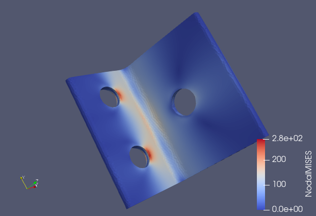

## 線形静解析 (弾性、並列)

静解析(弾性)を4並列で実施するには、`tutorial/02_elastic_hinge_parallel` のデータを用います。

### 解析対象

 | 項目       | 内容                | 備考                        | 参照 |
 |------------|---------------------|-----------------------------|------|
 | 解析の種別 | 線形静解析          | !SOLUTION,TYPE=STATIC       |      |
 | 節点数     | 84,056              |                             |      |
 | 要素数     | 49,871              |                             |      |
 | 要素タイプ | 10節点四面体2次要素 | !ELEMENT,TYPE=342 |[要素ライブラリ](../analysis/analysis_02.html#_2) |
 | 材料物性名 | STEEL               | !MATERIAL,NAME=STEEL |[材料データ](../analysis/analysis_02.html#_12)|
 | 材料性質   | ELASTIC             | !ELASTIC                    |      |
 | 境界条件   | 拘束,集中荷重       |                             |      |
 | 行列解法   | CG/SSOR             | !SOLVER,METHOD=CG,PRECOND=1 |      |

{.center width="350px"}
<div style="text-align: center;">
図4.2.1 各ノードの計算領域
</div>

### 解析内容

FrontISTRのコードを展開し、本例題のディレクトリへ移動し、解析に必要なファイル

 | ファイル名          | 種別               |
 |---------------------|--------------------|
 | hecmw_ctrl.dat      | 全体制御データ     |
 | hinge.cnt           | 解析制御データ     |
 | hinge.msh           | メッシュデータ     |
 | hecmw_part_ctrl.dat | 領域分割制御データ |

が有るか確認してください。

```
$ tar xvf FrontISTR.tar.gz
$ cd FrontISTR/tutorial/02_elastic_hinge_parallel
$ ls
hecmw_ctrl.dat  hecmw_part_ctrl.dat  hinge.cnt  hinge.msh
```

拘束面の変位を拘束し、強制面に集中荷重を付加する応力解析を実施します。

全体制御データ、解析制御データと領域分割制御データを以下に示します。

#### 全体制御データ `hecmw_ctrl.dat`

```
#
# for partitioner
#
!MESH, NAME=part_in,TYPE=HECMW-ENTIRE # hecmw_part1で分割する元のメッシュデータ
 hinge.msh
!MESH, NAME=part_out,TYPE=HECMW-DIST  # hecmw_part1で分割した後のファイル名
 hinge_4
#
# for solver
#
!MESH, NAME=fstrMSH, TYPE=HECMW-DIST  # 分割メッシュデータを指定
 hinge_4
!CONTROL, NAME=fstrCNT                # 解析制御データを指定
 hinge.cnt
!RESULT, NAME=fstrRES, IO=OUT         # 結果データを指定
 hinge.res
!RESULT, NAME=vis_out, IO=OUT         # 可視化データを指定
 hinge_vis
```

#### 解析制御データ `hinge.cnt`

```
#  Control File for FISTR
## Analysis Control
!VERSION                   # ファイルフォーマットのバージョンを指定
 3
!SOLUTION, TYPE=STATIC     # 解析の種別を指定
!WRITE,RESULT              # 結果データ出力の指定
!WRITE,VISUAL              # 可視化データの出力を指定
## Solver Control
### Boundary Conditon
!BOUNDARY
 BND0, 1, 3, 0.000000      # 拘束面1を指定
!BOUNDARY
 BND1, 1, 3, 0.000000      # 拘束面2を指定
!CLOAD
 CL0, 1, 0.01000           # 強制面を指定
### Material
!MATERIAL, NAME=STEEL      # 材料物性の指定
!ELASTIC                   # 弾性物質の定義
 210000.0, 0.3
!DENSITY                   # 質量密度の定義
 7.85e-6
### Solver Setting
!SOLVER,METHOD=CG,PRECOND=1,ITERLOG=YES,TIMELOG=YES  # ソルバーの制御
 10000, 2
 1.0e-08, 1.0, 0.0
## Post Control
!VISUAL,metod=PSR          # 可視化手法の指定
!surface_num=1             # 1つのサーフェースレンダリング内のサーフェース数
!surface 1                 # サーフェースの内容の指定
!output_type=VTK           # 可視化ファイルの型の指定
!END                       # 解析制御データの終わりを示す
```

#### `hecmw_part_ctrl.dat`

領域分割制御データ

```
!PARTITION,TYPE=NODE-BASED,METHOD=PMETIS,DOMAIN=4,UCD=part.inp
```

### 解析手順

MPIでFrontISTRを実行するため、最初にメッシュデータ `hinge.msh` を4領域に分割します。

```
$ hecmw_part1
Oct 07 11:04:52 Info: Reading mesh file...
Oct 07 11:04:52 Info: Starting domain decomposition...
Oct 07 11:04:52 TH(0/8) Info: Creating local mesh for domain #0 ...
Oct 07 11:04:52 TH(2/8) Info: Creating local mesh for domain #1 ...
Oct 07 11:04:52 TH(6/8) Info: Creating local mesh for domain #2 ...
Oct 07 11:04:52 TH(7/8) Info: Creating local mesh for domain #3 ...
Oct 07 11:04:52 Info: Domain decomposition done
```

新たに、hinge_4.xとpart.inpというファイルが生成されます。

```
$ ls
hecmw_ctrl.dat  hecmw_part_ctrl.dat  hinge.msh  hinge_4.1  hinge_4.3
hecmw_part.log  hinge.cnt            hinge_4.0  hinge_4.2  part.inp
```

続いて、FrontISTRの実行コマンド `fistr1` をMPIを用いて実行します。

```
$ mpirun -np 4 fistr1 -t 1
(MPI 4並列, 1 OpenMPスレッドで実行)
```

```
##################################################################
#                         FrontISTR                              #
##################################################################
---
version:    5.1.0
git_hash:   acab000c8c633b7b9d596424769e14363f720841
build:
  date:     2020-10-05T07:39:55Z
  MPI:      enabled
  OpenMP:   enabled
  option:   "-p --with-tools --with-refiner --with-metis --with-mumps --with-lapack --with-ml --with-mkl "
  HECMW_METIS_VER: 5
execute:
  date:       2020-10-07T11:07:21+0900
  processes:  4
  threads:    1
  cores:      4
  host:
    0: flow-p06
    1: flow-p06
    2: flow-p06
    3: flow-p06
---
...
 Step control not defined! Using default step=1
 fstr_setup: OK
 Start visualize PSF 1 at timestep 0

 loading step=    1
 sub_step= 1,   current_time=  0.0000E+00, time_inc=  0.1000E+01
 loading_factor=    0.0000000   1.0000000
### 3x3 BLOCK CG, SSOR, 2
      1    2.183567E+00
      2    2.423900E+00
      3    2.939117E+00
...
   2084    1.158654E-08
   2085    1.032414E-08
   2086    9.436273E-09
### Relative residual = 9.43589E-09

### summary of linear solver
      2086 iterations      9.435886E-09
    set-up time      :     4.695220E-02
    solver time      :     7.103976E+01
    solver/comm time :     1.929294E+01
    solver/matvec    :     1.544405E+01
    solver/precond   :     3.243278E+01
    solver/1 iter    :     3.405549E-02
    work ratio (%)   :     7.284205E+01

 Start visualize PSF 1 at timestep 1
### FSTR_SOLVE_NLGEOM FINISHED!

 ====================================
    TOTAL TIME (sec) :     72.42
           pre (sec) :      0.29
         solve (sec) :     72.13
 ====================================
 FrontISTR Completed !!
```

`FrontISTR Completed !!` が表示されたら解析完了です。

### 解析結果

解析が完了すると、幾つかのファイルが新たに作成されます。

```
$ ls
0.log       FSTR.dbg.3           hinge.cnt      hinge.res.2.1  hinge_vis_psf.0000
1.log       FSTR.msg             hinge.msh      hinge.res.3.0  hinge_vis_psf.0000.pvtu
2.log       FSTR.sta             hinge.res.0.0  hinge.res.3.1  hinge_vis_psf.0001
3.log       hecmw_ctrl.dat       hinge.res.0.1  hinge_4.0      hinge_vis_psf.0001.pvtu
FSTR.dbg.0  hecmw_part.log       hinge.res.1.0  hinge_4.1      part.inp
FSTR.dbg.1  hecmw_part_ctrl.dat  hinge.res.1.1  hinge_4.2
FSTR.dbg.2  hecmw_vis.ini        hinge.res.2.0  hinge_4.3
```

`*.res.*` は結果データと言い、FrontISTRのMPIノード毎の解析結果が格納されています。REVOCAP_PrePost等で表示出来ます。

`*_vis_*` は可視化データと言い、汎用の可視化ソフトで表示できます。今回の例ではVTKフォーマットで出力しているので、ParaView等を使って表示します。


{.center width="350px"}
<div style="text-align: center;">
図4.2.2 ミーゼス応力の解析結果(VTKで表示)
</div>
